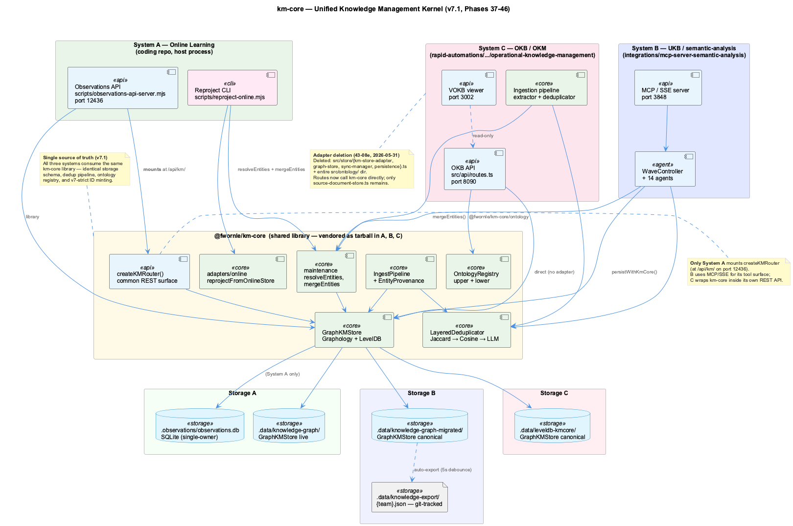

# UKB/VKB - Knowledge Management

UKB is one of three knowledge systems built on the shared **@fwornle/km-core** kernel. VKB is its web visualizer.



## The Three Knowledge Systems on km-core

| System | Where it lives | Entrypoint | Storage path |
|--------|----------------|------------|--------------|
| **System A** — Online learning (observations/digests/insights) | `scripts/observations-api-server.mjs` (host) | Observations API, port 12436 | `.observations/observations.db` (SQLite) + `.data/knowledge-graph/` (GraphKMStore) |
| **System B** — UKB / semantic-analysis | `integrations/mcp-server-semantic-analysis` (Docker) | MCP/SSE on port 3848 | `.data/knowledge-graph-migrated/` (GraphKMStore canonical) + `.data/knowledge-export/{team}.json` |
| **System C** — OKB / OKM | `_work/rapid-automations/integrations/operational-knowledge-management` (cross-repo) | OKB API on port 8090, VOKB viewer on port 3002 | `.data/leveldb-kmcore/` (GraphKMStore canonical) |

All three call the same library — identical storage schema, dedup pipeline (`LayeredDeduplicator`: Jaccard → Cosine → LLM), ontology registry, and v7-strict ID minting. The shared `createKMRouter()` REST surface is mounted by **System A only** (at `/api/km/` on the observations API); System B exposes MCP/SSE, and System C wraps km-core inside its own REST API.

| System | Trigger | Purpose |
|--------|---------|---------|
| **UKB** (Update Knowledge Base) | Manual/MCP | Curated git-derived insights, team sharing |
| **Observational Memory** | Automatic (per exchange) | Real-time session learning across all agents — see [Observational Memory](observational-memory.md) |
| **OKB** | Doc / RCA ingestion | Operational knowledge from runbooks, RCAs, and design docs (cross-repo) |
| **VKB** (Visualize) | `vkb` command | Web-based UKB visualization (port 8080); OKB has its own VOKB viewer on port 3002 |

## UKB (Manual/Batch)

### What It Does

- Analyzes git commits for patterns
- Interactive structured capture
- Ontology classification (4-layer pipeline)
- Git-tracked JSON exports for team sharing

### Usage (Within Claude Code)

```
# Incremental analysis (recent changes)
"ukb"

# Full analysis (entire codebase)
"full ukb"
```

### Storage

```
.data/knowledge-graph-migrated/  # @fwornle/km-core canonical store
                                 # (GraphKMStore backed by Graphology + LevelDB)
.data/knowledge-graph/           # legacy graphology store (still writable; drifting)
.data/knowledge-export/          # Git-tracked JSON exports
  coding.json
  other-project.json
```

The legacy `.data/knowledge-graph/` directory survives as a transitional readable copy; the `KM_CORE_PERSISTENCE` feature flag was retired and km-core is now the unconditional persistence path. See [km-core Migration](#km-core-migration) below.

### Ontology Classification

13 entity types organized into a [six-facet upper ontology](ontology.md):

| Facet | Entity Types | Question Answered |
|-------|-------------|-------------------|
| **Structure** | File, Service, Feature | What it IS |
| **Behavior** | Contract | What it DOES |
| **Operations** | RuntimeDiagnostics, StaticDiagnostics, Port, Config, Container, Process | How it RUNS |
| **Resilience** | Fault, Limitation | What goes WRONG |
| **Quality** | *(properties on Structure entities)* | How GOOD it is |
| **Evolution** | Revision | How it CHANGED |

Team-specific lower ontologies extend these with project-specific types (e.g., `LSLSession`, `MCPAgent`, `GraphDatabase`).

## Observational Memory (System A)

The automatic per-exchange capture pipeline — observations, digests, insights — is documented separately in [Observational Memory](observational-memory.md). It is the **System A** consumer of km-core: the host-side observations API (`scripts/observations-api-server.mjs`, port 12436) **mounts the shared `createKMRouter()` at `/api/km/`** while owning its own SQLite runtime store. Storage layout:

```
.observations/observations.db        # SQLite runtime store (single-owner host process)
.data/observation-export/            # Git-tracked JSON exports per tier
  observations.json
  digests.json
  insights.json
  metadata.json
.data/knowledge-graph/               # km-core GraphKMStore (shared with UKB)
```

Sensitivity-aware routing for summarization is handled by the [LLM CLI Proxy](../integrations/llm-cli-proxy.md), not by this pipeline directly.

## VKB (Visualization)

```bash
# Start visualization server
vkb

# Opens browser to http://localhost:8080
```

### Features

- Interactive force-directed graph
- Color-coding by entity type
- Full-text search
- Filter by type, significance, source
- Entity relationship exploration

## Comparison

| Aspect | UKB (System B) | Observational Memory (System A) | OKB (System C) |
|--------|----------------|---------------------------------|----------------|
| Trigger | Manual MCP command | Automatic per exchange | Document/RCA ingestion |
| Input | Git commits, prompts | LSL exchanges (all agents) | Markdown, Confluence, CodeBeamer |
| Runtime store | km-core GraphKMStore (`.data/knowledge-graph-migrated/`) | SQLite (`observations.db`) + km-core GraphKMStore | km-core GraphKMStore (`.data/leveldb-kmcore/`) |
| REST surface | MCP/SSE (port 3848) | km-core `createKMRouter` at `/api/km/` (port 12436) | OKB API (port 8090) — wraps km-core |
| Collaboration | Git-tracked JSON export | Git-tracked JSON export | OKB API + VOKB viewer (port 3002) |
| Search | Name/type-based via km-core | Keyword + semantic + RRF (in-process) | OKB API search endpoints |

### When to Use UKB

- Documenting architectural decisions
- Post-sprint knowledge capture
- Creating team knowledge base
- Recording bug fix patterns

### When to Use Observational Memory

- Always on (automatic)
- Cross-agent session continuity
- Truthfulness-verified persistent insights

### When to Use OKB

- Operational knowledge (runbooks, RCAs, design docs)
- Cross-repo / cross-team queries
- Operations playbook lookups

## Key Files

**UKB (System B)**:

- `integrations/mcp-server-semantic-analysis/src/agents/wave-controller.ts` — orchestrates wave-analysis; calls `persistWithKmCore()` on the shared km-core store
- `integrations/mcp-server-semantic-analysis/src/agents/persistence-agent.ts` — delegates writes to km-core's `GraphKMStore`
- `@fwornle/km-core` — shared kernel: `GraphKMStore`, `OntologyRegistry`, `LayeredDeduplicator`, `maintenance` (resolveEntities/mergeEntities), `adapters/online`, `createKMRouter`
- `.data/knowledge-graph-migrated/` — km-core canonical store
- `.data/knowledge-export/` — git-tracked JSON exports

**Observational Memory (System A)** — see [Observational Memory](observational-memory.md) for the full pipeline:

- `scripts/observations-api-server.mjs` — host-side single-owner API; mounts `createKMRouter` at `/api/km/` (port 12436)
- `scripts/reproject-online.mjs` — operator CLI that drives `reprojectFromOnlineStore` + `resolveEntities` against an isolated tmpdir GraphKMStore

**OKB (System C)** — full docs in [rapid-automations](https://bmw.ghe.com/adpnext-apps/rapid-automations/tree/main/integrations/operational-knowledge-management/docs):

- `src/index.ts` and `src/api/routes.ts` — OKB API server (port 8090); calls `GraphKMStore` directly with no adapter layer
- `src/store/source-document-store.ts` — OKB-specific document store (everything else under `src/store/` was retired)
- `lib/km-core/` — submodule pointer to the km-core source repo
- `vendor/fwornle-km-core-<version>.tgz` — repacked tarball that npm actually installs

**VKB**:

- `bin/vkb` — start server
- `integrations/vkb-visualizer/` — UKB web UI

## km-core Migration

The `KM_CORE_PERSISTENCE` feature flag was retired and km-core is the unconditional persistence path. The legacy persistence trio (three separate Graphology/LevelDB wrappers in `lib/knowledge-api/`) was deleted. The OKB followed: its `GraphKMStoreAdapter` transitional shim plus the entire `src/ontology/` directory were deleted from `operational-knowledge-management/src/`. Routes there now call `GraphKMStore` directly and import the ontology registry from `@fwornle/km-core/ontology`.

Net effect: a single library (`@fwornle/km-core`) is the source of truth for storage schema, entity ID minting (v7 strict), ontology classes, and the layered dedup pipeline across all three systems. See the [km-core unified architecture diagram](#the-three-knowledge-systems-on-km-core) at the top of this page.
