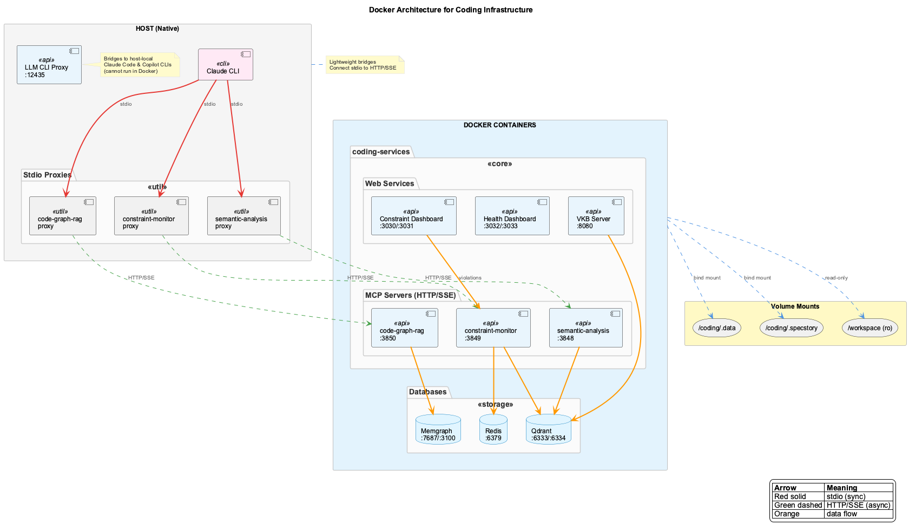

# Docker Mode

Containerized deployment for persistent services and shared resources.



## Benefits

- **Persistent Services** - MCP servers survive session restarts
- **Shared Browser** - Multiple Claude sessions share browser instance
- **Isolated Databases** - Qdrant, Redis, Memgraph in containers
- **Consistent Environment** - Same behavior across machines

## Prerequisites

```bash
# macOS
brew install --cask docker

# Linux
curl -fsSL https://get.docker.com | sh
```

## Enable Docker Mode

```bash
# Create marker file
touch .docker-mode

# Launch (services start automatically)
coding --claude
```

The `coding --claude` command:

1. Detects Docker mode via `.docker-mode` marker
2. Starts containers via Docker Compose
3. Waits for health checks to pass
4. Launches Claude with Docker MCP config

!!! tip "Alternative"
    Set environment variable instead of marker file:
    ```bash
    export CODING_DOCKER_MODE=true
    ```

## Verify Health

```bash
# Container status
docker compose -f docker/docker-compose.yml ps

# Health endpoints
curl http://localhost:3848/health  # Semantic Analysis
curl http://localhost:3847/health  # Browser Access
curl http://localhost:3849/health  # Constraint Monitor
curl http://localhost:3850/health  # Code Graph RAG
```

## Port Mapping

| Port | Service | Protocol |
|------|---------|----------|
| 3847 | Browser Access SSE | HTTP/SSE |
| 3848 | Semantic Analysis SSE | HTTP/SSE |
| 3849 | Constraint Monitor SSE | HTTP/SSE |
| 3850 | Code Graph RAG SSE | HTTP/SSE |
| 8080 | VKB Server | HTTP |
| 6333 | Qdrant | HTTP |
| 6334 | Qdrant | gRPC |
| 6379 | Redis | TCP |
| 7687 | Memgraph | Bolt |
| 3100 | Memgraph Lab | HTTP |

## Architecture

The Docker architecture consists of:

- **Host Machine**: Claude CLI with lightweight stdio proxies
- **Container**: MCP SSE servers (semantic-analysis, browser-access, constraint-monitor, code-graph-rag)
- **Databases**: Qdrant, Redis, Memgraph running in containers

See [Architecture > Data Flow](../architecture/data-flow.md) for detailed diagrams.

## Switch Between Modes

### Enable Docker Mode

```bash
touch .docker-mode
coding --claude  # Services start automatically
```

### Disable Docker Mode

```bash
rm .docker-mode
docker compose -f docker/docker-compose.yml down
coding --claude  # Now runs in native mode
```

## Common Operations

```bash
# View logs
docker compose -f docker/docker-compose.yml logs -f coding-services

# Restart services
docker compose -f docker/docker-compose.yml restart

# Rebuild after code changes
docker compose -f docker/docker-compose.yml build --no-cache
docker compose -f docker/docker-compose.yml up -d

# Full stop
docker compose -f docker/docker-compose.yml down

# Stop and remove volumes (data loss!)
docker compose -f docker/docker-compose.yml down -v
```

## Troubleshooting

### Container Won't Start

```bash
# Check logs
docker compose -f docker/docker-compose.yml logs coding-services

# Force rebuild
docker compose -f docker/docker-compose.yml build --no-cache
docker compose -f docker/docker-compose.yml up -d
```

### Port Conflicts

```bash
# Find process using port
lsof -i :3848

# Kill conflicting process or change ports in .env.ports
```

### Connection Refused

```bash
# Verify Docker mode is active
ls -la .docker-mode

# Check container status
docker compose -f docker/docker-compose.yml ps

# Test health endpoint
curl -v http://localhost:3848/health
```

### Volume Permission Issues

```bash
# Fix directory permissions
mkdir -p .data/knowledge-graph .specstory/history
chmod -R 755 .data/ .specstory/

# Restart
docker compose -f docker/docker-compose.yml restart
```
