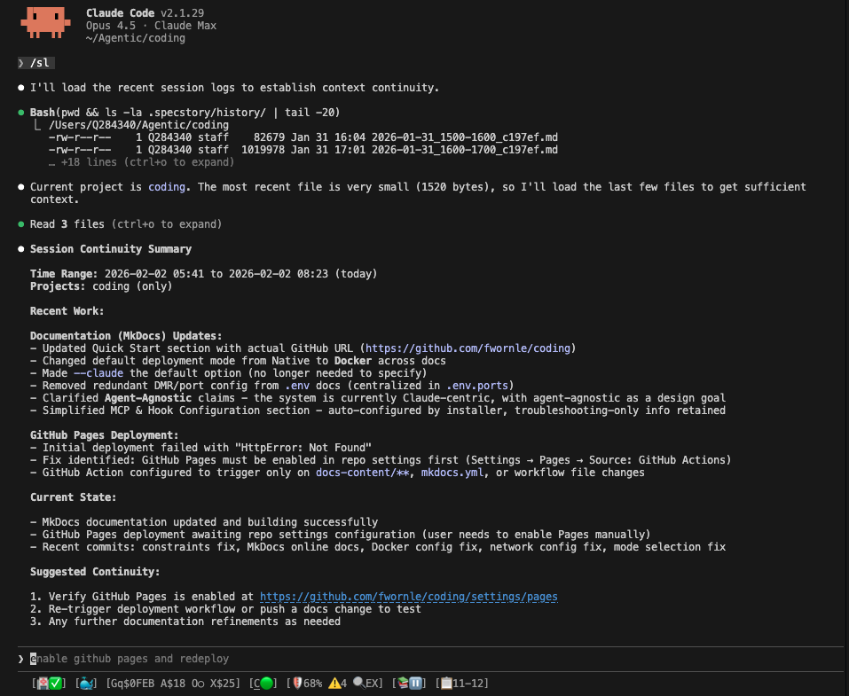

# Getting Started

Get coding running in under 5 minutes.


---

## Installation Options

Choose your deployment mode:

=== "Docker (Recommended)"

    

    **Benefits**:

    - Isolated services in containers
    - Persistent state survives restarts
    - Multiple Claude sessions share browser
    - Consistent behavior across machines
    - Easy cleanup (just stop containers)

    **Requirements**: Docker Desktop or Docker Engine

    [Install with Docker](installation.md#docker-installation-recommended){ .md-button .md-button--primary }

=== "Native"

    **Benefits**:

    - Lower resource usage (no Docker overhead)
    - Direct access to processes for debugging
    - Works without Docker installed
    - Faster startup

    **Requirements**: Node.js 18+ only

    [Install Native](installation.md#native-installation){ .md-button }

---

## Prerequisites

| Tool | Required | Purpose |
|------|----------|---------|
| **Node.js 18+** | Yes | Runtime for all services |
| **Git** | Yes | Clone repository, submodules |
| **jq** | Yes | JSON processing in scripts |
| **Docker** | For Docker mode | Container runtime |

### Quick Install

=== "macOS"

    ```bash
    brew install git node jq
    brew install --cask docker  # For Docker mode
    ```

=== "Linux (Ubuntu/Debian)"

    ```bash
    sudo apt update && sudo apt install -y git nodejs npm jq
    curl -fsSL https://get.docker.com | sh  # For Docker mode
    ```

=== "Windows (WSL2)"

    Install [Docker Desktop](https://www.docker.com/products/docker-desktop), then in WSL2:
    ```bash
    sudo apt update && sudo apt install -y git nodejs npm jq
    ```

---

## Quick Start

```bash
# 1. Clone repository with submodules
git clone --recurse-submodules https://github.com/fwornle/coding ~/Agentic/coding
cd ~/Agentic/coding

# 2. Run installer (Docker mode is default)
./install.sh

# 3. Reload shell
source ~/.bashrc  # or ~/.zshrc

# 4. Start coding
coding
```

That's it! The installer handles everything automatically.

---

## What Gets Installed

| Component | Description |
|-----------|-------------|
| **`coding`** | Launch Claude Code with all integrations |
| **`vkb`** | View Knowledge Base (web visualization) |
| **`ukb`** | Update Knowledge Base (knowledge extraction) |
| **MCP Servers** | Semantic Analysis, Constraint Monitor, Browser Access, Code Graph |
| **LSL** | Live Session Logging with 4-layer monitoring |
| **Hooks** | PreToolUse (constraints) and PostToolUse (logging) |

### Installation Safety

The installer follows a **non-intrusive policy**:

- Prompts before any system-level changes
- Creates timestamped backups of shell config
- Supports `--skip-all` to decline all system changes
- All data stays in `~/Agentic/coding/`

---

## Verification

After installation, verify everything is working:

```bash
coding --health
```


All services should show green. If you see issues, run:

```bash
./scripts/test-coding.sh --interactive
```

[Full Verification Guide](verify-repair.md){ .md-button }

---

## First Usage

### Start a Session

```bash
# Launch Claude Code with all systems
coding

# Or specify a project directory
coding --project ~/my-project
```



### View Knowledge Graph

```bash
vkb  # Opens browser to http://localhost:8080
```

### Update Knowledge Base

Within a Claude Code session:

```
# Incremental analysis (recent changes)
"ukb" or "update knowledge base"

# Full analysis (entire codebase history)
"ukb full" or "fully update knowledge base"

# Debug mode (single-stepping)
"ukb debug"
```

---

## Next Steps

<div class="grid cards" markdown>

-   :material-cog:{ .lg .middle } **Configuration**

    ---

    Set up API keys for LLM providers

    [:octicons-arrow-right-24: Configure](configuration.md)

-   :material-docker:{ .lg .middle } **Docker Mode**

    ---

    Deep dive into Docker deployment

    [:octicons-arrow-right-24: Docker details](docker-mode.md)

-   :material-wrench:{ .lg .middle } **Verify & Repair**

    ---

    Troubleshoot installation issues

    [:octicons-arrow-right-24: Verify](verify-repair.md)

-   :material-book-open:{ .lg .middle } **Core Systems**

    ---

    Learn about LSL, UKB/VKB, Constraints

    [:octicons-arrow-right-24: Explore](../core-systems/index.md)

</div>
