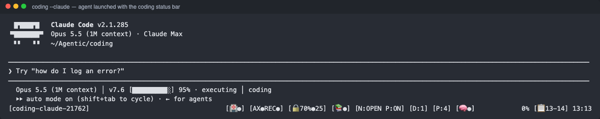
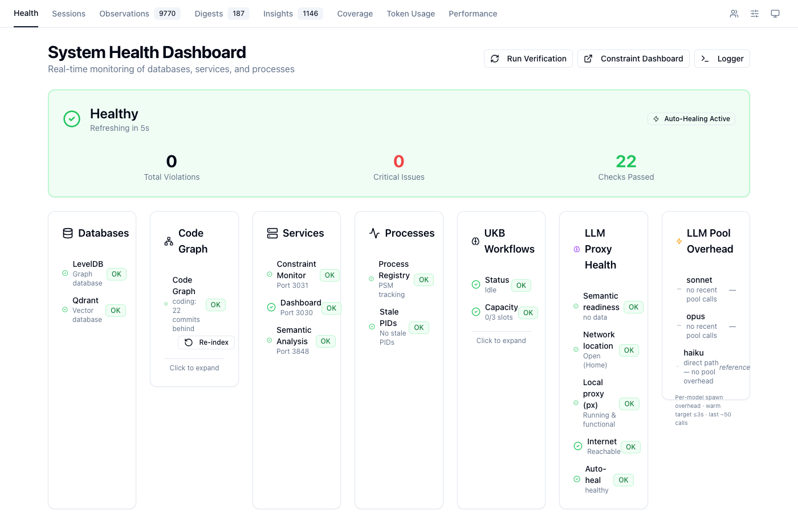

# Getting Started

Install, choose what to run, start your first session, and see where what `coding` learns
is kept — about five minutes for the `harness` tier, a little longer with Docker.

=== "⚡ Quick (~3 min)"

    ## Four commands

    ```bash
    git clone --recurse-submodules https://github.com/fwornle/coding ~/Agentic/coding
    cd ~/Agentic/coding && ./install.sh
    source ~/.zshrc          # or ~/.bashrc
    cd ~/my-project && coding
    ```

    ## Two questions

    The installer asks whether bare agents should be observed too (Enter = no, only sessions
    started via `coding`), and which **tier** to install:

    

    `harness` needs no Docker. `learning` and up add session logging, online learning and the
    knowledge viewer, and need Docker running. Change it any time with
    `coding-features profile <tier>` or in the dashboard. Details:
    [Installation](installation.md).

    ## The first launch in a repo

    With a learning tier, the first `coding` in a repo asks once where its learned data goes —
    Enter creates a private `<repo>-history`, a teammate's URL shares theirs, `skip` keeps it
    local. See [Per-Repo Tenancy](../architecture/tenancy.md).

    ## Check it worked

    The status line under the agent shows `[🏥●]` green when the system is healthy. For the
    full picture open the dashboard at [localhost:3032](http://localhost:3032).

    Then: [Configuration](configuration.md) for LLM provider keys, or
    [Verify & Repair](verify-repair.md) if something is not green.

=== "📖 Standard (~15 min)"

    ## What you need

    | Tool | For |
    |------|-----|
    | Node.js 22 LTS+ | the launcher and every host service (18 and 20 are EOL) |
    | Git | the repo, its submodules, and your learning repos |
    | `jq`, `tmux` | the scripts, and the session wrapper with the shared status bar |
    | Docker (running) | `learning` tiers and up only — the knowledge services are containers |
    | `gh`, logged in to `bmw.ghe.com` | optional: lets the first launch in a repo create its private `<repo>-history` for you |

    macOS, Linux, and Windows through **WSL** (with systemd enabled) are supported.

    ## Installing

    ```bash
    git clone --recurse-submodules https://github.com/fwornle/coding ~/Agentic/coding
    cd ~/Agentic/coding && ./install.sh
    source ~/.zshrc
    ```

    The installer first lists everything it would touch (`./install.sh --dry-run` stops there),
    then asks two questions — agent scope and tier — and installs only what that tier needs:

    | Tier | Adds | Docker |
    |---|---|---|
    | `harness` | agent launcher, status line, health monitoring, LLM proxy + token measurement | no |
    | `learning` | session logging, observations → digests → insights, UKB batch learning, knowledge viewer | yes |
    | `learning-perf` | performance measurement | yes |
    | `everything` | constraints (guardrails) + code graph | yes |

    Unattended: `./install.sh --yes --features=learning`. The full walkthrough with every
    prompt is on [Installation](installation.md).

    ## Your first session

    ```bash
    cd ~/my-project
    coding                  # the best available agent
    coding --claude         # or pick one: --copilot, --opencode, --pi
    coding --project DIR    # start in another directory
    ```

    The agent opens inside a tmux session with the shared status bar along the bottom:

    

    Launching the agent's own CLI directly skips session logging, knowledge injection and
    health monitoring — prefer `coding`.

    ## Where what it learns goes

    Everything learned in a repo is kept in that repo's `.coding/` folder — session logs,
    observations, insights, knowledge-graph slice, token usage. On the first launch you decide
    whether that folder is a private `<repo>-history` repo (shareable with teammates through
    git), or local only. Commits happen automatically; pushing is always your call:

    ```bash
    coding sync              # what each learning repo has to push / pull
    coding sync --push       # asks, then pushes
    ```

    Group repos into teams in **Dashboard → Teams**; the knowledge viewer follows that
    selection. See [Per-Repo Tenancy](../architecture/tenancy.md) and
    [Teams & Shared Learning](../guides/teams.md).

    ## Checking health

    The status line's `[🏥●]` is the summary. The dashboard at
    [localhost:3032](http://localhost:3032) shows each database, service and process, and
    **Run Verification** re-checks everything on demand:

    

    From a shell:

    ```bash
    coding-features status                 # which features are on, and why any are off
    curl -s localhost:3034/health          # the health coordinator
    ```

    [Verify & Repair](verify-repair.md) works through each service when something is red.

=== "📚 Deep Dive (full)"

    --8<-- "_tiers/getting-started/index.deep.md"
