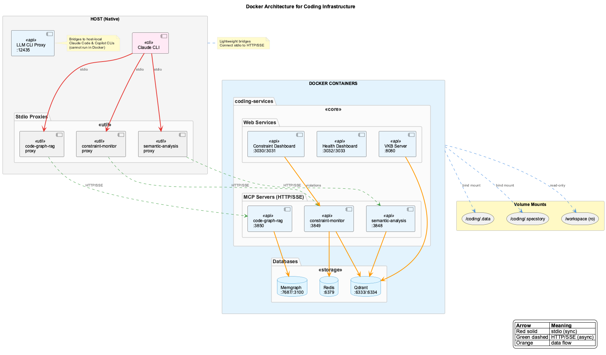
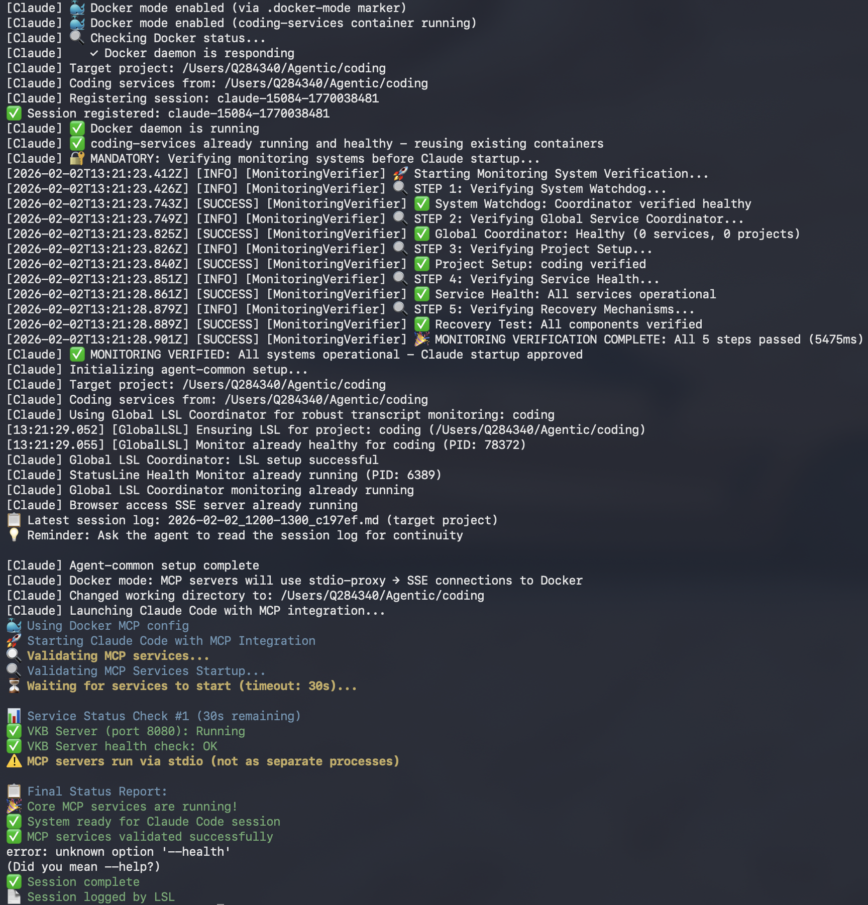
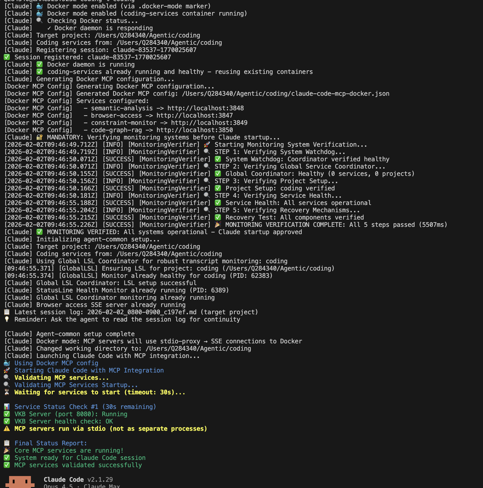

# Installation

Step-by-step guide to install coding on your system.

---

## Prerequisites

Before installing, ensure you have these tools:

=== "macOS"

    ```bash
    # Install prerequisites
    brew install git node jq tmux

    # Install Docker Desktop
    brew install --cask docker
    ```

=== "Linux (Ubuntu/Debian)"

    ```bash
    # Install prerequisites
    sudo apt update && sudo apt install -y git nodejs npm jq tmux

    # Install Docker
    curl -fsSL https://get.docker.com | sh
    sudo usermod -aG docker $USER  # Log out and back in
    ```

=== "Windows (WSL2)"

    1. Install [WSL2](https://docs.microsoft.com/en-us/windows/wsl/install)
    2. Install [Docker Desktop](https://www.docker.com/products/docker-desktop)
    3. In WSL2:
       ```bash
       sudo apt update && sudo apt install -y git nodejs npm jq tmux
       ```

### Version Requirements

| Tool | Minimum Version | Check Command |
|------|----------------|---------------|
| Node.js | 18+ | `node --version` |
| Git | 2.0+ | `git --version` |
| tmux | 3.0+ | `tmux -V` |
| Docker | 20+ | `docker --version` |
| jq | 1.6+ | `jq --version` |

---

## Docker Installation

Coding runs in Docker. All services (MCP servers, databases, dashboards) run as containers; only the Claude/Copilot CLI runs natively on the host.



### Step 1: Clone Repository

```bash
git clone --recurse-submodules https://github.com/fwornle/coding ~/Agentic/coding
cd ~/Agentic/coding
```

!!! tip "Existing Clone?"
    If you already cloned without submodules:
    ```bash
    git submodule update --init --recursive
    ```

### Step 2: Run Installer

```bash
./install.sh
```

The installer will:

1. Verify Docker is installed and running
2. Build Docker containers
3. Configure Claude MCP servers for SSE/HTTP communication
4. Set up Claude hooks (LSL, constraints)
5. Initialize knowledge store
6. Add `coding` and `vkb` commands to your PATH

!!! info "Non-Intrusive Installation"
    The installer prompts before any system changes and creates timestamped backups of your shell configuration. Use `--skip-all` to decline all system-level changes.

### Step 3: Reload Shell

```bash
source ~/.bashrc  # or ~/.zshrc for Zsh
```

### Step 4: Verify Installation

```bash
coding --health
```



You should see all services reporting healthy (green).

### Step 5: Start Coding

```bash
coding
```



---

## What Gets Installed

| Component | Location | Purpose |
|-----------|----------|---------|
| `coding` command | `~/Agentic/coding/bin/` | Launch Claude with all integrations |
| `vkb` command | `~/Agentic/coding/bin/` | View Knowledge Base |
| `ukb` command | `~/Agentic/coding/bin/` | Update Knowledge Base |
| MCP Servers | Docker | Semantic Analysis, Constraints, etc. |
| Claude Hooks | `~/.claude/settings.json` | LSL monitoring, constraint checks |
| Knowledge Store | `.data/knowledge-graph/` | Graph database |
| Session Logs | `.specstory/history/` | LSL files |

### Configuration Files Created

| File | Purpose |
|------|---------|
| `~/.claude/settings.json` | Claude hooks configuration |
| `.env` | API keys and settings |
| `.env.ports` | Port configuration |

---

## Troubleshooting Installation

### Docker Not Found

```bash
# Verify Docker is installed
docker --version

# Verify Docker daemon is running
docker info

# On macOS, ensure Docker Desktop is running
```

### Permission Denied

```bash
# Fix Docker socket permissions (Linux)
sudo usermod -aG docker $USER
# Log out and back in

# Fix directory permissions
chmod -R 755 ~/Agentic/coding
```

### Submodules Missing

```bash
cd ~/Agentic/coding
git submodule update --init --recursive
```

### Port Conflicts

```bash
# Check what's using a port
lsof -i :8080

# Change ports in .env.ports
cat .env.ports
```

### Reinstallation

To completely reinstall:

```bash
cd ~/Agentic/coding

# Stop all services
docker compose -f docker/docker-compose.yml down 2>/dev/null
pkill -f "coding"

# Clean state (preserves knowledge base)
rm -f .transition-in-progress

# Reinstall
./install.sh
```

---

## Next Steps

- [Verify Installation](verify-repair.md) - Detailed verification and repair
- [Configuration](configuration.md) - API keys and provider setup
- [First Usage](index.md#first-usage) - Start using coding

---

## Related Documentation

- [Troubleshooting](../reference/troubleshooting.md) - Common issues and solutions
