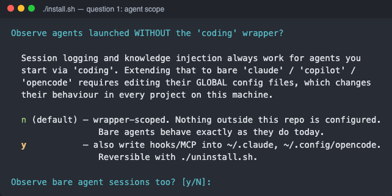
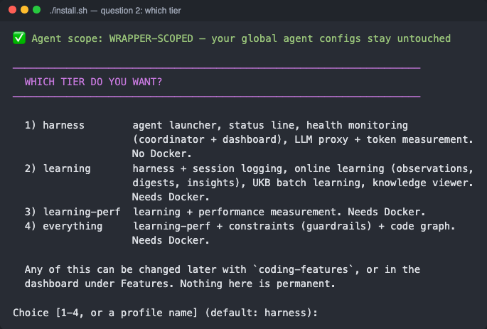
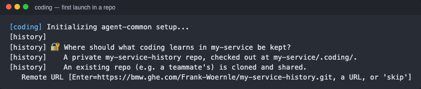
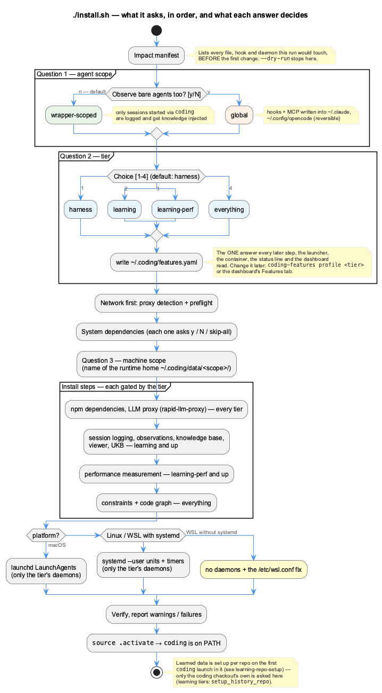

# Installation

Prerequisites, the install itself, and what it puts on your machine.

=== "⚡ Quick (~3 min)"

    ## Install

    ```bash
    git clone --recurse-submodules https://github.com/fwornle/coding ~/Agentic/coding
    cd ~/Agentic/coding && ./install.sh
    source ~/.zshrc          # or ~/.bashrc
    cd ~/my-project && coding
    ```

    `--recurse-submodules` is not optional — several integrations are submodules and the install
    fails confusingly without them.

    ## The two questions

    **1 — agent scope.** Enter (`n`) keeps your global agent configs untouched: only sessions
    started through `coding` are logged and get knowledge injected.

    

    **2 — tier.** Each tier is a superset of the one before. Enter installs `harness`.

    

    | Tier | Adds | Docker |
    |---|---|---|
    | `harness` | agent launcher, status line, health monitoring (coordinator + dashboard), LLM proxy + token measurement | no |
    | `learning` | session logging, online learning (observations → digests → insights), UKB batch learning, knowledge viewer | yes |
    | `learning-perf` | performance measurement | yes |
    | `everything` | constraints (guardrails) + code graph | yes |

    Change it any time: `coding-features profile <tier>`, or Dashboard → Features.

    ## The first launch in each repo

    With a `learning` tier, the first `coding` in a repo asks where its learned data goes —
    Enter creates a private `<repo>-history`, a teammate's URL shares theirs, `skip` keeps it
    local. See [Per-Repo Tenancy](../architecture/tenancy.md).

    

    ## What you need

    Node.js 22 LTS or newer, plus `git`, `jq` and `tmux`. Docker (**running**, not just
    installed) only for `learning` and up.

    === "macOS"

        ```bash
        brew install git node jq tmux && brew install --cask docker
        ```

    === "Linux / WSL2"

        ```bash
        sudo apt update && sudo apt install -y git nodejs npm jq tmux
        curl -fsSL https://get.docker.com | sh
        ```

    On Windows, install inside **WSL** (with systemd enabled in `/etc/wsl.conf`); there is no
    native Windows installer.

    ## What it does to your machine

    Prompts before any system-level change, backs up your shell config with a timestamp, and
    supports `--skip-all` to decline every system change. Its own state stays in the checkout.

    ## If it fails

    Most first-run failures are Docker not running, or a shell not reloaded since the install.
    [Verify & Repair](verify-repair.md) works through the rest.

=== "📖 Standard (~15 min)"

    ## Before you start

    | Tool | Why |
    |------|-----|
    | Docker | `learning` tiers and up: the knowledge services are containers — it must be **running**, not merely installed. `harness` needs none |
    | Node.js 22 LTS+ | The host-side launcher; 18 and 20 are EOL |
    | Git | Clone the repository and its submodules |
    | `jq` | JSON handling throughout the scripts |
    | `tmux` | Session wrapping and the shared status bar |

    ## Installing

    ```bash
    git clone --recurse-submodules https://github.com/fwornle/coding ~/Agentic/coding
    cd ~/Agentic/coding && ./install.sh
    source ~/.zshrc
    ```

    The services run as Docker containers with only the agent CLI native on the host, talking to
    them through stdio proxies. That is what keeps the install contained and makes removal a
    matter of stopping containers.

    ## What the installer asks, in order

    

    1. **Impact manifest** — every file, hook and background service this run would touch,
       shown before the first change. `./install.sh --dry-run` stops here.
    2. **Agent scope** — wrapper-scoped (default) or also observe bare `claude` / `copilot` /
       `opencode` by writing their global configs.
    3. **Tier** — `harness` · `learning` · `learning-perf` · `everything`, written to
       `~/.coding/features.yaml`. Every later step, the launcher, the container, the status line
       and the dashboard read that one file.
    4. **System dependencies** — each missing one asks `y` / `N` / `skip-all`.
    5. **Machine scope** — the name of this machine's runtime home `~/.coding/data/<scope>/`
       (caches only; what is shared lives in each repo, see
       [Per-Repo Tenancy](../architecture/tenancy.md)).

    Unattended: `./install.sh --yes --features=learning` (default tier `harness`). A re-run asks
    again with your current tier as the default, so changing tier is just re-running it.

    Background services are installed per platform — launchd on macOS, systemd user units on
    Linux and WSL — and only for the features of the chosen tier. WSL without systemd gets no
    services and the `/etc/wsl.conf` fix printed instead.

    ## What the installer is careful about

    It is deliberately non-intrusive, and each of these is a decision rather than an accident: it
    **prompts before any system-level change**, writes a **timestamped backup** of your shell
    config before touching it, honours **`--skip-all`** to decline every system change, and keeps
    its data inside the checkout rather than scattering it through your home directory.

    ## What you end up with

    | Component | Does |
    |-----------|------|
    | `coding` | Launches an agent with every enabled integration attached |
    | `coding-features` | Shows and changes the installed tier |
    | `coding sync` | Commits, pulls and pushes each repo's learning repo |
    | `semantic` | Knowledge-base workflows and ontology management (`learning`+) |
    | `vkb` | Opens the knowledge viewer (`learning`+) |
    | Dashboard | [localhost:3032](http://localhost:3032) — health, sessions, insights, tokens, teams, features |
    | Session logging | Automatic transcript capture into each repo's `.coding/history/` (`learning`+) |

    ## When it does not work

    Work in this order, because the failures nest:

    1. **Is Docker running?** (`learning` tiers and up) Not installed — running. This is the
       most common first-run failure.
    2. **Has the shell been reloaded?** `source ~/.zshrc`, or open a new terminal.
    3. **Did the submodules come down?** `git submodule update --init --recursive` if the clone
       omitted `--recurse-submodules`.
    4. **Then** the dashboard at [localhost:3032](http://localhost:3032), `coding-features status`,
       and [Verify & Repair](verify-repair.md) for anything remaining.

=== "📚 Deep Dive (full)"

    --8<-- "_tiers/getting-started/installation.deep.md"
