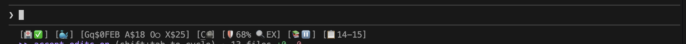

# Verify & Repair Installation

Test your installation and fix common issues.

---

## Quick Health Check

Run the comprehensive health check:

```bash
coding --health
```



A healthy system shows all services in green. If you see red indicators, follow the troubleshooting steps below.

---

## Automated Test Suite

The test script verifies all components:

```bash
# Check-only mode (default)
./scripts/test-coding.sh

# Interactive repair mode
./scripts/test-coding.sh --interactive

# Verbose output
./scripts/test-coding.sh --verbose
```

### Test Categories

| Test | What It Checks |
|------|----------------|
| Prerequisites | Node.js, Git, jq, Docker versions |
| Commands | `coding`, `vkb`, `ukb` in PATH |
| Configuration | `.env`, hooks, MCP config |
| Services | Docker containers or native processes |
| Connectivity | Health endpoints, port availability |
| Knowledge Base | Graph database accessibility |

---

## Detailed Verification

### 1. Check Prerequisites

```bash
# Node.js 18+
node --version

# Git
git --version

# jq
jq --version

# Docker (if Docker mode)
docker --version
docker info
```

### 2. Verify Commands Available

```bash
# Should show help
coding --help
vkb --help

# Check locations
which coding
which vkb
```

If commands not found, check your PATH:

```bash
echo $PATH | grep -q "Agentic/coding/bin" && echo "OK" || echo "Missing from PATH"
```

### 3. Check Docker Services (Docker Mode)

```bash
# List running containers
docker compose -f ~/Agentic/coding/docker/docker-compose.yml ps

# Expected output shows these services running:
# - coding-services (main MCP servers)
# - memgraph (graph database)
# - qdrant (vector database)
```

### 4. Test Health Endpoints

```bash
# Semantic Analysis MCP
curl -s http://localhost:3848/health | jq .

# Constraint Monitor MCP
curl -s http://localhost:3031/health | jq .

# VKB Server
curl -s http://localhost:8080/health | jq .

# Health Dashboard
curl -s http://localhost:3032/health | jq .
```

### 5. Verify LSL Monitor

```bash
# Check monitor health file
cat .health/coding-transcript-monitor-health.json | jq '{status, activity, lastCheck}'

# Check if monitor process is running
ps aux | grep -v grep | grep "enhanced-transcript-monitor"
```

### 6. Test Knowledge Base

```bash
# Check knowledge store exists
ls -la .data/knowledge-graph/

# Test VKB connection
curl -s http://localhost:8080/api/entities | jq 'length'
```

---

## Common Issues and Fixes

### Services Not Starting

**Symptoms**: Health check shows services as red/unavailable

**Docker Mode Fix**:
```bash
# Restart Docker services
docker compose -f docker/docker-compose.yml restart

# If that fails, rebuild
docker compose -f docker/docker-compose.yml down
docker compose -f docker/docker-compose.yml up -d --build
```

**Native Mode Fix**:
```bash
# Restart services
coding --restart-services
```

### Port Conflicts

**Symptoms**: "Address already in use" errors

**Fix**:
```bash
# Find what's using the port
lsof -i :8080

# Kill the process or change port in .env.ports
nano .env.ports

# Restart services after port change
docker compose -f docker/docker-compose.yml down
docker compose -f docker/docker-compose.yml up -d
```

### MCP Connection Errors

**Symptoms**: Claude can't connect to MCP servers

**Fix**:
```bash
# Verify MCP config
cat ~/.claude/settings.json | jq '.mcpServers'

# Reinstall hooks and config
./install.sh --mcp-only
```

### LSL Not Recording

**Symptoms**: No files in `.specstory/history/`

**Fix**:
```bash
# Check monitor status
cat .health/coding-transcript-monitor-health.json

# Restart monitor
coding --restart-monitor

# If still failing, check logs
tail -100 .logs/transcript-monitor-test.log
```

### Knowledge Base Corrupted

**Symptoms**: VKB shows errors, `ukb` fails

**Fix**:
```bash
# Backup current data
cp -r .data/knowledge-graph .data/knowledge-graph.backup

# Reset knowledge base
rm -rf .data/knowledge-graph
mkdir -p .data/knowledge-graph

# Re-run full analysis
# (within Claude session)
ukb full
```

### Docker Mode Not Detected

**Symptoms**: Services run in native mode despite Docker installed

**Fix**:
```bash
# Create Docker mode marker
touch .docker-mode

# Verify
ls -la .docker-mode

# Restart
coding
```

---

## Repair Commands

### Full Repair

```bash
./install.sh --repair
```

This will:
1. Check all prerequisites
2. Reinstall missing components
3. Rebuild Docker containers (if Docker mode)
4. Reset configuration to defaults
5. Restart all services

### Selective Repair

```bash
# Repair only MCP configuration
./install.sh --mcp-only

# Repair only hooks
./install.sh --hooks-only

# Rebuild Docker containers
cd docker && docker-compose build --no-cache && docker-compose up -d
```

### Reset to Clean State

!!! warning "Data Loss"
    This removes all local data including knowledge base and session logs.

```bash
# Stop everything
docker compose -f docker/docker-compose.yml down 2>/dev/null
pkill -f "coding"

# Remove state files
rm -rf .data .specstory .health .logs .cache
rm -f .docker-mode .transition-in-progress

# Reinstall
./install.sh
```

---

## Diagnostic Information

When reporting issues, include this diagnostic output:

```bash
# Generate diagnostic report
coding --diagnostics > diagnostics.txt

# Or manually collect:
echo "=== System ===" >> diagnostics.txt
uname -a >> diagnostics.txt
echo "=== Node ===" >> diagnostics.txt
node --version >> diagnostics.txt
echo "=== Docker ===" >> diagnostics.txt
docker --version >> diagnostics.txt
docker compose version >> diagnostics.txt
echo "=== Mode ===" >> diagnostics.txt
ls -la .docker-mode 2>&1 >> diagnostics.txt
echo "=== Services ===" >> diagnostics.txt
docker compose -f docker/docker-compose.yml ps 2>&1 >> diagnostics.txt
echo "=== Health ===" >> diagnostics.txt
coding --health 2>&1 >> diagnostics.txt
```

---

## Related Documentation

- [Installation Guide](installation.md) - Fresh installation
- [Configuration](configuration.md) - API keys and settings
- [Troubleshooting Reference](../reference/troubleshooting.md) - Extended troubleshooting
