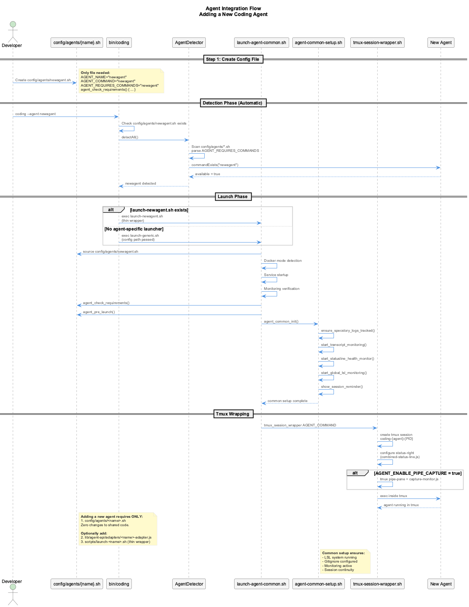
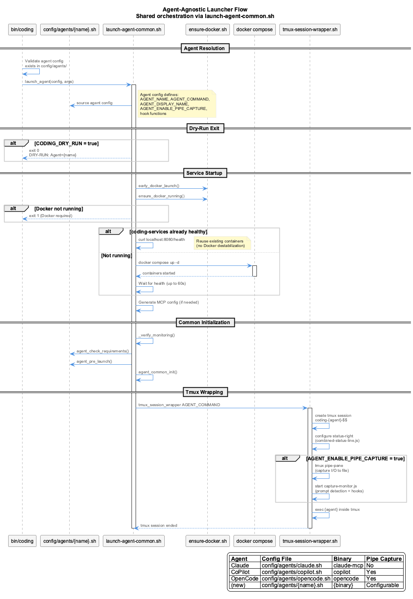
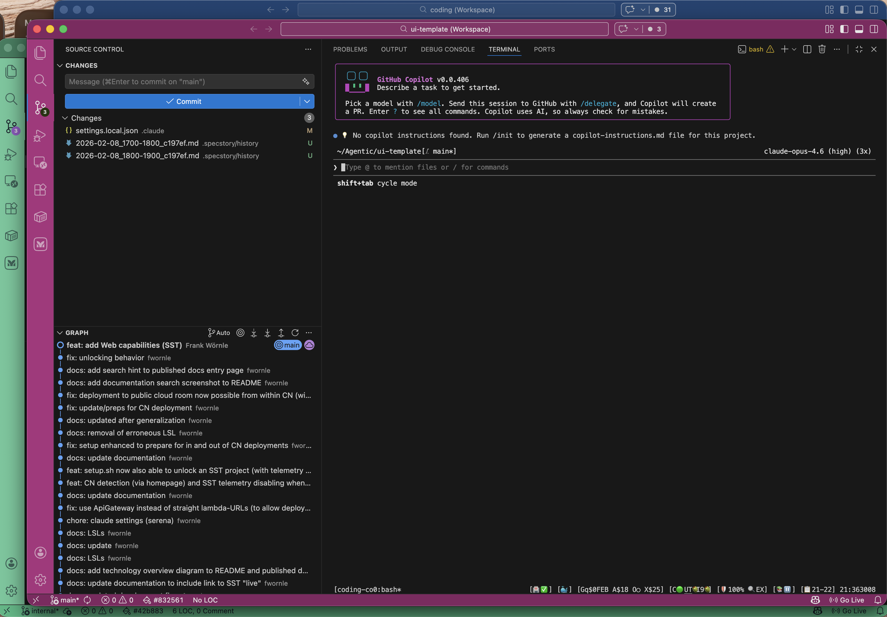
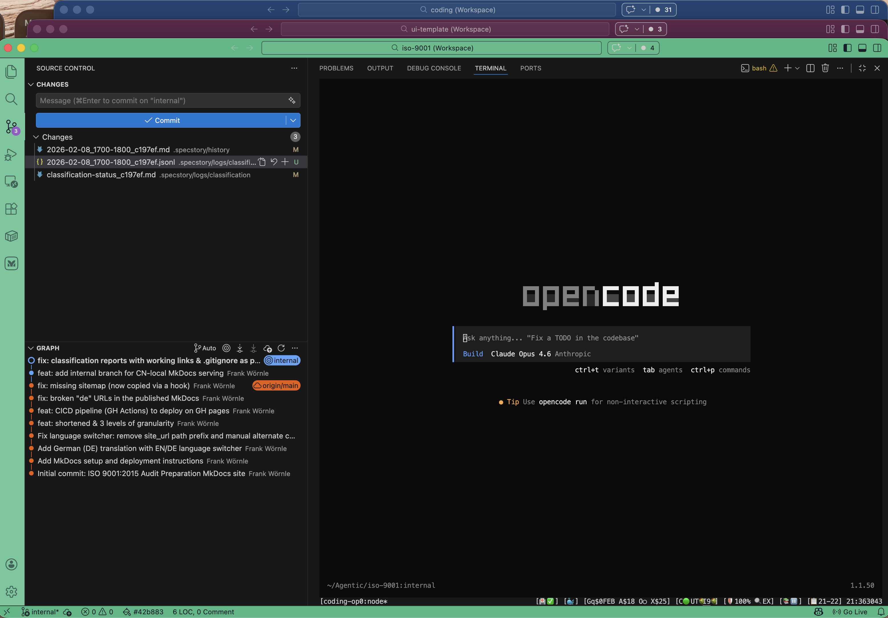

# Agent Integration Guide

**Adding New Coding Agents to the Coding System**

This guide provides step-by-step instructions for integrating new AI coding assistants into the agent-agnostic Coding system.

!!! success "1-File Integration"
    Adding a new agent requires **only a single config file** (`config/agents/<name>.sh`). No changes to shared code needed.

---

## Overview

The Coding system supports multiple AI coding assistants through a config-driven architecture. All agents share common infrastructure:

- **Tmux Session Wrapping** - Unified status bar rendering via `tmux-session-wrapper.sh`
- **Live Session Logging (LSL)** - Automatic transcript monitoring
- **Knowledge Management** - VKB server and semantic analysis
- **Constraint Monitoring** - Real-time code quality enforcement
- **Health Monitoring** - System status and recovery
- **Browser Automation** - Playwright integration
- **Session Continuity** - Cross-session context
- **Pipe-Pane Capture** - Optional I/O capture for non-native agents (prompt detection, hook firing)

---

## Architecture

### Agent-Agnostic Design


The system follows a layered architecture:

1. **Agent Layer** - Your AI coding assistant (Claude, CoPilot, OpenCode, etc.)
2. **Tmux Wrapper Layer** - Shared `tmux-session-wrapper.sh` wraps all agents in tmux with unified status bar
3. **Config Layer** - Agent definitions in `config/agents/<name>.sh`
4. **Orchestration Layer** - `launch-agent-common.sh` handles all shared startup (Docker, services, monitoring)
5. **Common Setup Layer** - Shared initialization (LSL, monitoring, gitignore)
6. **Shared Services Layer** - VKB, Semantic Analysis, Constraints, LSL
7. **Adapter Layer** - Abstract interface + agent implementations (loaded dynamically)

### Integration Flow



When a new agent is launched:

1. `bin/coding` validates config exists in `config/agents/<name>.sh`
2. Agent detection checks CLI availability via `AGENT_REQUIRES_COMMANDS`
3. Shared orchestrator (`launch-agent-common.sh`) sources the config
4. Docker mode detection (3-tier: marker file, container check, env var)
5. Services start (Docker compose or native, based on mode)
6. Agent-specific hooks run (`agent_check_requirements`, `agent_pre_launch`)
7. Agent launches wrapped in tmux session with unified status bar
8. Optional: pipe-pane I/O capture with `capture-monitor.js`

### Launcher Docker Mode Flow



All agents share identical Docker mode logic via `launch-agent-common.sh`:

- Transition lock checking (waits for mode transitions)
- 3-tier Docker mode detection
- Conditional Docker/native service startup
- Container reuse (health check before starting new containers)
- Docker MCP config generation

---

## Quick Start (1 File)

Create `config/agents/myagent.sh`:

```bash
#!/bin/bash
# Agent definition: My Agent
# Sourced by launch-agent-common.sh

AGENT_NAME="myagent"
AGENT_DISPLAY_NAME="MyAgent"
AGENT_COMMAND="myagent"
AGENT_SESSION_PREFIX="myagent"
AGENT_SESSION_VAR="MYAGENT_SESSION_ID"
AGENT_TRANSCRIPT_FMT="myagent"
AGENT_ENABLE_PIPE_CAPTURE=true
AGENT_PROMPT_REGEX='>\s+([^\n\r]+)[\n\r]'
AGENT_REQUIRES_COMMANDS="myagent"

# Verify agent CLI is available
agent_check_requirements() {
  if ! command -v myagent &>/dev/null; then
    _agent_log "Error: myagent CLI is not installed or not in PATH"
    exit 1
  fi
  _agent_log "myagent CLI detected"
}
```

**That's it.** Now test:

```bash
# Verify config is discovered
coding --agent myagent --dry-run

# Launch (if myagent binary is installed)
coding --agent myagent
```

!!! info "What You Get Automatically"
    - Docker mode detection and service startup
    - Monitoring verification
    - LSL transcript monitoring
    - Tmux session with status bar
    - Pipe-pane I/O capture (since `AGENT_ENABLE_PIPE_CAPTURE=true`)
    - Session registration and cleanup
    - All shared infrastructure

---

## Agent Config Reference

### Required Variables

| Variable | Description | Example |
|---|---|---|
| `AGENT_NAME` | Internal identifier (used in env vars) | `"myagent"` |
| `AGENT_COMMAND` | Binary/script to exec inside tmux | `"myagent"` or `"$CODING_REPO/bin/my-wrapper"` |

### Optional Variables

| Variable | Default | Description |
|---|---|---|
| `AGENT_DISPLAY_NAME` | `$AGENT_NAME` | Human-readable name for log messages |
| `AGENT_SESSION_PREFIX` | `$AGENT_NAME` | Prefix for session ID (`{prefix}-{PID}-{timestamp}`) |
| `AGENT_SESSION_VAR` | (none) | Env var to export session ID as (e.g. `CLAUDE_SESSION_ID`) |
| `AGENT_TRANSCRIPT_FMT` | `$AGENT_NAME` | Transcript format identifier |
| `AGENT_ENABLE_PIPE_CAPTURE` | `false` | Enable tmux pipe-pane I/O capture |
| `AGENT_PROMPT_REGEX` | (none) | Regex for prompt detection (required if capture enabled) |
| `AGENT_REQUIRES_COMMANDS` | `$AGENT_COMMAND` | Space-separated list of required CLI binaries |

### Hook Functions

Define these functions in your config to customize behavior:

```bash
# Called after services start, before agent launch
# Use to verify agent-specific dependencies
agent_check_requirements() {
  # Return non-zero or exit 1 to block launch
}

# Called just before tmux wrapping
# Use to start agent-specific services, log info
agent_pre_launch() {
  # Start HTTP adapter, set env vars, etc.
}

# Called on EXIT/INT/TERM (before PSM cleanup)
# Use to stop agent-specific background processes
agent_cleanup() {
  # Kill background servers, etc.
}
```

!!! tip "Hook Environment"
    All hooks have access to `_agent_log` for logging, `$CODING_REPO`, `$TARGET_PROJECT_DIR`, `$DOCKER_MODE`, `$SESSION_ID`, and all other env vars set by the orchestrator.

---

## Optional Enhancements

### Agent Adapter (for programmatic API access)

If other components need to interact with your agent programmatically, create `lib/agent-api/adapters/myagent-adapter.js`:

```javascript
import { BaseAdapter } from '../base-adapter.js';

class MyAgentAdapter extends BaseAdapter {
  constructor(config = {}) {
    super(config);
    this.capabilities = ['memory', 'browser', 'logging'];
  }

  async initialize() { this.initialized = true; }
  async cleanup() { /* cleanup resources */ }

  // Implement methods from API Contract below
}

export default MyAgentAdapter;
```

The adapter is loaded automatically by convention: `lib/agent-api/adapters/${agentType}-adapter.js`.

### Agent-Specific Launcher (thin wrapper)

If you need to customize the sourcing order or add pre-config logic, create `scripts/launch-myagent.sh`:

```bash
#!/bin/bash
set -e
SCRIPT_DIR="$(cd "$(dirname "${BASH_SOURCE[0]}")" && pwd)"
CODING_REPO="$(dirname "$SCRIPT_DIR")"
export CODING_REPO
source "$SCRIPT_DIR/agent-common-setup.sh"
source "$SCRIPT_DIR/launch-agent-common.sh"
launch_agent "$CODING_REPO/config/agents/myagent.sh" "$@"
```

If no `launch-myagent.sh` exists, `bin/coding` automatically falls back to `launch-generic.sh`.

---

## API Contract

### AgentAdapter Interface

**All adapters MUST implement these methods:**

#### Lifecycle Methods

```typescript
async initialize(): Promise<void>
async cleanup(): Promise<void>
```

#### Command Execution

```typescript
async executeCommand(command: string, args: string[]): Promise<any>
```

#### Memory Operations

```typescript
async memoryCreate(entities: Entity[]): Promise<CreateResult>
async memoryCreateRelations(relations: Relation[]): Promise<CreateResult>
async memorySearch(query: string): Promise<Entity[]>
async memoryRead(): Promise<GraphData>
async memoryDelete(entityNames: string[]): Promise<DeleteResult>
```

#### Browser Operations

```typescript
async browserNavigate(url: string): Promise<NavigationResult>
async browserAct(action: string, variables: Record<string, any>): Promise<ActionResult>
async browserExtract(): Promise<string>
async browserScreenshot(options?: ScreenshotOptions): Promise<Buffer>
```

#### Logging Operations

```typescript
async logConversation(data: ConversationEntry): Promise<LogResult>
async readConversationHistory(options?: HistoryOptions): Promise<ConversationEntry[]>
```

#### Utility Methods

```typescript
hasCapability(capability: string): boolean
getCapabilities(): string[]
isInitialized(): boolean
```

### Type Definitions

??? note "Full Type Definitions (click to expand)"
    ```typescript
    interface Entity {
      name: string;
      entityType: string;
      observations: string[];
      significance?: number;
      created?: string;
      lastUpdated?: string;
      metadata?: Record<string, any>;
    }

    interface Relation {
      from: string;
      to: string;
      relationType: string;
      created?: string;
      metadata?: Record<string, any>;
    }

    interface GraphData {
      nodes: Entity[];
      edges: Relation[];
      metadata?: { nodeCount: number; edgeCount: number; lastAccessed: string; };
    }

    interface CreateResult { success: boolean; created?: number; updated?: number; errors?: string[]; }
    interface DeleteResult { success: boolean; deleted: number; notFound: number; }
    interface NavigationResult { success: boolean; url?: string; error?: string; }
    interface ActionResult { success: boolean; result?: any; error?: string; }
    interface ConversationEntry { timestamp: string; type: string; content: any; metadata?: Record<string, any>; }
    interface LogResult { success: boolean; logFile?: string; error?: string; }
    interface HistoryOptions { limit?: number; startDate?: Date; endDate?: Date; type?: string; }
    ```

---

## Testing

### Test Checklist

- [ ] **Config**: `config/agents/<name>.sh` exists with required variables
- [ ] **Dry-run**: `coding --agent <name> --dry-run` succeeds
- [ ] **Detection**: Agent detected by `AgentDetector` (check with `coding --help`)
- [ ] **Launch**: Agent starts via `coding --agent <name>`
- [ ] **Tmux**: Agent launches inside tmux session with status bar
- [ ] **LSL**: Transcripts monitored and classified
- [ ] **Monitoring**: StatusLine health monitoring active
- [ ] **Cleanup**: Graceful shutdown works (`agent_cleanup` called)
- [ ] **E2E**: `tests/integration/launcher-e2e.sh` passes

### Validation Commands

```bash
# Dry-run (safe, no actual launch)
coding --agent myagent --dry-run

# Check detection
coding --help

# Launch agent
coding --agent myagent

# Check LSL status
coding --lsl-status

# Run full E2E test suite
./tests/integration/launcher-e2e.sh
```

---

## Examples

### Claude Code (`config/agents/claude.sh`)

- `AGENT_COMMAND="$CODING_REPO/bin/claude-mcp"` — launches via MCP wrapper
- `AGENT_ENABLE_PIPE_CAPTURE=false` — Claude has native transcript support
- `agent_check_requirements()` — checks MCP sync status
- `agent_pre_launch()` — logs Docker/native mode info

### GitHub Copilot CLI (`config/agents/copilot.sh`)

- `AGENT_COMMAND="copilot"` — launches copilot CLI directly
- `AGENT_ENABLE_PIPE_CAPTURE=true` — captures I/O via tmux pipe-pane
- `AGENT_PROMPT_REGEX` — detects submitted prompts via `❯` marker
- `agent_pre_launch()` — starts HTTP adapter server
- `agent_cleanup()` — stops HTTP adapter on exit



### OpenCode (`config/agents/opencode.sh`)

- 25-line config file, zero shared code changes
- Demonstrates the minimum integration: `AGENT_NAME` + `AGENT_COMMAND` + `agent_check_requirements()`



---

## Troubleshooting

### Agent Not Detected

1. Does `config/agents/<name>.sh` exist?
2. Is `AGENT_REQUIRES_COMMANDS` set to the correct binary name?
3. Is the binary in PATH? (`which <binary>`)

### Dry-Run Fails

1. Check `config/agents/<name>.sh` defines `AGENT_NAME` and `AGENT_COMMAND`
2. Check for syntax errors: `bash -n config/agents/<name>.sh`

### Services Not Starting

1. Are required ports available (8080, etc.)?
2. Is Docker running (for Docker mode)?
3. Does `start-services.sh` complete successfully?

### Pipe-Pane Capture Not Working

1. Is `AGENT_ENABLE_PIPE_CAPTURE=true` set in config?
2. Is `AGENT_PROMPT_REGEX` a valid regex?
3. Check capture file exists: `ls $CODING_REPO/.logs/capture/`
4. Check capture-monitor.js logs

---

## Related Documentation

- [Architecture Overview](../architecture/index.md)
- [Core Systems](../core-systems/index.md)
- [Status Line Guide](status-line.md)
- [Health Dashboard](health-dashboard.md)
