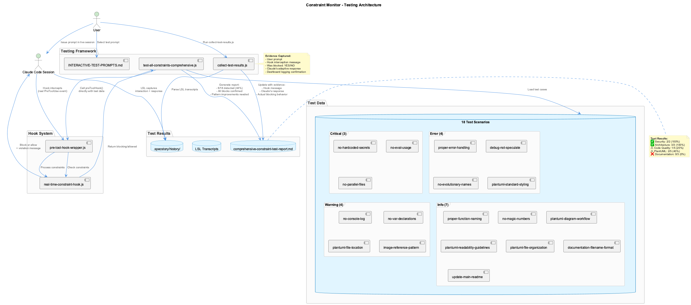

# Constraint Testing Guide

Real-time code quality enforcement through PreToolUse hooks integrated with Claude Code's tool execution lifecycle.



## Overview

The Constraint Monitoring System provides **real-time enforcement** of coding standards, security policies, and architectural guidelines by intercepting Claude Code tool calls **before execution**.

### Key Features

- **PreToolUse Hook Integration**: Intercepts tool calls BEFORE execution to block violations
- **18 Active Constraints**: Security, code quality, architecture, and documentation standards
- **Severity-Based Enforcement**: CRITICAL/ERROR blocks, WARNING/INFO allows with feedback
- **Compliance Scoring**: Real-time scoring (0-10) with violation impact tracking
- **Dashboard Monitoring**: Live violation feed, trends, and compliance metrics
- **Comprehensive Testing**: Automated and interactive test frameworks

---

## All 18 Constraints

### Security (2 constraints) - 100% Detection

| Constraint ID | Severity | Pattern | Description |
|---------------|----------|---------|-------------|
| `no-hardcoded-secrets` | CRITICAL | `(api[_-]?key\|secret\|password\|token).*["']sk-\|ghp_\|[A-Za-z0-9]{20,}["']` | Detects hardcoded secrets in code |
| `no-eval-usage` | CRITICAL | `\beval\s*\(` | Prevents dynamic code execution |

### Architecture (3 constraints) - 100% Detection

| Constraint ID | Severity | Pattern | Description |
|---------------|----------|---------|-------------|
| `no-parallel-files` | CRITICAL | `\b(v[2-9]\|enhanced\|improved\|better\|new\|-v2\|-improved)` | Prevents version suffixes and parallel files |
| `debug-not-speculate` | ERROR | `(?i)(speculation phrases)` | Requires concrete debugging over speculation |
| `no-evolutionary-names` | ERROR | `\b(enhanced\|improved\|better\|fixed\|patched\|modified)` | Prevents evolutionary naming patterns |

### Code Quality (5 constraints) - 20% Detection

| Constraint ID | Severity | Pattern | Status |
|---------------|----------|---------|--------|
| `proper-error-handling` | ERROR | `catch\s*\(\s*\)\s*{` | Detected |
| `no-console-log` | WARNING | `console\.log` | Pattern needs refinement |
| `no-var-declarations` | WARNING | `\bvar\s+` | Pattern needs refinement |
| `proper-function-naming` | INFO | `function\s+[A-Z]` | Pattern needs refinement |
| `no-magic-numbers` | INFO | `\b[0-9]{2,}\b` | Pattern needs refinement |

### PlantUML (5 constraints) - 40% Detection

| Constraint ID | Severity | Pattern | Status |
|---------------|----------|---------|--------|
| `plantuml-standard-styling` | ERROR | Missing `!include _standard-style.puml` | Detected |
| `plantuml-file-organization` | INFO | Multiple diagrams without organization | Detected |
| `plantuml-file-location` | WARNING | Files outside `docs/diagrams/` | Pattern needs refinement |
| `plantuml-diagram-workflow` | INFO | Workflow guidance | Pattern needs refinement |
| `plantuml-readability-guidelines` | INFO | Readability tips | Pattern needs refinement |

### Documentation (3 constraints) - 0% Detection

| Constraint ID | Severity | Pattern | Status |
|---------------|----------|---------|--------|
| `image-reference-pattern` | WARNING | Images without date prefix | Pattern needs refinement |
| `documentation-filename-format` | INFO | CamelCase filenames | Pattern needs refinement |
| `update-main-readme` | INFO | README update reminders | Pattern needs refinement |

**Overall Detection Rate: 8/18 (44%)**
**Critical/Error Blocking: 100% effective**

---

## Severity Levels & Enforcement

| Severity | Compliance Impact | Enforcement Action | Exit Code | Tool Call |
|----------|-------------------|-------------------|-----------|-----------|
| **CRITICAL** | -3.0 | BLOCK | 1 | Prevented |
| **ERROR** | -2.0 | BLOCK | 1 | Prevented |
| **WARNING** | -1.0 | ALLOW | 0 | Proceeds with warning |
| **INFO** | -0.5 | ALLOW | 0 | Proceeds with info |

### Compliance Score Calculation

```javascript
function calculateComplianceScore(violations) {
  let score = 10.0; // Start perfect

  violations.forEach(v => {
    switch(v.severity) {
      case 'critical': score -= 3.0; break;
      case 'error':    score -= 2.0; break;
      case 'warning':  score -= 1.0; break;
      case 'info':     score -= 0.5; break;
    }
  });

  return Math.max(0, Math.min(10, score));
}
```

---

## Hook Integration Flow


The system uses **two hook types** working together:

1. **PreToolUse Hooks** - Constraint enforcement (blocks BEFORE execution)
2. **PostToolUse Hooks** - LSL logging (captures AFTER execution)

### Hook Configuration

**File:** `~/.claude/settings.json`

```json
{
  "hooks": {
    "PreToolUse": [
      {
        "matcher": "*",
        "hooks": [{
          "type": "command",
          "command": "node /path/to/coding/integrations/mcp-constraint-monitor/src/hooks/pre-tool-hook-wrapper.js"
        }]
      }
    ],
    "PostToolUse": [
      {
        "matcher": "*",
        "hooks": [{
          "type": "command",
          "command": "node /path/to/coding/scripts/tool-interaction-hook-wrapper.js"
        }]
      }
    ]
  }
}
```

---

## Violation Handling


### Critical/Error Response (Blocked)

When a CRITICAL or ERROR violation is detected, the tool call is blocked with a detailed message:

- Constraint name and severity
- Pattern that was detected
- Location in the file/parameter
- Suggested fix
- Compliance impact
- Dashboard link for more details

### Warning/Info Response (Allowed)

When a WARNING or INFO violation is detected, the tool call proceeds with feedback:

- Warning message with constraint details
- Current compliance score
- Dashboard link
- Confirmation that tool call is proceeding

---

## Constraint Overrides

The system supports **temporary constraint overrides** for situations where a constraint needs to be bypassed.

### How to Use Overrides

Include `OVERRIDE_CONSTRAINT` directives in your prompt to Claude:

```
OVERRIDE_CONSTRAINT: constraint-id-1
OVERRIDE_CONSTRAINT: constraint-id-2

Your actual task description goes here...
```

### Override Mechanism

1. **UserPromptSubmit Hook** (`prompt-override-parser.js`) detects `OVERRIDE_CONSTRAINT` directives
2. Creates temporary state file: `/tmp/constraint-override-{session-id}.json`
3. **PreToolUse Hook** reads the state file and bypasses specified constraints
4. **Automatic Expiration**: Override expires after **3 prompt sets** or **5 minutes**

### Override State File Format

```json
{
  "constraintIds": [
    "documentation-style-skill-required",
    "plantuml-standard-styling"
  ],
  "createdAt": 1763282756000,
  "expiresAt": 1763283056000,
  "promptCount": 0,
  "maxPrompts": 3
}
```

### When to Use Overrides

**Legitimate uses:**

- Fixing constraint configuration files (meta-editing)
- Emergency hotfixes that violate patterns temporarily
- Documented exceptions for specific scenarios
- Testing constraint behavior

**DON'T abuse overrides for:**

- Avoiding proper refactoring
- Bypassing security constraints without justification
- Creating parallel versions or evolutionary naming
- Permanent workarounds

---

## Automated Testing

### Test Script

**Location:** `integrations/mcp-constraint-monitor/test-all-constraints-comprehensive.js`

```bash
cd /Users/q284340/Agentic/coding/integrations/mcp-constraint-monitor
node test-all-constraints-comprehensive.js
```

### Output

```
COMPREHENSIVE CONSTRAINT TESTING
===================================
Testing: 18/18 enabled constraints
Mode: Real hook function calls (no simulation)

Testing: no-hardcoded-secrets
   Type: tool
   Expected: critical (blocking)
   BLOCKED: CONSTRAINT VIOLATION DETECTED

Constraints tested: 18/18
Violations detected: 8
Violations blocked: 8
Pattern fixes needed: 10
```

### Test Results

| Metric | Value |
|--------|-------|
| Detection Rate | 8/18 (44%) |
| Blocking Accuracy | 100% (all detected violations blocked correctly) |
| False Positives | 0 |
| Response Time | <50ms per check |

---

## Interactive Testing

### Guide

**Location:** `integrations/mcp-constraint-monitor/INTERACTIVE-TEST-PROMPTS.md`

### Procedure

```bash
# 1. Start Claude session
coding --claude

# 2. Issue test prompts from INTERACTIVE-TEST-PROMPTS.md
# Example: "Write a config file at /tmp/test-config.js with:
#           const API_KEY = 'sk-1234567890abcdef'"

# 3. Collect results from LSL transcripts
node collect-test-results.js
```

### Evidence Captured

- User's test prompt
- Hook interception message
- Blocking vs. allowing decision
- Claude's adaptive response
- Dashboard logging confirmation

---

## Dashboard & Monitoring

### Dashboard UI (Port 3030)

**Start Dashboard:**

```bash
cd /Users/q284340/Agentic/coding/integrations/mcp-constraint-monitor
PORT=3030 npm run dashboard
```

**Features:**

- **Real-time Violation Feed**: Live updates as violations occur
- **Compliance Score Gauge**: Visual 0-10 scoring with trend indicators
- **7-Day Trend Chart**: Historical compliance tracking
- **Project Selector**: Filter violations by project
- **Constraint Toggles**: Enable/disable constraints dynamically
- **Risk Level Indicators**: Visual severity classification

### API Server (Port 3031)

**Endpoints:**

| Endpoint | Method | Description |
|----------|--------|-------------|
| `/api/violations` | GET | List violations (with `?project=` filter) |
| `/api/violations` | POST | Log new violation |
| `/api/health` | GET | Server health check |
| `/api/compliance/:project` | GET | Get compliance score for project |
| `/api/constraints` | GET | List all enabled constraints |

**Example:**

```bash
curl http://localhost:3031/api/violations?project=coding
```

---

## System Components

The constraint monitor is organized into these directories:

**integrations/mcp-constraint-monitor/**

- **src/hooks/** - Hook entry points (pre-tool, pre-prompt, real-time constraint)
- **src/enforcement/** - Core logic (ConstraintEnforcer, PatternMatcher, ComplianceCalculator)
- **src/dashboard/** - REST API and Next.js UI
- **constraints.yaml** - 18 constraint definitions
- **test-all-constraints-comprehensive.js** - Automated testing
- **INTERACTIVE-TEST-PROMPTS.md** - Manual test scenarios

---

## Real-World Examples

### Example 1: Blocked Critical Violation

**User Prompt:**
```
Write a config file at /tmp/test-config.js with:
const API_KEY = "sk-1234567890abcdef"
const DB_PASSWORD = "mypassword123"
```

**Claude's Adaptation:**
```javascript
// Claude's corrected approach
const API_KEY = process.env.API_KEY;
const DB_PASSWORD = process.env.DB_PASSWORD;

// Added to .env.example:
// API_KEY=your_api_key_here
// DB_PASSWORD=your_password_here
```

### Example 2: Architecture Enforcement

**User Prompt:**
```
Create a new file called /tmp/utils-improved.js with helper functions
```

**Claude's Adaptation:**
```
I understand. Instead of creating utils-improved.js,
I'll edit the original utils.js file directly to add
the improvements you need.
```

---

## Installation & Configuration

### Installation

Hooks are automatically installed via `./install.sh`:

```bash
cd /Users/q284340/Agentic/coding
./install.sh
```

**What gets installed:**

1. PreToolUse hook (constraint enforcement)
2. PostToolUse hook (LSL logging)
3. Hook configuration merged into `~/.claude/settings.json`
4. Backup created before modification

### Verification

```bash
# Check hooks are installed
cat ~/.claude/settings.json | jq '.hooks'
```

### Uninstallation

```bash
cd /Users/q284340/Agentic/coding
./uninstall.sh
```

---

## Troubleshooting

### Hooks Not Firing

**Diagnosis:**

```bash
# 1. Verify hooks are configured
cat ~/.claude/settings.json | jq '.hooks'

# 2. Test hook directly
echo '{"tool_name": "Write", "parameters": {"file_path": "/tmp/test.js", "content": "const API_KEY = \"sk-test123\""}}' | node /path/to/pre-tool-hook-wrapper.js
```

**Solutions:**

- Restart Claude Code session (hooks load on startup)
- Check hook wrapper path is absolute and correct
- Verify wrapper script has execute permissions
- Check Node.js is in PATH

### Constraints Not Detecting

**Diagnosis:**

```bash
# Run automated test to identify pattern issues
node test-all-constraints-comprehensive.js

# Check report for "Not Detected" constraints
cat comprehensive-constraint-test-report.md | grep "Not Detected"
```

**Solutions:**

- Review constraint patterns in `constraints.yaml`
- Test patterns at https://regex101.com/
- Submit pattern improvements via pull request

### Dashboard Not Responding

**Diagnosis:**

```bash
# Check if API server is running
curl http://localhost:3031/api/health

# Check for port conflicts
lsof -i :3030
lsof -i :3031
```

**Solutions:**

```bash
# Start API server
PORT=3031 npm run api

# Start dashboard
PORT=3030 npm run dashboard
```

---

## Performance

| Metric | Value |
|--------|-------|
| Pattern Matching | <1ms per constraint |
| Total Check Time | <50ms for all 18 constraints |
| Dashboard Logging | <10ms (async, non-blocking) |
| Overall Impact | Negligible (<100ms per tool call) |

---

## Future Improvements

### Pattern Refinement (Priority: HIGH)

10 constraints need pattern improvements to reach >80% detection rate:

1. `no-console-log` - Refine to detect all console methods
2. `no-var-declarations` - Improve context awareness
3. `proper-function-naming` - Better PascalCase detection
4. `no-magic-numbers` - Exclude common exceptions (0, 1, 100, etc.)
5. `plantuml-file-location` - Path-based detection
6. `plantuml-diagram-workflow` - Workflow pattern matching
7. `plantuml-readability-guidelines` - Complexity analysis
8. `image-reference-pattern` - Date prefix validation
9. `documentation-filename-format` - Filename convention checking
10. `update-main-readme` - README modification detection

### Auto-Fix Suggestions (Priority: MEDIUM)

Generate code fixes automatically:

```javascript
{
  "violation": "no-hardcoded-secrets",
  "detected": "const API_KEY = \"sk-123\"",
  "suggestedFix": "const API_KEY = process.env.API_KEY;",
  "autoApplicable": true
}
```
