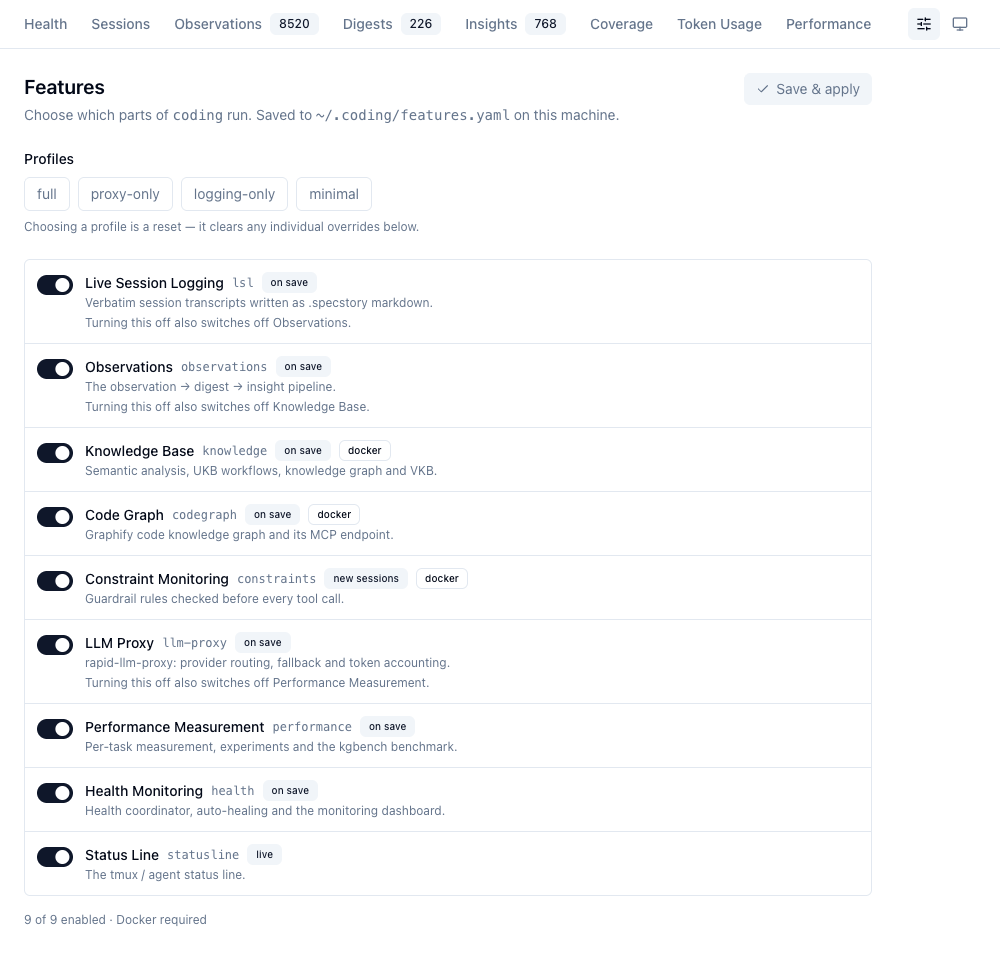
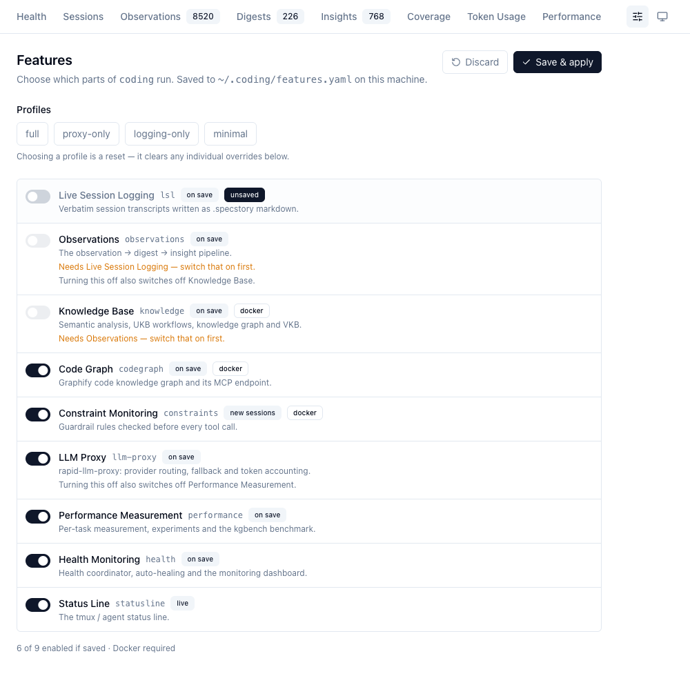

# Composing What Runs

`coding` is nine features, not one system. Some people want the whole stack; some want the
LLM proxy and nothing else; some cannot run Docker at all. Rather than forking the install,
you switch parts off.

=== "⚡ Quick (~3 min)"

    ## The nine features

    | id | what it is | needs Docker |
    |----|------------|--------------|
    | `lsl` | Verbatim session transcripts written as `.specstory` markdown | no |
    | `observations` | The observation → digest → insight pipeline | no |
    | `knowledge` | Semantic analysis, UKB workflows, the knowledge graph, VKB | **yes** |
    | `codegraph` | The graphify code knowledge graph and its MCP endpoint | **yes** |
    | `constraints` | Guardrail rules checked before every tool call | **yes** |
    | `llm-proxy` | Provider routing, fallback and token accounting | no |
    | `performance` | Per-task measurement, experiments, the kgbench benchmark | no |
    | `health` | Health coordinator, auto-healing, the monitoring dashboard | no |
    | `statusline` | The tmux / agent status line | no |

    **Everything is on by default.** An install with no configuration is byte-for-byte the
    historical stack, so there is nothing to do unless you want less.

    ## Change it from the terminal

    ```bash
    coding-features                    # what is on, and why
    coding-features set knowledge off  # one feature
    coding-features profile proxy-only # a preset
    coding-features explain knowledge  # why is this off?
    ```

    ## Or from the dashboard

    **Health → Features**, or [localhost:3032/features](http://localhost:3032/features)
    directly.

    

    Each row carries its id, when the change takes effect, and whether it needs Docker.
    Nothing happens until **Save & apply**.

    ## Four presets

    | profile | leaves on | Docker |
    |---------|-----------|--------|
    | `full` | everything | yes |
    | `logging-only` | `lsl`, `health`, `statusline` | **no** |
    | `proxy-only` | `llm-proxy`, `statusline` | **no** |
    | `minimal` | `statusline` | **no** |

    Only `knowledge`, `codegraph` and `constraints` need Docker. Switch all three off and the
    launcher never starts the container or asks for a daemon — which is what makes the bottom
    three profiles work on a machine without Docker Desktop.

=== "📖 Standard (~15 min)"

    ## Dependencies resolve downwards, never upwards

    Three features are built on others:

    ```
    lsl ──▶ observations ──▶ knowledge
    llm-proxy ──▶ performance
    ```

    **A dependent whose dependency is off is switched off too. The dependency is never
    switched on for you.** Turning something off is an explicit instruction and is honoured
    exactly; turning something on by implication would start services you did not ask for.

    The editor previews the whole cascade before you commit to it. One click on Live Session
    Logging takes Observations *and* Knowledge Base with it — each greyed out, each saying
    which dependency it is waiting on, and the footer counting what would survive the save:

    

    A blocked feature's toggle is not merely greyed — it will not move. Turning Knowledge Base
    back on from that state would be undone by the resolver a moment later, and a switch that
    silently flips itself back is worse than one that refuses.

    ## When a change takes effect

    Not everything can apply instantly, and the UI says which is which rather than implying
    they are all the same.

    | tier | what it covers | when |
    |------|----------------|------|
    | `live` | status line, dashboard gating, coordinator checks, CLI gates | next read — no restart |
    | `on save` | host daemons and container programs | immediately; only the delta is started or stopped |
    | `new sessions` | agent hooks | next agent launch — `--settings` is fixed at launch |

    ## Where the setting lives

    Four layers, last one wins:

    1. built-in defaults — everything on
    2. `<repo>/config/features.yaml` — committed, shared by the team
    3. `~/.coding/features.yaml` — this machine; what the CLI and the dashboard write
    4. `CODING_FEATURE_<ID>=on|off` — this shell only

    `coding-features explain <id>` names the layer that decided, so "why is this off" has one
    answer everywhere — the CLI, the status line tooltip and the dashboard chip all quote the
    same reason string.

    ## Turning off the thing you are looking at

    The dashboard is served *by* the `health` feature. Saving `proxy-only` or `minimal` from
    the editor therefore stops the editor. It asks first, and whatever terminal or log the
    apply lands in prints the way back:

    ```
    ⚠️  Health Monitoring is now off: the coordinator and the dashboard have stopped.
        The dashboard cannot turn it back on, because the dashboard is part of it.
        To restore everything:  coding-features profile full
    ```

    ## What a pared-down install looks like

    The status line is the fastest way to see the effect — a disabled feature contributes no
    badge at all, rather than a greyed-out one:

    `full` — everything on:

    <span class="statusline">[🏥<span class="sl-green">●</span>] [AX<span class="sl-green">●</span><span class="sl-under">C</span><span class="sl-green">●</span>] [🔒72%<span class="sl-amber">●</span>7] [📚<span class="sl-green">●</span>] [N:OPEN P:AUTO] [🧠<span class="sl-green">●</span>] <span class="gauge gauge-ok">███░░░░░  46%</span> [📋8-9] 08:19</span>

    `logging-only` — health, sessions and the log tranche survive; the knowledge, constraint
    and proxy badges go with their features:

    <span class="statusline">[🏥<span class="sl-green">●</span>] [AX<span class="sl-green">●</span><span class="sl-under">C</span><span class="sl-green">●</span>] [N:OPEN P:AUTO] <span class="gauge gauge-ok">███░░░░░  47%</span> [📋8-9] 08:19</span>

    `proxy-only` — one badge, the gauge, the clock:

    <span class="statusline">[🧠<span class="sl-green">●</span>] <span class="gauge gauge-ok">███░░░░░  47%</span> 08:19</span>

    `minimal`:

    <span class="statusline"><span class="gauge gauge-ok">███░░░░░  47%</span> 08:19</span>

    The context gauge and the clock are core, not a feature, so they survive every profile.
    The examples above are generated from the real renders by
    `scripts/render-statusline-png.mjs --spans`, not typed — hand-written bars on this site had
    already drifted to ten-cell gauges and a split `[N:] [P:]` pair months after both changed.

=== "📚 Deep Dive (full)"

    --8<-- "_tiers/guides/features.deep.md"
