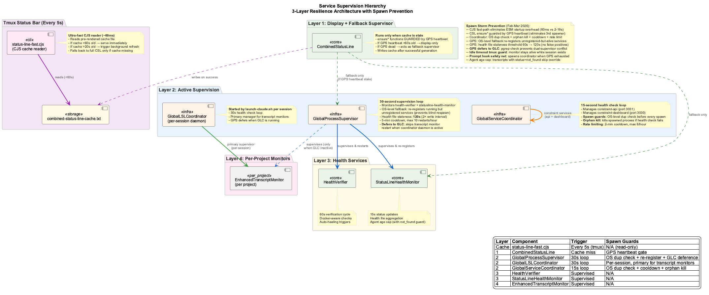

# Health Dashboard Deep Dive

Comprehensive health tracking and status reporting across all Claude Code sessions.


## 6-Layer Protection Architecture


The system implements a robust 6-layer monitoring protection with 9 core classes:

| Layer | Class | Purpose |
|-------|-------|---------|
| **Layer 0** | SystemMonitorWatchdog | Ultimate failsafe - runs via cron/launchd, ensures GSC always runs |
| **Layer 1** | GlobalServiceCoordinator | Self-healing daemon managing all critical services |
| **Layer 1** | GlobalLSLCoordinator | Multi-project transcript monitoring manager |
| **Layer 2** | MonitoringVerifier | Pre-session verification (exit 0=OK, 1=FAIL, 2=WARN) |
| **Layer 3** | HealthVerifier | Core verification engine with auto-healing |
| **Layer 4** | StatusLineHealthMonitor | Health aggregation for Claude Code status bar |
| **Layer 5** | EnhancedTranscriptMonitor | Real-time per-project transcript monitoring |
| **Layer 5** | LiveLoggingCoordinator | Logging orchestration with multi-user support |
| **Core** | ProcessStateManager | Unified registry with atomic file locking (used by all) |


---

## 9-Class System Design

### Core Infrastructure: ProcessStateManager

**Location:** `scripts/process-state-manager.js`

- Unified registry for all system processes (`.live-process-registry.json`)
- Atomic file operations via proper-lockfile
- Session-aware process tracking (global, per-project, per-session)
- Used by ALL other health system classes

### Layer 0: SystemMonitorWatchdog

**Location:** `scripts/system-monitor-watchdog.js`

- Ultimate failsafe "monitor monitoring the monitor"
- Runs via system cron/launchd every minute
- Ensures GlobalServiceCoordinator is always running
- Cannot be killed by user processes

### Layer 1: GlobalServiceCoordinator

**Location:** `scripts/global-service-coordinator.js`

- Self-healing service management daemon
- 15-second health checks with exponential backoff recovery
- Manages: constraint API, constraint dashboard, MCP servers
- Service registry maintenance

### Layer 1: GlobalLSLCoordinator

**Location:** `scripts/global-lsl-coordinator.js`

- Multi-project transcript monitoring manager
- 30-second health checks on all registered projects
- Auto-recovery of dead Enhanced Transcript Monitors
- Maintains: `.global-lsl-registry.json`

### Layer 2: MonitoringVerifier

**Location:** `scripts/monitoring-verifier.js`

- Pre-session verification of all monitoring systems
- Exit codes: 0=OK, 1=Critical failure (MUST NOT START), 2=Warning
- Validates: watchdog, coordinator, project registration, service health

### Layer 3: HealthVerifier

**Location:** `scripts/health-verifier.js`

- Core verification engine with 15-second periodic checks
- Checks databases (LevelDB, Qdrant, SQLite, Memgraph, CGR Cache), services, processes
- Generates health scores (0-100) per service
- Triggers auto-healing via HealthRemediationActions
- Daemon robustness: Heartbeat mechanism, error handlers, and external watchdog

### Layer 4: StatusLineHealthMonitor

**Location:** `scripts/statusline-health-monitor.js`

- Health aggregation for Claude Code status bar
- 15-second update interval with auto-healing
- Only shows sessions with running transcript monitors
- Outputs to: `.logs/statusline-health-status.txt`

### Layer 5: EnhancedTranscriptMonitor

**Location:** `scripts/enhanced-transcript-monitor.js`

- Real-time per-project transcript monitoring
- 2-second check interval for prompt detection
- Writes health files to centralized `.health/` directory
- Generates LSL files in `.specstory/history/`

### Layer 5: LiveLoggingCoordinator

**Location:** `scripts/live-logging-coordinator.js`

- Orchestrates live logging components
- Manages LSLFileManager and operational logging
- Multi-user support with user hash tracking
- Performance metrics collection

---

## Dashboard Features

The system includes a real-time web-based health dashboard accessible at `http://localhost:3032`:

### Monitoring Cards

**1. Databases** (LevelDB, Qdrant, CGR Cache)

- Real-time connection status
- Lock detection and ownership tracking
- Availability monitoring
- CGR Cache staleness tracking (commits behind, threshold-based alerts)

**2. Services** (VKB Server, Constraint Monitor, Dashboard)

- Port connectivity checks
- Process health validation
- Service uptime tracking

**3. Processes** (Process Registry, Stale PIDs)

- Process State Manager (PSM) status
- Automatic stale PID cleanup
- Process lifecycle tracking

**4. API Quota** (LLM Providers)

- Real-time quota monitoring for all configured providers
- Provider status: Groq, Google Gemini, Anthropic Claude, OpenAI, X.AI (Grok)
- Usage percentage and remaining quota display
- Color-coded health indicators (green=operational, yellow=warning, red=error)

### Dashboard Actions

- **Run Verification**: Manually trigger health verification
- **Auto-Healing**: Toggle automatic recovery mechanisms
- **Live Updates**: Real-time status updates every 5 seconds
- **Violation Tracking**: Detailed view of active system violations
- **Recommendations**: Actionable suggestions for system health improvement

---

## UKB Workflow Monitor

The dashboard includes a dedicated UKB Workflow Monitor that provides visual tracking of knowledge base update workflows:


### Features

- **Visual Multi-Agent Workflow Graph** - Hub-and-spoke visualization showing the Coordinator orchestrating 13 specialized agents (Git, Vibe, Code, Semantic, Ontology, QA, etc.)
- **Agent Status Indicators** - Real-time execution status per agent (running, completed, not yet run)
- **Pipeline Statistics** - Commits processed, sessions analyzed, candidates discovered vs. final entities
- **Deduplication Metrics** - Shows reduction percentage (e.g., 86.9% reduction from raw to final)
- **Entity Breakdown** - Final counts by type (GraphDatabase, MCPAgent, System, Pattern, etc.)
- **Execution Details** - Duration, LLM provider used (e.g., Groq llama-3.3-70b), completion status
- **Historical View** - Browse past workflow executions with full details


### Sub-Steps Visualization

The workflow graph now displays sub-steps for multi-step agents. Click the blue badge on an agent node to expand and view its internal processing steps:


Each sub-step arc shows the step name and can be clicked to view detailed information including inputs, outputs, and LLM usage:


**Sub-Steps Features:**

- **Auto-expand on running**: When a multi-step agent starts executing, its sub-steps automatically expand with animation
- **Pulsing animation**: Running agents display a pulsing glow effect on their sub-step arcs
- **Rotating indicator**: A rotating dashed circle shows active processing
- **Click to select**: Click any sub-step arc to view its detailed information in the sidebar
- **Inputs/Outputs**: Each sub-step shows what data it receives and produces
- **LLM Usage**: Indicates whether the sub-step uses no LLM, fast, standard, or premium models

### Execution Tracing


The "View Trace" button opens the execution trace modal showing the complete timeline of all workflow steps with detailed timing, outputs, and any errors encountered.

**Access:** Click the "UKB Workflow Monitor" card on the dashboard or navigate to the dedicated tab.

---

## Daemon Robustness Mechanism

The HealthVerifier daemon implements a defense-in-depth approach to ensure continuous health monitoring.

### Heartbeat Mechanism

The daemon writes a heartbeat file every verification cycle to prove liveness:

**Location:** `.health/verifier-heartbeat.json`

```json
{
  "pid": 64832,
  "timestamp": "2025-12-14T07:32:42.292Z",
  "uptime": 30.98,
  "memoryUsage": 11647584,
  "cycleCount": 2
}
```

### Defense-in-Depth Summary

| Layer | Mechanism | Protection |
|-------|-----------|------------|
| Internal | Error Handlers | Catches uncaught exceptions/rejections |
| Internal | Timer Self-Check | Detects if setInterval stops |
| External | Heartbeat File | Proves daemon is alive and cycling |
| External | API Watchdog | Auto-restarts stale/dead daemons |

---

## Auto-Recovery Mechanisms



### Plug'n'Play Behavior

The system provides seamless recovery without requiring user intervention:

1. **Dead Monitor Detection**: Identifies stale or crashed monitor processes
2. **Automatic Recovery**: Spawns new monitors for unmonitored sessions
3. **Registry Updates**: Maintains accurate process tracking
4. **Health Verification**: Confirms recovery success

### Recovery Scenarios

- **Stale PID Recovery**: Detects and replaces dead process IDs
- **Missing Monitor Recovery**: Creates monitors for active but unmonitored sessions
- **Coordinator Recovery**: Restarts coordination processes when needed
- **Health Check Recovery**: Resumes health checking when coordinator fails

### Global Monitoring Enhancements

1. **Port Connectivity Monitoring**: Tests dashboard (port 3030) and API (port 3031) connectivity
2. **CPU Usage Detection**: Identifies stuck processes consuming excessive CPU (>50%)
3. **Process Health Validation**: Verifies running processes match expected PIDs
4. **Stuck Server Detection**: Automatically detects and reports unresponsive dashboard servers

---

## Database Health Monitoring

### Database Lock Detection

- **Pre-flight Lock Detection**: Checks for Level DB locks before opening database
- **Lock Owner Identification**: Uses `lsof` to identify which process holds database locks
- **Actionable Error Messages**: Provides clear instructions for resolving lock conflicts
- **Qdrant Health Checks**: Monitors vector database availability

### Health Check Response

```javascript
{
  levelDB: {
    available: boolean,
    locked: boolean,
    lockedBy: number | null  // PID of lock holder
  },
  qdrant: {
    available: boolean
  }
}
```

### Fail-Fast Architecture

The system uses explicit error handling instead of silent degradation:

**Error Message:**
```
Failed to initialize graph database: Level DB is locked by another process (PID: 12345).
This is likely the VKB server. To fix:
  1. Stop VKB server: vkb server stop
  2. Or kill the process: kill 12345
  3. Then retry your command
```

---

## Health Data Storage

### Centralized Health Files

All health files are centralized in the coding project's `.health/` directory:

- **Location**: `/Users/q284340/Agentic/coding/.health/`
- **Pattern**: `{projectName}-transcript-monitor-health.json`
- **Git Management**: Excluded via coding's `.gitignore`

### File Structure

The `.health/` directory contains:

- `coding-transcript-monitor-health.json`
- `curriculum-alignment-transcript-monitor-health.json`
- `nano-degree-transcript-monitor-health.json`
- `verifier-heartbeat.json`

### Health File Format

```json
{
  "timestamp": 1759046473900,
  "projectPath": "/Users/q284340/Agentic/coding",
  "transcriptPath": "/Users/.../coding/ff78b04f-7bf1-47f3-8bd5-95fad54132bf.jsonl",
  "status": "running",
  "userHash": "g9b30a",
  "metrics": {
    "memoryMB": 14,
    "memoryTotalMB": 27,
    "cpuUser": 6114958,
    "cpuSystem": 1783796,
    "uptimeSeconds": 6812,
    "processId": 78580
  },
  "transcriptInfo": {
    "status": "active",
    "sizeBytes": 2453561,
    "ageMs": 1417,
    "lastFileSize": 2453561
  },
  "activity": {
    "lastExchange": "b23853b3-26e9-42b2-ac52-a50817818382",
    "exchangeCount": 20,
    "isSuspicious": false,
    "suspicionReason": null
  },
  "streamingActive": true,
  "errors": []
}
```

---

## PSM Singleton Pattern

The StatusLine Health Monitor daemon implements a robust singleton pattern via PSM integration:

### Registration Flow

1. On startup, daemon checks PSM for existing healthy instance
2. If found and `--force` not specified, exits with error message
3. If not found or `--force` specified, registers as global service
4. Refreshes health check timestamp every 30 seconds
5. On graceful shutdown, unregisters from PSM

### CLI Options

```bash
# Start daemon (will fail if already running)
node scripts/statusline-health-monitor.js --daemon

# Force start (kills existing instance)
node scripts/statusline-health-monitor.js --daemon --force

# With auto-healing enabled
node scripts/statusline-health-monitor.js --daemon --auto-heal
```

### Viewing PSM Status

```bash
node scripts/process-state-manager.js status
```

Output:
```
Process Health Status:
   Total: 5 | Healthy: 5 | Unhealthy: 0

Global Services:
   global-service-coordinator (PID: 13296, uptime: 9492m)
   global-lsl-coordinator (PID: 13816, uptime: 9491m)
   vkb-server (PID: 6074, uptime: 858m)
   statusline-health-monitor (PID: 39770, uptime: 1m)

Project Services:
   /Users/q284340/Agentic/coding:
     enhanced-transcript-monitor (PID: 40417, uptime: 0m)
```

---

## Performance Metrics

### Resource Usage

| Metric | Value |
|--------|-------|
| Memory per Monitor | ~5-15MB |
| CPU Usage | <1% per monitor during normal operation |
| Disk I/O | Minimal (health file updates every 15 seconds) |
| Network | None (local file system only) |

### Scalability

| Metric | Value |
|--------|-------|
| Supported Sessions | Unlimited (tested with 10+ concurrent sessions) |
| Discovery Time | <100ms for session discovery |
| Recovery Time | <5 seconds for auto-recovery |
| StatusLine Update | Real-time (sub-second updates) |

---

## Troubleshooting

### Common Issues

**"Level DB is locked by another process"**

```bash
# Check what's holding the lock
lsof .data/knowledge-graph/LOCK

# Stop VKB server
vkb server stop

# Or kill the process
kill <PID>
```

**Sessions Not Appearing in StatusLine**

1. Check Global LSL Registry: Verify project is registered
2. Check Claude Transcript Directory: Ensure session has active transcript
3. Verify Monitor Process: Check if transcript monitor is running

**Auto-Recovery Not Working**

1. Check Coordinator PID: Verify coordinator process is current
2. Check Health Check Interval: Ensure health checks are running
3. Manual Recovery: `node scripts/global-lsl-coordinator.js health-check`

### Health Check Commands

```bash
# Verify all components are working
node scripts/statusline-health-monitor.js --verify

# Test session discovery
node scripts/statusline-health-monitor.js --discover

# Check auto-recovery status
node scripts/global-lsl-coordinator.js status

# Check all process health
ps aux | grep -E "(transcript-monitor|global-lsl-coordinator)"
```
