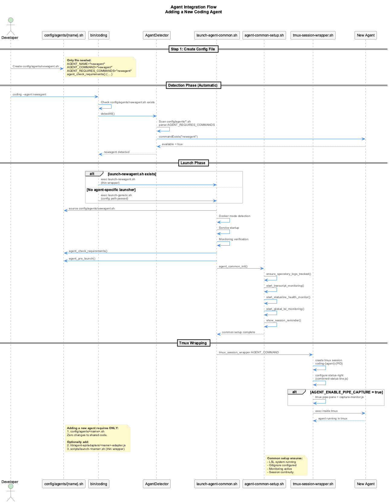
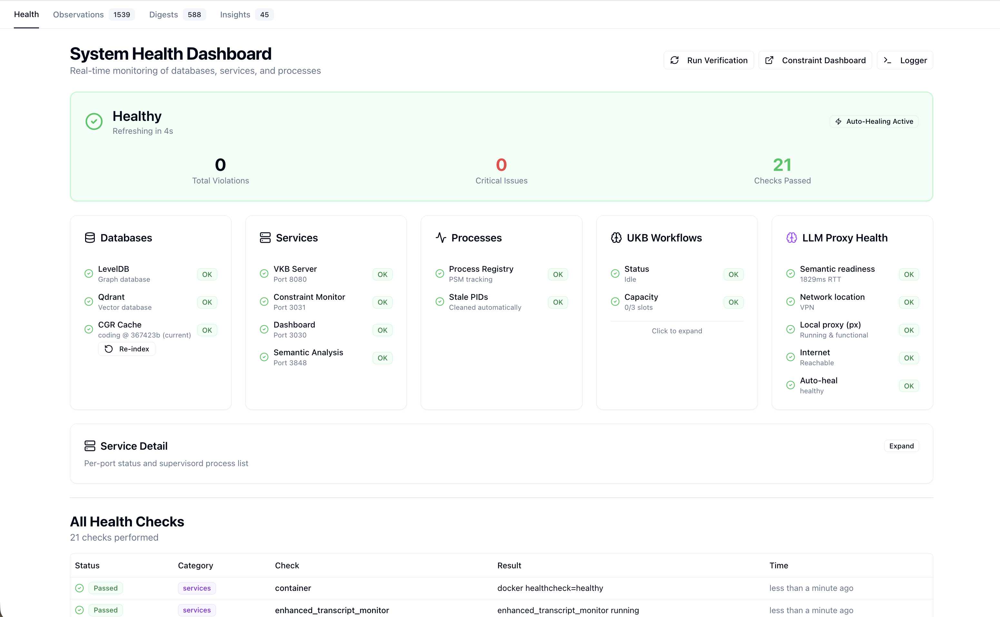
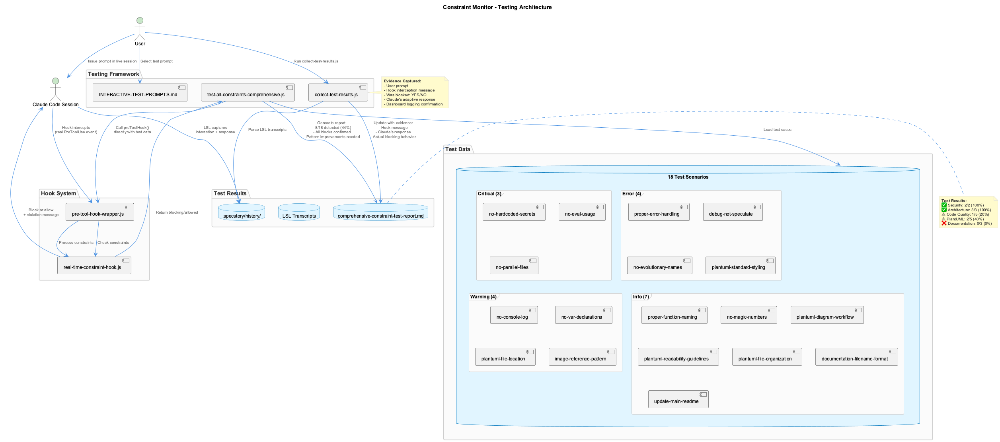
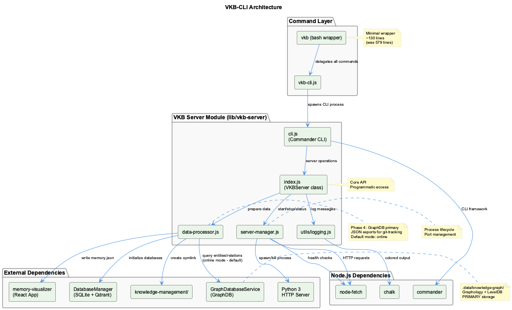

# Deep Dive Guides

Comprehensive reference guides with detailed explanations, complete configurations, and visual walkthroughs.

<a href="agent-integration/" class="thumbnail-card">
  
  

    <h3>Agent Integration</h3>
    
Add a new coding agent with a single config file — config reference, hooks, API contract

  

</a>

<a href="status-line/" class="thumbnail-card">
  
  

    <h3>Status Line Guide</h3>
    
Complete emoji reference and configuration

  

</a>

<a href="health-dashboard/" class="thumbnail-card">
  
  

    <h3>Health Dashboard</h3>
    
6-layer protection architecture, 9-class system design, and UKB workflow monitoring

  

</a>

<a href="constraint-testing/" class="thumbnail-card">
  
  

    <h3>Constraint Testing</h3>
    
18 constraints with detection status, automated testing framework, and hook configuration

  

</a>

<a href="vkb-visualization/" class="thumbnail-card">
  
  

    <h3>VKB Visualization</h3>
    
Interactive knowledge graph exploration, CLI commands, and HTTP API endpoints

  

</a>

<a href="knowledge-workflows/" class="thumbnail-card">
  
  

    <h3>Knowledge Workflows</h3>
    
14-agent UKB system, continuous learning, and SmartOrchestrator coordination

  

</a>

## More Guides

Same depth as the cards above — these simply have no diagram to lead with.

- [Continuous Integration](../ci/README.md) — the four GitHub Actions workflows: what each one proves, and how to read a red run
- [Network Configuration](network-configuration.md) — corporate VPN, proxy detection, and agent-specific API routing
- [LLM Providers](llm-providers.md) — configuring cloud and local providers for semantic analysis workflows

## When to Use These Guides

| Guide | Use When... |
|-------|-------------|
| **Agent Integration** | Adding a new AI coding assistant to the system |
| **Status Line** | You need to understand status bar indicators |
| **Health Dashboard** | Investigating health issues or understanding the monitoring architecture |
| **Constraint Testing** | Adding new constraints, debugging detection, or testing enforcement |
| **VKB Visualization** | Exploring knowledge graphs or integrating VKB programmatically |
| **Knowledge Workflows** | Understanding how knowledge is captured, processed, and stored |
| **Continuous Integration** | A CI run went red, or you need to know what a green one actually proves |
| **Network Configuration** | Working behind a corporate proxy or VPN, or routing an agent's API traffic |
| **LLM Providers** | Adding, switching, or troubleshooting a cloud or local LLM provider |

## Quick Links

- [Getting Started](../getting-started/index.md) - Initial setup and configuration
- [Core Systems](../core-systems/index.md) - Overview of LSL, UKB/VKB, Constraints
- [Architecture](../architecture/index.md) - System architecture and data flow
- [Troubleshooting](../reference/troubleshooting.md) - Common issues and solutions
