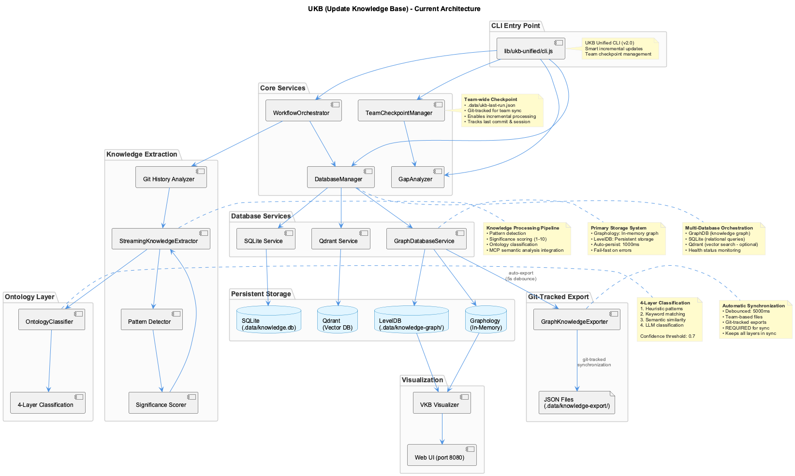
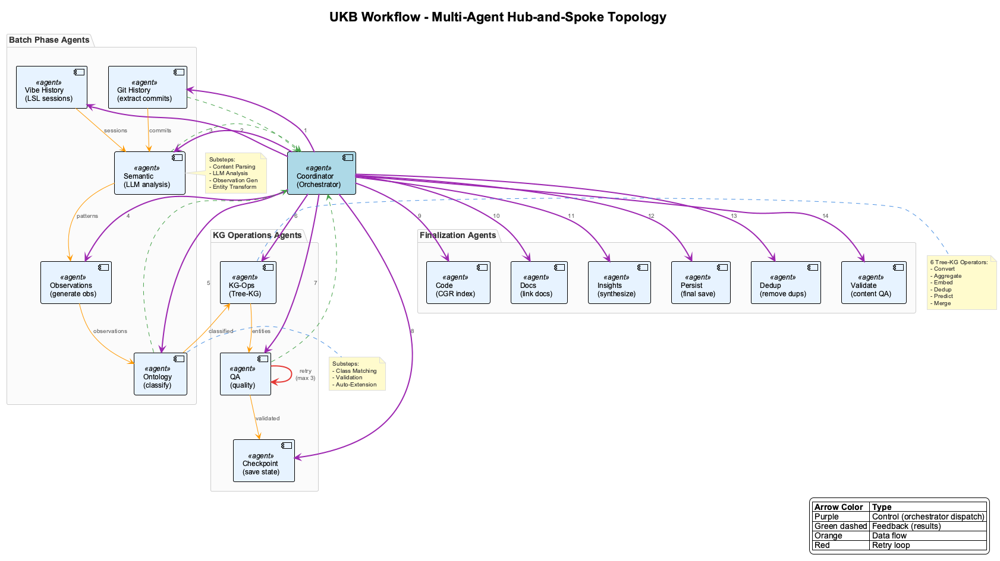
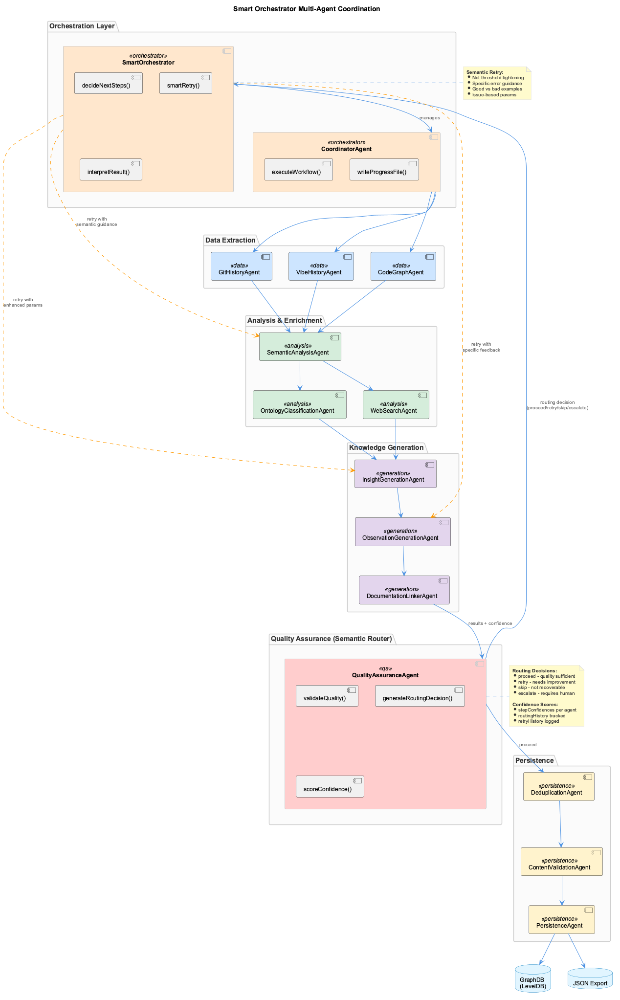
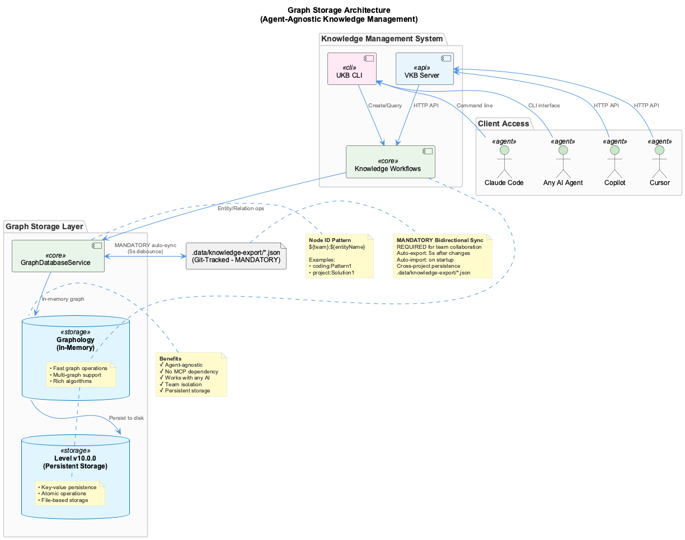
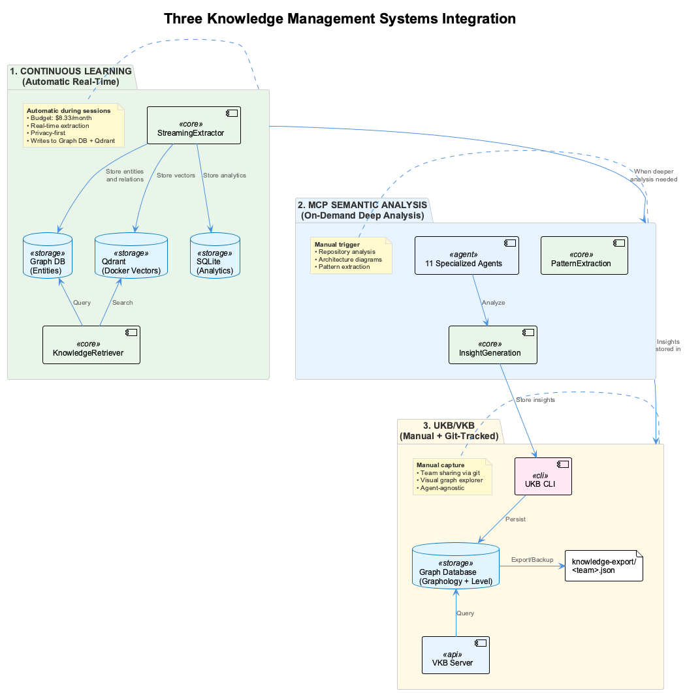
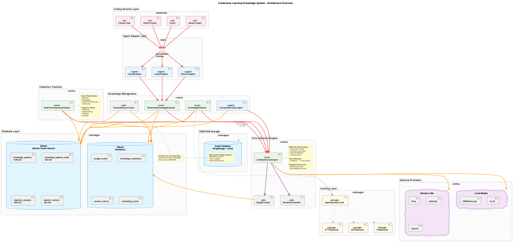
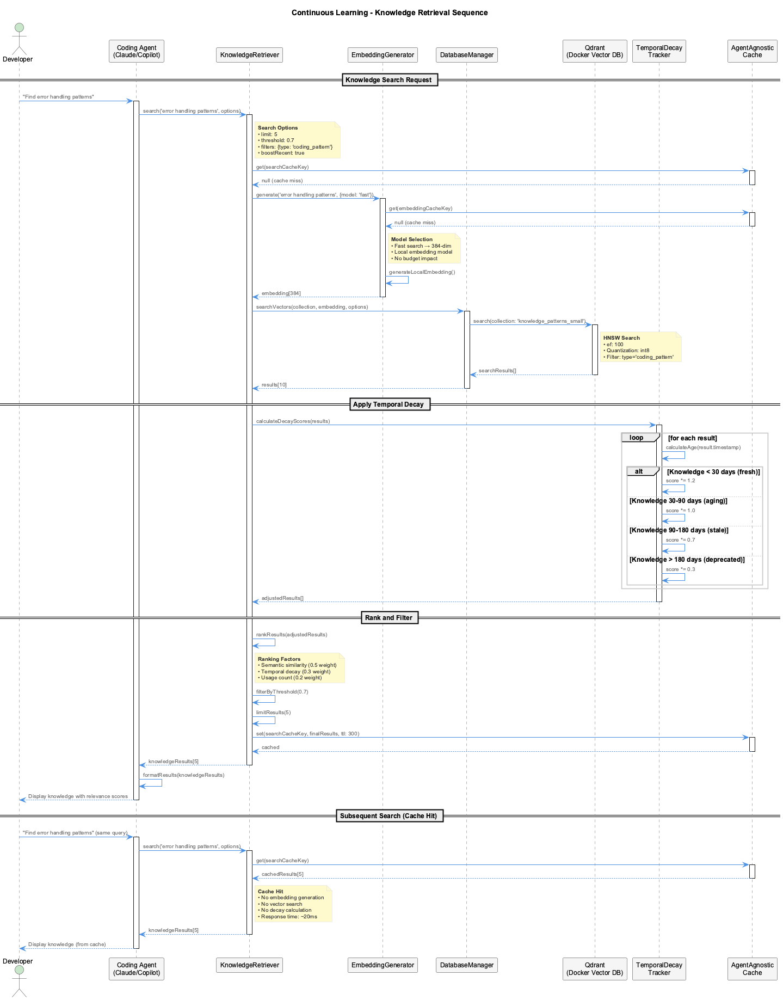

# Knowledge Workflows Guide

Complete guide to the knowledge capture, processing, and storage systems.



## Overview

The coding infrastructure uses two complementary knowledge management systems:

| System | Purpose | Trigger | Storage |
|--------|---------|---------|---------|
| **MCP Semantic Analysis** | Deep, on-demand code analysis with 14 specialized agents | Type "ukb" in Claude chat | GraphDB to LevelDB to JSON |
| **Continuous Learning** | Real-time session learning with budget control | Automatic during sessions | Qdrant + SQLite |

---

## UKB - Update Knowledge Base

### Current System: MCP Integration

The UKB CLI tool has been replaced with MCP (Model Context Protocol) integration. Type "ukb" in **Claude chat** to trigger knowledge updates.

### Quick Start

```
# In Claude chat (NOT terminal):
User: "ukb"

# Claude executes incremental analysis automatically
# Shows summary of entities created, relations, insights generated
```

### Full Analysis

```
User: "ukb full"
```

This processes entire git history and all session logs instead of just changes since last checkpoint.

### What Happens When You Type "ukb"

1. Claude detects knowledge update request
2. Decides: incremental or full analysis
3. Calls MCP semantic-analysis tool
4. Executes 14-agent workflow with SmartOrchestrator
5. QA agent provides semantic routing (proceed/retry/skip/escalate)
6. Stores to GraphDB to LevelDB to JSON export
7. Shows you a summary with confidence metrics

---

## 14-Agent Multi-Agent System



### Smart Orchestrator Flow



### Orchestration Layer

- **SmartOrchestrator** - Semantic coordination with confidence propagation and intelligent retry
- **CoordinatorAgent** - Executes workflow definitions, manages agent lifecycle

### Data Extraction Agents

1. **GitHistoryAgent** - LLM-powered commit pattern analysis and evolution extraction
2. **VibeHistoryAgent** - Analyzes session logs with LLM context extraction
3. **CodeGraphAgent** - AST-based indexing via Memgraph (requires Docker)

### Analysis & Enrichment Agents

4. **SemanticAnalysisAgent** - Deep semantic analysis with LLM fallback chain
5. **OntologyClassificationAgent** - Maps entities to project ontology
6. **WebSearchAgent** - Researches patterns with optional LLM result ranking

### Knowledge Generation Agents

7. **InsightGenerationAgent** - Creates structured insights with PlantUML diagrams
8. **ObservationGenerationAgent** - Adds observations using LLM structuring
9. **DocumentationLinkerAgent** - LLM-powered semantic doc-to-code matching

### Quality & Persistence Agents

10. **QualityAssuranceAgent** - **Semantic Router**: validates quality, generates routing decisions (proceed/retry/skip/escalate), provides confidence scoring
11. **DeduplicationAgent** - Semantic duplicate detection using OpenAI embeddings
12. **ContentValidationAgent** - Final validation and entity refresh
13. **PersistenceAgent** - Stores entities to GraphDB

### SmartOrchestrator Features

- **Semantic Retry**: Not mechanical threshold tightening - provides specific guidance on what went wrong
- **Confidence Propagation**: Each step reports confidence; downstream agents are aware of upstream quality
- **Routing Decisions**: QA generates proceed/retry/skip/escalate based on semantic analysis
- **LLM-Assisted Decisions**: Uses AI to interpret failures and suggest remediation

---

## Storage Architecture



The storage flows through three layers:

1. **Graphology (in-memory)** - Fast graph operations with 1-second auto-persist
2. **LevelDB (persistent)** - Durable storage at `.data/knowledge-graph/`
3. **JSON Files (git-tracked)** - Team sync via `.data/knowledge-export/coding.json`

| Layer | Location | Purpose |
|-------|----------|---------|
| GraphDB | In-memory Graphology | Fast graph operations |
| LevelDB | `.data/knowledge-graph/` | Persistent storage |
| JSON Export | `.data/knowledge-export/coding.json` | Git-tracked team sync |
| Checkpoint | `.data/ukb-last-run.json` | Incremental processing |

---

## Team Synchronization

**Developer A workflow:**

1. Types "ukb" in Claude
2. Workflow executes
3. Updates: .data/knowledge-export/coding.json
4. Updates: .data/ukb-last-run.json
5. Git commits both files
6. Git pushes to remote

**Developer B workflow:**

1. Git pulls from remote
2. Gets updated coding.json (knowledge)
3. Gets updated ukb-last-run.json (checkpoint)
4. Types "ukb" in Claude
5. Only processes commits/sessions since checkpoint (avoiding duplicate work)

---

## Continuous Learning System





### Key Features

- **Agent-Agnostic Design**: Currently optimized for Claude Code; designed to support other AI assistants in future
- **Real-Time Extraction**: Learns as you code, not after the fact
- **Semantic Search**: Find relevant knowledge using vector similarity
- **Budget-Aware**: Tracks LLM costs and enforces monthly limits ($8.33/month)
- **Privacy-First**: Automatically routes sensitive data to local models
- **Cross-Session Learning**: Share knowledge across different coding sessions

### System Components


**Inference Layer:**

- `UnifiedInferenceEngine` - Central LLM inference with multi-provider support
- `BudgetTracker` - Cost tracking and $8.33/month enforcement
- `SensitivityClassifier` - 5-layer privacy detection
- `CircuitBreaker` - Failure detection and provider failover

**Knowledge Management:**

- `StreamingKnowledgeExtractor` - Real-time knowledge extraction with buffering
- `KnowledgeRetriever` - Semantic search with temporal decay
- `ConceptAbstractionAgent` - Pattern generalization (3+ instances)
- `TemporalDecayTracker` - Knowledge aging and freshness management

---

## Knowledge Extraction Flow


1. **Exchange Processing**: Developer interacts with coding agent
2. **Intent Classification**: Trajectory analyzer classifies developer intent
3. **Budget Check**: Budget tracker verifies cost allowance
4. **Sensitivity Detection**: Classifier routes sensitive data to local models
5. **Knowledge Extraction**: Buffered exchanges are processed and stored
6. **Budget Fallback**: Automatic fallback to local models when budget exceeded

---

## Knowledge Retrieval Flow



1. **Search Request**: Developer queries for knowledge patterns
2. **Cache Check**: System checks for cached results first
3. **Embedding Generation**: Query converted to vector embedding
4. **Vector Search**: Qdrant performs HNSW search with filters
5. **Temporal Decay**: Results adjusted based on knowledge age
6. **Ranking & Filtering**: Results ranked by relevance and filtered by threshold
7. **Cache Storage**: Results cached for future queries (5-minute TTL)

**Performance**: Cache hits return results in ~20ms vs ~300ms for vector search.

---

## Dual-Database Strategy

| Database | Purpose | Location |
|----------|---------|----------|
| **Qdrant** | Vector search (semantic similarity) | localhost:6333 |
| **SQLite** | Analytics, budget tracking, metadata | `.cache/knowledge.db` |

### Qdrant Collections

| Collection | Dimensions | Purpose |
|------------|------------|---------|
| `knowledge_patterns` | 1536-dim | High-quality long-term storage |
| `knowledge_patterns_small` | 384-dim | Fast local embeddings |
| `trajectory_analysis` | 384-dim | Development trajectory tracking |
| `session_memory` | 384-dim | Session-specific memory |

### SQLite Tables

- `budget_events` - LLM cost tracking
- `knowledge_extractions` - Extraction metadata
- `session_metrics` - Session analytics
- `embedding_cache` - Cached embeddings

---

## Budget Configuration

### Monthly Limit

Default: $8.33/month

```javascript
const system = new KnowledgeLearningSystem({
  budgetLimit: 8.33,
  budgetAlerts: [
    { threshold: 50, action: 'log' },
    { threshold: 80, action: 'warn' },
    { threshold: 90, action: 'notify' }
  ],
  budgetAwareRouting: true  // Prefer cheaper providers when budget tight
});
```

### Provider Costs

| Provider | Input (per 1K tokens) | Output (per 1K tokens) |
|----------|----------------------|------------------------|
| Groq | $0.0004 | $0.0006 |
| OpenRouter | $0.001 | $0.001 |
| Local (Ollama) | $0 | $0 |

### Fallback Chain

The system tries providers in order: groq (remote, fast) then openrouter (remote, accurate) then local (free, private)

---

## Temporal Decay

Knowledge ages over time with configurable decay rates:

| Category | Max Age | Rank Adjustment |
|----------|---------|-----------------|
| Fresh | 30 days | +20% |
| Aging | 90 days | No change |
| Stale | 180 days | -30% |
| Deprecated | 365 days | -70% |

**Exceptions** (never decay):

- `coding_principle`
- `architecture_pattern`

---

## Status Indicators

### Knowledge System Status

| Status | Icon | Meaning |
|--------|------|---------|
| Ready | `[📚✅]` | Knowledge extraction ready and operational |
| Processing | `[📚⏳]` | Actively extracting knowledge from session |
| Idle | `[📚💤]` | Operational but waiting/sleeping |
| Warning | `[📚⚠️ ⚠️N]` | Has N errors but still operational |
| Paused/Disabled | `[📚⏸️ ]` | Knowledge extraction disabled in config |
| Offline | `[📚❌]` | System offline or initialization failed |

---

## Initialization

### Automatic Initialization

Knowledge system is **automatically initialized** during fresh installations:

```bash
# Run the installer (automatically initializes knowledge system)
./install.sh

# Or initialize manually if needed
node scripts/initialize-knowledge-system.js
```

### Verification

```bash
# Check health status
cat .health/coding-transcript-monitor-health.json | jq '.knowledgeExtraction'

# Check status line
CODING_REPO=/path/to/coding node scripts/combined-status-line.js

# Run E2E tests
node scripts/test-knowledge-extraction.js [--verbose]
```

---

## Visualization

### Start VKB Server

```bash
# In terminal:
vkb server start

# Open browser to http://localhost:8080
```

### VKB Features

- Interactive graph visualization
- Entity browsing and search
- Relation exploration
- Real-time updates via WebSocket

See [VKB Visualization Guide](vkb-visualization.md) for complete documentation.

---

## Migration Guide

### What to Stop Doing

- `ukb --interactive` (command doesn't exist)
- `ukb --auto` (command doesn't exist)
- `ukb entity add ...` (command doesn't exist)
- Manual JSON file editing

### What to Start Doing

- Type "ukb" in Claude chat
- Let Claude call MCP semantic-analysis tool
- Trust the 14-agent workflow with SmartOrchestrator
- Review auto-generated insights and confidence metrics
- Commit `.data/knowledge-export/*.json` and `.data/ukb-last-run.json`

---

## Troubleshooting

### Qdrant Connection Errors

```bash
# Check if Qdrant is running
curl http://localhost:6333/health

# Start Qdrant with Docker
docker run -p 6333:6333 qdrant/qdrant
```

### Budget Exceeded

```javascript
// Check budget status
const budget = await system.getBudgetStatus();
// Review budget.used, budget.remaining, budget.percentage

// Force heuristic mode (no LLM costs)
const system = new KnowledgeLearningSystem({
  forceHeuristic: true
});
```

### Slow Vector Search

- Enable quantization for faster searches
- Reduce search limit
- Use 384-dim embeddings instead of 1536-dim

---

## Key Files

| File | Purpose |
|------|---------|
| `.data/knowledge-graph/` | LevelDB persistent storage |
| `.data/knowledge-export/coding.json` | Git-tracked knowledge export |
| `.data/ukb-last-run.json` | Incremental processing checkpoint |
| `.cache/knowledge.db` | SQLite analytics database |
| `.health/coding-transcript-monitor-health.json` | Knowledge extraction health |
| `.specstory/config/knowledge-system.json` | Knowledge system configuration |
