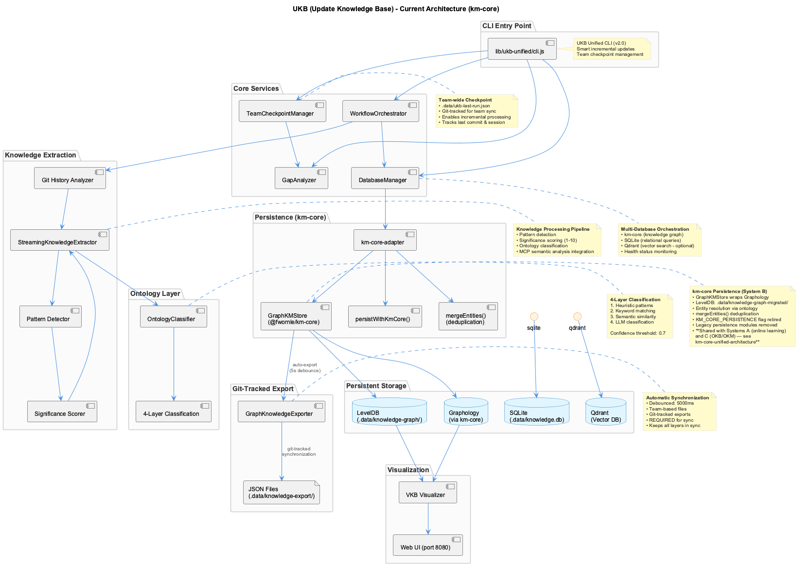

# Knowledge Workflows

How knowledge is captured, processed and stored — the on-demand extraction pass and the
continuous learning that runs beside it.

=== "⚡ Quick (~3 min)"

    ## Two systems, different rhythms

    | System | What it does | When |
    |--------|--------------|------|
    | **Semantic Analysis** | Deep extraction by a 14-agent workflow | On demand |
    | **Continuous Learning** | Real-time capture from live sessions | Always, in the background |

    The first is a considered pass over your history; the second notices things as they happen.

    ## Running the extraction pass

    ```bash
    semantic workflow run wave-analysis --team coding     # production, 10-20 min
    semantic workflow status                              # progress
    ```

    Asking for it in chat works too — the agent runs the same command. It is **asynchronous**:
    the command returns a workflow id and leaves the run going, so watch the dashboard rather
    than waiting on the terminal.

    Add `--debug` for a mocked-LLM, single-stepped run that spends nothing.

    ## What comes out

    Entities, relations and insights, written to the graph and exported as JSON under
    `.data/knowledge-export/`. Those exports are git-tracked, so knowledge changes show up in
    diffs and travel with the repo.

    ## Looking at it

    ```bash
    vkb     # the viewer at localhost:8080
    ```

=== "📖 Standard (~15 min)"

    ## The extraction pass

    

    A 14-agent workflow reads your git history and session logs and produces entities, relations
    and insights. An orchestrator routes between the agents and a QA agent decides, per step,
    whether to proceed, retry, skip or escalate — so a weak result is caught inside the run
    rather than persisted and discovered later.

    ```bash
    semantic workflow run wave-analysis --team coding
    semantic workflow status
    ```

    Two things to know before you run it. It takes **10–20 minutes** and is asynchronous, so
    treat the returned workflow id as the handle and watch the dashboard. And `--debug` runs the
    whole thing against a mocked LLM with single-stepping, which is the way to understand the
    workflow without paying for it.

    The incremental pass starts from the last checkpoint; a full pass reprocesses everything from
    the first commit.

    ## Where knowledge is stored

    Two databases, because the two access patterns are genuinely different: a graph for
    structure — what relates to what — and a vector store for similarity, which is what makes
    retrieval work at injection time. Both are fronted by the same shared kernel, and both are
    exported to git-tracked JSON.

    That export is what makes knowledge shareable. A teammate pulls the JSON and their instance
    hydrates from it; nobody ships a database file.

    ## Continuous learning alongside it

    While the extraction pass is deliberate and occasional, the continuous learning path records
    observations as sessions happen, consolidating them into digests and, over a longer window,
    into persistent insights. It runs under a budget so it cannot become the dominant consumer,
    and it applies temporal decay so that what mattered last month does not outrank what matters
    now.

    ## How this feeds back

    Everything above exists to be injected. At prompt time the retrieval service searches these
    stores and puts the most relevant material into the agent's context — see
    [Knowledge Context Injection](../architecture/knowledge-injection.md) for the retrieval side.
    Extraction fills the well; injection draws from it.

    ## What not to do

    The old `ukb` shell script is gone, and so is the MCP server that briefly replaced it. There
    is one supported path — the `semantic` CLI, which the agent will run for you if you ask in
    chat. Hand-editing the JSON exports is also unsupported: they are generated artefacts, and
    the next pass overwrites them.

=== "📚 Deep Dive (full)"

    --8<-- "_tiers/guides/knowledge-workflows.deep.md"
