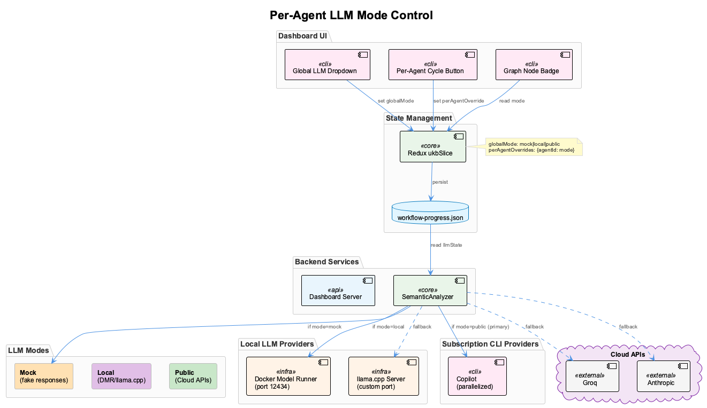
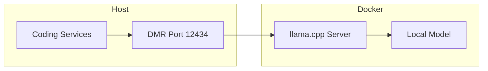
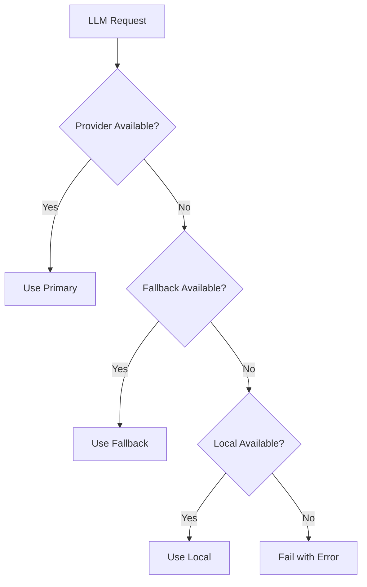
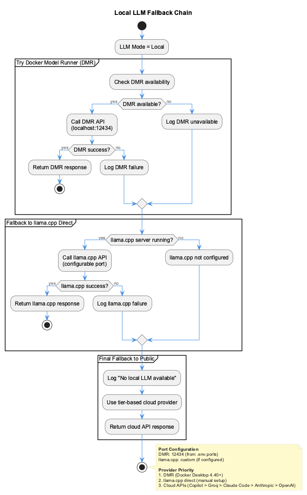

# LLM Provider Setup

Configure cloud and local LLM providers for semantic analysis workflows.



---

## Overview

The coding infrastructure uses LLMs for:

- **Knowledge extraction** (UKB workflows)
- **Semantic classification** (LSL content routing)
- **Continuous learning** (real-time session analysis)
- **Code analysis** (pattern recognition)

You can use cloud providers, local models, or a combination:

| Mode | Providers | Cost | Privacy | Speed |
|------|-----------|------|---------|-------|
| **Cloud** | Groq, Anthropic, OpenAI | $$$ | Data sent externally | Fast (API) |
| **Local** | DMR/llama.cpp | Free | Data stays local | Varies |
| **Mock** | Simulated | Free | N/A | Instant |

---

## Cloud Providers

### Groq (Recommended)

Fastest inference for open models. Recommended for UKB workflows.

```env
# .env
GROQ_API_KEY=gsk_...
```

**Supported Models:**

- `llama-3.3-70b-versatile` (default for semantic analysis)
- `llama-3.1-8b-instant` (fast, lower quality)
- `mixtral-8x7b-32768` (good for long context)

### Anthropic Claude

High-quality analysis, used as fallback.

```env
# .env
ANTHROPIC_API_KEY=sk-ant-...
```

**Supported Models:**

- `claude-3-5-sonnet-20241022`
- `claude-3-haiku-20240307`

### OpenAI

GPT models and embeddings.

```env
# .env
OPENAI_API_KEY=sk-...
```

**Supported Models:**

- `gpt-4o` (analysis)
- `gpt-4o-mini` (fast tasks)
- `text-embedding-3-small` (embeddings)

### Google Gemini

Alternative provider.

```env
# .env
GOOGLE_API_KEY=...
```

---

## Local Models (DMR/llama.cpp)

Run models locally for zero cost and complete privacy.

### Architecture



### Docker Model Runner (DMR)

DMR provides an OpenAI-compatible API for local models.

**Setup:**

1. **Configure Port** (in `.env.ports`):

   ```env
   DMR_PORT=12434
   DMR_HOST=localhost
   ```

2. **Start DMR** (via Docker):

   ```bash
   # DMR is included in docker-compose.yml
   # Starts automatically with: coding
   ```

3. **Verify Connection**:

   ```bash
   curl http://localhost:12434/v1/models
   ```

### llama.cpp Direct

For non-Docker setups or custom configurations.

**Build llama.cpp:**

```bash
git clone https://github.com/ggerganov/llama.cpp
cd llama.cpp
make -j
```

**Start Server:**

```bash
./llama-server \
  --model /path/to/model.gguf \
  --host 0.0.0.0 \
  --port 12434 \
  --ctx-size 4096
```

### Recommended Local Models

| Model | Size | RAM Required | Use Case |
|-------|------|--------------|----------|
| `llama-3.2-3b` | 2GB | 4GB | Fast, development |
| `llama-3.2-8b` | 5GB | 8GB | Balanced |
| `llama-3.1-70b-q4` | 40GB | 48GB | Production quality |
| `codellama-34b` | 20GB | 24GB | Code-focused |

### Model Download

```bash
# Using Hugging Face CLI
huggingface-cli download TheBloke/Llama-2-7B-GGUF \
  llama-2-7b.Q4_K_M.gguf \
  --local-dir ./models

# Or via DMR (if supported)
curl -X POST http://localhost:12434/v1/models/pull \
  -d '{"model": "llama-3.2-3b"}'
```

---

## Provider Fallback Chain

The system uses a configurable fallback chain:



### Default Chain

1. **Groq** - Fast, cost-effective
2. **Anthropic** - High quality fallback
3. **OpenAI** - Alternative fallback
4. **Local (DMR)** - Zero-cost final fallback

### Configuration

```javascript
// Fallback chain configuration
const providers = [
  { name: 'groq', priority: 1 },
  { name: 'anthropic', priority: 2 },
  { name: 'openai', priority: 3 },
  { name: 'local', priority: 4 }
];
```

---

## Semantic Workload Routing

Different workloads are routed to appropriate providers:



### Routing Rules

| Workload | Default Provider | Rationale |
|----------|------------------|-----------|
| **Knowledge Extraction** | Groq (llama-70b) | Needs quality + speed |
| **Semantic Classification** | Local or Groq | High volume, lower quality OK |
| **Embedding Generation** | OpenAI or Local | Vector consistency |
| **Sensitive Content** | Local only | Privacy requirement |
| **Budget Exceeded** | Local only | Cost control |

### Sensitivity-Based Routing

The 5-layer sensitivity classifier automatically routes:

- **Safe content** → Cloud providers (fast, accurate)
- **Sensitive content** → Local models (private, free)

Sensitive patterns detected:

- API keys and tokens
- Passwords and credentials
- Email addresses
- Corporate identifiers
- Financial data

---

## Workflow-Specific Configuration

### UKB Workflows

```env
# .env
UKB_LLM_PROVIDER=groq
UKB_LLM_MODEL=llama-3.3-70b-versatile
UKB_FALLBACK_PROVIDER=local
```

### Continuous Learning

```env
# .env
LEARNING_LLM_PROVIDER=groq
LEARNING_BUDGET_LIMIT=8.33  # Monthly limit in USD
LEARNING_FALLBACK_TO_LOCAL=true
```

### LSL Classification

```env
# .env
LSL_CLASSIFIER_PROVIDER=local  # Use local for privacy
LSL_CLASSIFIER_MODEL=llama-3.2-3b
```

---

## Debug Mode

For development and testing, use mock or local modes:

### Mock Mode

Returns simulated responses without LLM calls:

```bash
# Via Claude chat
ukb debug  # Enables mock mode

# Via environment
export SEMANTIC_LLM_MODE=mock
```

### Local-Only Mode

Force all calls to local models:

```bash
export SEMANTIC_LLM_MODE=local
```

### Provider Override

Force a specific provider:

```bash
export SEMANTIC_LLM_PROVIDER=groq
export SEMANTIC_LLM_MODEL=llama-3.3-70b-versatile
```

---

## Cost Management

### Budget Tracking

The system tracks LLM costs per provider:

```bash
# Check current budget status
curl http://localhost:3848/api/budget
```

Response:

```json
{
  "monthlyLimit": 8.33,
  "used": 2.45,
  "remaining": 5.88,
  "percentage": 29.4,
  "providers": {
    "groq": 1.20,
    "anthropic": 0.85,
    "openai": 0.40
  }
}
```

### Provider Costs

| Provider | Input (per 1M tokens) | Output (per 1M tokens) |
|----------|----------------------|------------------------|
| Groq | $0.40 | $0.60 |
| Anthropic Claude 3.5 | $3.00 | $15.00 |
| OpenAI GPT-4o | $2.50 | $10.00 |
| Local (DMR) | $0 | $0 |

### Budget Alerts

Configure alerts in `.env`:

```env
BUDGET_ALERT_50=log      # Log at 50%
BUDGET_ALERT_80=warn     # Warning at 80%
BUDGET_ALERT_90=notify   # Notification at 90%
BUDGET_EXCEEDED=local    # Switch to local when exceeded
```

---

## Troubleshooting

### DMR Not Responding

```bash
# Check if DMR is running
curl http://localhost:12434/health

# Check Docker container
docker ps | grep dmr

# View logs
docker logs coding-dmr
```

### Model Not Found

```bash
# List available models
curl http://localhost:12434/v1/models

# Pull model (if DMR supports)
curl -X POST http://localhost:12434/v1/models/pull \
  -d '{"model": "llama-3.2-3b"}'
```

### Slow Local Inference

- Use smaller quantized models (Q4_K_M)
- Increase context size only if needed
- Ensure GPU acceleration is enabled
- Check available RAM

### Provider Timeout

```env
# Increase timeout (milliseconds)
LLM_TIMEOUT=60000
LLM_RETRY_COUNT=3
LLM_RETRY_DELAY=1000
```

---

## Related Documentation

- [Health Dashboard](health-dashboard.md) - Workflow debug controls
- [Knowledge Workflows](knowledge-workflows.md) - UKB system details
- [Configuration](../getting-started/configuration.md) - API keys setup
