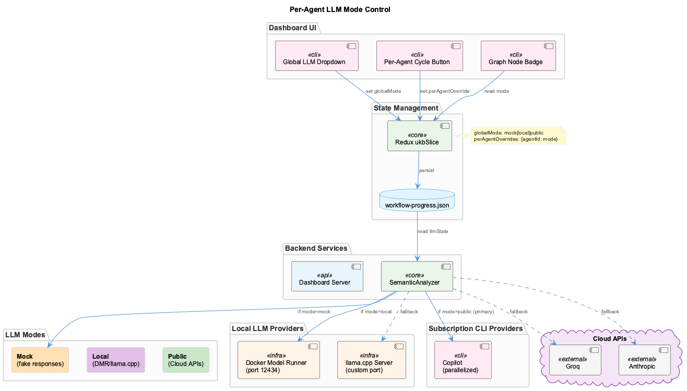

# LLM Providers

Which backends can serve the project's LLM work, what each costs, and how to add or
troubleshoot one.

=== "⚡ Quick (~3 min)"

    ## Four kinds of provider

    | Kind | Cost | Privacy | Notes |
    |------|------|---------|-------|
    | **Subscription** | none marginal | Uses your existing account | Preferred — flat rate |
    | **Cloud API** | per token | Data leaves the machine | Fallback |
    | **Local** | free | Data stays local | Speed varies with hardware |
    | **Mock** | free | n/a | Tests and single-stepping |

    Subscriptions are tried first, so most background work costs nothing per token.

    ## Provider means account

    Write `<provider>/<model>`, never a bare model name. A flat-rate subscription and a metered
    API key can serve the identical model and are completely different money.

    ## Where the configuration lives

    Two version-controlled YAMLs in the proxy repo — one deciding provider and model, one
    deciding what happens when that provider cannot. Both hot-reload on save.

    Edit them in the dashboard at **Token Usage → Settings**, or by hand.

    ## Why did this call go where it went

    ```bash
    curl -s 'localhost:12435/api/llm/routing/resolve?job=bg-observation-writer' | jq -r .summary
    ```

    ## Free local runs

    Point work at a local model runner and it costs nothing and leaves nothing. Expect a large
    latency difference — fine for a turn you are watching, usually wrong for high-volume
    background work.

=== "📖 Standard (~15 min)"

    ## What uses an LLM here

    Knowledge extraction, session-content classification, continuous learning and code analysis.
    They differ enormously in volume: the background services make far more calls than you do
    interactively, which is why their routing matters more for cost than the model you chat with.

    

    ## Choosing among providers

    The ordering principle is simple — **spend nothing before spending something**. Subscription
    accounts are flat rate, so work served there has no marginal cost; metered APIs are the
    fallback for when a subscription cannot serve the request, whether through quota exhaustion
    or a missing capability.

    Local runners sit alongside both. They are free and private, and their cost is latency: a
    laptop generating at a few tokens a second is entirely reasonable for a turn you are sitting
    in front of and a poor choice for a queue of background jobs, which is why scope is
    configurable per target rather than globally.

    ## Provider ids name accounts

    This is the single most common source of confusion in cost analysis. A provider id identifies
    **the account that gets billed**, not the company that makes the model. Two providers can
    serve the identical model at completely different cost, so a bare model name is never enough
    to answer "what did this cost". Always write `<provider>/<model>`.

    ## The configuration

    Two YAML files in the proxy repo decide everything: one maps a piece of work to a provider
    and a complexity band, the other gives each provider an ordered list of what to try when it
    cannot serve. Both hot-reload, and a file that will not parse aborts proxy startup rather
    than being half-applied — not knowing where calls should go is not a state to serve around.

    Edit them from **Token Usage → Settings** on the dashboard, which validates before writing and
    preserves the comments in both files, or edit the YAML directly.

    Full detail on how a route resolves is in [LLM Routing](../architecture/llm-routing.md); the
    provider layer underneath is [LLM Architecture](../architecture/llm-architecture.md).

    ## Resilience

    A circuit breaker opens after five consecutive failures and resets after sixty seconds, so a
    failing provider is dropped quickly rather than retried into the ground. An LRU cache
    deduplicates identical requests. Quota is tracked optimistically — capacity is assumed until
    a provider says otherwise — with exponential backoff once one refuses.

    ## When a provider misbehaves

    Start by asking the proxy what it would do, which is the same decision the request path makes:

    ```bash
    curl -s 'localhost:12435/api/llm/routing/resolve?job=<job>' | jq -r .summary
    curl -s 'localhost:12435/api/llm/routing/resolve?job=<job>&tools=true' | jq .skipped
    ```

    The `skipped` array names each dropped provider **and why**, which distinguishes the two
    cases that look identical from outside: a configuration problem you fix by editing YAML, and
    a runtime problem you fix with a login or a VPN connection.

    If routing looks right and calls still fail, check egress rather than routing — on a
    corporate network with direct egress every off-premises provider fails identically while the
    routing decision was correct.

=== "📚 Deep Dive (full)"

    --8<-- "_tiers/guides/llm-providers.deep.md"
