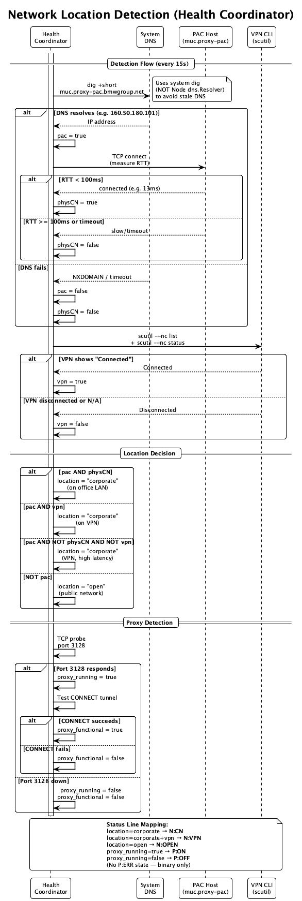
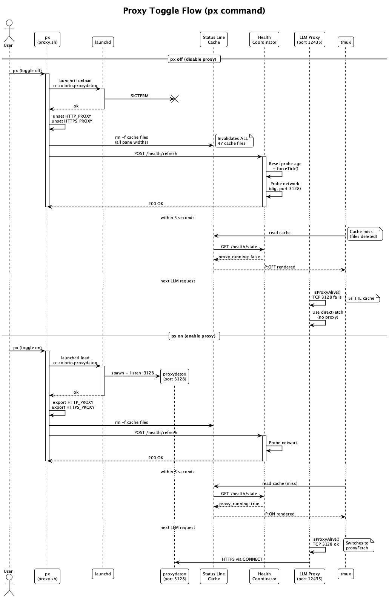

# Network Configuration

How the Coding launcher handles corporate VPN, proxy detection, and agent-specific API routing.

---

## Overview

The Coding system operates in three network environments:

- **VPN** — connected to corporate network via VPN tunnel; proxy (proxydetox on `127.0.0.1:3128`) is running and required for external API calls
- **Corporate Network (CN)** — physically on the corporate network (e.g. office ethernet/Wi-Fi); proxy is running and required for external API calls
- **Home / Public Network** — direct internet access, no proxy needed

The **health coordinator** is the single source of truth for network state. It probes every **15 seconds** and exposes the result via `GET /health/state` → `network`. The launcher, status line, and LLM proxy all consume this endpoint — there is no independent detection elsewhere.


---

## Connectivity Matrix

| Agent | Auth Method | Inside VPN (proxy) | Outside VPN (direct) |
|---|---|---|---|
| `coding --claude` | OAuth (Max subscription) | Works via proxy | Works direct |
| `coding --opencode` | Auto-selected | GH Copilot Enterprise via proxy | Anthropic direct |
| `coding --copilot` | VS Code Copilot token | Works via proxy | Works direct |

!!! info "OpenCode Model Switching"
    OpenCode automatically switches its LLM provider based on network location:

    - **VPN**: `github-copilot-enterprise/claude-opus-4.6` (free via corporate subscription)
    - **Public**: `claude-opus-4-6` (personal Anthropic API key or subscription)

---

## Detection Flow

### Unified Detection (Health Coordinator)

The coordinator (`scripts/health-coordinator.js`) is the **single authority** for network location. It probes every 15 seconds using three independent signals — evaluated in order, first match wins:

| Priority | Signal | Method | Result |
|----------|--------|--------|--------|
| 1 | **Cisco VPN CLI** | `/opt/cisco/secureclient/bin/vpn state` → output contains "Connected" | `vpn` |
| 2 | **utun interface** | `ifconfig` → any `utun*` with an `inet` address | `vpn` |
| 3 | **BMW internal DNS** | `dig +short muc.proxy-pac.bmwgroup.net` (spawns a fresh process — never stale) + TCP latency to resolved IP | `corporate` (<100 ms) or `vpn` (≥100 ms) |
| — | None match | DNS resolution fails entirely | `open` |

!!! warning "Why `dig` instead of Node.js `dns.Resolver`"
    Node.js caches the system DNS servers at process start. If the coordinator starts on a hotspot (public DNS like `8.8.8.8`) and the user later connects to the office LAN (corporate DNS `160.50.x.x`), `dns.getServers()` returns the **stale startup servers** — BMW internal hostnames can't resolve, and the coordinator reports `open` indefinitely. Spawning `dig` as a subprocess reads the current OS DNS config on every probe, eliminating this class of bugs.

### Launcher Bootstrap (`detect-network.sh`)

The startup script runs a **one-time** DNS-based check before the coordinator is available:

```bash
# DNS-based — works without proxy (no chicken-and-egg)
dig +short muc.proxy-pac.bmwgroup.net +timeout=2
dig +short cc-github.bmwgroup.net +timeout=2
```

If either resolves to a corporate IP → `INSIDE_CN=true`. This replaced the previous `curl https://cc-github.bmwgroup.net` approach, which required the proxy to already be configured (circular dependency on CN).

Once the coordinator is running, the launcher defers to `GET http://localhost:3034/health/state` for all subsequent network state.



### Startup Sequence


---

## Proxy Management

### The `px` Toggle

The `px` shell alias is the **only** way to toggle the proxy. It performs three actions atomically:

1. **Toggles the proxydetox daemon** via `launchctl unload`/`launchctl load` of the plist — this truly stops/starts the daemon and closes/opens port 3128 (previous implementations used `launchctl stop` which was ineffective due to launchd socket activation respawning the process immediately)
2. **Invalidates status line caches** — deletes all per-pane cache files so the next tmux render reflects the new state
3. **Notifies the health coordinator** — `POST /health/refresh` triggers an immediate network re-probe (bypasses the 15s poll interval)

```bash
px          # Toggle: if proxy running → stop; if stopped → start
```

### Update Propagation After `px`



The status line reflects the new P: state within **≤5 seconds** (one tmux refresh cycle):

| Step | Latency | Mechanism |
|------|---------|-----------|
| proxydetox stop/start | instant | `launchctl unload`/`load` |
| Cache invalidation | instant | `rm .logs/combined-status-line-cache-*.txt` |
| Coordinator re-probe | instant | `POST /health/refresh` resets rate-limiter + forces tick |
| tmux renders | ≤5s | `status-interval 5` picks up fresh state |

### LLM Proxy Dynamic Routing

The LLM proxy (`rapid-llm-proxy`, port 12435) dynamically adapts to proxy availability without restart:

- On each outbound request, `smartFetch()` TCP-probes port 3128 (with 5s cache)
- If proxydetox is **up** → routes via `undici.ProxyAgent` (corporate proxy)
- If proxydetox is **down** → routes via native `fetch` (direct internet)

This means `px off` on a hotspot (direct internet) works immediately — the LLM proxy stops trying to route through the dead proxy within 5 seconds.

### Inside VPN / Corporate Network

The corporate proxy (proxydetox) runs on `127.0.0.1:3128`. The launcher:

1. Checks if `HTTP_PROXY` is already set in the environment
2. If not, probes `127.0.0.1:3128` and auto-configures:

```bash
export HTTP_PROXY="http://127.0.0.1:3128"
export HTTPS_PROXY="http://127.0.0.1:3128"
export NO_PROXY="localhost,127.0.0.1,.bmwgroup.net"
```

All external API calls (Anthropic, GitHub, OpenAI) **require** this proxy when inside VPN/CN. Direct connections time out.

### Outside VPN (Public Network)

The launcher **clears** any proxy env vars inherited from shell profiles:

```bash
unset HTTP_PROXY HTTPS_PROXY http_proxy https_proxy
```

This prevents opencode/claude from trying to route through a non-existent proxy.

---

## Agent API Endpoints

Each agent validates its required API endpoint before launch:

| Agent | Required API | Endpoint Tested |
|---|---|---|
| Claude Code | Anthropic | `https://api.anthropic.com` |
| OpenCode (VPN) | GitHub Copilot | `https://api.github.com` |
| OpenCode (public) | Anthropic | `https://api.anthropic.com` |
| Copilot CLI | GitHub | `https://api.github.com` |

If validation fails, the launcher logs a warning but does not block startup (the agent may still work via cached tokens or fallback mechanisms).

---

## Testing & Debugging

### Dry Run

Test network detection without launching an agent:

```bash
coding --opencode --dry-run
coding --claude --dry-run
```

Output includes:
```
[OpenCode] 🏢 Inside Corporate Network (cc-github.bmwgroup.net reachable)
[OpenCode] Proxy active: http://127.0.0.1:3128/
[OpenCode] ✅ External access working (via proxy)
[OpenCode] DRY-RUN: Network: CN=true, Proxy=true, Required=true
[OpenCode] 🏢 VPN → GitHub Copilot Enterprise (claude-opus-4.6)
[OpenCode] ✅ GitHub API reachable (for Copilot provider)
```

### Force Network Mode

Override detection for testing:

```bash
# Simulate outside VPN
CODING_FORCE_CN=false coding --opencode --dry-run

# Simulate inside VPN
CODING_FORCE_CN=true coding --opencode --dry-run
```

### Troubleshooting

| Symptom | Cause | Fix |
|---|---|---|
| `N:OPEN` when on office LAN | Coordinator started on hotspot; stale DNS servers (pre-`dig` fix) or process running old code | Restart coordinator: `launchctl stop com.coding.health-coordinator && launchctl start com.coding.health-coordinator` |
| `P:ON` after `px off` | Old `px` used `launchctl stop` which launchd respawns via socket activation | Update `proxy.sh` to use `launchctl unload`/`load` instead |
| Status line takes >10s to show P: change | Cache files not invalidated; coordinator not notified | Ensure `px` does `rm .logs/combined-status-line-cache-*.txt` AND `curl -s -X POST http://localhost:3034/health/refresh` |
| LLM proxy 500s after `px off` | Proxy dead but LLM proxy still routing through `ProxyAgent` | LLM proxy now has `smartFetch()` with 5s proxy-alive cache — recovers automatically |
| 502 Bad Gateway in OpenCode | Proxy interfering with streaming API | Check proxydetox is running: `lsof -i :3128` |
| All API calls timeout (000) | Inside VPN/CN without proxy | Run `px` to start proxydetox, or set `HTTP_PROXY` |
| "Credit balance too low" | Using API key instead of OAuth | Log in via `claude auth login` for Max subscription |
| OpenCode uses wrong model | Network detection mismatch | Use `--dry-run` to check, or `CODING_FORCE_CN=true/false` |
| Semantic readiness yellow (brain badge) | `processOverrides` routing health-coordinator through `claude-code` (slow subprocess) | Set override to `copilot`: `curl -X POST http://localhost:12435/api/llm/settings -H 'Content-Type: application/json' -d '{"settings":{"processOverrides":{"health-coordinator":{"provider":"copilot"}}}}'` |

---

## Environment Variables

| Variable | Set By | Purpose |
|---|---|---|
| `HTTP_PROXY` / `HTTPS_PROXY` | detect-network.sh | Route traffic through corporate proxy |
| `NO_PROXY` | detect-network.sh | Bypass proxy for local/internal hosts |
| `INSIDE_CN` | detect-network.sh | `true` when on corporate VPN |
| `PROXY_WORKING` | detect-network.sh | `true` when external APIs are reachable |
| `PROXY_REQUIRED` | detect-network.sh | `true` when proxy is needed (= inside CN) |
| `CODING_FORCE_CN` | User override | Force `true`/`false` to skip detection |
| `OPENCODE_CONFIG_CONTENT` | opencode.sh | JSON config for model/provider selection |

---

## Health Coordinator Network State

The coordinator exposes live network state at `GET http://localhost:3034/health/state` → `network`:

```json
{
  "network": {
    "internet_reachable": true,
    "proxy_running": true,
    "proxy_functional": true,
    "proxy_port_listening": true,
    "location": "vpn",
    "last_check": "2026-05-29T07:48:52.982Z",
    "last_probe_end": "2026-05-29T07:48:52.980Z"
  }
}
```

| Field | Type | Description |
|-------|------|-------------|
| `internet_reachable` | boolean | Whether external endpoints are reachable (via proxy or direct) |
| `proxy_running` | boolean | Whether proxydetox process is alive |
| `proxy_functional` | boolean | Whether CONNECT through proxy succeeds |
| `proxy_port_listening` | boolean | Whether port 3128 accepts TCP connections |
| `location` | string | `vpn`, `corporate`, `open`, or `unknown` |
| `last_probe_end` | ISO string | Timestamp of last completed network probe |

The `POST /health/refresh` endpoint triggers an immediate network re-probe (resets the rate-limiter so the probe runs on the next tick, regardless of the 15s interval).

The dashboard's **LLM Proxy Health** card and the statusline's `[N:xx]` / `[P:xx]` badges both consume this state. **N** reflects `location`; **P** reflects `proxy_port_listening` (binary ON/OFF — there is no ERR state).
