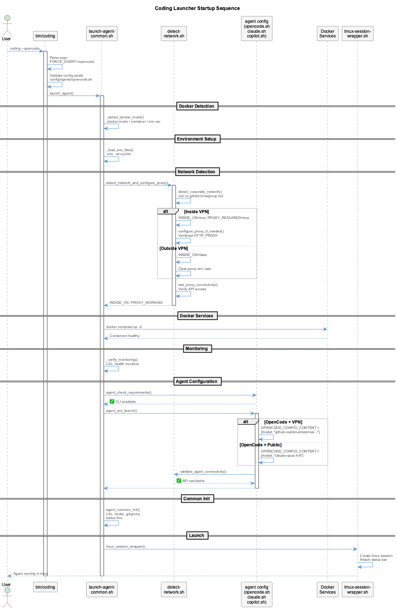

# Network Configuration

How the Coding launcher handles corporate VPN, proxy detection, and agent-specific API routing.

---

## Overview

The Coding system operates in two network environments:

- **Inside VPN / Corporate Network (CN)** — all external API calls must go through the corporate proxy (proxydetox on `127.0.0.1:3128`)
- **Outside VPN / Public Network** — direct internet access, no proxy needed

The launcher automatically detects the environment and configures each agent accordingly.


---

## Connectivity Matrix

| Agent | Auth Method | Inside VPN (proxy) | Outside VPN (direct) |
|---|---|---|---|
| `coding --claude` | OAuth (Max subscription) | Works via proxy | Works direct |
| `coding --opencode` | Auto-selected | GH Copilot Enterprise via proxy | Anthropic direct |
| `coding --copilot` | VS Code Copilot token | Works via proxy | Works direct |

!!! info "OpenCode Model Switching"
    OpenCode automatically switches its LLM provider based on network location:

    - **VPN**: `github-copilot-enterprise/claude-opus-4.6` (free via corporate subscription)
    - **Public**: `claude-opus-4-6` (personal Anthropic API key or subscription)

---

## Detection Flow

The detection runs early in the startup pipeline (`detect-network.sh`), before any agent-specific configuration:

1. **Corporate network probe** — `curl https://cc-github.bmwgroup.net` (2s timeout)
2. **Proxy configuration**:
    - Inside CN: verify/auto-configure proxydetox (`127.0.0.1:3128`)
    - Outside CN: **clear** proxy env vars (`unset HTTP_PROXY HTTPS_PROXY`)
3. **Connectivity test** — verify the chosen API endpoint is actually reachable
4. **Agent model selection** — OpenCode picks GitHub Copilot or Anthropic

### Startup Sequence



---

## Proxy Configuration

### Inside VPN (Corporate Network)

The corporate proxy (proxydetox) runs on `127.0.0.1:3128`. The launcher:

1. Checks if `HTTP_PROXY` is already set in the environment
2. If not, probes `127.0.0.1:3128` and auto-configures:

```bash
export HTTP_PROXY="http://127.0.0.1:3128"
export HTTPS_PROXY="http://127.0.0.1:3128"
export NO_PROXY="localhost,127.0.0.1,.bmwgroup.net"
```

All external API calls (Anthropic, GitHub, OpenAI) **require** this proxy when inside VPN. Direct connections time out.

### Outside VPN (Public Network)

The launcher **clears** any proxy env vars inherited from shell profiles:

```bash
unset HTTP_PROXY HTTPS_PROXY http_proxy https_proxy
```

This prevents opencode/claude from trying to route through a non-existent proxy.

---

## Agent API Endpoints

Each agent validates its required API endpoint before launch:

| Agent | Required API | Endpoint Tested |
|---|---|---|
| Claude Code | Anthropic | `https://api.anthropic.com` |
| OpenCode (VPN) | GitHub Copilot | `https://api.github.com` |
| OpenCode (public) | Anthropic | `https://api.anthropic.com` |
| Copilot CLI | GitHub | `https://api.github.com` |

If validation fails, the launcher logs a warning but does not block startup (the agent may still work via cached tokens or fallback mechanisms).

---

## Testing & Debugging

### Dry Run

Test network detection without launching an agent:

```bash
coding --opencode --dry-run
coding --claude --dry-run
```

Output includes:
```
[OpenCode] 🏢 Inside Corporate Network (cc-github.bmwgroup.net reachable)
[OpenCode] Proxy active: http://127.0.0.1:3128/
[OpenCode] ✅ External access working (via proxy)
[OpenCode] DRY-RUN: Network: CN=true, Proxy=true, Required=true
[OpenCode] 🏢 VPN → GitHub Copilot Enterprise (claude-opus-4.6)
[OpenCode] ✅ GitHub API reachable (for Copilot provider)
```

### Force Network Mode

Override detection for testing:

```bash
# Simulate outside VPN
CODING_FORCE_CN=false coding --opencode --dry-run

# Simulate inside VPN
CODING_FORCE_CN=true coding --opencode --dry-run
```

### Troubleshooting

| Symptom | Cause | Fix |
|---|---|---|
| 502 Bad Gateway in OpenCode | Proxy interfering with streaming API | Check proxydetox is running: `lsof -i :3128` |
| All API calls timeout (000) | Inside VPN without proxy | Start proxydetox or set `HTTP_PROXY` |
| "Credit balance too low" | Using API key instead of OAuth | Log in via `claude auth login` for Max subscription |
| OpenCode uses wrong model | Network detection mismatch | Use `--dry-run` to check, or `CODING_FORCE_CN=true/false` |

---

## Environment Variables

| Variable | Set By | Purpose |
|---|---|---|
| `HTTP_PROXY` / `HTTPS_PROXY` | detect-network.sh | Route traffic through corporate proxy |
| `NO_PROXY` | detect-network.sh | Bypass proxy for local/internal hosts |
| `INSIDE_CN` | detect-network.sh | `true` when on corporate VPN |
| `PROXY_WORKING` | detect-network.sh | `true` when external APIs are reachable |
| `PROXY_REQUIRED` | detect-network.sh | `true` when proxy is needed (= inside CN) |
| `CODING_FORCE_CN` | User override | Force `true`/`false` to skip detection |
| `OPENCODE_CONFIG_CONTENT` | opencode.sh | JSON config for model/provider selection |
