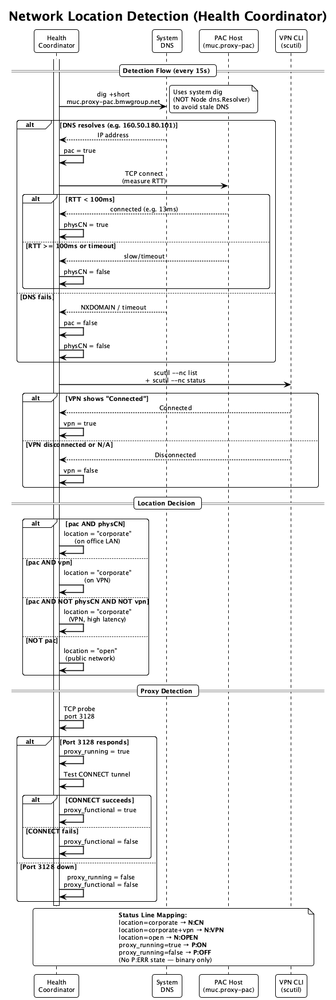
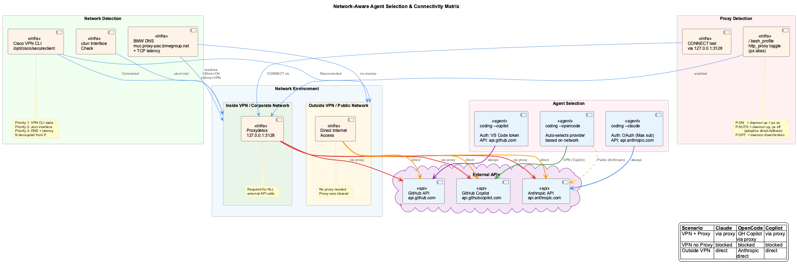

# Network Configuration

Corporate VPN, proxy detection, and how each agent's API traffic is routed on either
network.

=== "⚡ Quick (~3 min)"

    ## Three environments, one detector

    | Where you are | Proxy |
    |---------------|-------|
    | On the corporate network | Required — proxydetox on `127.0.0.1:3128` |
    | On VPN | Required — same proxy |
    | At home or anywhere public | None; direct |

    The **health coordinator is the single authority** on which one you are in. It probes every
    15 seconds; the launcher, the status line and the LLM proxy all read its answer rather than
    detecting independently.

    ## Check where the system thinks you are

    ```bash
    curl -s localhost:3034/health/state | jq .network
    ```

    ## `vpn` and `corporate` mean the same thing

    The coordinator says `vpn`, `corporate` or `open`. The LLM proxy says `corporate` or
    `public`. **`vpn` and `corporate` are the same network** — comparing the two vocabularies as
    raw strings is a real and recurring source of restart loops.

    ## When calls fail on the corporate network

    Routing can look perfect while every off-premises call fails. Check egress, not routing:

    ```bash
    curl -s localhost:12435/health | jq '.egress, .networkMode'
    ```

    A proxy pinned to a network you have since left produces exactly this. Restarting the proxy
    *while on the network you are actually on* re-pins it.

=== "📖 Standard (~15 min)"

    ## How the network is detected

    Three signals, in priority order, first match wins:

    | Priority | Signal | Gives |
    |----------|--------|-------|
    | 1 | Cisco VPN CLI reports a connected tunnel | `vpn` |
    | 2 | An active `utun*` interface with an address | `vpn` |
    | 3 | Internal DNS resolves, plus a latency measurement | `corporate` under 100 ms, else `vpn` |
    | — | DNS does not resolve at all | `open` |

    

    The DNS probe deliberately shells out to `dig` rather than using Node's resolver. Node caches
    the system DNS servers at process start, so a coordinator that started on a hotspot and then
    moved onto the office LAN would keep querying the public resolvers, fail to resolve internal
    names, and report `open` indefinitely. Spawning `dig` reads the current OS configuration
    every time.

    The launcher has its own one-time bootstrap check for the moment before the coordinator is
    up, also DNS-based — the previous version fetched a corporate URL, which required the proxy
    to already be configured, which required knowing the network. Once the coordinator is
    running, everything defers to it.

    ## What each agent does on each network

    

    Inside the corporate network the launcher auto-detects proxydetox and sets `HTTP_PROXY` and
    `HTTPS_PROXY`. Outside, it actively **clears** those variables — a stale proxy setting
    pointing at a proxy that is not there fails in a way that looks like an API outage.

    ## The two network vocabularies

    This is worth stating plainly because it has caused real restart loops: the coordinator
    speaks `corporate | vpn | open`, and the LLM proxy speaks `corporate | public`. **`vpn` and
    `corporate` are the same network under two names.** Any code comparing the two must map them
    first, and the flip detector must compare against the last *settled* classification rather
    than the last raw reading, or a single transitional sample triggers a restart.

    The bug this describes is invisible on a public network, where both sides happen to spell it
    the same way. Diagnose it on the VPN specifically.

    ## Egress can fail while routing is perfect

    Distinguish two questions that look identical from the outside: *where was this call routed*,
    and *could the process reach the internet at all*. On the corporate network with direct
    egress, every off-premises provider fails with a bare connection error while the routing
    decision was entirely correct.

    ```bash
    curl -s localhost:12435/health | jq '.egress, .networkMode'
    ```

    The tell is one on-premises provider succeeding while everything else fails. Fallback depth
    does not help — every hop in a chain shares the same egress pin, so a stale pin fails all of
    them identically.

    ## Diagnosing

    ```bash
    curl -s localhost:3034/health/state | jq .network       # what the coordinator sees
    curl -s localhost:12435/health | jq '.networkMode'      # what the proxy believes
    ```

    If those two disagree after mapping `vpn` to `corporate`, the proxy is holding a stale
    reading; kickstarting it while on your current network re-pins it.

=== "📚 Deep Dive (full)"

    --8<-- "_tiers/guides/network-configuration.deep.md"
