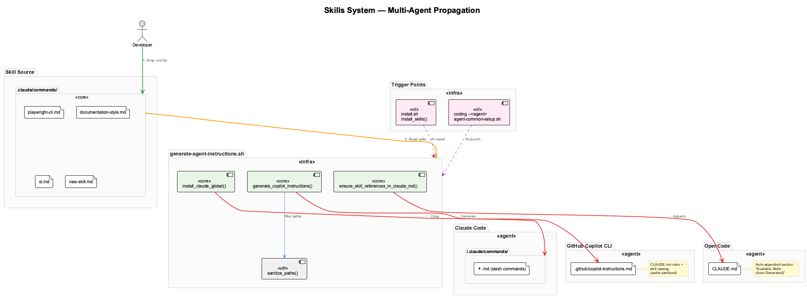

# Skills System

Skills are reusable workflow instructions that all supported coding agents (Claude Code, GitHub Copilot CLI, OpenCode) can use. A single skill definition propagates automatically to every agent.



---

## Adding a New Skill

1. Create a `.md` file in `.claude/commands/` with YAML frontmatter:

    ```markdown
    ---
    name: my-skill
    description: >
      Brief description of when this skill should be triggered.
      This text is used in the skill catalog for all agents.
    ---

    # My Skill

    Instructions the agent should follow when this skill is activated.
    ```

2. Run the propagation script:

    ```bash
    ./scripts/generate-agent-instructions.sh
    ```

That's it. The skill is now available in all three agents.

---

## How It Works Per Agent

| Agent | Mechanism | Location |
|-------|-----------|----------|
| **Claude Code** | Copied as global slash command | `~/.claude/commands/*.md` |
| **Copilot CLI** | Included in generated instructions | `.github/copilot-instructions.md` |
| **OpenCode** | Appended to project instructions | `CLAUDE.md` (auto-generated section) |

### Claude Code

Skills in `~/.claude/commands/` become slash commands invokable via `/skill-name`. Claude reads these natively.

### GitHub Copilot CLI

Copilot reads `.github/copilot-instructions.md` for project-level instructions. The generator creates this file by combining all rules from `CLAUDE.md` (with machine-specific paths sanitized) and a catalog of available skills.

### OpenCode

OpenCode reads `CLAUDE.md` natively but has no slash command system. The generator appends an **Available Skills (Auto-Generated)** section listing all skills. This section is idempotent — re-running replaces it.

---

## Automatic Sync Points

The script runs automatically at two points:

- **`./install.sh`** — `install_skills()` during installation
- **`coding --<agent>`** — `ensure_agent_instructions()` at every launch

Skills stay current even if you add new ones between installs.

---

## Path Sanitization

Generated files never contain machine-specific paths:

| Pattern | Replacement |
|---------|-------------|
| Absolute repo path | `$CODING_REPO` |
| Home directory | `~` |
| Username patterns | `~` |

This makes `.github/copilot-instructions.md` safe to commit.

---

## Current Skills

| Skill | Trigger | Description |
|-------|---------|-------------|
| **documentation-style** | PlantUML, Mermaid, diagrams | Naming conventions, style sheets, validation |
| **playwright-cli** | Browser automation, screenshots, E2E | Drives Playwright from bash without MCP |
| **sl** | Session continuity | Loads recent Live Session Logs for context |

---

## Script Reference

```bash
# Sync all skills to all agents
./scripts/generate-agent-instructions.sh

# With explicit paths (used internally)
./scripts/generate-agent-instructions.sh <project_dir> <coding_repo>
```
