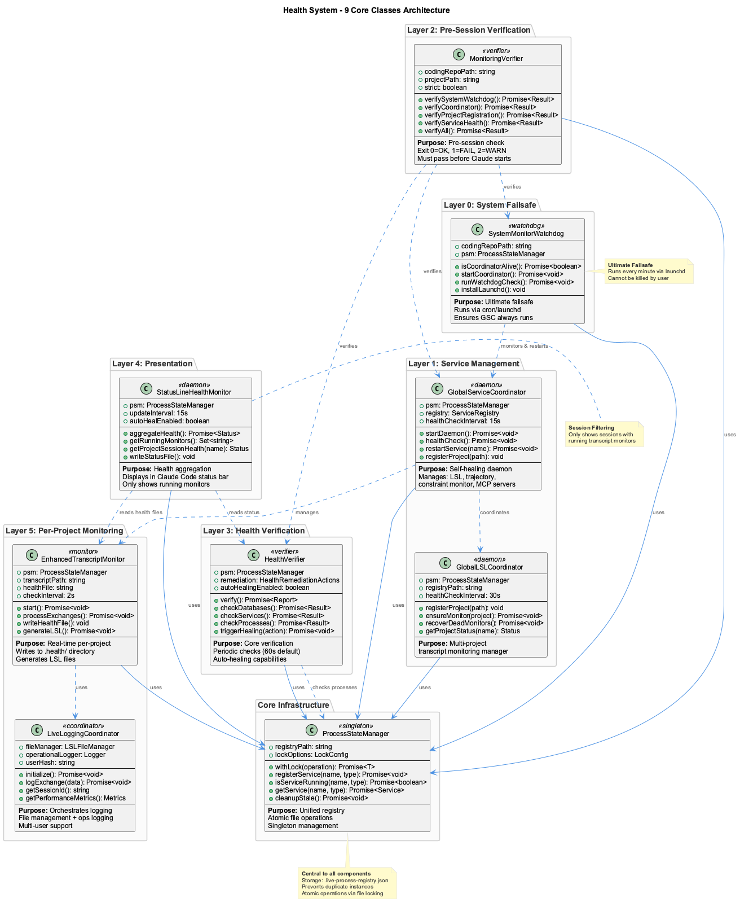
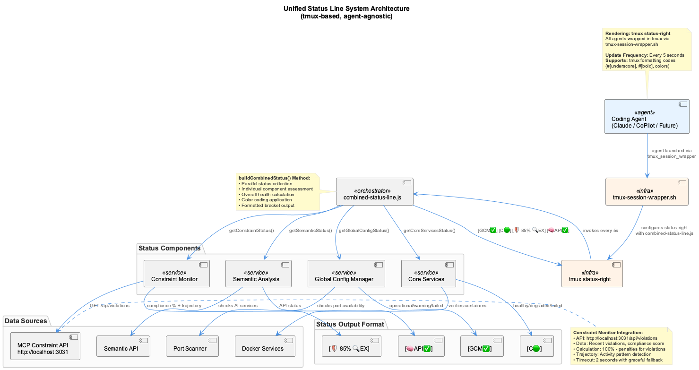
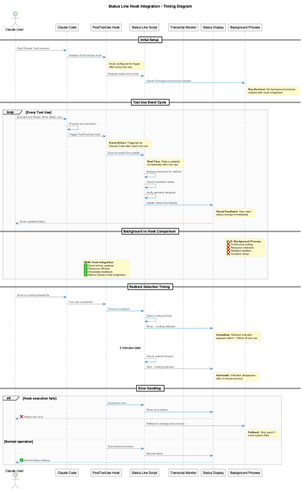
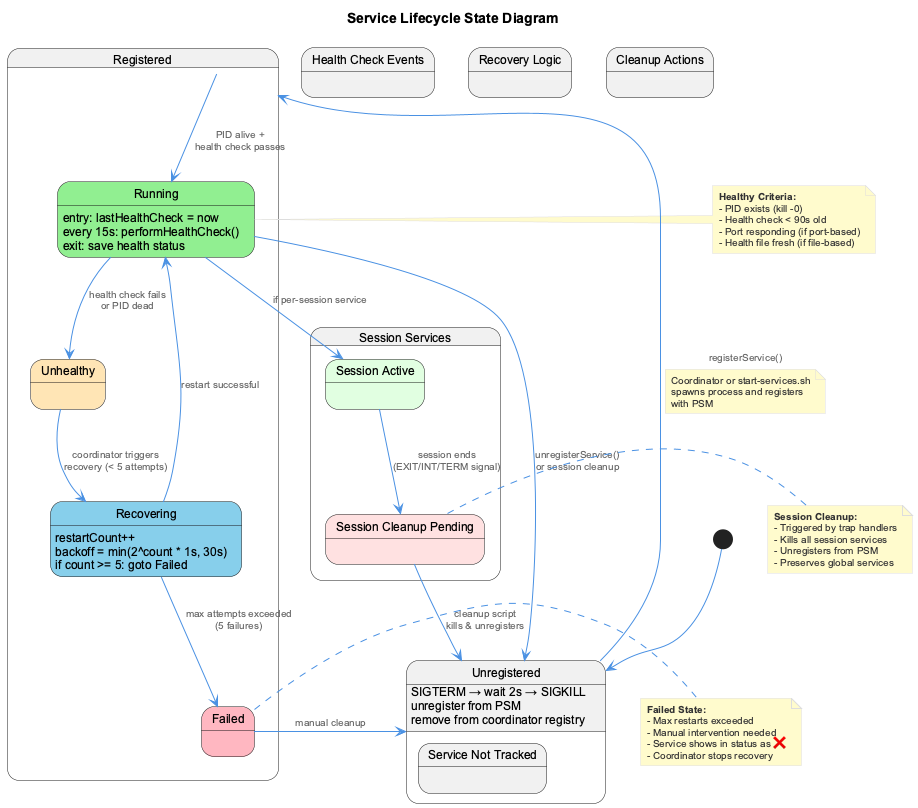

# Status Line Complete Guide

Real-time visual indicators of system health and development activity rendered via the unified tmux status bar. All coding agents (Claude, CoPilot, etc.) are wrapped in tmux sessions by `tmux-session-wrapper.sh`, which configures `status-right` to invoke `status-line-fast.cjs` — an ultra-fast CJS cache reader (~60ms) that serves pre-rendered status from a file-based cache, eliminating the 2-18s ESM module loading penalty under system load.


## Reading the Status Line

### Example Display

**Native Mode:**
```
[🏥✅] [Gq$0FEB A$0 O$0 X$25] [C🟢 UT🫒] [🛡️ 67% 🔍EX] [📚✅] 📋17-18
```

**Docker Mode:**
```
[🐳] [🐳MCP:SA✅CM✅CGR✅] [🏥✅] [Gq$0FEB A$0 O$0 X$25] [C🟢 UT🫒] [🛡️ 67% 🔍EX] [📚✅] 📋17-18
```

### Component Breakdown

| Component | Example | Description |
|-----------|---------|-------------|
| Docker Mode | `[🐳]` | Indicator that system is running in Docker mode |
| Docker MCP Health | `[🐳MCP:SA✅CM✅CGR✅]` | Health of containerized MCP SSE servers |
| System Health | `[🏥✅]` | Unified health (infrastructure + services) |
| API Quota | `[Gq$0FEB A$0 O$0 X$25]` | LLM provider spend/balance (live) |
| Active Sessions | `[C🟢 UT🫒]` | Project abbreviations with activity icons |
| Constraint Compliance | `🛡️ 67%` | Code quality compliance percentage |
| Trajectory State | `🔍 EX` | Current development activity |
| Knowledge System | `[📚✅]` | Knowledge extraction status |
| LSL Time Window | `📋17-18` | Session time range (HHMM-HHMM) |

---

## Complete Emoji Reference

### System Health Indicators

| Display | Meaning | Action |
|---------|---------|--------|
| `[🏥✅]` | All systems healthy | None needed |
| `[🏥⚠️]` | Issues detected | Check dashboard for details |
| `[🏥⏰]` | **Stale** - verification data >2 minutes old | Health verifier may have crashed |
| `[🏥❌]` | Critical issues or error | Immediate attention required |
| `[🏥💤]` | Health verifier offline | Start health verifier |

### Session Activity Indicators

Sessions use a **graduated color scheme** based on time since last activity. **All sessions are always displayed** — sleeping sessions show as 💤, never hidden. Sessions are only removed when the agent process exits.

| Icon | Status | Time Since Activity | Description |
|------|--------|---------------------|-------------|
| 🟢 | Active | < 5 minutes | Active session with recent activity |
| 🌲 | Cooling | 5 - 15 minutes | Session cooling down |
| 🫒 | Fading | 15 min - 1 hour | Session fading, still tracked |
| 🪨 | Dormant | 1 - 6 hours | Session dormant but alive |
| ⚫ | Inactive | 6 - 24 hours | Session inactive but tracked |
| 💤 | Sleeping | > 24 hours | Long-term dormant session |
| ❌ | Error | Any | Health check failed or service crash |

**Visual progression:**
```
🟢 Active → 🌲 Cooling → 🫒 Fading → 🪨 Dormant → ⚫ Inactive → 💤 Sleeping
   <5min      5-15min     15m-1hr     1-6hr        6-24hr       >24hr
```

!!! info "Agent Age Cap"
    When an agent process (Claude, Copilot, OpenCode) is running, the displayed age is capped at the transcript monitor's uptime. This prevents a freshly started session in a project with old transcripts from immediately showing as dormant — the session starts green and naturally progresses through the cooling scheme based on how long the current session has been idle.

!!! warning "Not-Found Transcript Guard"
    Agents that don't produce Claude-compatible transcripts (e.g., OpenCode) have `transcriptInfo.status: 'not_found'`. The age cap logic skips these sessions — they correctly display as ⚫ inactive instead of falsely showing as 🟢 active.

### Trajectory States

| Icon | State | Description |
|------|-------|-------------|
| 🔍 | EX (Exploring) | Information gathering and analysis |
| 📈 | ON (On Track) | Productive progression |
| 📉 | OFF (Off Track) | Deviating from optimal path |
| ⚙️ | IMP (Implementing) | Active code modification |
| ✅ | VER (Verifying) | Testing and validation |
| 🚫 | BLK (Blocked) | Intervention preventing action |

### Knowledge System Indicators

| Status | Icon | Meaning |
|--------|------|---------|
| Ready | `[📚✅]` | Knowledge extraction ready and operational |
| Processing | `[📚⏳]` | Actively extracting knowledge from session |
| Idle | `[📚💤]` | Operational but waiting/sleeping |
| Warning | `[📚⚠️ ⚠️N]` | Has N errors but still operational |
| Paused/Disabled | `[📚⏸️ ]` | Knowledge extraction disabled in config |
| Offline | `[📚❌]` | System offline or initialization failed |

### Internal Health Components

The statusline-health-monitor writes detailed health to `.logs/statusline-health-status.txt`:

```
[GCM:✅] [Sessions: C:🟢] [Guards:✅] [DB:✅] [VKB:✅] [Browser:✅] [Dash:✅]
```

| Label | Ports | Service | Description |
|-------|-------|---------|-------------|
| `GCM` | - | Global Process Supervisor | Session coordinator and auto-restart |
| `Sessions` | - | Transcript Monitors | Per-project Claude session health |
| `Guards` | 3030/3031 | Constraint Monitor | Dashboard and API for code quality |
| `DB` | - | Databases | LevelDB, SQLite, Qdrant, Memgraph |
| `VKB` | 8080 | Knowledge Visualization | Graph visualization server |
| `Browser` | 3847 | Browser Automation | SSE server for parallel sessions |
| `Dash` | 3032/3033 | System Health Dashboard | UI and API for health monitoring |

---

## API Quota Monitoring

All four LLM providers update automatically via API-based or self-tracking mechanisms. No manual spend updates needed after initial key setup.

### Format

`[Provider$X ...]` — dollar amounts show live spend or remaining balance.

### Provider Data Sources

| Abbrev | Provider | Data Source | Setup |
|--------|----------|-------------|-------|
| `Gq` | Groq | BudgetTracker self-tracking | Automatic (no key needed) |
| `Ggl` | Google Gemini | Free tier (no tracking) | `GEMINI_API_KEY` |
| `A` | Anthropic | Admin API (cost report) | `ANTHROPIC_ADMIN_API_KEY` |
| `O` | OpenAI | Admin API (costs) | `OPENAI_ADMIN_API_KEY` |
| `X` | X.AI Grok | Management API (balance) | `XAI_MANAGEMENT_KEY` + `XAI_TEAM_ID` |

### Display Logic

| Scenario | Display | Meaning |
|----------|---------|---------|
| Admin API: spend data | `A$2` | $2 spent this month (live) |
| Admin API: with prepaid credits | `A$18` | $18 remaining of prepaid |
| Monthly self-tracked (Groq) | `Gq$0FEB` | $0 spent in February |
| Management API (xAI) | `X$25` | $25 remaining balance |
| Free tier (Google) | `Ggl●` | Available (rate-limited) |
| No admin key configured | `O○` | Cannot get usage data |

### Pie Chart Symbols

Used when percentage-based display applies (prepaid credits configured):

| Symbol | Name | Remaining |
|--------|------|-----------|
| `●` | Full | >87.5% |
| `◕` | Three-quarters | 62.5-87.5% |
| `◐` | Half | 37.5-62.5% |
| `◔` | Quarter | 12.5-37.5% |
| `○` | Empty | <12.5% or no data |

### Setup

Run the interactive setup script to configure API keys (one-time):

```bash
node scripts/setup-api-keys.js
```

Each key is validated with a test API call before saving to `.env`. Groq requires no setup.

### API Keys Reference

| Variable | Provider | Where to Get It |
|----------|----------|----------------|
| `ANTHROPIC_ADMIN_API_KEY` | Anthropic | console.anthropic.com → Settings → Admin API Keys |
| `OPENAI_ADMIN_API_KEY` | OpenAI | platform.openai.com/settings/organization/admin-keys |
| `XAI_MANAGEMENT_KEY` | xAI | console.x.ai → Settings → Management Keys |
| `XAI_TEAM_ID` | xAI | console.x.ai team settings URL |

### How Groq Self-Tracking Works

Groq has no billing API. The Docker-based `BudgetTracker` (`src/inference/BudgetTracker.js`) tracks costs from every LLM call and periodically writes to `.data/llm-usage-costs.json` (debounced, atomic write). The `api-quota-checker.js` reads this file for Groq spend. The legacy Playwright billing scraper is automatically bypassed when self-tracking data exists.

### Configuration

Provider credits in `config/live-logging-config.json` serve as fallbacks:

```json
{
  "provider_credits": {
    "groq": {
      "billingType": "monthly",
      "monthlySpend": 0,
      "billingMonth": "FEB",
      "spendLimit": null
    },
    "anthropic": { "prepaidCredits": 0 },
    "openai": { "prepaidCredits": null },
    "xai": { "prepaidCredits": 25 }
  }
}
```

---

## Docker Mode Indicators

### Detection

Docker mode is detected when:
- The `.docker-mode` marker file exists in the coding repository
- OR the `CODING_DOCKER_MODE=true` environment variable is set

### Docker MCP Health Display

| Abbreviation | Service | Port | Health Check |
|--------------|---------|------|--------------|
| `SA` | Semantic Analysis | 3848 | `http://localhost:3848/health` |
| `CM` | Constraint Monitor | 3849 | `http://localhost:3849/health` |
| `CGR` | Code Graph RAG | 3850 | `http://localhost:3850/health` |

### Status Icons

- `✅` - Service healthy and responding
- `❌` - Service down or not responding
- `⚠️` - Service responding but with issues

### Examples

| Display | Meaning |
|---------|---------|
| `[🐳MCP:SA✅CM✅CGR✅]` | All Docker MCP services healthy |
| `[🐳MCP:SA✅CM❌CGR✅]` | Constraint Monitor is down |
| `[🐳MCP:SA⚠️CM✅CGR✅]` | Semantic Analysis has issues |

---

## Architecture

### 6-Layer Health System



The StatusLineHealthMonitor (Layer 4) aggregates health from all other layers and outputs to the Combined Status Line display.



### Tmux-Based Rendering

All coding agents are wrapped in tmux sessions via `scripts/tmux-session-wrapper.sh`. The wrapper:

- Creates a tmux session named `coding-{agent}-{PID}`
- Configures `status-right` to invoke `status-line-fast.cjs` (CJS fast-path cache reader, ~60ms)
- Handles nesting guard (reuses existing tmux if already inside one)
- Propagates environment variables (`CODING_REPO`, `SESSION_ID`, etc.)
- Enables mouse forwarding for terminal interaction

This replaces the previous approach of using agent-specific status bar APIs (e.g., Claude's `statusLine` config), providing a unified rendering target that works identically for all agents.

### Cache Fast-Path

The `status-line-fast.cjs` is a CommonJS module that eliminates ESM module loading overhead:

- Reads pre-rendered status from `.logs/combined-status-line-cache.txt`
- If cache <60s old → **serves immediately** (~60ms)
- If cache >20s old → triggers **background refresh** via `combined-status-line.js` (detached)
- If cache missing/stale → synchronous fallback to full CSL

This ensures the status bar **never goes blank** under system load (ESM imports took 2-18s under high process count).

### Status Line Update Flow



**Cache Fast-Path (normal operation):**

1. **Tmux Timer**: `status-right` fires every 5 seconds → `status-line-fast.cjs`
2. **Cache Check**: Read `.logs/combined-status-line-cache.txt`
3. If cache fresh → serve immediately (~60ms), done
4. If cache >20s → trigger background refresh (detached `combined-status-line.js`)

**Full Refresh (background or fallback):**

1. **Status Collection**:
   - Read health verification status
   - Query constraint monitor API
   - Read trajectory state file
   - Check API quota for all providers
   - Scan LSL registry
2. **Status Aggregation**: Combine all indicators
3. **Display**: Render to tmux status bar (supports tmux formatting codes: `#[underscore]`, `#[bold]`, colors)
4. **Cache Write**: Save to `.logs/combined-status-line-cache.txt`
5. **GPS Check**: If GPS heartbeat >60s stale, run ensure* functions as fallback supervisor

### Caching

| Data | Cache Duration |
|------|----------------|
| Pre-rendered status (fast-path) | 60s TTL, 20s background refresh |
| Health status | 5 minutes |
| Constraint compliance | 1 minute |
| API quota (real-time) | 30 seconds |
| API quota (estimated) | 5 minutes |
| Trajectory state | Read on every update |
| LSL status | Read on every update |

### Spawn Storm Prevention

The supervision architecture includes guards to prevent runaway process spawning:

| Guard | Component | Mechanism |
|-------|-----------|-----------|
| GPS heartbeat gate | CombinedStatusLine | ensure* functions skip when GPS heartbeat <60s old |
| OS-level dup check | GlobalServiceCoordinator | `findRunningProcessesByScript()` before every spawn |
| Orphan kill | GlobalServiceCoordinator | Kills spawned process if post-spawn health check fails |
| Cooldown | GPS (5min), Coordinator (2min) | Per-service cooldown between restart attempts |
| Rate limiting | GPS (10/hr), Coordinator (6/hr) | Maximum restarts per service per hour |
| OS-level re-registration | GlobalProcessSupervisor | Re-registers alive services instead of respawning |

---

## Service Lifecycle States



### State Transitions

**Health States** (for `[🏥...]` indicator):
- Health check success → Healthy (✅)
- GCM or Health Verifier issues → Warning (⚠️)
- Critical failures → Critical (❌)

**Session States** (graduated cooling scheme):
- Time passage → 🟢 → 🌲 → 🫒 → 🪨 → ⚫ → 💤
- Sessions only removed when agent exits, never hidden while running

---

## Session Discovery

### Discovery Methods

1. **Running Monitor Detection**: Checks `ps aux` for running `enhanced-transcript-monitor.js` processes
2. **Agent Process Detection**: Scans for `claude`, `copilot`, and `opencode` processes via `ps -eo pid,comm` and resolves project from working directory via `lsof`
3. **Registry-based Discovery**: Uses Global LSL Registry for registered sessions
4. **Dynamic Discovery**: Scans Claude transcript directories for unregistered sessions
5. **Health File Validation**: Uses centralized health files from `.health/` directory

### Key Behavior

- Sessions with a **running agent process** use age capped at monitor uptime (graduated cooling from session start)
- Sessions with running transcript monitors but no active agent use transcript-based activity icons
- Sessions are **only removed** when the agent process has exited — never hidden
- The Global Process Supervisor automatically restarts dead monitors within 30 seconds

### Multi-Agent Support

| Agent | Binary | Detection Method |
|-------|--------|-----------------|
| Claude | `claude` | Exact match on `ps -eo comm` |
| Copilot | `copilot` | Path-ending match `/copilot$` |
| OpenCode | `opencode` | Path-ending match `/opencode$` |

New agents can be added to the detection loop in `statusline-health-monitor.js` → `getRunningAgentSessions()`.

### Smart Abbreviation Engine

Project names are automatically abbreviated:

| Project Name | Abbreviation |
|--------------|--------------|
| coding | C |
| curriculum-alignment | CA |
| nano-degree | ND |
| project-management | PM |
| user-interface | UI |

**Algorithm Handles:**
- Single words: First letter (coding → C)
- Hyphenated words: First letter of each part (curriculum-alignment → CA)
- Camel case: Capital letters (projectManagement → PM)

---

## Configuration

### Status Line Configuration

**File**: `config/status-line-config.json`

```json
{
  "enabled": true,
  "update_interval_ms": 5000,
  "cache_duration_ms": 300000,
  "health_source": ".health/verification-status.json",
  "trajectory_source": ".specstory/trajectory/live-state.json",
  "lsl_registry": ".lsl/global-registry.json",
  "constraint_api": "http://localhost:3031/api/compliance/{project}",
  "abbreviation_style": "smart",
  "multi_session_display": true,
  "max_sessions_displayed": 5
}
```

### Configuration Options

| Option | Description | Default |
|--------|-------------|---------|
| `enabled` | Toggle status line on/off | `true` |
| `update_interval_ms` | How often to check for updates | 5000ms |
| `cache_duration_ms` | How long to cache health status | 5 minutes |
| `abbreviation_style` | `smart` \| `first-letter` \| `full-name` | `smart` |
| `multi_session_display` | Show multiple sessions or just active one | `true` |
| `max_sessions_displayed` | Maximum sessions to show | 5 |

---

## Terminal Title Broadcasting

### How It Works

Every 15 seconds, the statusline-health-monitor broadcasts status to all Claude session terminals via ANSI escape codes:

```
Terminal Tab: "C🟢 | UT🫒 CA🌲"
              ↑          ↑
        Current     Other active sessions
        project     (all sessions shown)
```

### Terminal Compatibility

| Terminal | Status | Notes |
|----------|--------|-------|
| iTerm2 | ✅ Works | Full OSC 0 support |
| Terminal.app | ✅ Works | Native macOS terminal |
| VS Code Terminal | ❌ Limited | Does not process OSC 0 from external TTY writes |
| tmux | ✅ Works | Primary rendering target — all agents run inside tmux |

---

## Troubleshooting

### Status bar completely blank?

```bash
# Check cache file freshness
ls -la .logs/combined-status-line-cache.txt

# Test fast-path directly (should complete in <100ms)
time node scripts/status-line-fast.cjs

# Force full refresh
node scripts/combined-status-line.js

# Check for process spawn storm (should be <80 Node processes)
ps aux | grep node | wc -l

# If >100 processes, kill the coordinator and let GPS restart cleanly
ps aux | grep global-service-coordinator | grep -v grep
```

### Status line not updating?

```bash
# Check if health verifier is running
ps aux | grep health-verifier

# Manually trigger health check
node scripts/health-verifier.js

# Check status files exist
ls -la .health/verification-status.json
ls -la .specstory/trajectory/live-state.json
```

### Wrong project showing as active?

```bash
# Check LSL registry
cat .lsl/global-registry.json | jq '.'

# Verify activity timestamps
cat .lsl/global-registry.json | jq '.sessions[] | {project, last_activity}'
```

### Session not showing that should be?

```bash
# Check if agent process is detected (claude, copilot, opencode)
ps -eo pid,comm | awk '/claude$|copilot$|opencode$/ {print}'

# Check if the agent's cwd resolves to the right project
lsof -p <PID> 2>/dev/null | grep cwd

# Check if transcript monitor is running for that project
ps aux | grep enhanced-transcript-monitor | grep PROJECT_NAME

# Sessions show if: agent process running OR transcript monitor running
```

### Docker MCP services showing unhealthy?

```bash
# Check if Docker containers are running
docker compose -f docker/docker-compose.yml ps

# Test individual health endpoints
curl http://localhost:3848/health  # Semantic Analysis
curl http://localhost:3849/health  # Constraint Monitor
curl http://localhost:3850/health  # Code Graph RAG

# Check container logs for errors
docker compose -f docker/docker-compose.yml logs coding-services
```

---

## Key Files

**Core System:**

| File | Purpose |
|------|---------|
| `scripts/tmux-session-wrapper.sh` | Tmux session wrapper — wraps all agents with unified status bar |
| `scripts/status-line-fast.cjs` | Ultra-fast CJS cache reader (~60ms) — invoked by tmux `status-right` |
| `scripts/combined-status-line.js` | Full status line renderer + fallback supervisor (writes cache) |
| `scripts/combined-status-line-wrapper.js` | ESM wrapper (backup; primary is fast-path CJS) |
| `scripts/statusline-health-monitor.js` | Session health monitor daemon (multi-agent detection) |
| `scripts/global-service-coordinator.js` | Constraint service management with spawn guards |
| `scripts/auto-restart-watcher.js` | File-change detection for daemon code reloading |
| `scripts/health-verifier.js` | Health status provider |
| `lib/api-quota-checker.js` | API quota provider (calls Admin/Management APIs) |
| `src/inference/BudgetTracker.js` | LLM cost tracking with file persistence (Docker) |
| `scripts/setup-api-keys.js` | Interactive admin/management API key setup |
| `.data/llm-usage-costs.json` | BudgetTracker cost output (Groq self-tracking) |
| `.lsl/global-registry.json` | LSL session registry |
| `.health/verification-status.json` | Health status cache |
| `.logs/statusline-health-status.txt` | Rendered status line output |
| `.logs/combined-status-line-cache.txt` | Pre-rendered status cache (served by fast-path) |

**Configuration:**

| File | Purpose |
|------|---------|
| `config/status-line-config.json` | Status line configuration |
| `config/live-logging-config.json` | API quota and provider config |
