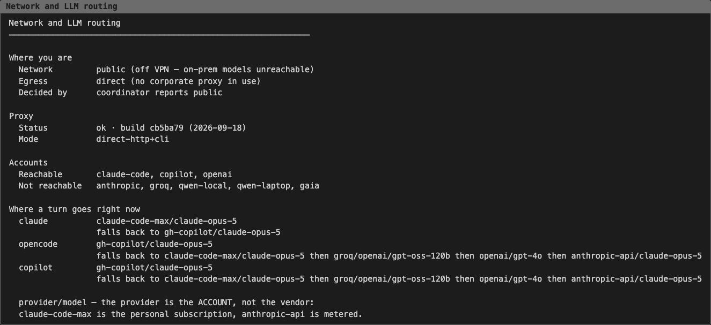
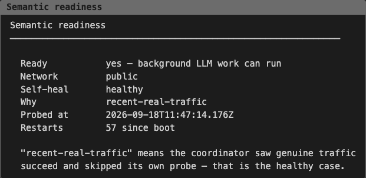
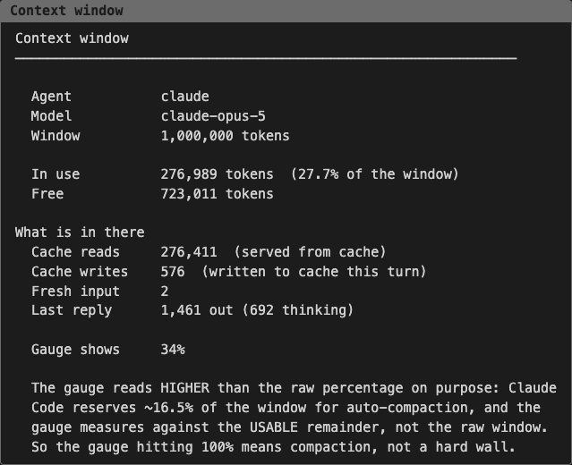

# Status Line

The tmux bar is on screen the whole time you work. Learning to read it turns most "is
something broken?" questions into a glance.

=== "⚡ Quick (~3 min)"

    ## What a badge is telling you

    **The emoji is the label; the dot is the state.** The leading emoji says what the badge is
    about and never changes; the tinted `●` after it says how that thing is doing.

    [🏥●] [AX●C●] [🔒72%●7] [📚●] [N:OPEN P:AUTO] [🧠●] ███░░░░░  47% [📋8-9] 08:20

    | Segment | Means |
    |---------|-------|
    | `[🏥●]` | Overall system health |
    | `[AX●C●]` | Active sessions per project — your pane's project is underlined |
    | `[🔒72%●7]` | Constraint compliance; `●N` in amber appears when there are violations |
    | `[📚●]` | Knowledge pipeline freshness |
    | `[N:OPEN P:AUTO]` | Where this machine is, and how it gets out — one bracket, because you read them together |
    | `[🧠●]` | Proxy semantic readiness |
    | `███░░░░░ 47%` | How full **this pane's** conversation context is |
    | `[📋8-9]` | Session logging time window |

    Each badge belongs to a feature, and a feature you have switched off contributes no badge
    at all — see [Composing What Runs](features.md).

    ## The badges are clickable

    Clicking a badge opens the thing it describes. Two kinds of target: a **page**, which
    reuses the browser tab you already have open, and a **popup** over your pane, dismissed
    with any key.

    | Click | Opens |
    |-------|-------|
    | `[🏥●]` | The health dashboard |
    | one project bubble | **that** project's repository page — not the underlined one |
    | `[🔒72%●7]` | The constraint dashboard |
    | `[📚●]` | The observations tab |
    | `[N:OPEN P:AUTO]` | Popup: where your traffic goes right now |
    | `[🧠●]` | Popup: why the semantic badge is the colour it is |
    | the gauge | Popup: context in tokens, not just a percentage |
    | `[📋8-9]` | The sessions tab |

    The clock is deliberately inert. Every action is read-only — a stray click cannot restart,
    toggle or write anything.

    ## Two absences that are good news

    `[LSL●]` appears only when session logging for **this pane** is unhealthy — no badge means it
    is fine. `[L:n]` and `[D:n]` (local executions, prompt downgrades) are hidden at zero.

    ## The gauge is the odd one out

    The context gauge has no brackets and no emoji — it carries a tinted background instead,
    which is what separates it. It describes the agent in *this* pane, not the system.

    A pane that has just started shows the gauge's **zero position** — an empty trough at
    `0%` — until its agent first reports. That is a new session, not a fault. A gauge that is
    absent altogether means the agent has no readable context store at all, which is a
    different thing and looks different.

    ## Colours

    Red is reserved. Knowledge-pipeline staleness *fades* through a green ramp rather than going
    red, so "getting old" and "actually broken" never look the same.

=== "📖 Standard (~15 min)"

    ## How it gets rendered

    `status-right` invokes a small CommonJS fast-path reader that serves a per-pane pre-rendered
    cache in roughly 60 ms, and only spawns the full renderer when that cache is stale. The full
    renderer pulls live state from the health coordinator on `:3034` — the single source of truth
    — and every coordinator-derived badge shares one memoized probe per render, so a bar with
    eight badges still makes one call.

    That two-stage design is why the bar can update every five seconds without the cost showing
    up anywhere.

    ## Reading state

    Every badge follows the same convention: a fixed emoji identifying the subject, then a glyph
    carrying the state. Where the state is purely a severity it is a tinted dot on a shared
    four-colour scale, so you learn one scale rather than one vocabulary per badge.

    Session activity uses a graduated green ramp rather than a binary, which is how an idle
    session is distinguishable from an active one without a second glyph.

    ## The context gauge

    The gauge shows how full the conversation in **this pane** is — not a system metric, and not
    shared between panes. It is deliberately the only segment without brackets or a leading
    emoji, using a tinted background as its delimiter instead, so it reads as a different kind of
    thing at a glance.

    ## Why some badges are missing

    Several segments are hidden in their healthy or zero state, on the principle that a bar full
    of "everything is fine" is harder to scan than one that only speaks up when it has something
    to say:

    | Segment | Hidden when |
    |---------|-------------|
    | `[LSL●]` | Session logging for this pane is healthy |
    | `[L:n]` | No completions served locally |
    | `[D:n]` | The prompt classifier is off, or nothing was downgraded |
    | `●N` in the constraint badge | No violations |

    ## Clicking a badge

    tmux can make a span of the status line a mouse target, so each field is wrapped in a range
    carrying its own tag; a click reports that tag to a binding, which hands it to a small
    dispatcher. The clock carries no range, which is why it does nothing.

    **Pages reuse a tab.** A status line is clicked often, so opening a new tab each time would
    bury the browser in duplicates. The dispatcher looks for a tab already showing the
    dashboard and navigates *that* one to the route you asked for — which is also how the
    sub-tab gets selected. A tab already on the target is focused without reloading, so scroll
    position and filters survive.

    Only the top-level tabs are routes and therefore addressable this way. The nested tabs
    inside Token Usage and Performance are component state, not URLs, so a click lands on the
    page and not on the inner tab.

    **Popups answer the question the badge raises.** A two-cell badge can say *that* something
    is wrong but never *what*, so the three fields whose subject has no page of its own open a
    report instead.

    The network badge answers where your traffic actually goes — which is not obvious from
    `[N:OPEN P:ON]`, and changes with the network:

    

    The semantic badge explains its own colour. `recent-real-traffic` is the healthy case — the
    coordinator saw genuine traffic succeed and skipped its probe — which reads like a fault
    until something says so:

    

    The gauge popup gives the context in tokens against the real window, and explains why it
    reads higher than the raw percentage: Claude Code reserves ~16.5% of the window for
    auto-compaction, and the gauge measures against the usable remainder:

    

    ## When the bar itself is wrong

    The status line is a *reader*. A grey or stale health badge means the thing it reads from has
    stopped, not that the services it describes have — check the coordinator first.

    A project missing from the session list means that project has no session monitor running,
    which is different from its monitor being unhealthy. And a stale bar after a code change is
    usually a long-lived tmux session still executing an older binary; check what is actually on
    disk before chasing the rendering.

    ## Changing it

    The bar is configured per project and rendered by a shared script, so a change affects every
    agent's session. Because sessions can override global tmux settings, read the live
    environment of the running session rather than the config file when a setting appears not to
    apply.

=== "📚 Deep Dive (full)"

    --8<-- "_tiers/guides/status-line.deep.md"
