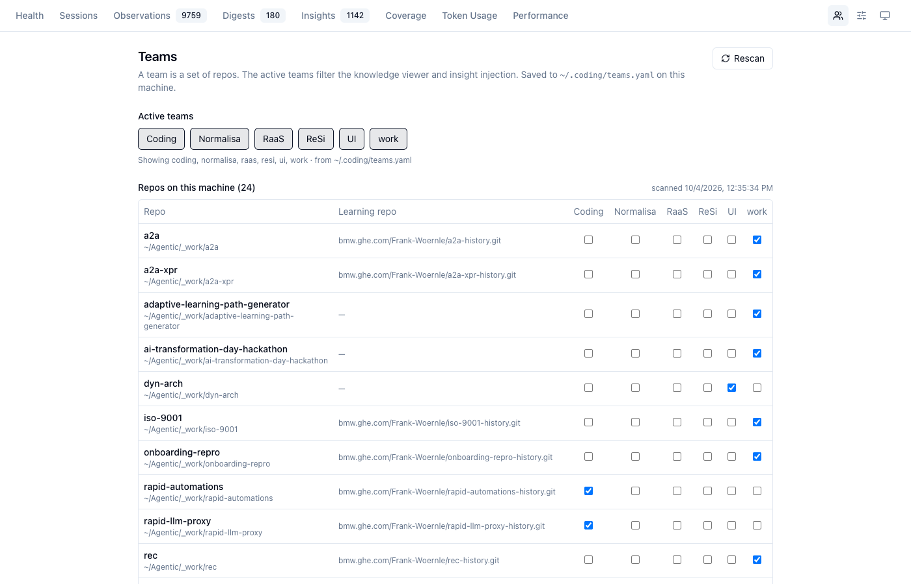
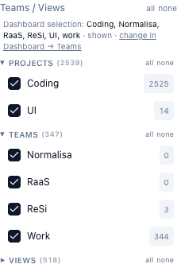
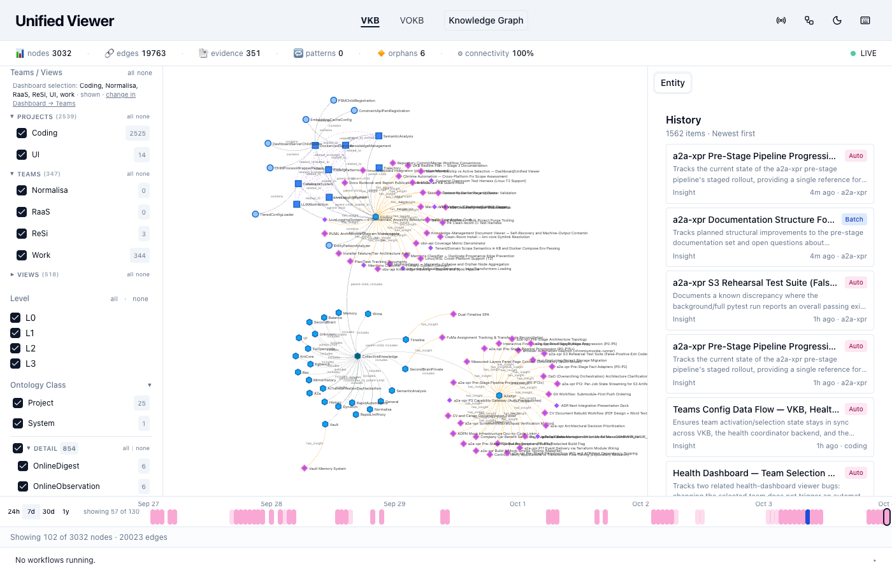
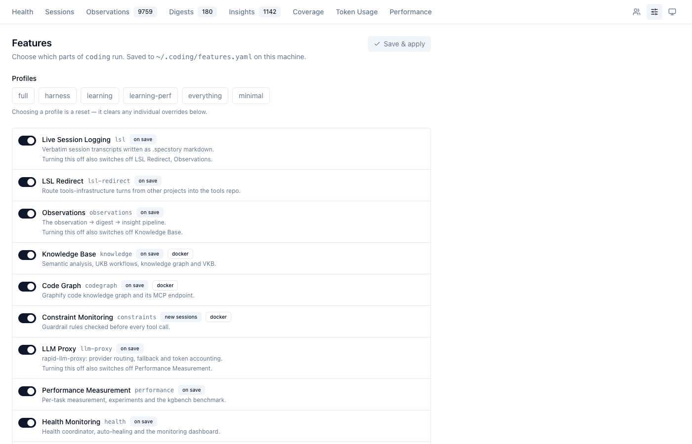

# Teams & Shared Learning

How to group your repos into teams, choose what the knowledge viewer shows, and share what
`coding` learned with teammates. The design behind it is in
[Per-Repo Tenancy](../architecture/tenancy.md).

=== "⚡ Quick (~3 min)"

    ## Group repos into teams

    Open [localhost:3032/teams](http://localhost:3032/teams) (the people icon at the top
    right of the dashboard). Every repo `coding` found on this machine is a row; every team is
    a column. Tick a box to put a repo in a team.

    

    The chips under **Active teams** are the selection the knowledge viewer shows. Saved to
    `~/.coding/teams.yaml`.

    ## See it in the viewer

    The viewer's **Teams / Views** rail starts from the same selection and changes it both
    ways — toggle a team here and the dashboard follows.

    

    ## Share with a teammate

    ```bash
    coding sync --push       # you: push what was learned (asks first)
    ```

    Your teammate starts `coding` in their checkout of the same repo and gives your
    `<repo>-history` URL at the first-launch prompt. From then on their launches pull your
    knowledge, and yours pull theirs.

=== "📖 Standard (~15 min)"

    ## The Teams tab

    | Part | What it does |
    |---|---|
    | **Active teams** chips | the selection the viewer shows (click to toggle) |
    | **Repos on this machine** | the discovery scan of `$HOME` (depth 4): git repos with a `.coding/` (or a legacy, not yet migrated `.specstory/history`) |
    | **Learning repo** column | where that repo's learned data is pushed; `—` means no choice yet (asked at the next `coding` launch there) |
    | team columns | membership — a repo may be in several teams |
    | **Rescan** | re-runs discovery now (it otherwise refreshes every 10 minutes) |

    **Add team** creates your own team; its delete button removes a team of yours (shipped teams cannot be deleted). Only `~/.coding/teams.yaml` is
    written; the shipped `config/teams.yaml` declares no memberships.

    ## What a selection changes — and what it does not

    | Surface | Uses |
    |---|---|
    | Knowledge viewer (graph, rail counts, History, LSL strip) | the **active selection** |
    | Dashboard pages that read obs-api with `?teams=` | the teams requested |
    | **Knowledge injection** into an agent | the teams of the **repo the agent runs in** — not the selection |

    So narrowing the viewer to one team never hides knowledge from an agent working elsewhere.
    A repo that is in no team gets only its own project's knowledge.

    ## The viewer

    

    The rail lists **Projects** (repos), **Teams** and **Views**; the number next to each is the
    count of entities it admits. The line at the top names the dashboard's selection and links
    there. The canvas redraws only when the selection actually changes.

    ## Choosing what runs: the Features tab

    The settings icon next to Teams opens **Features**: the installed tier as a profile, and a
    switch per feature. Dependencies are explained inline ("Turning this off also switches off
    …"), and the chip next to each says when a change takes effect — on save, or for new
    sessions only.

    

    The same from a shell: `coding-features status`, `coding-features profile learning`,
    `coding-features set performance off`.

    ## Sharing, step by step

    1. **You** work in repo `X`. Learned data lands in `X/.coding/` and is committed locally at
       session end and every 30 minutes.
    2. `coding sync` lists every learning repo with commits to push; the status line shows
       `[P:n]` while `n` of them are waiting.
    3. `coding sync --push` asks, then pushes.
    4. **A teammate** launches `coding` in `X` and pastes your `X-history` URL at the prompt
       (or Enter, if their default already points at it). The repo is cloned into their
       `X/.coding/`.
    5. Every later launch pulls; obs-api merges what arrived and the next prompt can use it.

    For a repo they do not have checked out, add the remote to a team instead:

    ```yaml
    # ~/.coding/teams.yaml
    teams:
      raas:
        repos:
          - https://bmw.ghe.com/alice/rapid-automations-history.git
    ```

    It appears under **Shared learning repos** on the Teams tab; **Clone N missing** (or
    `POST /teams/sync` on the coordinator) clones it read-only under
    `~/.coding/data/<scope>/var/shared/`, and `coding sync pull` keeps it current.

    ## Commands

    ```bash
    coding sync                   # what each learning repo has to push / pull
    coding sync pull --repo .     # pull one repo now
    coding sync commit            # commit everywhere, push nothing
    coding sync --push [--yes]    # push (asks unless --yes)
    ```

=== "📚 Deep Dive (full)"

    --8<-- "_tiers/guides/teams.deep.md"
