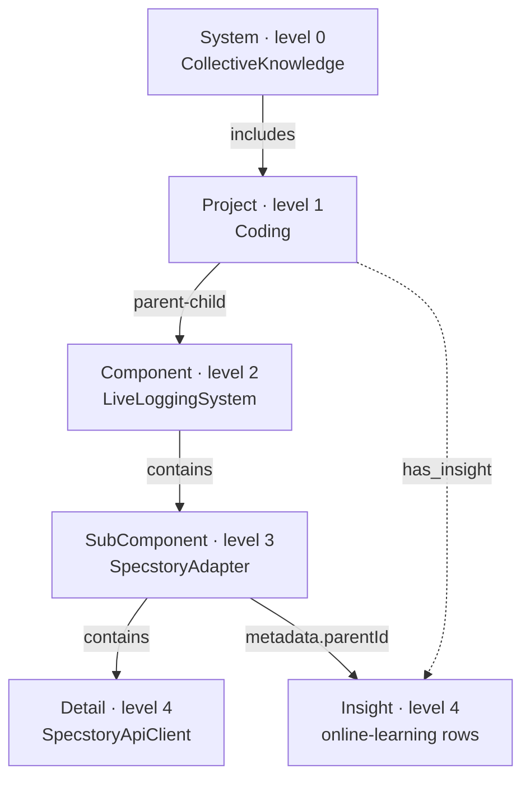
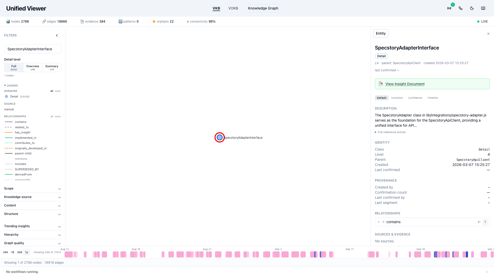
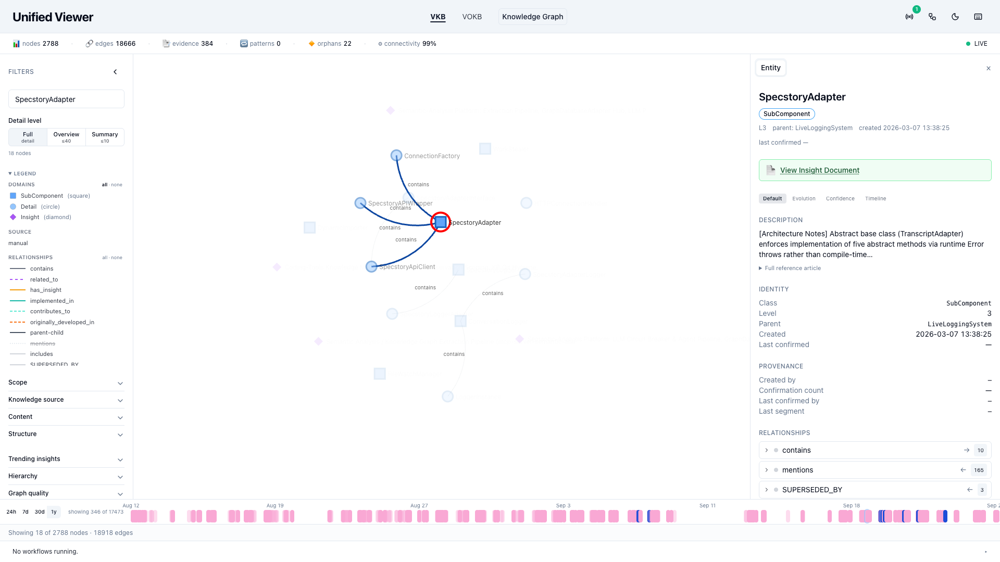
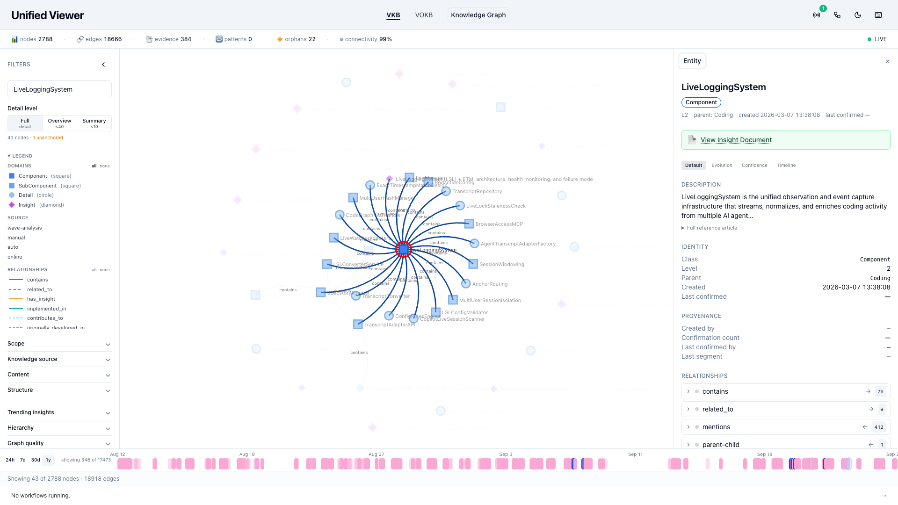
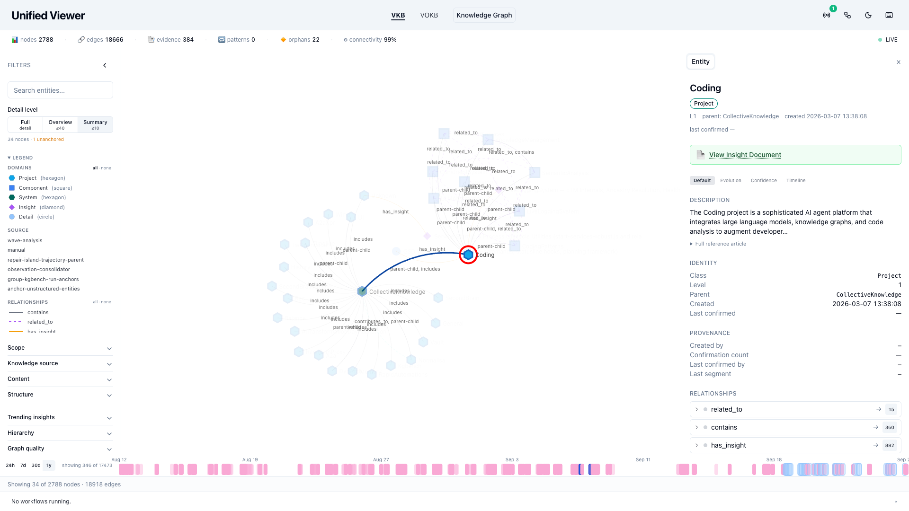
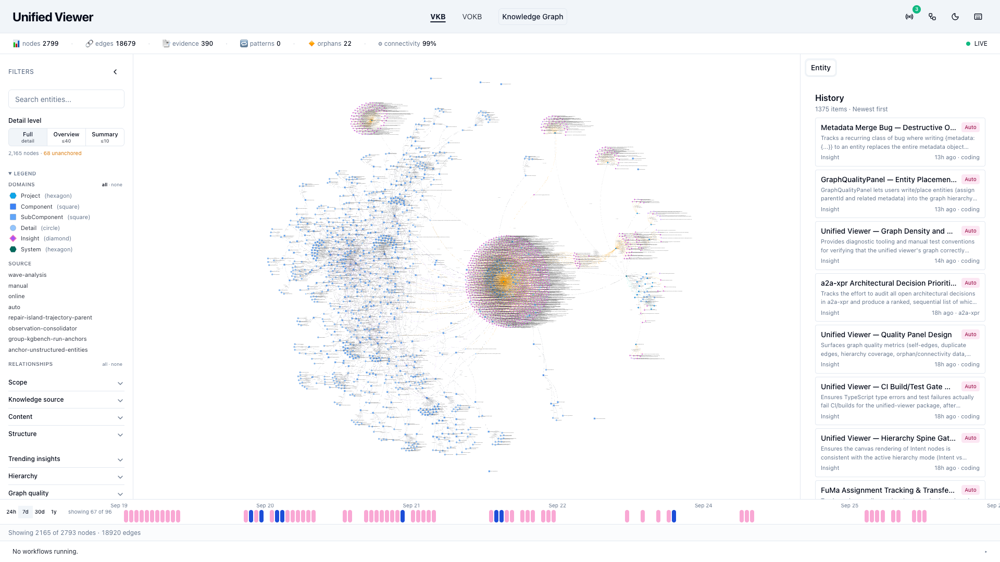
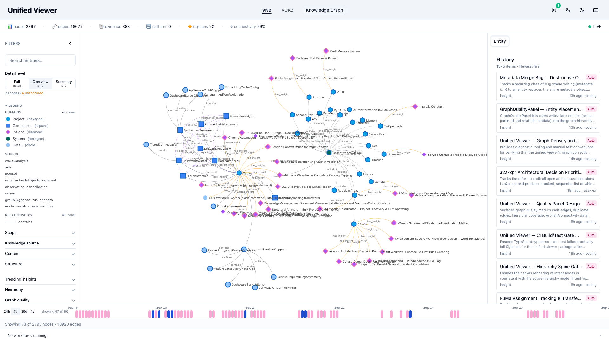
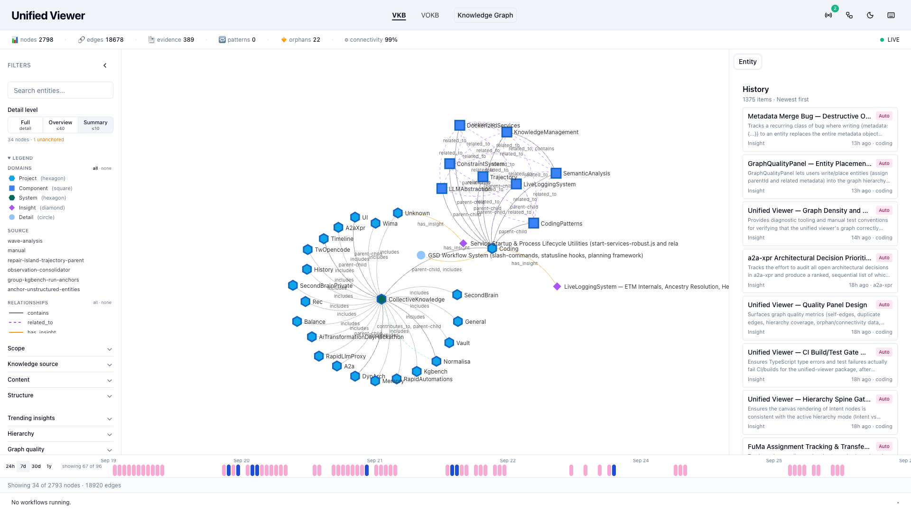

# Reading the Graph Bottom-Up

A walkthrough of the Unified Viewer's two summarization controls, followed end to end on one
real node: how a single `Detail` row at the bottom of the ontology turns into `CollectiveKnowledge`
at the top, and how the **Detail level** control applies that same fold to the whole canvas at once.

**Viewer**: <http://127.0.0.1:5173/viewer/coding> · **Data**: obs-api on `:12436` ·
**Corpus measured**: 2026-09-25 16:34Z, 2,801 entities / 18,696 edges

> The store is live — the ETM writes to it continuously, so the header counts in the screenshots
> drift by a few nodes between captures (2,793 → 2,801 over this session). Every *derived* figure in
> this document comes from one replay at 16:34Z so the tables cannot disagree with each other.

## Overview

The viewer has two ways to ask for less detail, and they are the same movement seen from two ends.

| | Control | Question it answers |
|---|---|---|
| **Vertical** | Walking up a node's parents | "What stands for this row?" |
| **Horizontal** | The **Detail level** segmented control | "Apply that fold to everything." |

Neither one aggregates anything at read time. Both are *filters over structure that already exists
in the graph* — the parent edges (`contains`, `parent-child`, `includes`) and the roll-up markers
(`metadata.rollUpOf`, `metadata.rolledUpInto`) written by the knowledge pipeline. That matters for
trust: nothing you see at Summary was invented for the view.

## The five ontology levels

`HIERARCHY_LEVEL` in `integrations/unified-viewer/src/graph/hierarchy-parents.ts` is the whole
ladder:



`Insight` sits at `Detail`'s level rather than below it — an Insight is a SubComponent's child, not a
Detail's. It was absent from this table until 2026-09-21, which is why the entire online-learning
population (975 Insights, 742 of them under `Coding`) could not participate in the hierarchy at all.

The dashed edge is the fallback. Only 147 Insights carry an explicit `metadata.parentId` naming a
SubComponent; the other 828 have nothing but `has_insight` from their Project. That edge is ranked
*below* every containment edge, so it never displaces a real placement — it just means an unplaced
Insight hangs off its Project instead of falling out of the tree and rendering as an
unattributable dot.

## Part 1 — one node, walked upward

The subject: **`SpecstoryAdapterInterface`**, a `Detail` row describing one class in one file.

### Stop 1 — `SpecstoryAdapterInterface` (Detail)



Search narrows the canvas to a single circle. The panel describes **one class in one file**, and the
`RELATIONSHIPS` block has a single entry: `contains ← 1`. The rail's legend has collapsed to
`Detail (circle)` and source `manual`, because the legend is driven by what is drawn, not by what the
store holds.

The header reads `L4 · parent: SpecstoryApiClient` — depth 4, the bottom of the ladder, and the one
hop this walk is about to take. (Both of those values were `—` until the defect described at the end
of this page was fixed.)

This is the bottom of the ladder: nothing is folded into this row, and it stands for nothing but
itself.

**Stop 2, `SpecstoryApiClient`, is not shown separately** — it is another `Detail`, one hop up, with a
subtree of exactly one (this node). Its description is visibly hedged: *"…although specific
implementation details are not available. The lack of direct source code access limits the ability
[to…]"*. Two `Detail` rows in a row is the ladder marking time; the interesting change is the next
hop.

### Stop 3 — `SpecstoryAdapter` (SubComponent)



Two hops up, the register changes from *file* to *contract*: an abstract base class enforcing five
methods, and a mandatory classification/redaction gate every adapter must route through. The
relationship block is now `contains → 10`, `mentions ← 165`, `SUPERSEDED_BY ← 3`.

### Stop 4 — `LiveLoggingSystem` (Component)



This is the ×30 step, and it is the one you can see. The node sits at the centre of a starburst of
`contains` edges — `contains → 75`, `mentions ← 412` — and the description has stopped naming classes
altogether: it describes a *pipeline*, the four agent backends feeding it, and what it does to their
output. Its subtree is 274 entities: 120 Insights, 100 Details, 54 SubComponents.

### Stop 5 — `Coding` (Project)



At the top of the useful range, `Coding` carries `contains → 373`, `has_insight → 882`,
`parent-child → 9`. The screenshot is taken at **Summary**, which is why the canvas behind it is the
bare backbone — `CollectiveKnowledge` with its `includes` spokes and the highlighted edge down to
`Coding`.

> **Note on the two counts.** The `contains → N` figure in the panel is an *edge* count; the "direct
> children" column above is a *hierarchy* count. They differ because `deriveParents()` gives each
> child exactly one parent — of the ~129 nodes with more than one candidate, only the winning edge
> becomes a tree child — and because `contains` also points at entities outside the hierarchy classes.

Each step up is one hop along the parent pointer that `deriveParents()` chose for it. The
**scope** column is the number of entities in that node's subtree — everything it stands for once
the levels below it are folded away.

| Stop | Node | Class | Direct children | Scope (subtree) | Description length |
|---:|---|---|---:|---:|---:|
| 1 | `SpecstoryAdapterInterface` | Detail | 0 | 0 | 498 ch |
| 2 | `SpecstoryApiClient` | Detail | 1 | 1 | 517 ch |
| 3 | `SpecstoryAdapter` | SubComponent | 6 | 9 | 1,075 ch |
| 4 | `LiveLoggingSystem` | Component | 90 | 274 | 1,364 ch |
| 5 | `Coding` | Project | 230 | 2,002 | 1,516 ch |
| 6 | `CollectiveKnowledge` | System | 24 | 2,105 | 201 ch |

Two things are worth reading off that table.

**Scope grows by roughly an order of magnitude per hop** — 0 → 1 → 9 → 274 → 2,002 → 2,105. The
jump from SubComponent to Component is the steep one (9 → 274, ×30): that is where the viewer stops
describing code and starts describing a subsystem.

**Text does not shrink on the way up — it shrinks per thing covered.** Summarization here is not
"fewer words", it is *a wider referent for the same number of words*:

| Node | Class | Characters per entity covered |
|---|---|---:|
| `SpecstoryApiClient` | Detail | 517 |
| `SpecstoryAdapter` | SubComponent | 119 |
| `LiveLoggingSystem` | Component | 5.0 |
| `Coding` | Project | 0.76 |
| `CollectiveKnowledge` | System | 0.10 |

The `System` row is the giveaway: 201 characters standing for 2,105 entities. It has stopped
describing the corpus and started declaring a policy for it.

### What the descriptions actually say

The register changes at every hop — file, then class contract, then subsystem, then platform, then
charter.

**Detail** — `SpecstoryAdapterInterface`, about one file and one coupling:

> The SpecstoryAdapter class in `lib/integrations/specstory-adapter.js` serves as the foundation for
> the SpecstoryApiClient, providing a unified interface for API interactions. […] The use of the
> SpecstoryAdapterInterface enables loose coupling between the SpecstoryApiClient and […]

**SubComponent** — `SpecstoryAdapter`, about a contract its children must satisfy:

> [Architecture Notes] Abstract base class (`TranscriptAdapter`) enforces implementation of five
> abstract methods via runtime `Error` throws rather than compile-time interfaces, since the codebase
> is plain JS with JSDoc typing; Mandatory classification/redaction schema gate […]

**Component** — `LiveLoggingSystem`, about a pipeline and the agents feeding it:

> LiveLoggingSystem is the unified observation and event capture infrastructure that streams,
> normalizes, and enriches coding activity from multiple AI agent backends (Claude, Copilot,
> OpenCode, Pi) into a persistent knowledge graph. […]

**Project** — `Coding`, about the platform:

> The Coding project is a sophisticated AI agent platform that integrates large language models,
> knowledge graphs, and code analysis to augment developer workflows […]

**System** — `CollectiveKnowledge`, about what is allowed in at all:

> Central hub for high-value, transferable programming patterns. Contains only proven solutions
> applicable across multiple projects. Focus: architectural decisions, performance patterns,
> reusable designs.

## Part 2 — the same fold, applied to the whole canvas

Walking one node upward answers "what stands for this row?" once. The **Detail level** control in the
filter rail answers it for every row at once. It is a segmented control, not a slider: the three
positions are named, discrete and non-linear — *Summary is not "more Overview"*.

Behind it are three boolean flags that already existed in the store. The control composes them; it
does not run a second roll-up pass.

| Level | `hideRolledUp` | `collapseSubComponents` | `aggregatesOnly` | Nodes drawn |
|---|:--:|:--:|:--:|---:|
| **Full** — *every row, nothing folded* | – | – | – | 2,165 |
| **Overview ≤40** — *the default* | ✓ | ✓ | – | 73 |
| **Summary ≤10** | ✓ | ✓ | ✓ | 34 |

`showStale` is `false` at all three levels — rows archived by the ratio-0 sweep ("code claims no
longer exist") are out of the default view everywhere, and reachable in one click from
**Advanced → Content**. This distinction is load-bearing: a *rolled-up* row has a parent standing in
for it, so hiding it loses nothing; a *stale* row has nothing standing in for it, so hiding it under
a checkbox labelled "rolled-up" is how a row disappears and nobody goes looking for it.

### Full — every row, nothing folded



**`2,165 nodes · 68 unanchored`.** This is the audit view, and it is the picture that motivated the
control: complete, correct, and unreadable. Note the legend — `SubComponent (square)` appears here and
is absent at the other two levels, because all 405 of them are folded away the moment you leave Full.

### Overview — where you land



The readout under the control reads **`73 nodes · 6 unanchored`**. `CollectiveKnowledge` sits at the
centre, every `Project` hangs off it by `includes`, and the eight `Component` squares cluster around
`Coding`. At the bottom edge, `SERVICE_ORDER_Contract` is drawn attached to `DashboardServiceWrapper`
— one of the eleven rows placed on 2026-09-25.

### What each flag removes

- **`hideRolledUp`** — hides rows carrying both `archivedAt` and `rolledUpInto`. Their roll-up parent
  is on the canvas in their place.
- **`collapseSubComponents`** — a SubComponent is drawn only while its Component is expanded, and the
  check is *transitive*: a row is hidden when **any** ancestor is a collapsed SubComponent, not only
  its immediate parent. A row whose ancestors contain nothing openable stays visible — hiding it
  would make it invisible *because* nobody placed it, which is the failure this whole view exists to
  surface.
- **`aggregatesOnly`** — keeps only rows that are themselves roll-up parents (non-empty
  `metadata.rollUpOf`), with `System` / `Project` / `Component` exempt so the survivors hang off the
  architecture instead of floating.

### What survives, by class

| Ontology class | Full | Overview | Summary |
|---|---:|---:|---:|
| Insight | 1,021 | 29 | 2 |
| Detail | 708 | 13 | 1 |
| SubComponent | 405 | 0 | 0 |
| Component | 8 | 8 | 8 |
| Project | 22 | 22 | 22 |
| System | 1 | 1 | 1 |
| **Total** | **2,165** | **73** | **34** |

The backbone — 31 rows of `System` + `Project` + `Component` — is **identical at all three levels**.
Every node the control removes is an `Insight`, a `Detail` or a `SubComponent`. That is the whole
mechanism in one table: detail levels fold the *contents*, never the *skeleton*, so the shape of the
graph you learn at Summary is the shape you keep when you zoom in.

That also explains the ≤40 target: at Overview the backbone alone costs 31 of the 40, which is why
the budget is checked **per project against the worst one** rather than store-wide.

### Summary — the skeleton alone



**`34 nodes · 1 unanchored`.** What is left is almost exactly the backbone: `CollectiveKnowledge`
with every `Project` on `includes` spokes, and the `Component` squares above `Coding` on
`parent-child`. Three non-structural rows survive — the two `Insight`s and one `Detail` that are
themselves roll-up parents, which is precisely what `aggregatesOnly` asks for.

Note that `unanchored` fell from 6 to 1: five of the six unanchored rows were folded away by the same
filters, which is why the count is reported next to the level and not as a fixed store statistic.

## Part 3 — what refuses to fold

Under the node readout sits a second number in amber: **unanchored**. Those are rendered rows with no
`Project` or `System` anywhere above them — and they are the one population no detail level can help
with, because folding is a walk up the parent pointers and these rows have none.

Live figures for the same snapshot:

```
rendered      73 nodes · 85 edges        worst project: Coding 30 / 40
unanchored     6
  wrongClass   1   a Project claims it via has_insight, but it is not classed
                   Insight, so the tree refuses the edge — an ontology decision
  danglingRef  5   the edge that should place it points at an entity not in the
                   store; placing the child would hide the break
  recordedParent 0 (was 11 — see below)
  unclaimed    0
```

The density gate fails on `worst.nodes > 40 || unrooted > 0` — note the **or** — so this snapshot reports
`overBudget: true` with `overBy: 0` — every project is comfortably inside 40 and the failure is
entirely the six unanchored rows. That asymmetry is deliberate: an unanchored row is invisible in the
tree at every detail level, so it would otherwise fail silently.

**Graph quality** in the filter rail names each category and, for the one category that is safely
automatable, offers a single action. On 2026-09-25 the `recordedParent` bucket held 11 rows whose
writer had named a parent in `metadata.parentId` that nothing read; one click placed all 11 and the
unanchored count went **17 → 6**. The two remaining categories are deliberately *not* auto-fixable —
one needs an ontology decision, the other would hide a broken reference.

### Found while writing this walkthrough: the panel's `Parent` row was dead

The first draft of this page was illustrated with screenshots showing `Parent: —` and `Level: —` in
the entity panel's `IDENTITY` block — for the `Detail` leaf, for the `SubComponent`, for the
`Component`, and for `Coding` itself. That was not a property of those four rows.
`EntityDetailPanel.tsx` rendered `entity.parent` and `EntityIdentityHeader.tsx` rendered
`entity.level`, and measured against the live store:

| Field | Entities carrying it (of 2,801) | Who read it |
|---|---:|---|
| `entity.parent` | **0** | the panel's `Parent` row, the header's `parent:` chip |
| `entity.level` | **0** | the panel's `Level` row, the header's `L{n}` chip |
| `metadata.parent` | **0** | nobody (was `HierarchyNavigator`, fixed earlier) |
| `metadata.parentId` | **845** | `deriveParents()`, the tree, the canvas |

So those slots could only ever print `—`, for every row, in every session. It is the same bug
already fixed once in `HierarchyNavigator` — which read `metadata.parent`, set on 0 of 2,441
entities, and therefore rendered the project tree as ~1,341 siblings. The fix there was to stop
reading a stored field and derive the parent from edges; the two panels were never migrated with it.

**Fixed on 2026-09-26.** Both render sites now fall back to `graph/hierarchy-identity.ts`, which
reads the store's `hierarchyParents` map — the one `deriveParents()` writes and the canvas collapses
by, so the panel cannot name a parent the canvas draws no edge to. `Level` became **ontology depth**
(System 0 … Detail/Insight 4) rather than the dead 0–3 layer field. The screenshots above are the
post-fix ones: the `Detail` leaf reads `L4 · parent: SpecstoryApiClient`, the `SubComponent`
`L3 · parent: LiveLoggingSystem`, and `Coding` `L1 · parent: CollectiveKnowledge`.

Two details worth keeping:

- A stored field still wins, so a row that one day carries a real `parent` is not overridden by the
  derived one. Today nothing does.
- A parent the store does not hold renders as its **id**, not as `—`. "Broken reference" and "is a
  root" are different facts, and there are 5 `danglingRef` rows where confusing them would hide the
  break.

The regression test is the shape no earlier test used: an entity with neither field set. Every
pre-existing case passed a synthetic entity that *did* carry `level` and `parent`, which is exactly
why a suite of 1,043 green tests never saw this.

## Reproducing these numbers

The node counts in this document are not read off a screenshot — they come from the same predicate the
canvas draws with, replayed over the live store:

```bash
cd integrations/unified-viewer

# The default (Overview) view, as JSON
npx vite-node scripts/assert-graph-density.ts --json

# Any other level
GRAPH_DETAIL_LEVEL=full    npx vite-node scripts/assert-graph-density.ts
GRAPH_DETAIL_LEVEL=summary npx vite-node scripts/assert-graph-density.ts
```

The script imports `isEntityVisible` and `deriveParents` rather than reimplementing them, so it can
only disagree with the canvas if the canvas itself changed. It seeds the store's own
`DETAIL_LEVEL_FLAGS` table and `hierarchySpine: 'code'` — the rail's default tree. Omitting that last
field is what once made the replay report 75 nodes against a canvas showing 73.

It exits non-zero when `worst project > 40 || unrooted > 0`, so a density regression fails a check
instead of waiting to be noticed on a screenshot.

## Source map

Paths are relative to `integrations/unified-viewer/`.

| Concern | File |
|---|---|
| The ladder (`System`…`Insight`) and parent ranking | `src/graph/hierarchy-parents.ts` |
| The three flags and what each removes | `src/graph/visibility-predicate.ts` |
| Preset table + `deriveDetailLevel()` | `src/store/viewer-store.ts` |
| The segmented control and its copy | `src/panels/filters/DetailLevel.tsx` |
| Unanchored categories | `src/graph/attribution.ts` |
| The panel that names and fixes them | `src/panels/GraphQualityPanel.tsx` |
| Replayable node count | `scripts/assert-graph-density.ts` |

## See also

- [Ontology](../core-systems/ontology.md) — what each class is allowed to mean
- [UKB & VKB](../core-systems/ukb-vkb.md) — where the entities this view folds come from
- [Knowledge Workflows](knowledge-workflows.md) — the pipeline that writes them
