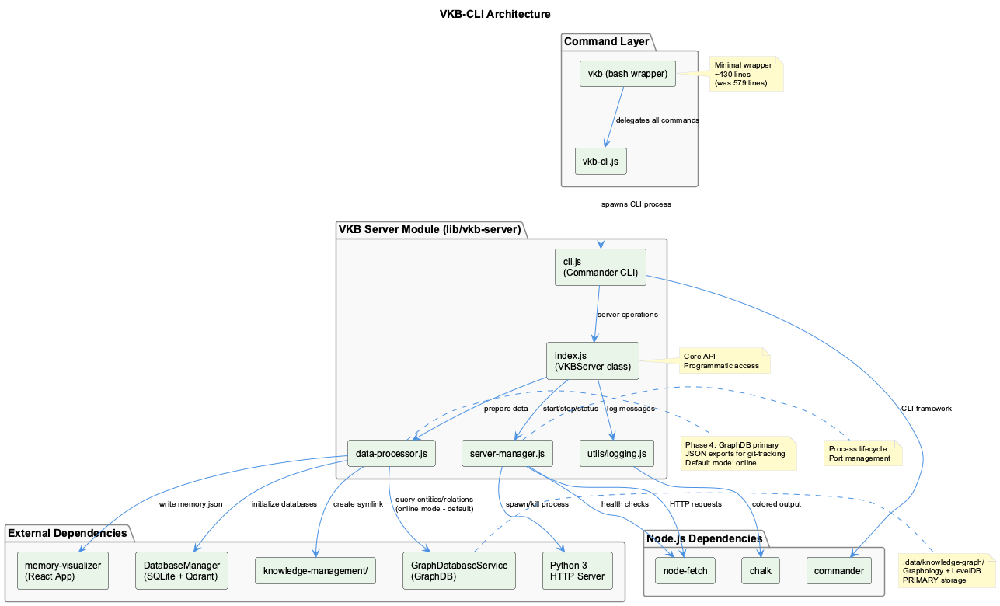
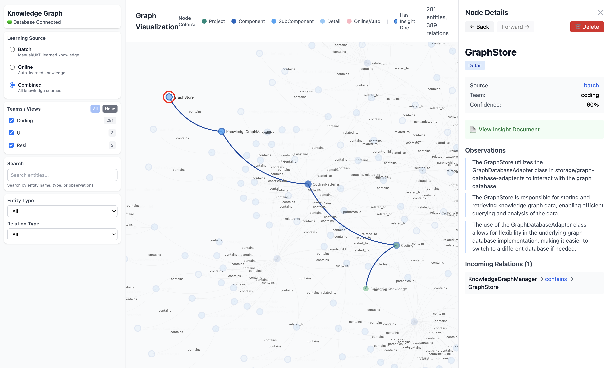
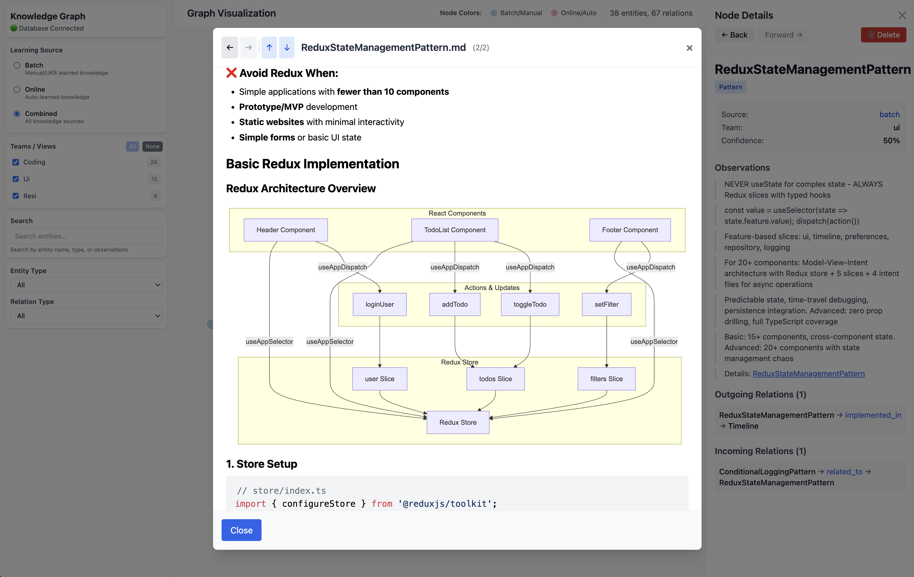
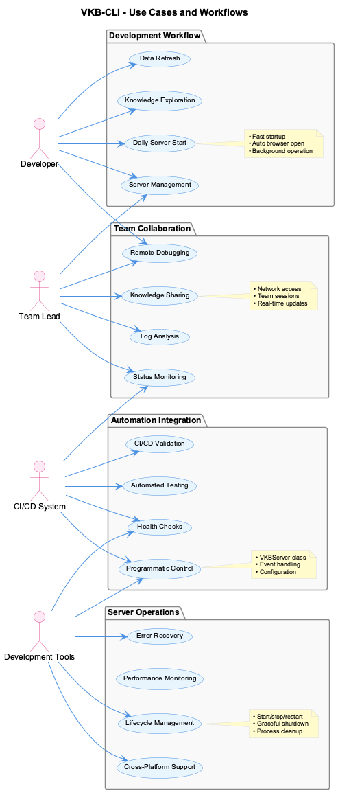

# VKB Visualization Guide

Interactive knowledge graph visualization and exploration.



## Overview

VKB (Visualize Knowledge Base) is a cross-platform knowledge visualization server that provides interactive web-based exploration of knowledge graphs. It offers comprehensive server lifecycle management, real-time data updates, and programmatic control.

### Key Features

- **Interactive Visualization**: Explore knowledge graphs in browser
- **Server Management**: Start, stop, restart with automatic recovery
- **Real-time Updates**: Refresh data without restart
- **Health Monitoring**: Automatic health checks and status reporting
- **Cross-Platform**: Works on Windows, macOS, and Linux
- **Programmatic API**: Control server from Node.js code

### Visualization Screenshots






---

## Quick Reference

### Basic Commands

```bash
# Start visualization server (default command)
vkb
vkb start

# Stop server gracefully
vkb stop

# Restart server
vkb restart

# Check server status
vkb status

# View server logs
vkb logs

# Start in foreground for debugging
vkb fg

# Check what's using the port
vkb port
```

### Access Visualization

Once started, visualization is available at:

```
http://localhost:8080
```

Server automatically opens browser on startup (disable with `--no-browser`)

---

## Usage Modes

### 1. Background Server (Default)

```bash
vkb start
```

**What it does:**

- Starts server in background
- Opens browser automatically
- Runs as daemon process
- PID tracked for management
- Logs to `/tmp/vkb-server.log`

**Use when:**

- Daily development sessions
- Long-running visualization access
- Team knowledge sharing
- Production-like deployment

### 2. Foreground Mode

```bash
vkb fg
vkb foreground
```

**What it does:**

- Runs server in foreground
- Logs output to console
- Blocks terminal
- Useful for debugging

**Use when:**

- Debugging server issues
- Development and testing
- Monitoring real-time logs
- Troubleshooting startup problems

### 3. Server Management

```bash
# Check status
vkb status --json --verbose

# View logs
vkb logs -n 100 --follow

# Check port usage
vkb port --kill

# Force restart
vkb stop --force && vkb start
```

---

## Server Lifecycle



### Startup Sequence

1. **Pre-startup Validation**
   - Environment dependency checking (Node.js, Python 3)
   - Project structure validation
   - Port availability verification
   - Existing process detection

2. **Data Preparation**
   - Knowledge base loading and parsing
   - Format conversion (JSON to NDJSON)
   - Symlink creation for file serving
   - Asset verification

3. **Server Initialization**
   - HTTP server process spawning
   - PID tracking and management
   - Health verification
   - Browser integration (optional)

4. **Runtime Monitoring**
   - Process health checks
   - Log monitoring
   - Error detection and recovery
   - Resource usage tracking

### Shutdown Sequence

1. **Graceful Termination**
   - Server process signaling (SIGTERM)
   - Connection draining
   - Resource cleanup
   - PID file removal

2. **Forced Cleanup**
   - Process termination (SIGKILL if needed)
   - Port release verification
   - Temporary file cleanup
   - Log file finalization

---

## Data Management

### Real-time Data Refresh

```bash
# Refresh data without restarting server
vkb-cli data refresh

# Validate data integrity
vkb-cli data validate

# Export data in various formats
vkb-cli data export --format json --output kb-export.json
```

### Workflow Integration

```bash
# Knowledge capture happens via:
# 1. Continuous Learning (automatic during coding)
# 2. MCP Semantic Analysis (type "ukb" in Claude chat)

# Refresh visualization after knowledge updates
vkb-cli data refresh

# Or restart for comprehensive refresh
vkb restart
```

---

## HTTP API Endpoints

When running, VKB exposes HTTP endpoints for integration:

### Health Check

```bash
curl http://localhost:8080/health
```

**Response:**
```json
{
  "status": "healthy",
  "uptime": 135000,
  "version": "2.0.0",
  "timestamp": "2025-06-20T10:30:00.000Z"
}
```

### Server Status

```bash
curl http://localhost:8080/api/status
```

**Response:**
```json
{
  "running": true,
  "pid": 12345,
  "port": 8080,
  "memory": {
    "rss": 47284224,
    "heapTotal": 32768000,
    "heapUsed": 18234000
  }
}
```

### Knowledge Base Info

```bash
curl http://localhost:8080/api/kb/info
```

**Response:**
```json
{
  "entities": 45,
  "relations": 123,
  "lastUpdated": "2025-06-20T10:25:00.000Z"
}
```

### Data Refresh

```bash
curl -X POST http://localhost:8080/api/kb/refresh
```

**Response:**
```json
{
  "success": true,
  "entities": 45,
  "relations": 123,
  "duration": 1250
}
```

---

## Programmatic API

### VKBServer Class

```javascript
const { VKBServer } = require('vkb-server');

// Create server instance
const server = new VKBServer({
  port: 8080,
  projectRoot: process.cwd(),
  logLevel: 'info',
  autoRestart: true
});

// Start server
await server.start({
  foreground: false,
  openBrowser: true
});

// Get server status
const status = await server.status();
// Use status.port for debugging

// Refresh data
const result = await server.refreshData();
// result.entities and result.relations available

// Health check
const health = await server.healthCheck();
if (!health.healthy) {
  // Handle unhealthy server
}

// View logs
const logs = await server.logs({ lines: 100, level: 'error' });

// Stop server
await server.stop();
```

### Event Handling

```javascript
server.on('starting', () => {
  // Server is starting
});

server.on('started', (result) => {
  // Server started at result.url
});

server.on('stopped', (result) => {
  // Server stopped, result.pid available
});

server.on('error', (error) => {
  // Handle error
});

server.on('health-check', (result) => {
  if (!result.healthy) {
    // Health check failed
  }
});
```

---

## Common Use Cases

### 1. Daily Development Session

```bash
# Start development session
cd /path/to/project
vkb start

# Server starts, opens browser automatically
# Developer explores knowledge graph throughout day

# End of day
vkb stop
```

### 2. Knowledge Base Updates

```bash
# Capture new insights (in Claude chat)
# Type: "ukb"

# Refresh without restart
vkb-cli data refresh

# Or full restart
vkb restart
```

### 3. Debugging and Troubleshooting

```bash
# Start in foreground for debugging
vkb fg --debug

# Monitor logs in real-time
vkb logs --follow

# Check port conflicts
vkb port

# Check health status
vkb status --verbose

# Force restart if needed
vkb stop --force && vkb start
```

### 4. Multi-Project Development

```bash
# Project A
cd /path/to/project-a
vkb start --port 8080

# Project B (different port)
cd /path/to/project-b
vkb start --port 8081

# Check both servers
vkb-cli server status --all

# Access in browser
open http://localhost:8080  # Project A
open http://localhost:8081  # Project B

# Cleanup
vkb-cli server stop --all
```

### 5. Team Knowledge Sharing

```bash
# Presenter starts server
vkb start

# Allow network access
vkb-cli config set host 0.0.0.0
vkb restart

# Team accesses via network: http://presenter-ip:8080

# Refresh with latest insights during session
vkb-cli data refresh

# Generate sharing report after session
vkb-cli server logs --since "1 hour ago" > session-log.txt
vkb-cli data export --format json --output session-knowledge.json
```

---

## Configuration

### Environment Variables

```bash
# Default server port
export VKB_PORT=8080

# Project root directory
export VKB_PROJECT_ROOT=/path/to/project

# Logging level
export VKB_LOG_LEVEL=info

# Enable auto-restart
export VKB_AUTO_RESTART=true

# Disable automatic browser opening
export VKB_NO_BROWSER=true
```

### Configuration File

Create `.vkbrc` in project root:

```json
{
  "port": 8080,
  "logLevel": "info",
  "autoRestart": true,
  "healthCheckInterval": 30000,
  "browser": {
    "enabled": true,
    "command": "open"
  },
  "server": {
    "host": "localhost",
    "workers": 1
  }
}
```

---

## Troubleshooting

### Common Issues

```bash
# Port already in use
vkb port --kill
vkb start

# Server not responding
vkb stop --force
vkb start

# Data not updating
vkb-cli data refresh

# Permission issues
sudo vkb start  # or fix file permissions

# Check logs for errors
vkb logs --level error
```

### Debug Mode

```bash
# Start with debug logging
vkb fg --debug

# Check detailed status
vkb status --json --verbose

# Monitor health
watch -n 5 'vkb status'
```

---

## Related Documentation

- [UKB - Update Knowledge Base](knowledge-workflows.md)
- [Core Systems: UKB/VKB](../core-systems/ukb-vkb.md)
- [Knowledge Management Overview](../architecture/data-flow.md)
