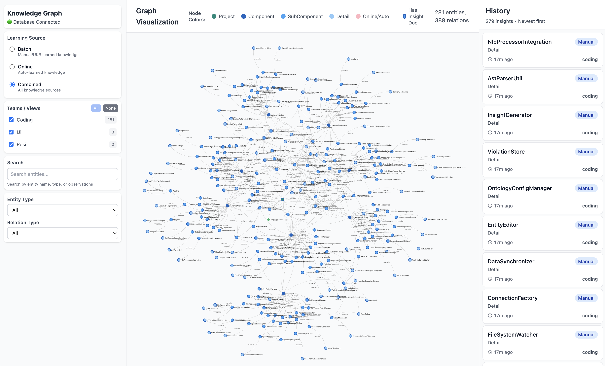
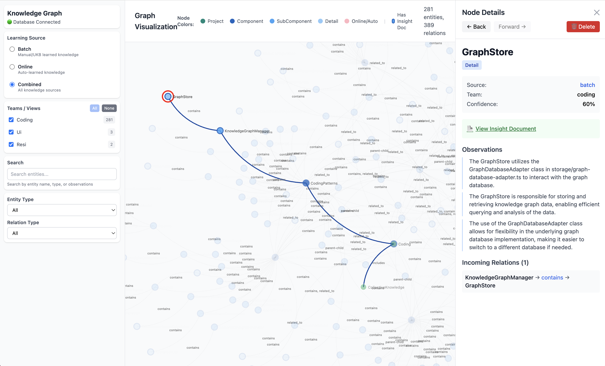
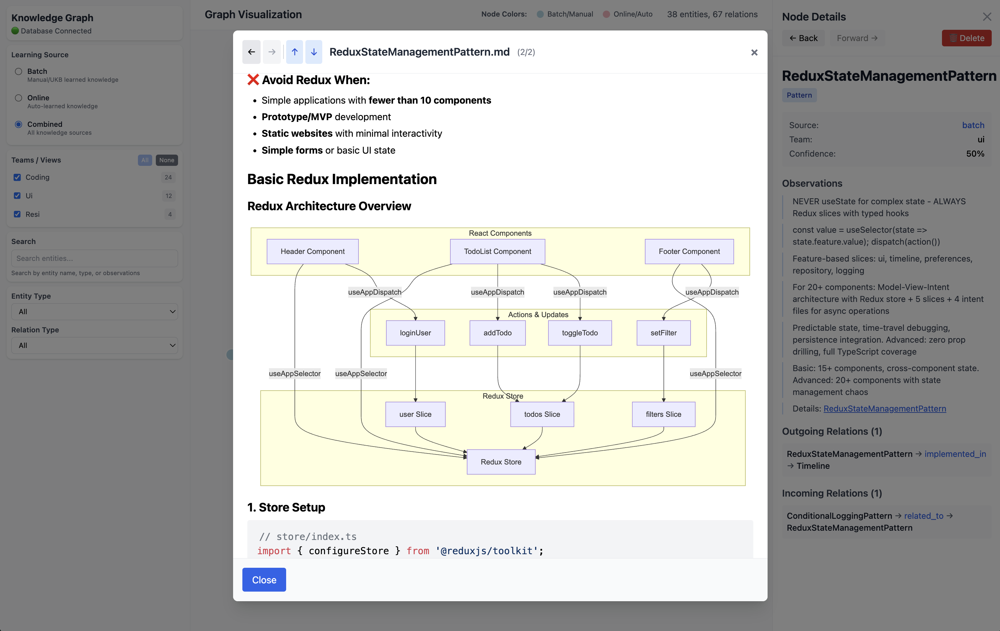

# VKB Visualization

The knowledge graph, in a browser — how to run the viewer, drive it from a script, and
fix it when it will not start.

=== "⚡ Quick (~3 min)"

    ## Open it

    ```bash
    vkb
    ```

    That starts the server and opens [localhost:8080](http://localhost:8080). Add `--no-browser`
    to skip the browser.

    ## The commands

    ```bash
    vkb start        # same as bare `vkb`
    vkb status       # is it running
    vkb stop         # graceful shutdown
    vkb restart      # stop, then start
    vkb logs         # server logs
    vkb fg           # run in the foreground, for debugging
    vkb port         # what is holding the port
    ```

    ## What you see

    

    Entities laid out as a graph, filterable by type, team and learning source. Click a node for
    its details — type, source, confidence, observations and relations — and where an entity has
    a full insight document, a button opens it as rendered markdown with diagrams and code.

    ## If it will not start

    ```bash
    vkb port     # something else on 8080?
    vkb logs     # what did it say
    vkb fg       # run in the foreground and watch it fail
    ```

    `vkb fg` is the one that actually tells you why — the others report that it failed, not what
    happened.

=== "📖 Standard (~15 min)"

    ## What VKB is

    A cross-platform server that renders the knowledge graph for interactive exploration, with
    its own lifecycle management, health checks and a programmatic API for driving it from code.

    

    ## Exploring the graph

    

    The graph view filters by entity type, by team, and by learning source — which matters more
    than it sounds, because it separates knowledge from the deliberate extraction pass from
    knowledge picked up continuously during sessions. Being able to view either alone, or both
    together, is what lets you tell "the system worked this out while I was working" from "the
    extraction pass concluded this".

    Selecting a node opens its details: type, source, team, confidence score, the observations
    behind it, and its incoming relations. Confidence is worth attending to — a low-confidence
    entity is a hypothesis, not a fact.

    Entities that carry a full insight document open it in an overlay, rendered as markdown with
    diagrams and code blocks intact.

    

    ## Running the server

    ```bash
    vkb              # start and open a browser
    vkb start        # the same
    vkb status       # running or not
    vkb restart      # bounce it
    vkb stop         # graceful shutdown
    ```

    The server recovers automatically from most failures and refreshes its data without needing a
    restart, so a stale-looking graph is usually a browser cache rather than a stopped server.

    ## Driving it from code

    There is a programmatic API for starting, stopping and querying the server from Node, which
    is what to use when a script needs the graph rather than a person. It exposes the same
    lifecycle operations as the CLI plus HTTP endpoints for the data itself, so a script can pull
    entities directly instead of scraping the page.

    ## When it will not come up

    ```bash
    vkb port    # is something already on 8080
    vkb logs    # the recorded failure
    vkb fg      # run in the foreground and watch it happen
    ```

    Work down that list in order. `vkb port` catches the common case — a previous instance that
    did not exit — and `vkb fg` is the one that shows you an actual stack trace rather than a
    report that startup failed.

=== "📚 Deep Dive (full)"

    --8<-- "_tiers/guides/vkb-visualization.deep.md"
