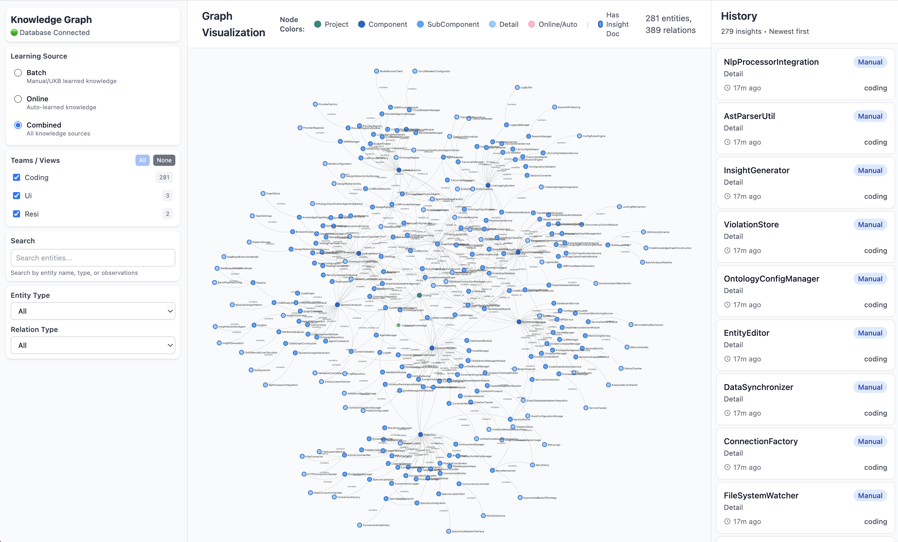
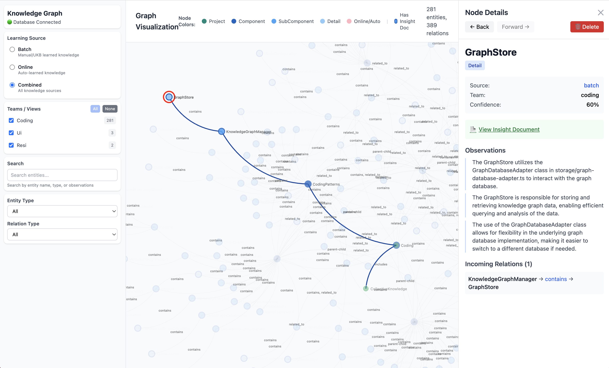

# VKB Visualization

The knowledge graph in a browser — how to open the viewer, what it shows, and what to check
when it shows nothing.

=== "⚡ Quick (~3 min)"

    ## Open it

    ```bash
    vkb
    ```

    That opens [127.0.0.1:12436/viewer/coding](http://127.0.0.1:12436/viewer/coding). The
    first run builds the viewer (about half a minute); after that it opens at once.

    ```bash
    vkb okb          # the operational knowledge base (VOKB) instead
    vkb --no-open    # just print the URL
    vkb --build      # rebuild, e.g. after changing the viewer's sources
    ```

    `vkb` needs the `knowledge` feature (the `learning` tiers). There is no server to start or
    stop: obs-api — always running with a learning tier — serves the viewer.

    ## What you see

    

    Entities as a graph — projects, components, insights, details — filterable by team, type,
    learning source and detail level. Click a node for its details and relations; where an
    entity has a full insight document, a button opens it rendered, with diagrams.

    ## Teams

    The **Teams / Views** rail on the left starts from the selection in **Dashboard → Teams**
    and changes it both ways. See [Teams & Shared Learning](teams.md).

=== "📖 Standard (~15 min)"

    ## How it is served

    The viewer is a static single-page app (`integrations/unified-viewer`). `vkb`:

    1. checks the `knowledge` feature is on (`coding-features status`);
    2. builds the app if `dist/` is missing or older than any of its sources — dependencies are
       installed first if needed; the build log is `.logs/vkb-build.log`;
    3. checks obs-api answers on `:12436`;
    4. opens `http://127.0.0.1:12436/viewer/<system>` (macOS `open`, Linux `xdg-open`, WSL
       `wslview`; otherwise it prints the URL).

    obs-api serves the build under `/viewer/` and every viewer route falls back to the app's
    shell; the app reads the graph from the same obs-api. The installer builds the viewer once
    for `learning` tiers, so the first `vkb` is usually instant.

    ## Exploring the graph

    

    | Panel | Does |
    |---|---|
    | Filters (left) | search, detail level (Full · Overview · Summary), legend, teams / projects / views, ontology class, source |
    | Canvas | the graph; drag to pan, scroll to zoom, click a node to select it |
    | Entity / History (right) | the selected node's details, or the newest insights |
    | Timeline (bottom) | when knowledge was learned; click a bar to jump to it |

    [Reading the Graph](viewer-detail-levels.md) explains the detail levels.

    ## When it shows nothing

    | Symptom | Check |
    |---|---|
    | "This command needs the 'knowledge' feature" | `coding-features set knowledge on` (or a learning tier) |
    | `obs-api is not answering on :12436` | `curl -s localhost:12436/health`; Dashboard → Health |
    | "The knowledge viewer has not been built yet" | `vkb --build`; the log is `.logs/vkb-build.log` |
    | "Showing 0 of 0 nodes" for a long time | `curl -s 'localhost:12436/api/v1/entities?limit=1'` — is the store hydrated? |
    | Old UI after an update | `vkb --build` |

    ## Developing the viewer

    ```bash
    cd integrations/unified-viewer
    npm run dev            # http://127.0.0.1:5173/viewer/coding, hot reload
    npm test               # vitest
    ```

    The dev server reads the same obs-api; `vkb --build` produces what everyone else sees.

=== "📚 Deep Dive (full)"

    --8<-- "_tiers/guides/vkb-visualization.deep.md"
