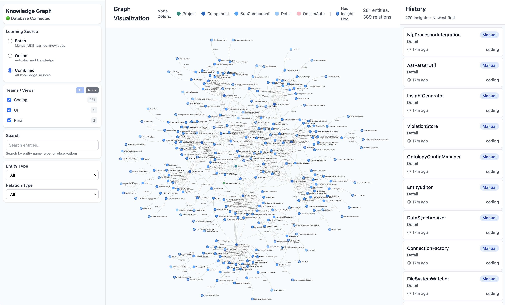
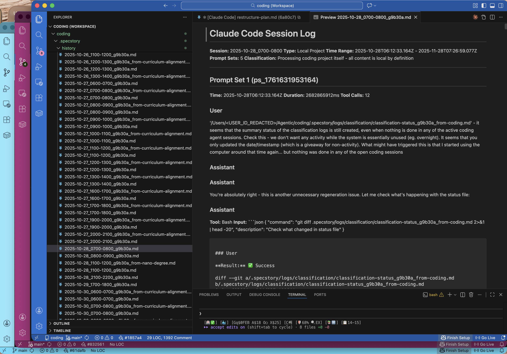
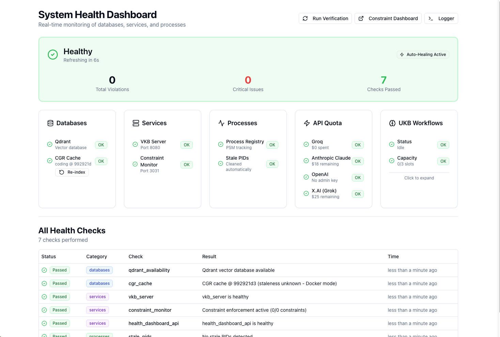

# Coding

**A self-learning experience layer for AI coding assistants**

Coding wraps around your AI coding assistant to capture conversations, build knowledge, prevent mistakes, and track progress - creating a continuously improving development environment.



---

## What is Coding?

Coding is an infrastructure layer that enhances AI coding assistants by:

- **Capturing everything** - Automatic session logging of all prompts, tool calls, and responses
- **Learning from experience** - Build a knowledge base from your coding history and conversations
- **Preventing mistakes** - Constraint system stops errors before they happen
- **Tracking progress** - Real-time trajectory detection and status feedback


---

## Key Features

### Live Session Logging (LSL)

Every conversation is captured automatically with intelligent 5-layer classification that routes content between projects.



- Real-time monitoring with zero data loss
- Automatic redaction of secrets and credentials
- Multi-project support with foreign session tracking
- Configurable time-based slots (hourly files)

[Learn more about LSL](core-systems/lsl.md){ .md-button }

---

### Knowledge Management (UKB/VKB)

A 14-agent AI system extracts insights from your git history and conversation logs, building a searchable knowledge graph.


**Update Knowledge Base (UKB)**:
```bash
ukb           # Incremental update from last checkpoint
ukb full      # Full analysis from first commit
ukb debug     # Single-stepping with mocked LLM
```

**View Knowledge Base (VKB)**:
```bash
vkb           # Opens http://localhost:8080
```

[Learn more about Knowledge Management](core-systems/ukb-vkb.md){ .md-button }

---

### Constraint System

20+ configurable constraints enforce code quality via PreToolUse hooks - preventing mistakes before they happen.


- Real-time violation detection and blocking
- Web dashboard for monitoring and configuration
- Per-project constraint configuration
- Auto-correction suggestions

[Learn more about Constraints](core-systems/constraints.md){ .md-button }

---

### Health Monitoring

4-layer watchdog architecture ensures system reliability with automatic recovery.



- Process health monitoring with automatic restart
- Service lifecycle management
- Multi-agent workflow visualization
- LLM call tracing (tokens, duration, costs)

[Learn more about Health Monitoring](architecture/health-monitoring.md){ .md-button }

---

### Status Line

Real-time feedback via the unified tmux status bar showing system health, costs, and development state. All coding agents (Claude, CoPilot, etc.) are wrapped in tmux sessions with a shared status line rendered by `combined-status-line.js`.


| Indicator | Meaning |
|-----------|---------|
| Health icons | Service status (green/red) |
| Cost display | API usage tracking |
| Trajectory | Current development phase |
| LSL status | Logging window and routing |

[Learn more about Status Line](guides/status-line.md){ .md-button }

---

## Quick Start

```bash
# Clone and install (Docker mode is default)
git clone --recurse-submodules https://github.com/fwornle/coding ~/Agentic/coding
cd ~/Agentic/coding && ./install.sh

# Reload shell
source ~/.bashrc  # or ~/.zshrc

# Start coding with all features
coding

# View your knowledge graph
vkb
```


[Full Installation Guide](getting-started/index.md){ .md-button .md-button--primary }

---

## Design Principles

| Principle | Description |
|-----------|-------------|
| **Agent-Agnostic** | Designed for any AI assistant — Claude and CoPilot fully supported, others follow the same pattern |
| **Non-Intrusive** | Docker deployment keeps your system clean |
| **Provider Flexible** | Works with Anthropic, OpenAI, Groq, and local LLMs (DMR/llama.cpp) |
| **Multi-Project** | Handle multiple projects with automatic context routing |
| **Multi-Developer** | Session logs tagged per user for collaboration |
| **Self-Healing** | 4-layer monitoring with automatic recovery |

---

## Feature Status

| Feature | Status | Description |
|---------|--------|-------------|
| Live Session Logging | :material-check-circle:{ .green } Production | Full session capture with 5-layer classification |
| Knowledge Base (UKB) | :material-check-circle:{ .green } Production | 14-agent knowledge extraction system |
| Knowledge Viewer (VKB) | :material-check-circle:{ .green } Production | Graph visualization and exploration |
| Constraint System | :material-check-circle:{ .green } Production | 20+ constraints with web dashboard |
| Health Monitoring | :material-check-circle:{ .green } Production | 4-layer watchdog architecture |
| Status Line | :material-check-circle:{ .green } Production | Real-time terminal feedback |
| Online Learning | :material-progress-clock:{ .yellow } Beta | Continuous learning without manual UKB |
| Trajectory Detection | :material-progress-clock:{ .yellow } Beta | Real-time goal and deviation tracking |

---

## MCP Integrations

Coding provides several MCP (Model Context Protocol) servers:

| Integration | Purpose |
|-------------|---------|
| [Semantic Analysis](integrations/semantic-analysis.md) | 14-agent AI-powered code analysis |
| [Constraint Monitor](integrations/constraint-monitor.md) | Real-time violation detection |
| [Browser Access](integrations/browser-access.md) | Stagehand browser automation |
| [Code Graph RAG](integrations/code-graph-rag.md) | AST-based code search via Memgraph |
| [Serena](integrations/serena.md) | Advanced code navigation |

---

## Documentation

<div class="grid cards" markdown>

-   :material-rocket-launch:{ .lg .middle } **Getting Started**

    ---

    Installation, configuration, and first steps

    [:octicons-arrow-right-24: Get started](getting-started/index.md)

-   :material-cog:{ .lg .middle } **Core Systems**

    ---

    LSL, UKB/VKB, Constraints, Trajectories

    [:octicons-arrow-right-24: Explore](core-systems/index.md)

-   :material-puzzle:{ .lg .middle } **Integrations**

    ---

    MCP servers and external tools

    [:octicons-arrow-right-24: View integrations](integrations/index.md)

-   :material-book-open-variant:{ .lg .middle } **Guides**

    ---

    Deep-dive tutorials and workflows

    [:octicons-arrow-right-24: Read guides](guides/index.md)

</div>
