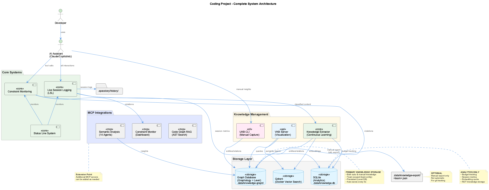

# Coding

**A self-learning experience layer for AI coding assistants** — it captures your sessions,
builds knowledge from them, and stops known mistakes before they happen.

=== "⚡ Quick (~3 min)"

    ## In one paragraph

    Coding wraps whichever AI coding assistant you use — Claude Code, Copilot CLI, OpenCode or
    Pi — in a shared environment that records every session, extracts durable knowledge from that
    history, blocks known mistakes at the moment a tool is called, and reports what it all cost.
    The assistant is replaceable; the environment around it is the point.

    ## Install and run

    ```bash
    git clone --recurse-submodules https://github.com/fwornle/coding ~/Agentic/coding
    cd ~/Agentic/coding && ./install.sh
    source ~/.zshrc          # or ~/.bashrc
    coding                   # launches Claude Code with everything wired up
    ```

    ## What you get

    | Feature | What it does for you |
    |---------|----------------------|
    | Live Session Logging | Records every prompt, tool call and response, secrets redacted |
    | Knowledge Management | Turns that history into a searchable graph — `vkb` to look at it |
    | Constraints | Blocks a bad tool call before it runs, with a suggested fix |
    | Health Monitoring | Supervises the services and restarts what dies |
    | Status Line | Health, cost and logging state, live in your tmux bar |
    | Multi-agent support | The same environment for Claude, Copilot, OpenCode and Pi |

    ## Where to go next

    `coding --health` should come back all green. If it does, read
    [Getting Started](getting-started/index.md); if it does not, go straight to
    [Verify & Repair](getting-started/verify-repair.md).

=== "📖 Standard (~15 min)"

    ## What the layer actually does

    Coding is infrastructure that sits around an AI coding assistant rather than inside it. It
    does four things, and they compound: it **captures** every session, **learns** from the
    accumulated history, **prevents** repeats of known mistakes, and **measures** what the work
    costs.

    

    ## Capture, learn, prevent

    **Live Session Logging** records every conversation automatically into
    `.specstory/history/`, classifying content so that work touching several projects is routed
    to the right one, and redacting secrets on the way through. Nothing is asked of you.

    **Knowledge Management** turns that history, plus your git log, into a knowledge graph via a
    14-agent extraction pass:

    ```bash
    semantic workflow run wave-analysis --team coding   # the extraction pass, async, 10-20 min
    semantic workflow status                            # how far it has got
    vkb                                                 # browse the result at :8080
    ```

    **Constraints** run as PreToolUse hooks, so a violating call is stopped *before* execution
    rather than reported afterwards. Twenty-odd rules ship configured; the dashboard at
    `localhost:3030` shows what fired and why.

    **Health monitoring** supervises the services in layers, restarting what dies, and surfaces
    the result both at `localhost:3032` and in the tmux status bar.

    ## Any agent, one environment

    Claude Code is the default, but nothing above is specific to it:

    | Agent | Launch |
    |-------|--------|
    | Claude Code (default) | `coding` or `coding --claude` |
    | GitHub Copilot CLI | `coding --copilot` |
    | OpenCode | `coding --opencode` |
    | Pi | `coding --pi` |

    All four share the same tmux wrapping, status line, health monitoring, session logging,
    knowledge base and constraint enforcement. Adding a fifth is a single config file in
    `config/agents/` — see the [Agent Integration Guide](guides/agent-integration.md).

    Always launch through `coding`. A bare `claude` session still works, but it is invisible to
    token accounting because the adapters that capture it are installed per launch.

    ## Everyday commands

    | Command | Does |
    |---------|------|
    | `coding` | Start a session with everything running |
    | `coding --health` | Check every service |
    | `vkb` | Open the knowledge graph at `localhost:8080` |
    | `semantic workflow run wave-analysis --team coding` | Refresh the knowledge base |

    ## What is production-ready

    Session logging, the knowledge base and viewer, constraints, health monitoring and the status
    line are all in production use. Online learning — continuous knowledge capture without an
    explicit pass — is still beta.

=== "📚 Deep Dive (full)"

    --8<-- "_tiers/index.deep.md"
