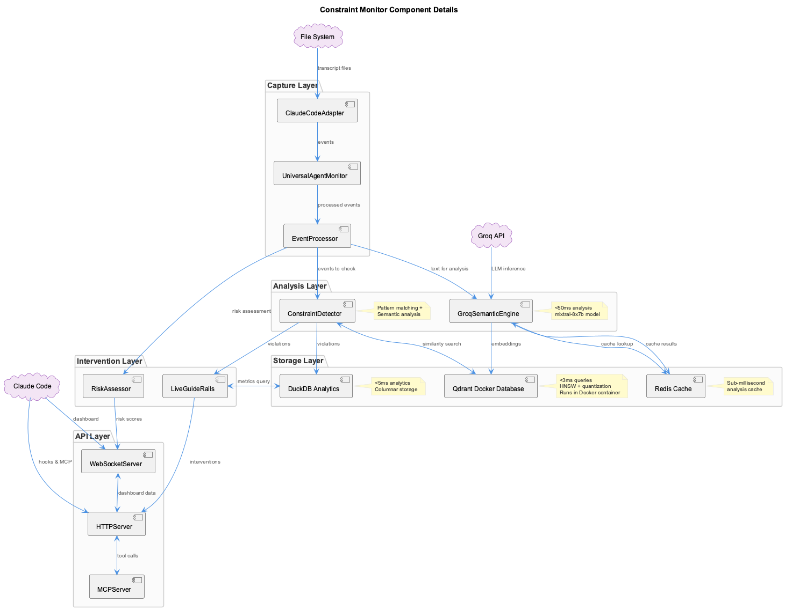

# Constraint Monitor

Real-time code quality enforcement via MCP and PreToolUse hooks.



## Overview

| Property | Value |
|----------|-------|
| Component | `mcp-constraint-monitor` |
| Type | MCP Server + Hooks |
| Port (Docker) | 3849 |
| Dashboard | http://localhost:3030 |
| API | http://localhost:3031 |

## Enforcement Mechanism

The constraint monitor uses **PreToolUse hooks** to intercept tool calls before execution:

1. Claude initiates tool call
2. PreToolUse hook fires
3. Constraint Monitor evaluates parameters
4. CRITICAL/ERROR: Block execution
5. WARNING/INFO: Allow with feedback

## MCP Tools

| Tool | Description |
|------|-------------|
| `check_constraints` | Validate code against constraints |
| `get_constraint_status` | Current compliance metrics |
| `get_violation_history` | Past violations with resolutions |
| `update_constraints` | Modify constraint rules |

## 20 Active Constraints

### Security (2)

| ID | Severity | Detection |
|----|----------|-----------|
| `no-hardcoded-secrets` | CRITICAL | 100% |
| `no-eval-usage` | CRITICAL | 100% |

### Architecture (3)

| ID | Severity | Detection |
|----|----------|-----------|
| `no-parallel-files` | CRITICAL | 100% |
| `debug-not-speculate` | ERROR | 100% |
| `no-evolutionary-names` | ERROR | 100% |

### Code Quality (7)

| ID | Severity | Detection |
|----|----------|-----------|
| `proper-error-handling` | ERROR | 100% |
| `no-console-log` | WARNING | 100% |
| `no-console-error` | WARNING | 100% |
| `no-console-warn` | WARNING | 100% |
| `no-var-declarations` | WARNING | Partial |
| `proper-function-naming` | INFO | Partial |
| `no-magic-numbers` | INFO | Partial |

### PlantUML (5)

| ID | Severity | Detection |
|----|----------|-----------|
| `plantuml-standard-styling` | ERROR | 100% |
| `plantuml-file-organization` | INFO | 100% |
| `plantuml-file-location` | WARNING | Partial |
| `plantuml-diagram-workflow` | INFO | Partial |
| `plantuml-readability-guidelines` | INFO | Partial |

### Documentation (3)

| ID | Severity | Detection |
|----|----------|-----------|
| `image-reference-pattern` | WARNING | Partial |
| `documentation-filename-format` | INFO | Partial |
| `update-main-readme` | INFO | Partial |

## Configuration

**Constraints File**: `integrations/mcp-constraint-monitor/constraints.yaml`

```yaml
- id: no-hardcoded-secrets
  group: security
  pattern: 'API_KEY|SECRET|TOKEN pattern'
  message: 'CRITICAL: Potential hardcoded secret detected'
  severity: critical
  enabled: true
  suggestion: Use environment variables instead
```

**Hook Configuration**: `~/.claude/settings.json`

```json
{
  "hooks": {
    "PreToolUse": [{
      "matcher": "*",
      "hooks": [{
        "type": "command",
        "command": "node /path/to/pre-tool-hook-wrapper.js"
      }]
    }]
  }
}
```

## Dashboard

**URL**: http://localhost:3030

**Features**:

- Real-time violation feed
- Compliance score gauge (0-10)
- 7-day trend chart
- Project selector
- Constraint toggles

## API Endpoints

| Endpoint | Method | Description |
|----------|--------|-------------|
| `/api/violations` | GET | List violations |
| `/api/violations` | POST | Log new violation |
| `/api/compliance/:project` | GET | Project compliance score |
| `/api/constraints` | GET | List enabled constraints |
| `/api/health` | GET | Health check |

## Compliance Scoring

| Severity | Impact |
|----------|--------|
| CRITICAL | -3.0 |
| ERROR | -2.0 |
| WARNING | -1.0 |
| INFO | -0.5 |

Score clamped between 0 and 10.

## Testing

### Automated

```bash
cd integrations/mcp-constraint-monitor
node test-all-constraints-comprehensive.js
```

### Interactive

See `INTERACTIVE-TEST-PROMPTS.md` for manual test scenarios.

## Health Check

```bash
# API health
curl http://localhost:3031/api/health

# Docker mode
curl http://localhost:3849/health
```

## Key Files

| File | Purpose |
|------|---------|
| `src/hooks/pre-tool-hook-wrapper.js` | Hook entry point |
| `src/enforcement/ConstraintEnforcer.js` | Enforcement engine |
| `constraints.yaml` | Constraint definitions |
| `src/dashboard/api/` | REST API |
| `src/dashboard/ui/` | Next.js dashboard |
