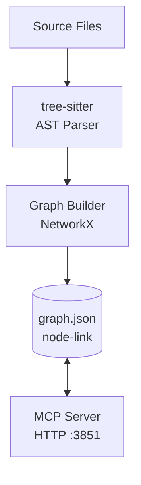

# Graphify

Static, file-based code knowledge graph built with tree-sitter. No database.

## Overview

| Property | Value |
|----------|-------|
| Component | `graphify` |
| Type | MCP Server (HTTP) |
| Runs in | `coding-services` container (supervisord `mcp-servers:graphify`) |
| MCP endpoint | `http://localhost:3851/mcp` |
| Graph | `graph.json` (NetworkX node-link) at `.data/graphify/graphify-out/graph.json` |
| Host CLI | `bin/graphify` shim (→ `docker exec coding-services graphify …`) |

## Architecture



- **tree-sitter parser** — extracts the AST from source files
- **Graph builder** — builds a NetworkX graph of code elements and their relationships
- **`graph.json`** — static node-link JSON at `.data/graphify/graphify-out/graph.json`, stamped with `built_at_commit`
- **MCP server** — HTTP endpoint serving query tools to Claude Code / Copilot / OpenCode

All Python stays inside the container. The host talks to it through the `bin/graphify` shim,
which forwards to `docker exec coding-services graphify …`.

## What It Does

- **AST Extraction** - Parses code with tree-sitter into a static graph
- **Graph Storage** - Persists nodes and relationships in a single `graph.json` (no database, no Cypher, no embeddings)
- **Structural Search** - Query the graph for callers, dependencies, and paths
- **Call Graph** - Function dependency analysis
- **Path Finding** - Shortest path between two code concepts

The graph is stamped with `built_at_commit` so staleness can be detected against `HEAD`.

## MCP Tools

| Tool | Description |
|------|-------------|
| `query_graph` | Structural / natural-language query over the graph (BFS/DFS) |
| `get_node` | Retrieve a single node by id |
| `get_neighbors` | List a node's neighbours |
| `shortest_path` | Shortest path between two nodes |
| `graph_stats` | Graph size and shape statistics |
| `god_nodes` | Most-connected hub nodes |

## Actions

### Query the Graph

```
query_graph { "query": "What functions call UserService.create_user?" }
```

### Get a Node

```
get_node { "id": "app.services.UserService" }
```

### Shortest Path

```
shortest_path { "source": "ObservationWriter", "target": "obs-api" }
```

## Host CLI

The `bin/graphify` shim forwards to the container — all Python stays inside `coding-services`:

```bash
graphify query "what calls captureForegroundTokens"     # structural query
graphify path "ObservationWriter" "obs-api"             # shortest path
graphify god-nodes --top 20                             # most-connected hubs
```

A `/graphify` skill is registered for claude / copilot / opencode.

## The Graph File

The graph is a static NetworkX node-link JSON — there is no database and no Cypher:

```bash
# Inspect the graph and its built_at_commit stamp
ls -la .data/graphify/graphify-out/graph.json

# Quick stats via the CLI
graphify god-nodes --top 20
```

Extraction scope is controlled by a repo-root `.graphifyignore`.

## Indexed Entities

| Entity Type | Description |
|-------------|-------------|
| `Function` | Functions and methods |
| `Class` | Classes and types |
| `Module` | Files and packages |
| `Import` | Import relationships |
| `Call` | Function call relationships |

## Use Cases

### Understanding Code

```
"What functions call registerWithPSM?"
"Show me all classes that implement the Repository interface"
"How does the authentication flow work?"
```

### Finding Dependencies

```
"What modules import UserService?"
"Show the call graph for processPayment"
```

## Rebuilding the Graph

```bash
graphify update /workspace/coding        # incremental (AST only) — fast, use this most of the time
graphify extract /workspace/coding       # full re-extract (incl. docs semantic pass)
graphify extract /workspace/coding --code-only   # full code re-extract, no LLM/network
```

The dashboard **Re-index** button runs `graphify update` via `scripts/graphify-reindex.sh`, and
shows how many commits behind the graph currently is.

Freshness is decided by comparing the graph's `built_at_commit` against `HEAD`:

| Status | Commits behind | Action |
|--------|----------------|--------|
| Fresh | 0–50 | none needed |
| Stale | > 50 | re-index recommended (`graphify update`) |
| Diverged | commit not in history | re-index required |
| No graph | — | initial extraction needed (`graphify extract`) |

## Integration with Semantic Analysis

The `analyze_code_graph` tool in the semantic-analysis MCP server reads the same `graph.json` — no separate database to keep in sync.

## Troubleshooting

### Container not running

```bash
# Symptom: "graphify: container 'coding-services' is not running"
cd docker && docker-compose up -d coding-services
```

### Graph out of date

```bash
graphify update /workspace/coding
```
