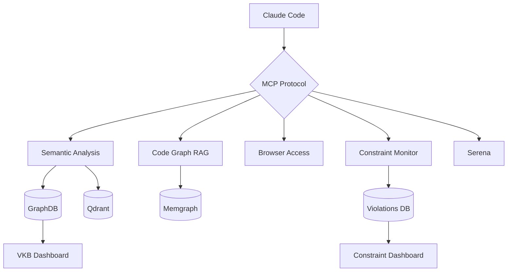

# Integrations

MCP servers and tools that extend the coding infrastructure.


---

## MCP Servers

<div class="grid cards" markdown>

-   :material-brain:{ .lg .middle } **Semantic Analysis**

    ---

    14-agent AI system for code understanding and knowledge extraction.

    

    - Knowledge workflow orchestration
    - Pattern recognition
    - Ontology mapping

    **Port**: 3848 (Docker)

    [:octicons-arrow-right-24: Details](semantic-analysis.md)

-   :material-shield:{ .lg .middle } **Constraint Monitor**

    ---

    Real-time code quality enforcement via PreToolUse hooks.

    

    - 20+ configurable constraints
    - Web dashboard
    - Violation tracking

    **Port**: 3849 (Docker)

    [:octicons-arrow-right-24: Details](constraint-monitor.md)

-   :material-web:{ .lg .middle } **Browser Access**

    ---

    AI-powered browser automation via Stagehand.

    - Visual scraping
    - Form automation
    - Screenshot capture

    **Port**: 3847 (Docker)

    [:octicons-arrow-right-24: Details](browser-access.md)

-   :material-graph:{ .lg .middle } **Code Graph RAG**

    ---

    AST-based code search with Memgraph graph database.

    - Call graph analysis
    - Natural language queries
    - Similar code finding

    **Port**: 3850 (Docker)

    [:octicons-arrow-right-24: Details](code-graph-rag.md)

-   :material-magnify:{ .lg .middle } **Serena**

    ---

    AST-based code analysis (read-only).

    - Deep code navigation
    - Pattern matching
    - Semantic search

    **Mode**: Native only

    [:octicons-arrow-right-24: Details](serena.md)

-   :material-view-dashboard:{ .lg .middle } **Dashboard**

    ---

    System monitoring and knowledge visualization.

    

    - VKB knowledge viewer
    - Health monitoring
    - Workflow visualization

    **Port**: 8080 (VKB), 3032 (Health)

    [:octicons-arrow-right-24: Details](dashboard.md)

-   :material-swap-horizontal:{ .lg .middle } **LLM CLI Proxy**

    ---

    HTTP bridge to host CLI tools for Docker containers.

    - Forwards to `claude` and `copilot-cli`
    - Zero-cost subscription routing
    - Automatic provider fallback

    **Port**: 12435 (Host)

    [:octicons-arrow-right-24: Details](llm-cli-proxy.md)

</div>

---

## Service Ports

| Service | Port | Protocol | Health Check |
|---------|------|----------|--------------|
| Browser Access | 3847 | HTTP/SSE | `/health` |
| Semantic Analysis | 3848 | HTTP/SSE | `/health` |
| Constraint Monitor | 3031/3849 | HTTP | `/health` |
| Code Graph RAG | 3850 | HTTP/SSE | `/health` |
| VKB Server | 8080 | HTTP | `/health` |
| Health Dashboard | 3032 | HTTP | `/health` |
| Memgraph | 7687 | Bolt | N/A |
| Memgraph Lab | 3100 | HTTP | N/A |
| Qdrant | 6333/6334 | HTTP/gRPC | `/health` |
| LLM CLI Proxy | 12435 | HTTP | `/health` |

---

## Architecture



---

## MCP Configuration

MCP servers are configured automatically by the installer. The configuration depends on your deployment mode.

### Docker Mode (Default)

MCP servers run as HTTP/SSE services in Docker containers. Claude communicates via stdio-proxy:

```
Claude Code <-> stdio-proxy.js <-> HTTP/SSE <-> Docker Container
```

### Native Mode

MCP servers run as direct Node.js processes managed by Claude CLI:

```
Claude Code <-> stdio <-> Node.js Process
```

### Configuration Location

- **macOS/Linux**: `~/.claude/settings.json`
- **Windows**: `%APPDATA%/Claude/settings.json`

!!! note "Auto-Configuration"
    The installer creates and maintains MCP configuration. Manual editing is rarely needed.

---

## Available Tools

Each MCP server provides tools accessible within Claude sessions:

### Semantic Analysis Tools

| Tool | Purpose |
|------|---------|
| `determine_insights` | AI-powered content analysis |
| `execute_workflow` | Run multi-agent workflows |
| `analyze_code` | Code pattern analysis |
| `analyze_repository` | Repository-wide analysis |
| `create_ukb_entity_with_insight` | Create knowledge entities |
| `refresh_entity` | Update stale entities |

### Constraint Monitor Tools

| Tool | Purpose |
|------|---------|
| `check_constraints` | Validate code against constraints |
| `get_violation_history` | View past violations |
| `get_constraint_status` | Current compliance metrics |
| `update_constraints` | Modify constraint rules |

### Browser Access Tools

| Tool | Purpose |
|------|---------|
| `stagehand_navigate` | Navigate to URL |
| `stagehand_act` | Perform page actions |
| `stagehand_extract` | Extract page content |
| `stagehand_observe` | Find interactive elements |
| `screenshot` | Capture page screenshot |

### Code Graph RAG Tools

| Tool | Purpose |
|------|---------|
| `query_code_graph` | Natural language queries |
| `index_repository` | Build code graph |
| `get_code_snippet` | Retrieve source code |
| `comprehensive_analysis` | Deep code analysis |

---

## Health Checks

### Docker Mode

```bash
# Check all health endpoints
for port in 3847 3848 3849 3850 8080 3032; do
  echo "Port $port: $(curl -s http://localhost:$port/health | jq -r '.status // "N/A"')"
done
```

### Native Mode

```bash
# Check if MCP servers are registered
cat ~/.claude/settings.json | jq '.mcpServers | keys'
```

---

## Submodule Management

Integration components are git submodules:

```bash
# Update all submodules
git submodule update --remote

# Initialize missing submodules
git submodule update --init --recursive

# Update specific submodule
git submodule update --remote integrations/mcp-server-semantic-analysis
```

---

## Related Documentation

- [Configuration](../getting-started/configuration.md) - API keys and settings
- [Docker Mode](../getting-started/docker-mode.md) - Container deployment
- [Data Flow](../architecture/data-flow.md) - Integration data flow
