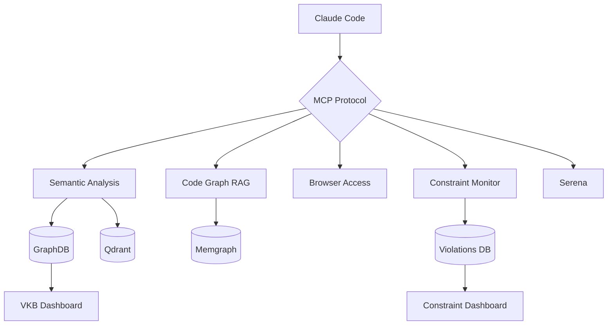

# Integrations

MCP servers and tools that extend the coding infrastructure.

## MCP Server Overview

| Server | Purpose | Port (Docker) |
|--------|---------|---------------|
| [Semantic Analysis](semantic-analysis.md) | 14-agent AI-powered code analysis | 3848 |
| [Constraint Monitor](constraint-monitor.md) | Real-time violation detection | 3849 |
| [Browser Access](browser-access.md) | Stagehand browser automation | 3847 |
| [Code Graph RAG](code-graph-rag.md) | AST-based code search via Memgraph | 3850 |
| [Serena](serena.md) | AST-based code analysis (read-only) | - |
| [Dashboard](dashboard.md) | System health and VKB visualization | 8080 |

## Integration Architecture



## MCP Configuration

### Native Mode

MCP servers run as stdio processes:

```json
{
  "mcpServers": {
    "semantic-analysis": {
      "command": "node",
      "args": ["/path/to/mcp-server-semantic-analysis/build/index.js"],
      "env": {
        "ANTHROPIC_API_KEY": "your-key"
      }
    }
  }
}
```

### Docker Mode

MCP servers run as HTTP/SSE services:

```json
{
  "mcpServers": {
    "semantic-analysis": {
      "command": "node",
      "args": ["/path/to/mcp-server-semantic-analysis/dist/stdio-proxy.js"],
      "env": {
        "SEMANTIC_ANALYSIS_SSE_URL": "http://localhost:3848"
      }
    }
  }
}
```

## Health Checks

### Native Mode

```bash
# Check if MCP servers are registered
cat ~/.config/Claude/claude_desktop_config.json | jq '.mcpServers | keys'
```

### Docker Mode

```bash
# Check all health endpoints
for port in 3847 3848 3849 3850; do
  echo "Port $port: $(curl -s http://localhost:$port/health | jq -r '.status')"
done
```

## Tool Availability

Within Claude Code session, available tools depend on configured MCP servers:

**Semantic Analysis Tools**:

- `determine_insights` - AI-powered content analysis
- `execute_workflow` - Multi-agent workflows
- `analyze_code` - Code pattern analysis
- `create_ukb_entity_with_insight` - Knowledge base creation

**Constraint Monitor Tools**:

- `check_constraints` - Validate code against constraints
- `get_violation_history` - View past violations
- `get_constraint_status` - Current compliance metrics

**Browser Access Tools**:

- `stagehand_navigate` - Navigate to URL
- `stagehand_act` - Perform page actions
- `stagehand_extract` - Extract page content
- `screenshot` - Capture page screenshot

**Code Graph RAG Tools**:

- `query_code_graph` - Natural language code queries
- `index_repository` - Build code graph
- `get_code_snippet` - Retrieve source code

## Submodule Management

Integration components are git submodules:

```bash
# Update all submodules
git submodule update --remote

# Initialize missing submodules
git submodule update --init --recursive

# Update specific submodule
git submodule update --remote integrations/mcp-server-semantic-analysis
```

## Related Documentation

- [Getting Started > Configuration](../getting-started/configuration.md) - MCP setup
- [Getting Started > Docker Mode](../getting-started/docker-mode.md) - Container deployment
- [Architecture > Data Flow](../architecture/data-flow.md) - Integration data flow
