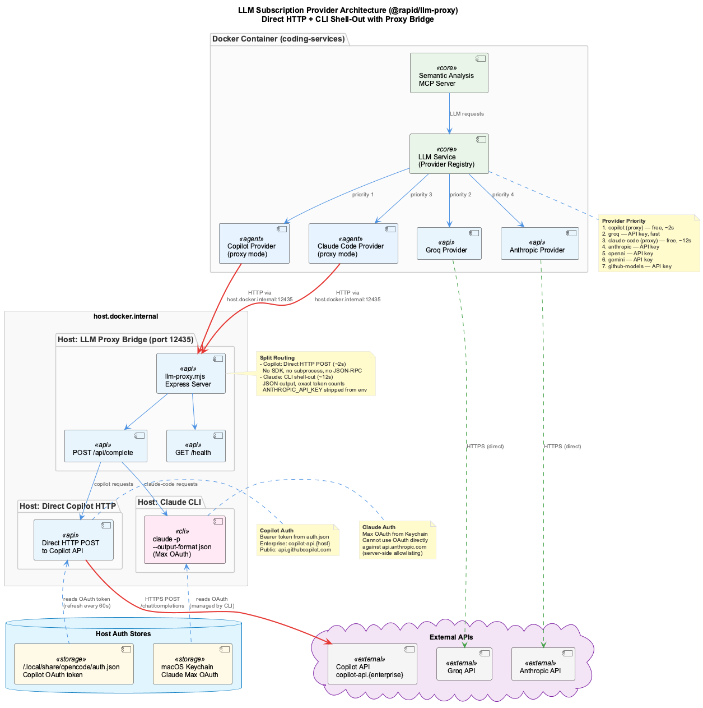
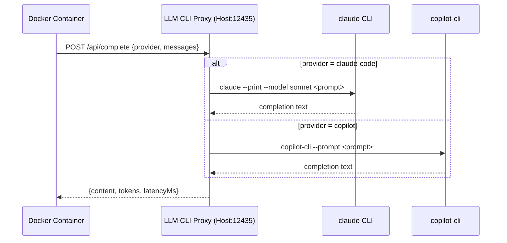

# LLM CLI Proxy

## Overview

The LLM CLI Proxy is an HTTP bridge that runs on the host machine, forwarding LLM completion requests to locally-installed CLI tools (`claude`, `copilot-cli`). This enables Docker containers to use subscription-based LLM providers that require host-side CLI access.

**Port**: 12435 (host)

**Why it exists**: Inside Docker, CLI tools like `claude --print` and `copilot-cli` are unavailable. Without the proxy, the LLM provider chain falls back to paid API providers (Groq, Anthropic, OpenAI). The proxy bridges this gap, allowing Docker workloads to use GitHub Copilot (primary, parallelism-optimized) and Claude Max subscriptions at zero incremental cost. Copilot scales beautifully with parallelism — 0.77s effective per call at 10 concurrent requests.

---

## Architecture





### Provider Fallback Chain

The unified LLM layer tries providers in this order (copilot first for parallelism):

1. **Copilot CLI** (primary) - direct `copilot-cli` or via HTTP Proxy — parallelism-optimized
2. **Groq** - fast API fallback
3. **Claude Code CLI** - direct `claude` or via HTTP Proxy
4. **Cloud APIs** - Anthropic, OpenAI, Gemini, GitHub Models (paid, per-token)

Each CLI provider (`claude-code`, `copilot`) checks for local CLI first, then falls back to the proxy automatically during initialization.

---

## API Endpoints

### `GET /health`

Returns proxy status and provider availability.

**Response:**

```json
{
  "status": "ok",
  "providers": {
    "claude-code": {
      "available": true,
      "version": "2.1.50",
      "lastChecked": 1708600000000
    },
    "copilot": {
      "available": false,
      "lastChecked": 1708600000000
    }
  },
  "uptime": 3600,
  "inFlightRequests": 0
}
```

### `POST /api/complete`

Forward a completion request to a CLI provider.

**Request:**

```json
{
  "provider": "claude-code",
  "messages": [
    {"role": "system", "content": "You are a helpful assistant."},
    {"role": "user", "content": "Explain dependency injection."}
  ],
  "model": "sonnet",
  "maxTokens": 1000,
  "temperature": 0.5,
  "tier": "standard"
}
```

**Response (200):**

```json
{
  "content": "Dependency injection is...",
  "provider": "claude-code",
  "model": "sonnet",
  "tokens": {"input": 25, "output": 150, "total": 175},
  "latencyMs": 2500
}
```

**Error Responses:**

| Status | Type | Meaning |
|--------|------|---------|
| 400 | `VALIDATION_ERROR` | Missing required fields or unknown provider |
| 401 | `AUTH_ERROR` | CLI authentication failure |
| 429 | `QUOTA_EXHAUSTED` | Provider quota/rate limit reached |
| 503 | `PROVIDER_UNAVAILABLE` | CLI tool not installed or not working |
| 504 | `TIMEOUT` | CLI execution timed out |
| 500 | `CLI_ERROR` | CLI execution failed |

---

## Configuration

### Environment Variables

| Variable | Default | Description |
|----------|---------|-------------|
| `LLM_CLI_PROXY_PORT` | `12435` | Port the proxy listens on |
| `LLM_CLI_PROXY_URL` | - | Set in Docker container to `http://host.docker.internal:12435` |

### Docker Compose

The Docker container connects via `host.docker.internal`:

```yaml
environment:
  - LLM_CLI_PROXY_URL=http://host.docker.internal:12435
```

---

## Installation

The proxy is set up automatically by `install.sh`:

1. Checks for `claude` and `copilot-cli` on the host
2. Installs npm dependencies and builds TypeScript
3. Offers to create a persistent background service:
    - **macOS**: LaunchAgent (`~/Library/LaunchAgents/com.coding.llm-cli-proxy.plist`)
    - **Linux**: systemd user service (`~/.config/systemd/user/llm-cli-proxy.service`)

### Manual Setup

```bash
cd integrations/llm-cli-proxy
npm install
npm run build
npm start
```

### Auto-Start

The proxy starts automatically when launching `coding` (via `bin/coding`). The startup script (`scripts/start-services-robust.js`) handles:

- Checking if already running on port 12435
- Building from TypeScript if `dist/server.js` is missing
- Spawning the process with retry logic
- Health check via `GET /health`

---

## Health Monitoring

The proxy is monitored by the health verification system:

- **Severity**: Warning (optional service)
- **Check type**: HTTP health (`GET /health`)
- **Auto-heal**: Disabled (host-side service, not Docker-managed)
- **Dashboard**: Appears in System Health Dashboard service checks

---

## Development

### Running Tests

```bash
# Proxy server tests
cd integrations/llm-cli-proxy
npx tsx --test src/server.test.ts

# Provider proxy integration tests
npx tsx --test lib/llm/__tests__/cli-provider-proxy.test.ts
```

### Project Structure

```
integrations/llm-cli-proxy/
  src/
    server.ts       # Express server with /health and /api/complete
    server.test.ts  # Integration tests
  dist/             # Compiled output
  package.json
  tsconfig.json
```

---

## Troubleshooting

### Proxy not starting

1. Check if port is already in use: `lsof -ti:12435`
2. Verify build: `ls integrations/llm-cli-proxy/dist/server.js`
3. Check logs: `node integrations/llm-cli-proxy/dist/server.js`

### Provider shows unavailable

The proxy checks CLI availability at startup. If `claude` or `copilot-cli` is not in PATH:

```bash
# Check claude
which claude && claude --version

# Check copilot-cli
which copilot-cli
```

### Health dashboard shows degraded

Ensure the health check endpoint uses `localhost:12435` (not `host.docker.internal`, which only resolves inside Docker).

---

## Related

- [LLM Architecture](../architecture/llm-architecture.md) - Unified LLM provider layer
- [LLM Providers Guide](../guides/llm-providers.md) - Provider configuration
- [Docker Mode](../getting-started/docker-mode.md) - Docker deployment
