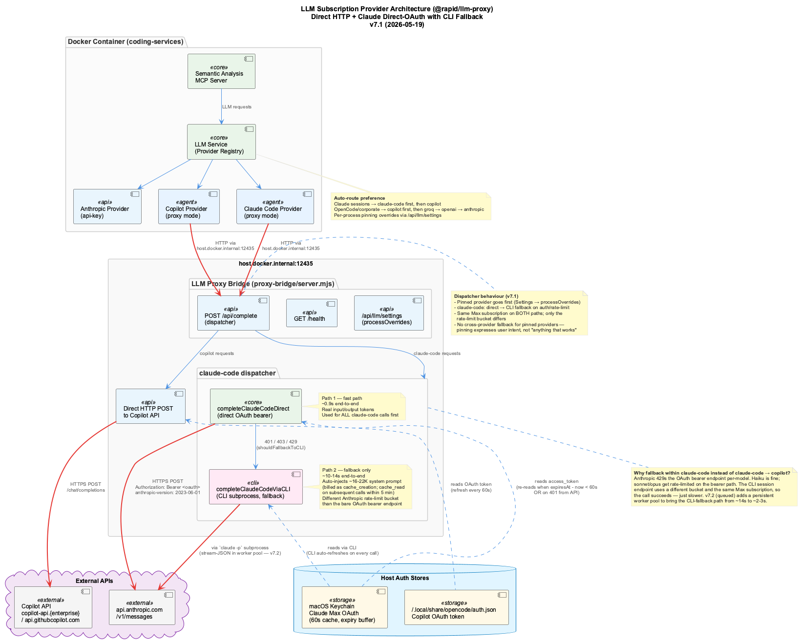
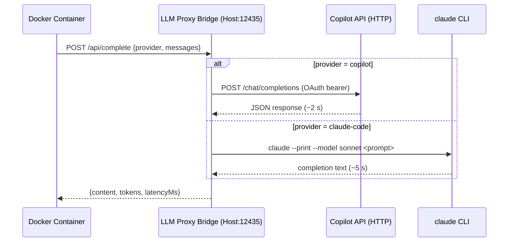

# LLM Proxy Bridge

> **Extracted to standalone package**: The LLM layer is now provided by [`@rapid/llm-proxy`](https://bmw.ghe.com/adpnext-apps/rapid-llm-proxy). The local `src/llm-proxy/llm-proxy.mjs` is a thin wrapper that delegates to the package.

## Overview

The LLM Proxy Bridge enables Docker containers to access host-side LLM capabilities. It runs on the host machine (port 12435) and serves as an HTTP intermediary between containerised workloads and LLM providers:

- **Copilot** (primary): Direct HTTP POST to the Copilot API using OAuth tokens from `~/.local/share/opencode/auth.json` — parallelism-optimised (0.77 s effective per call at 10 concurrent)
- **Claude Code**: Spawns the `claude --print` CLI on the host

**Port**: 12435 (host)

**Why it exists**: Inside Docker, host-side credentials and CLI tools are unavailable. Without the proxy, the LLM provider chain falls back to paid API providers (Groq, Anthropic, OpenAI). The proxy bridges this gap, allowing Docker workloads to use subscription-based providers at zero incremental cost.

---

## Architecture




```mermaid
sequenceDiagram
    participant D as Docker Container
    participant P as LLM Proxy Bridge (Host:12435)
    participant API as Copilot API (HTTP)
    participant C as claude CLI

    D->>P: POST /api/complete {provider, messages}
    alt provider = copilot
        P->>API: POST /chat/completions (OAuth bearer)
        API-->>P: JSON response (~2 s)
    else provider = claude-code
        P->>C: claude --print --model sonnet <prompt>
        C-->>P: completion text (~5 s)
    end
    P-->>D: {content, tokens, latencyMs}
```

### Provider Fallback Chain

The `@rapid/llm-proxy` unified layer tries providers in this order (copilot first for parallelism):

1. **Copilot** (primary) — direct HTTP POST to Copilot API, parallelism-optimised
2. **Groq** — fast API fallback
3. **Claude Code** — `claude --print` CLI on host, or via proxy bridge
4. **Cloud APIs** — Anthropic, OpenAI, Gemini, GitHub Models (paid, per-token)

Each subscription provider checks for local access first (direct API / local CLI), then falls back to the proxy bridge automatically during initialisation.

---

## API Endpoints

### `GET /health`

Returns proxy status and provider availability.

**Response:**

```json
{
  "status": "ok",
  "providers": {
    "copilot": {
      "available": true,
      "mode": "direct-http",
      "lastChecked": 1708600000000
    },
    "claude-code": {
      "available": true,
      "version": "2.1.50",
      "lastChecked": 1708600000000
    }
  },
  "uptime": 3600,
  "inFlightRequests": 0
}
```

### `POST /api/complete`

Forward a completion request to an LLM provider.

**Request:**

```json
{
  "provider": "copilot",
  "messages": [
    {"role": "system", "content": "You are a helpful assistant."},
    {"role": "user", "content": "Explain dependency injection."}
  ],
  "model": "claude-sonnet-4.5",
  "maxTokens": 1000,
  "temperature": 0.5,
  "tier": "standard"
}
```

**Response (200):**

```json
{
  "content": "Dependency injection is...",
  "provider": "copilot",
  "model": "claude-sonnet-4.5",
  "tokens": {"input": 25, "output": 150, "total": 175},
  "latencyMs": 2100
}
```

**Error Responses:**

| Status | Type | Meaning |
|--------|------|---------|
| 400 | `VALIDATION_ERROR` | Missing required fields or unknown provider |
| 401 | `AUTH_ERROR` | OAuth token expired or missing |
| 429 | `QUOTA_EXHAUSTED` | Provider quota/rate limit reached |
| 503 | `PROVIDER_UNAVAILABLE` | Provider not configured or unreachable |
| 504 | `TIMEOUT` | Request timed out |
| 500 | `PROVIDER_ERROR` | Upstream error |

---

## Configuration

### Environment Variables

| Variable | Default | Description |
|----------|---------|-------------|
| `LLM_CLI_PROXY_PORT` | `12435` | Port the proxy listens on |
| `LLM_CLI_PROXY_URL` | - | Set in Docker containers to `http://host.docker.internal:12435` |

### Docker Compose

The Docker container connects via `host.docker.internal`:

```yaml
environment:
  - LLM_CLI_PROXY_URL=http://host.docker.internal:12435
```

---

## Quick Start

```bash
# Start the proxy bridge (thin wrapper delegates to @rapid/llm-proxy)
node src/llm-proxy/llm-proxy.mjs

# Or use the standalone package directly
npx @rapid/llm-proxy
```

### Auto-Start

The proxy starts automatically when launching `coding` (via `bin/coding`). The startup script (`scripts/start-services-robust.js`) handles:

- Checking if already running on port 12435
- Spawning the process with retry logic
- Health check via `GET /health`

---

## Health Monitoring

The proxy is monitored by the health verification system:

- **Severity**: Warning (optional service)
- **Check type**: HTTP health (`GET /health`)
- **Auto-heal**: Disabled (host-side service, not Docker-managed)
- **Dashboard**: Appears in System Health Dashboard service checks

---

## Troubleshooting

### Proxy not starting

1. Check if port is already in use: `lsof -ti:12435`
2. Check logs: `node src/llm-proxy/llm-proxy.mjs`

### Copilot auth failure

OAuth tokens are read from `~/.local/share/opencode/auth.json`. If expired:

```bash
# Re-authenticate via OpenCode
opencode  # tokens refresh on startup
```

### Claude CLI not found

```bash
which claude && claude --version
```

### Health dashboard shows degraded

Ensure the health check endpoint uses `localhost:12435` (not `host.docker.internal`, which only resolves inside Docker).

---

## Full Documentation

See the [`@rapid/llm-proxy` package documentation](https://bmw.ghe.com/adpnext-apps/rapid-llm-proxy/tree/main/docs) for:

- [Architecture](https://bmw.ghe.com/adpnext-apps/rapid-llm-proxy/tree/main/docs/architecture.md) — provider stack, tier routing, circuit breaker
- [Providers](https://bmw.ghe.com/adpnext-apps/rapid-llm-proxy/tree/main/docs/providers.md) — per-provider setup and auth
- [Proxy Bridge](https://bmw.ghe.com/adpnext-apps/rapid-llm-proxy/tree/main/docs/proxy-bridge.md) — Docker bridge details
- [Configuration](https://bmw.ghe.com/adpnext-apps/rapid-llm-proxy/tree/main/docs/configuration.md) — YAML config reference

---

## Related

- [LLM Architecture](../architecture/llm-architecture.md) — Unified LLM provider layer
- [LLM Providers Guide](../guides/llm-providers.md) — Provider configuration
- [Docker Mode](../getting-started/docker-mode.md) — Docker deployment
