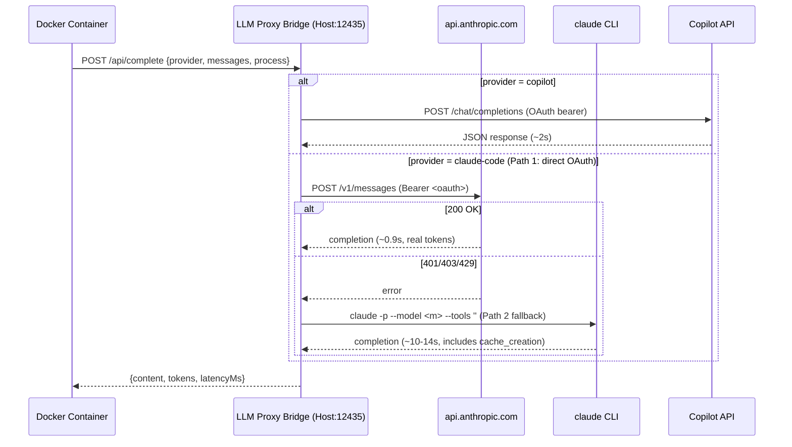
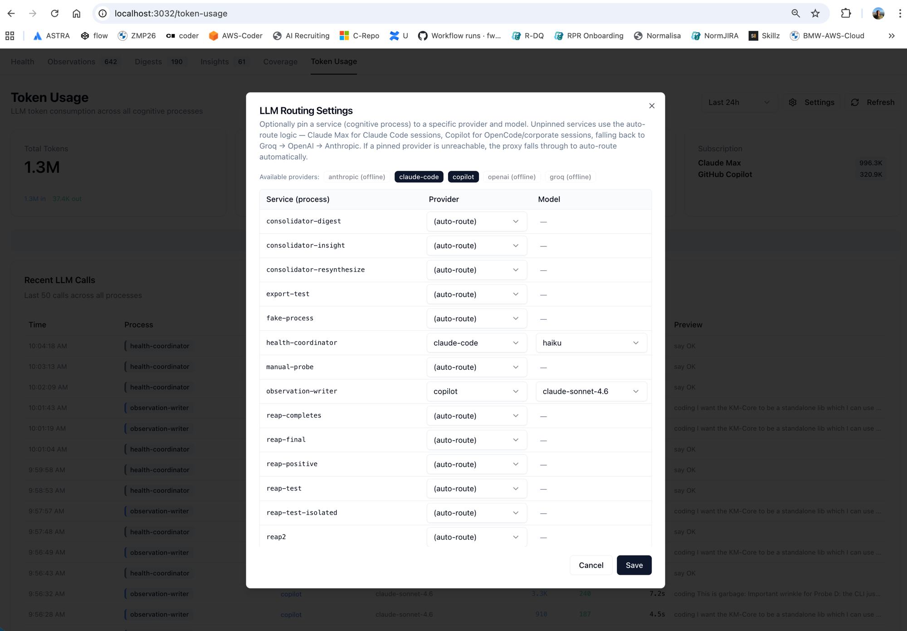
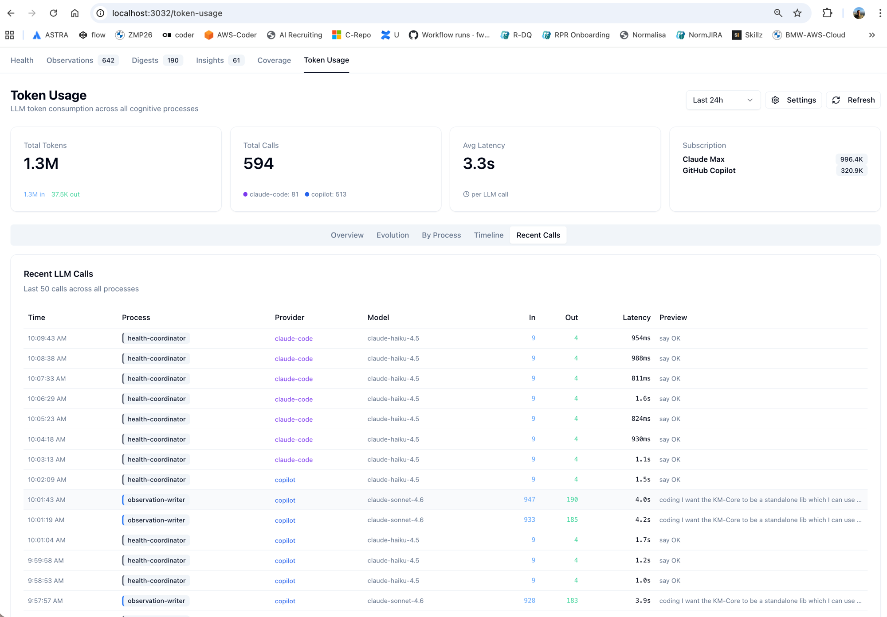

# LLM Proxy Bridge

> **Extracted to standalone package**: The LLM layer is now provided by [`@rapid/llm-proxy`](https://bmw.ghe.com/adpnext-apps/rapid-llm-proxy). The local `src/llm-proxy/llm-proxy.mjs` is a thin wrapper that delegates to the package.

## Overview

The LLM Proxy Bridge enables Docker containers to access host-side LLM capabilities. It runs on the host machine (port 12435) and serves as an HTTP intermediary between containerised workloads and the subscription LLM providers:

- **Copilot** — direct HTTP POST to the Copilot API using OAuth tokens from `~/.local/share/opencode/auth.json`. Parallelism-optimised (~0.77s effective per call at 10 concurrent).
- **Claude Code (Max subscription)** — a two-tier dispatch (since 2026-05-19):
    1. **Direct OAuth path** (fast): POST to `api.anthropic.com/v1/messages` with `Authorization: Bearer <oauth>` read from the macOS keychain. ~0.9s, real token counts (9 in / 4 out for `say OK`).
    2. **CLI fallback** (slower): when the direct path returns 401/403/429, the dispatcher falls back to spawning the `claude -p` subprocess. The CLI auto-injects ~16-22K tokens of system prompt (billed as `cache_creation`) and takes ~10-14s per call, but routes through a **different Anthropic rate-limit bucket on the same Max subscription** — empirically sonnet/opus succeed via CLI while the bearer endpoint 429s.

**Port**: 12435 (host)

**Why it exists**: Inside Docker, host-side credentials and CLI tools are unavailable. Without the proxy, the LLM provider chain falls back to paid API providers (Groq, Anthropic, OpenAI). The proxy bridges this gap, letting Docker workloads use subscription-based providers at zero incremental cost.

---

## Architecture



```mermaid
sequenceDiagram
    participant D as Docker Container
    participant P as LLM Proxy Bridge (Host:12435)
    participant ApiAnt as api.anthropic.com
    participant Cli as claude CLI
    participant ApiCop as Copilot API

    D->>P: POST /api/complete {provider, messages, process}
    alt provider = copilot
        P->>ApiCop: POST /chat/completions (OAuth bearer)
        ApiCop-->>P: JSON response (~2s)
    else provider = claude-code (Path 1: direct OAuth)
        P->>ApiAnt: POST /v1/messages (Bearer <oauth>)
        alt 200 OK
            ApiAnt-->>P: completion (~0.9s, real tokens)
        else 401/403/429
            ApiAnt-->>P: error
            P->>Cli: claude -p --model <m> --tools '' (Path 2 fallback)
            Cli-->>P: completion (~10-14s, includes cache_creation)
        end
    end
    P-->>D: {content, tokens, latencyMs}
```

### Provider routing

Auto-route preference depends on the caller's session type:

- **Claude sessions**: `claude-code` first, then `copilot`, then API-key providers (groq → openai → anthropic).
- **OpenCode / corporate sessions**: `copilot` first (the claude CLI can't reach `api.anthropic.com` through the corporate proxy in some VPN modes), then groq → openai → anthropic.

Operators can pin specific cognitive processes to specific (provider, model) pairs in the Token Usage dashboard's Settings dialog. Pin data persists at `.data/llm-proxy/llm-settings.json`. **Pinning expresses intent — the dispatcher never silently re-routes a pinned provider to a different one.** Within `claude-code`, the direct→CLI fallback ladder applies because both paths run on the same Max subscription.



### Observed behaviour

A snapshot of the Token Usage page's *Recent Calls* table once the direct-OAuth path went live. The `claude-code/claude-haiku-4.5` rows show the new 9 input / 4 output / ~1s envelope from the direct path; the older `claude-code/claude-haiku-4.5` rows above (with 14.9K input tokens / 7+s latency) are pre-fix CLI calls retained for comparison.



---

## API Endpoints

### `GET /health`

Returns proxy status and provider availability.

**Response:**

```json
{
  "status": "ok",
  "providers": {
    "copilot": {
      "available": true,
      "mode": "direct-http",
      "lastChecked": 1708600000000
    },
    "claude-code": {
      "available": true,
      "version": "2.1.50",
      "lastChecked": 1708600000000
    }
  },
  "uptime": 3600,
  "inFlightRequests": 0
}
```

### `POST /api/complete`

Forward a completion request to an LLM provider.

**Request:**

```json
{
  "provider": "copilot",
  "messages": [
    {"role": "system", "content": "You are a helpful assistant."},
    {"role": "user", "content": "Explain dependency injection."}
  ],
  "model": "claude-sonnet-4.5",
  "maxTokens": 1000,
  "temperature": 0.5,
  "tier": "standard"
}
```

**Response (200):**

```json
{
  "content": "Dependency injection is...",
  "provider": "copilot",
  "model": "claude-sonnet-4.5",
  "tokens": {"input": 25, "output": 150, "total": 175},
  "latencyMs": 2100
}
```

**Error Responses:**

| Status | Type | Meaning |
|--------|------|---------|
| 400 | `VALIDATION_ERROR` | Missing required fields or unknown provider |
| 401 | `AUTH_ERROR` | OAuth token expired or missing. For `claude-code`, the dispatcher will normally have already fallen back to the CLI before surfacing this. |
| 429 | `QUOTA_EXHAUSTED` | Provider rate limit reached. For `claude-code` this surfaces only when **both** the direct OAuth bearer AND the CLI fallback return 429 — a true hard limit on the Max subscription. The common case (sonnet via bearer 429, CLI succeeds) is invisible to the caller. |
| 503 | `PROVIDER_UNAVAILABLE` | Provider not configured or unreachable |
| 504 | `TIMEOUT` | Request timed out |
| 500 | `PROVIDER_ERROR` | Upstream error |

### Environment escape hatches (claude-code)

| Env var | Effect |
|---|---|
| `LLM_PROXY_DISABLE_CLAUDE_DIRECT=1` | Force every `claude-code` call through the legacy CLI path (skip the direct OAuth fast path). Useful if Anthropic tightens the bearer-endpoint allowlist or for debugging. |

---

## Configuration

### Environment Variables

| Variable | Default | Description |
|----------|---------|-------------|
| `LLM_CLI_PROXY_PORT` | `12435` | Port the proxy listens on |
| `LLM_CLI_PROXY_URL` | - | Set in Docker containers to `http://host.docker.internal:12435` |

### Docker Compose

The Docker container connects via `host.docker.internal`:

```yaml
environment:
  - LLM_CLI_PROXY_URL=http://host.docker.internal:12435
```

---

## Quick Start

```bash
# Start the proxy bridge (thin wrapper delegates to @rapid/llm-proxy)
node src/llm-proxy/llm-proxy.mjs

# Or use the standalone package directly
npx @rapid/llm-proxy
```

### Auto-Start

The proxy starts automatically when launching `coding` (via `bin/coding`). The startup script (`scripts/start-services-robust.js`) handles:

- Checking if already running on port 12435
- Spawning the process with retry logic
- Health check via `GET /health`

---

## Health Monitoring

The proxy is monitored by the health verification system:

- **Severity**: Warning (optional service)
- **Check type**: HTTP health (`GET /health`)
- **Auto-heal**: Disabled (host-side service, not Docker-managed)
- **Dashboard**: Appears in System Health Dashboard service checks

---

## Troubleshooting

### Proxy not starting

1. Check if port is already in use: `lsof -ti:12435`
2. Check logs: `node src/llm-proxy/llm-proxy.mjs`

### Copilot auth failure

OAuth tokens are read from `~/.local/share/opencode/auth.json`. If expired:

```bash
# Re-authenticate via OpenCode
opencode  # tokens refresh on startup
```

### Claude CLI not found

The CLI fallback path requires `claude` on the host:

```bash
which claude && claude --version
```

If the direct OAuth path works, the CLI is only needed for sonnet/opus calls (rate-limited on the bearer endpoint). Without the CLI, those calls will surface as `QUOTA_EXHAUSTED`.

### claude-code calls take ~14s instead of ~1s

The dispatcher fell back to the CLI path. Check the proxy log:

```bash
tail -50 ~/Agentic/coding/.data/llm-proxy/logs/stdout.log | grep claude-code
```

Look for `direct API rate-limited ... falling back to CLI`. This is expected today for `sonnet`/`opus` — Anthropic's OAuth bearer endpoint per-model rate limit. The CLI fallback uses the same Max subscription but a different rate-limit bucket. The v7.2 milestone (worker pool) will bring this fallback down to ~2-3s.

### "say OK" health-coordinator probe burns 16K tokens per call

This is the symptom of `health-coordinator` being routed through the CLI path. Verify the direct OAuth path is enabled:

```bash
env | grep LLM_PROXY_DISABLE_CLAUDE_DIRECT  # should be empty
```

If set to `1`, unset it and restart the proxy:

```bash
launchctl kickstart -k gui/$(id -u)/com.coding.llm-cli-proxy
```

Healthy state: `say OK` calls report 9 input + 4 output tokens at ~0.9s.

### Health dashboard shows degraded

Ensure the health check endpoint uses `localhost:12435` (not `host.docker.internal`, which only resolves inside Docker).

---

## Full Documentation

See the [`@rapid/llm-proxy` package documentation](https://bmw.ghe.com/adpnext-apps/rapid-llm-proxy/tree/main/docs) for:

- [Architecture](https://bmw.ghe.com/adpnext-apps/rapid-llm-proxy/tree/main/docs/architecture.md) — provider stack, tier routing, circuit breaker
- [Providers](https://bmw.ghe.com/adpnext-apps/rapid-llm-proxy/tree/main/docs/providers.md) — per-provider setup and auth
- [Proxy Bridge](https://bmw.ghe.com/adpnext-apps/rapid-llm-proxy/tree/main/docs/proxy-bridge.md) — Docker bridge details
- [Configuration](https://bmw.ghe.com/adpnext-apps/rapid-llm-proxy/tree/main/docs/configuration.md) — YAML config reference

---

## Related

- [LLM Architecture](../architecture/llm-architecture.md) — Unified LLM provider layer
- [LLM Providers Guide](../guides/llm-providers.md) — Provider configuration
