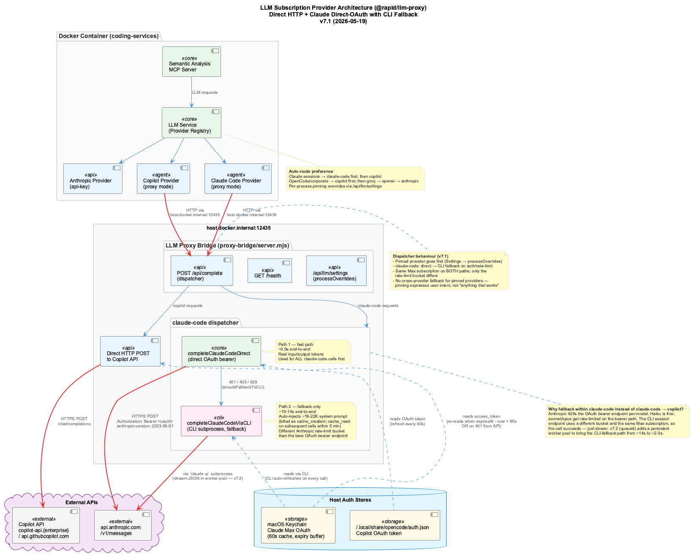

# LLM Proxy Bridge

The one path every LLM call takes — which is what makes routing, fallback and token
accounting possible at all.

=== "⚡ Quick (~3 min)"

    ## What it is

    An HTTP service on the host at **port 12435**. Containers cannot reach host credentials or
    CLI tools, so without it every containerised workload would fall through to paid API
    providers. The bridge lets them use subscription accounts instead, at no marginal cost.

    ## The endpoint

    ```
    POST http://localhost:12435/api/complete
    ```

    **Not** the OpenAI-shaped `/v1/chat/completions`. Body is
    `{ process, messages, complexity? }`; the response is `{ content, provider, model, tokens,
    latencyMs }` — not OpenAI-wrapped, and `provider` is the **account** id.

    ## The port that trips everyone

    **12435 is the proxy. 3033 is the Health API.** Posting a completion to 3033 returns
    `Cannot POST /api/complete` — a bare 404 that names nothing.

    ## Health

    ```bash
    curl -s localhost:12435/health | jq '.networkMode, .egress'
    ```

    ## After changing its source

    Its `dist/` is gitignored and the runtime imports the compiled output, so edits to `src/`
    do not reach the running daemon until you rebuild and restart it.

=== "📖 Standard (~15 min)"

    ## Why it exists

    Inside a container there are no host credentials and no host CLIs. Without a bridge, the
    provider chain in every containerised workload falls through to metered APIs — which is both
    expensive and a different set of models than the interactive session is using.

    

    Because everything goes through one place, three things become possible that otherwise are
    not: routing decisions can be made centrally and reproducibly, fallback can be described as
    configuration rather than scattered code, and every call can be accounted for.

    ## Talking to it

    ```bash
    curl -s localhost:12435/api/complete \
      -H 'content-type: application/json' \
      -d '{"process":"my-service","messages":[{"role":"user","content":"say OK"}],"complexity":"small"}'
    ```

    Three things about that request are worth stating explicitly, because each has caused real
    confusion:

    **The path is `/api/complete`.** Reaching for the OpenAI shape gets a 404.

    **`process` is what makes accounting work.** It names the calling service and is what the
    token dashboard attributes by. A call without one lands under `unknown`.

    **`complexity` is the band, and it is the field that controls cost.** A `taskType` field does
    nothing — it is read by nothing in the proxy, which is how a background classifier once ran
    on an expensive model while appearing to declare itself cheap.

    ## Two ports, one common mistake

    12435 is this proxy. 3033 is the Health API. They are unrelated services, and posting a
    completion to the wrong one produces `Cannot POST /api/complete` rather than anything that
    names the problem.

    ## Subscription accounts and their fallbacks

    The bridge serves subscription providers first. For the Claude path there are two tiers: a
    fast direct OAuth call, and a slower CLI fallback used when the direct path is rejected.

    The fallback is not merely slower — it routes through a **different rate-limit bucket on the
    same subscription**, which is why it can succeed when the direct path is being throttled. It
    also carries a large auto-injected system prompt, billed as cache creation, so its token
    figures look very different for the same work.

    ## Rebuilding after a change

    The compiled `dist/` is gitignored and the running service imports it, so a fresh clone
    cannot start the proxy and an edit to `src/` has no effect until it is rebuilt and the daemon
    restarted. Configuration is different — the YAML files hot-reload on save, and the bridge's
    own `.mjs` files do not.

    ## Checking it

    ```bash
    curl -s localhost:12435/health | jq '.networkMode, .egress'
    curl -s 'localhost:12435/api/llm/routing/resolve?job=<job>' | jq -r .summary
    ```

    The first answers "can this process reach the internet, and on what network"; the second
    answers "where would this call go". They fail independently, and a routing decision can be
    perfectly correct while egress is broken.

=== "📚 Deep Dive (full)"

    --8<-- "_tiers/integrations/llm-cli-proxy.deep.md"
