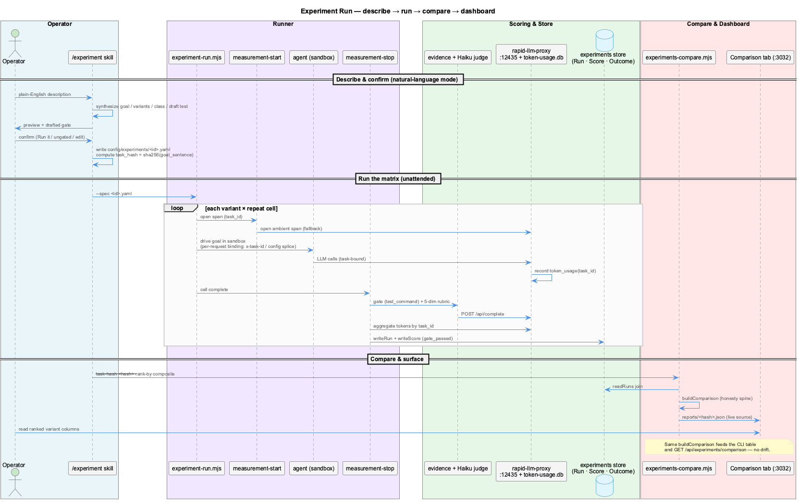

# Measurement Architecture

## Overview

This page explains how a single experiment is measured end-to-end — from a plain-English description to a ranked comparison the dashboard reads live. The pipeline is a **thin skill wrapper** over two CLIs (`experiment-run.mjs`, `experiments-compare.mjs`); all the measurement logic lives in `lib/experiments/` and is shared by both the CLI and the dashboard API so the two can never drift.

---

## The measurement span

Each run is wrapped in a **measurement span** keyed by a `task_id`:

- **`measurement-start.mjs`** opens the span and writes `.data/active-measurement.json`. The shared `rapid-llm-proxy` (port **12435**) reads it and stamps every `token_usage` row with that `task_id`.
- The agent then drives the goal inside a restored **sandbox** snapshot (`snapshot_id`, default `smoke-spec`) so runs are reproducible and isolated.
- **`measurement-stop.mjs`** closes the span: it aggregates tokens from `token-usage.db WHERE task_id = ?`, runs the **evidence harness** (the objective `test_command` gate), invokes the **Haiku judge** for the 5-dimension rubric, and persists the results.

### Foreground vs background attribution

Only the interactive agent's tokens should count toward a run. `token-aggregate.mjs` separates **foreground** traffic (the agent's own file-adapter hashes `cladpt`/`copadt`, or proxy-routed `opencode`/`mastra`) from **background** daemons (`consolidator-*`, `health-coordinator`, `observation-writer`, …) so judge/consolidator calls sharing the window don't inflate the run's cost. The dominant foreground group becomes the run's `canonical_agent` / `canonical_model`.

---

## The data model

Three linked entities are written to the dedicated experiment store (`.data/experiments/leveldb`, kept separate from the knowledge graph to avoid churn):

| Entity | Key fields | Purpose |
|--------|-----------|---------|
| **Run** | `task_id`, `task_hash`, `task_class`, `agent`/`model`/`framework`/`env`, `variant`, `repeat`, `terminal_state`, 6 route heuristics | one execution of the goal by one variant |
| **Score** | `gate_passed` (true/false/null), 5-dim rubric (`goal_achieved`, `code_quality`, `test_coverage`, `regressions`, `spec_drift`), `goal_aligned_ratio` | objective gate + quality signal |
| **Outcome** | `totalTokens`, `inputTokens`, `outputTokens`, `reasoningTokens` | the cost totals |

Key discipline — **null is not zero (D-09):** a metric that could not be computed is stored `null` and *excluded* from stats, never coerced to `0`. This keeps means honest and prevents a missing rubric from dividing the composite by zero (such a variant routes to **unscored** instead).

### `task_hash` closes the loop

The runner derives `task_hash = sha256(goal_sentence)` at close. The `/experiment` skill re-derives the *same* hash (it owns the goal sentence) and passes it straight to the compare step — so `run → compare → dashboard` is mechanically closed with no stdout scraping.

---

## Comparison & the dashboard

`experiments-compare.mjs` calls `buildComparison(rows, {taskHash, rankBy})` from `lib/experiments/compare.mjs`:

1. **read** all runs for the `task_hash` (join Run → Score → Outcome),
2. **classify** each variant into the honesty-spine group (ranked/failed/ungated/unscored),
3. **aggregate** each ranked variant's successful runs into `{mean, stddev, median, min, max, n}`,
4. **rank** by `--rank-by` (`composite` default, or `tokens` / `wallclock` / `score`),
5. **write** `.data/experiments/reports/<task_hash>.json`.

That exact JSON is what the dashboard's **Comparison** tab reads via `GET /api/experiments/comparison` — and the endpoint calls the *same* `buildComparison`, guarded by a deep-equality test, so the CLI table and the dashboard can never disagree.

**Service ports involved:** dashboard `:3032` · dashboard API `:3033` · vkb `:8080` · llm-proxy `:12435`. The proxy, obs-api, and ETM run as auto-respawning launchd daemons (`com.coding.*`).
