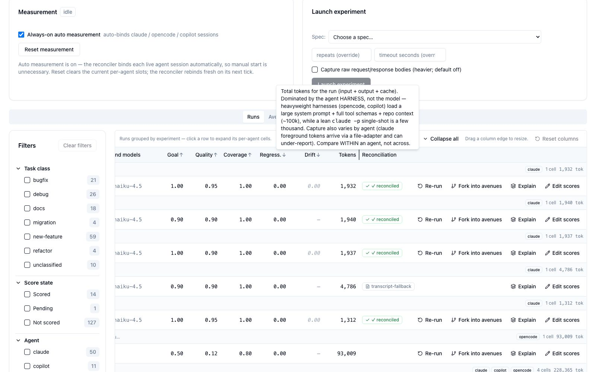
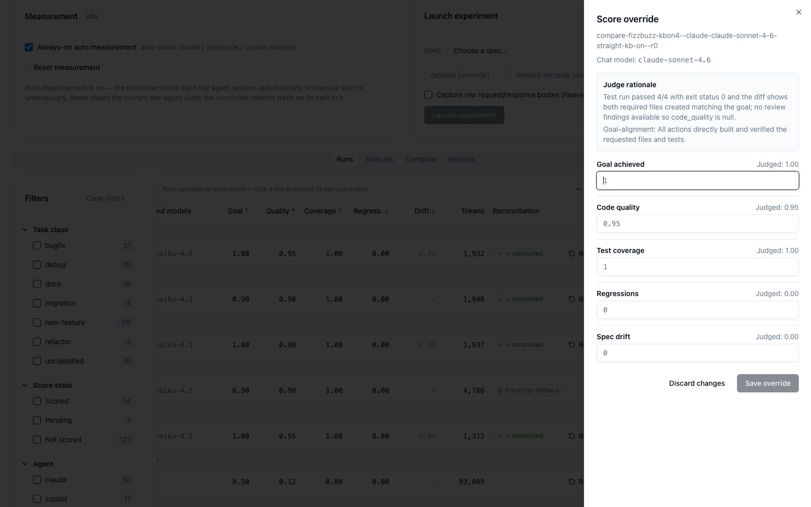
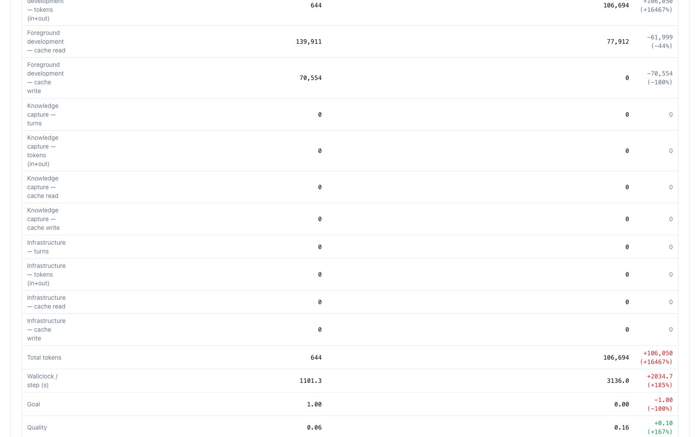

# Performance Dashboard — Full Reference

This page is the exhaustive reference for the **Performance** dashboard at
**[http://localhost:3032](http://localhost:3032) → Performance** — every tab, column, badge, score
dimension, and interactive facet, plus **every hover tooltip written out as visible prose** (the
dashboard hides a lot of load-bearing explanation behind hover; it is all reproduced here).

For a guided, screenshot-driven walkthrough, start with the [Tutorial](tutorial.md). For the model
behind it, see the [Overview](overview.md) and [Architecture](architecture.md).

---

## The page at a glance

The header reads *"Task-anchored query over experiment runs — cost, route quality, and outcome
scores."* Below it:

- **Four stat tiles** — **Total runs**, **Scored runs**, **Total tokens**, **Median wallclock / step**.
- **Show quarantined (N)** — a toggle that re-fetches with `?includePending` to reveal runs that were
  quarantined (invalid/`unclassified` `task_class`); hidden from default queries.
- **Measurement** panel (left) and **Launch experiment** panel (right) — see below.
- Sub-tabs: **Runs · Avenues · Compare · Reports**.
- A faceted **Filters** rail (Task class · Score state · Agent · Model · Framework).

### Measurement panel

**Always-on auto measurement** is on by default — *"auto-binds claude / opencode / copilot sessions."*
A background reconciler binds each live agent session automatically, so a manual start is unnecessary.
**Reset measurement** clears the current per-agent slots; the reconciler rebinds fresh on its next tick.

### Launch experiment panel

Pick a **Spec** from the dropdown (populated from `config/experiments/*.yaml` via
`GET /api/experiments/specs`; malformed specs appear disabled with their parse error). Optional
**repeats** / **timeout** overrides, a **variant subset** with per-variant model/agent overrides, a
**Sweep** expander (every combination of the selected fork axes), and **Capture raw request/response
bodies (heavier; default off)**. **Launch experiment** posts to `/api/experiments/run` and wires up the
**Run monitor** (a variant×repeat cell grid with live state + Cancel/Dismiss).

!!! warning "Run experiments UNATTENDED"
    There is a **single** global measurement span slot and a shared host proxy. A concurrent
    in-repo agent LLM call gets mis-stamped with the open cell's `task_id`. Never drive a matrix
    from an interactive agent working the same repo.

---

## Runs tab

Runs are **grouped by experiment-run** — one collapsible parent per experiment (see
[experiment-RUN id](#concepts-glossary)), each showing a goal summary, agent chips, cell count, and
total tokens. Non-experiment sessions collapse into a pinned **"Other activity — ambient
(auto-measured) sessions"** bucket. **Expand all / Collapse all** toggles every group.

Expanded, each parent reveals its per-agent child cells with their composite `task_id` and scores:

### Runs table columns

| Column | Shows | Notes |
|--------|-------|-------|
| **(select)** | Row checkbox | Header selects all; drives **Compare selected (2)** |
| **Run** | `goal_sentence` (bold) + `task_id` (mono, muted) | task_id only when no goal |
| **When** | Relative age + absolute date, or "running Nm" | Turns amber **"· stuck?"** when a run is open > 20 min |
| **Class** | `task_class` | "unclassified" (muted) when null |
| **Agent** | `claude` / `opencode` / `copilot` / `mastracode` | em-dash if null |
| **Chat model** | Normalized `canonical_model` | italic **"unmeasured"** when empty |
| **Background models** | Distinct background models for the cell | em-dash if none |
| **Goal ↑ · Quality ↑ · Coverage ↑ · Regress. ↓ · Drift ↓** | The 5-dim rubric (0–1) | null renders **"—"**, never 0 — see [glossary](#score-dimension-glossary) |
| **Tokens** | `input + output + cache` | Compare **within** an agent, not across |
| **Reconciliation** | Token-reconciliation badge | reconciled / transcript-fallback / Δ discrepancy |
| **Actions** | Re-run · Fork into avenues · Explain · Edit scores | Re-run + Fork only on completed experiment runs |

Footer legend (verbatim): *"Scores are 0–1 rubric values. ↑ higher is better (Goal, Quality,
Coverage); ↓ lower is better (Regress., Drift). Hover a column header for details. An amber 'edited'
marker means an operator override; hover it to see the original judged value."*

### Score-dimension glossary

The 5 rubric dimensions (`SCORE_DIMENSIONS`: `goal_achieved`, `code_quality`, `test_coverage`,
`regressions`, `spec_drift`). Hover any **header** for the definition — reproduced here verbatim:

- **Goal ↑** — *"Goal achieved — did the run accomplish its stated goal? LLM-judged (Opus) from the
  VERIFICATION verdict + test summary + goal-vs-diff. Scale 0–1; higher is better (1 = fully achieved).
  '—' = no evidence to judge (never treated as 0)."*
- **Quality ↑** — *"Code quality of the result — LLM-judged from diff size + code-review findings.
  Scale 0–1; higher is better. '—' = no code evidence available (e.g. the diffstat did not capture the
  change). NOTE: the judge never sees file contents, so this is a coarse signal."*
- **Coverage ↑** — *"Test coverage of the change — judged from test pass-rate + new-tests-for-new-code
  ratio. Scale 0–1; higher is better. <1 is usually an evidence-completeness discount (judge could not
  fully confirm), not a specific missing test. '—' = no test evidence."*
- **Regress. ↓** — *"Regressions introduced — tests that broke and were NOT introduced by this run.
  Binary 0 or 1; lower is better (0 = none). '—' = no evidence."*
- **Drift ↓** — *"Drift from the spec/intent (divergence from the PLAN.md task list, else the goal
  sentence). Scale 0–1; lower is better (0 = on-spec). '—' = null (no plan to diverge from — the common
  case for freeform goals)."* Plus the **experiment-cell note**: *"For experiment cells (freeform
  goals, no PLAN.md task list) Drift mirrors Goal — it is not an independent signal, so it is shown
  muted here."*

Hovering a **score value** shows the dimension value, its definition, and **"Why this run scored this:
&lt;rationale&gt;"** (Goal uses the ratio rationale; the others use the rubric rationale):

!!! tip "Tokens column — read it right"
    Hover the **Tokens** header: *"Total tokens for the run (input + output + cache). Dominated by
    the agent HARNESS, not the model — heavyweight harnesses (opencode, copilot) load a large system
    prompt + full tool schemas + repo context (~100k), while a lean `claude -p` single-shot is a few
    thousand. Capture also varies by agent (claude foreground tokens arrive via a file-adapter and can
    under-report). Compare WITHIN an agent, not across."* Per-row: *"A suspiciously small claude number
    can be a foreground-capture gap, not a real efficiency win."*

### Editing a score (operator override)

**Edit scores** opens the override drawer. Each dimension shows its **Judged: X** value and an editable
field; the **Judge rationale** panel explains the auto-score. A saved override sets the amber **"edited"**
badge (hover shows *"Judged (before your edit): &lt;value&gt;"*); `effective()` uses `corrected_* →
judged → null`.

---

## Avenues tab

An **avenue** is one variant of the same starting prompt, run on its own isolated git branch
(`avenue/<task-id>`, backed by a worktree). Forking a span runs that prompt across **agents, models,
frameworks, or knowledge-injection on vs off** — every avenue of one origin span is grouped into a
single ranked table.

The built-in help card (surfaced here) defines every column and action:

- **Avenue** — the variant's task id and its `agent · model · framework`.
- **Outcome** — goal-achievement score (0–1, higher is better), read verbatim from the run's
  measurement (an operator-corrected score wins over the auto-judged one). Default sort, best first.
- **Tokens** — total tokens the avenue consumed (K/M abbreviated). Lower is cheaper.
- **Route** — route efficiency: agent loop iterations to reach the result. Lower is better.
- **Wall-clock** — wall-clock seconds per step. Lower is faster.
- **Merge** — the branch's git status vs `main` (hover for ahead/behind/conflicting files):
  **✓ merged** (already merged), **unmerged** (ahead, no conflicts — safe to promote),
  **⚠ conflicts** (overlaps block a clean merge — Promote disabled until resolved), **no badge** (pruned
  or never created — a merge state is never fabricated).
- **A — in any cell** means **not measured**, never zero; unmeasured avenues always sort last.

**Working with avenues:** **Compare** (tick two → Compare tab), **Promote to main** (merges the winner;
blocked while conflicts show — *"avenue/&lt;taskId&gt; has conflicts with main — resolve them before
promoting."*), **Prune** (deletes the branch/worktree — *"Measurement data stays in .data — only the
branch is removed. This cannot be undone."*).

---

## Compare tab

Two sections. **Two-run comparison** contrasts any two runs by role; **Experiment variant comparison**
is the ranked variant matrix for one experiment.

### Two-run comparison (`RunCompare`)

*"Contrast two runs by role — e.g. the same task with a different foreground model. Δ is B − A; green
means B improved on that metric (lower tokens/regressions/drift/wallclock, higher scores)."* Rows break
tokens down by **role** (foreground / knowledge / infrastructure) × turns / tokens / cache read / cache
write, then Total tokens, Wallclock/step, and the 5 score dims.

The lower half surfaces the outcome deltas (Goal, Quality, Wallclock) with green/red direction coloring:

A companion **Difference viewer** aligns the two runs by request signature, collapses the identical
prefix, and starts at the first divergence — *"how the different decisions cost more or fewer tokens and
loops."*

### Experiment variant comparison (`ComparisonMatrix`)

*"Variants as columns, metrics ± variance as rows. Ranked best-first; failed / ungated / unscored
variants are shown separately and are never ranked as a winner."* The **honesty spine**:

- **RANKED** — *"Successful, gated & scored — sorted best composite first."*
- **FAILED (no successful runs)** — *"Gate failed or timeout/abort — never a cheap winner."*
- **UNGATED** — *"No test_command — shown, not ranked."*
- **UNSCORED** — *"Successful & gated but null/zero rubric — shown, not ranked."*

Metric rows: Total tokens, Wallclock (s), Wallclock/step (s), Rubric score, Loop count, Edit reverts,
Redundant reads, Abandoned tools, Total steps, Goal achieved, Code quality, Test coverage, Regressions,
Spec drift — each `mean ± stddev` (hover a cell for median / min·max / n).

---

## Reports tab

**Save report** freezes the current facet-state + rows into a snapshot that never re-queries; **Refresh
snapshot** re-runs it deliberately. Use it to pin a comparison you want to cite later.

---

## Timeline

Selecting a run loads its **per-turn timeline** below the Runs table. Turns are chronological and
colored by **role** — foreground development, knowledge capture, infrastructure — with **role-filter
chips** to isolate a lane. Each turn shows its fresh in/out tokens and a cache split (cache-read
hatched); process pills carry a glossary on hover.

The **fullscreen** timeline (`/performance/timeline/:taskId`) adds the reconciliation summary and a
**Cumulative context growth** band with the full category legend:

!!! note "Reasoning tokens are estimated"
    *"Claude does not report reasoning tokens natively (thinking is folded into output tokens); this
    value is estimated from the thinking text"* — and is *"a subset already counted in the turn's
    output, not additive."*

---

## Context & Caching explainer

**Explain** on any run opens **"Context & caching — what actually gets sent to the LLM"** — the anatomy
of the context window measured from real wire bytes.

- **Topology strip** — `agent foreground chat` → `rapid-llm-proxy (:12435, single metering seam)` →
  `backend LLM (cache lives HERE)`, plus Docker background services.
- **Anatomy band** — one turn's full context window as exact UTF-8 bytes per category: **System
  Instructions**, **Tool Descriptions**, **Retrieved Knowledge**, **Conversation History**, **Tool
  Outputs**, **User Input**. The dashed line is the **cacheable-prefix** boundary; only the User Input
  tail is fresh each turn.

The lower half is the **caching detail** — how the biggest turn was billed, the explicit-vs-implicit
wire explanation, and the per-turn stacked bar chart:

- **Per-turn tokens** — green = cache read, amber = cache write, blue = fresh input, purple = output.
- **Cache-write N/A** — *"This provider's wire protocol doesn't report cache creation; we show N/A
  rather than a fabricated 0."* (OpenAI-wire providers like copilot/opencode report `cached_tokens` but
  no write counter.)

### Retrieved Knowledge detail

Clicking the **Retrieved Knowledge** segment opens the injected-context breakdown:

*"A ~1,000-token block prepended to every prompt by the knowledge-injection hook (UserPromptSubmit →
POST /api/retrieve)."* Budget = **300 Working Memory + 700 semantic**, retrieved via **Qdrant RRF +
SQLite FTS5** over four collections (Insights ≤4 · Digests ≤3 · Entities ≤3 · Observations ≤3), per-tier
capped and budget-truncated. Per-item badges: **cos** = *"Raw embedding similarity between the query and
this item (Qdrant cosine)"*; **rel** = *"Final fused rank score: RRF over semantic + keyword + recency
lists, × tier weight, × project/topic-overlap boosts."*

!!! tip "A 0 B Retrieved-Knowledge block is a feature"
    For a trivial task (fizzbuzz) on a `kb-on` cell, the quality gate's LLM relevance judge rejects the
    topical-but-useless matches, so **Retrieved Knowledge = 0 B**. That empty block is the gate working,
    not a bug — see [Knowledge-injection axis](architecture.md#knowledge-injection-axis-kb-on-kb-off).

---

## Badges & status glossary

| Badge | Meaning |
|-------|---------|
| **Measurement active / idle** | Whether a measurement span is currently open |
| **"edited" (amber)** | Operator score override present; hover for the judged value |
| **Reconciliation** | ✓ reconciled (wire ↔ transcript agree) · transcript-fallback (no wire rows) · ⚠ Δ discrepancy (disagree — treat with caution) |
| **Merge status** | merged · unmerged · conflicts · none (never fabricated) |
| **Gate outcome** | passed · failed · ungated · unscored |
| **Cell state** | complete · running / restoring / scoring · timeout / abort · pending / skipped |
| **Role pill** | foreground (primary) · knowledge (violet) · infrastructure (amber) |
| **wire** | `anthropic` / `openai` / `unknown` — which wire the turn was billed on |
| **"possible loop"** | Advisory: this turn repeats a recent tool signature (fuzzy, non-adjacent — distinct from the backend `loop_count`) |
| **kb-on / kb-off** | Knowledge-injection axis value for the cell |

---

## Concepts glossary

- **Composite `task_id`** — `<experiment_id>[-<salt>]--<agent>-<model>-<framework>-<env>--r<N>`. The
  `--` delimiter is how both the dashboard and the KB-injection gate detect an experiment cell
  (`/--/.test(task_id)`). A bare session UUID never contains `--`.
- **`task_hash`** — `sha256(goal_sentence)`, shared by ALL cells and re-runs of one goal; the
  experiment identity and the Compare-tab key. Re-derive with
  `printf '%s' "$GOAL" | shasum -a 256` — do **not** scrape it from runner stdout.
- **experiment-RUN id** — the `task_id` prefix before the first `--`; the Runs-table grouping key, so
  `v9` / `v10` / re-runs don't collapse into one giant parent.
- **cell / matrix** — a cell is one `{agent, model, framework, env, test_command}` combo restored into
  an isolated sandbox; the matrix runs every cell.
- **kb-on / kb-off** — values on the `env` axis. `kb-off`/`default` → `CODING_KNOWLEDGE_INJECTION=0`;
  `kb-on` → real gated injection (see [Architecture](architecture.md#knowledge-injection-axis-kb-on-kb-off)).
- **avenue** — a forked exploration branch grouped by `origin_span_id`; normal `/experiment` cells have
  no `origin_span_id`, so they appear in neither the Avenues cards nor a grouped Runs list.
- **foreground vs background** — foreground = user-driven work (file adapters cladpt/copadt/opnadt;
  proxy processes opencode/mastra); background = consolidator / health-coordinator / observation-writer
  / backfill / route-judge. Denylist wins.
- **honesty spine** — ranked / failed / ungated / unscored (an **ungated** variant has no `test_command`
  and is compared on tokens/wallclock only, never cost-ranked).
- **curated tiers** — for cells, only `insights` + `kg_entities` are injected; episodic
  `digests`/`observations` are excluded, and the task-agnostic Working-Memory scaffold is suppressed.
- **closed-6 `task_class`** — `refactor · bugfix · new-feature · migration · debug · docs`
  (keyword-derived; anything else quarantines).
- **score states** — `scored` · `not_scored:"trivial"` (< 1 consequential event) · `pending` (locator
  miss / trace unresolved, re-scorable).

### Ports & endpoints

| Port | Service | Key routes |
|------|---------|-----------|
| **12435** | rapid-llm-proxy / token tap | `/api/complete`, `/api/token-usage/recent`, `/v1/copilot/…`, `/api/llm/settings` |
| **12436** | obs-api / retrieval | `/api/retrieve` |
| **8080** | vkb-server / experiments API | `/api/experiments/*` |
| **3032** | dashboard | Performance page |
| **3034** | health coordinator | `/health/state` |
| **3033** | Health API | — |

---

See the [Tutorial](tutorial.md) for the guided walkthrough, the [`/experiment` skill
reference](experiment-skill.md) for authoring experiments, or the [Architecture](architecture.md) for
how capture, injection, and scoring work under the hood.
