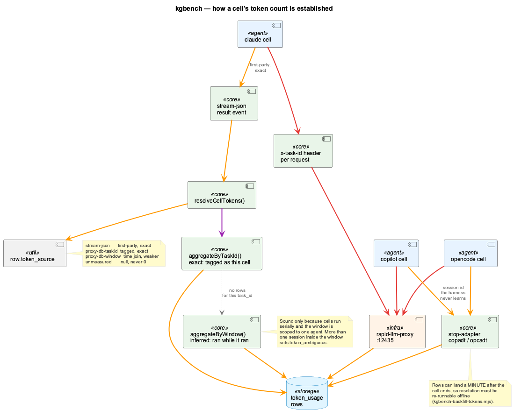

# Experimental Design — Excluding Bias, Making Numbers Comparable

This is the deep section. It documents every control that stands between a benchmark run and a
number you should not trust, and — for each one — the specific failure that made it necessary.

Nothing here is hypothetical. Every control below exists because a run without it produced a
plausible, publishable, wrong result.

> Terms used here (*arm*, *cell*, *axis*, *gated*, *leak*, *containment*, *baseline*) are defined
> in the [Glossary](kgbench-guide.md#glossary).

---

## The governing principle

A benchmark result is a claim of the form *"A differs from B."* That claim is valid only if A
and B differed in the way you intended and in no other way that matters.

So the work of experimental design is entirely negative: enumerate the ways they could differ
that you did not intend, and eliminate or record each one. The uncomfortable part is that the
dangerous differences are precisely the ones that do not announce themselves. A crashed run is
obvious. A run where the restriction silently did not apply looks exactly like a run where it
did — except that all the arms score the same, which reads as *"the questions are too easy."*

Three properties follow, and they shape everything below:

1. **Failures of control are silent.** So controls must be *verified*, not configured.
2. **Verification must precede spending.** A four-hour matrix that turns out to be void is
   four hours plus the temptation to publish it anyway.
3. **What cannot be controlled must be recorded next to the number**, not averaged over and
   footnoted.

---

## Part 1 — Containment: what the system is allowed to read

### The failure

A benchmark's questions live somewhere. In this project they live in the repository the agents
search, and every agent has a file-read tool.

The first pilot produced an answer that began, in effect, *"this question is a known probe from
`config/kgbench/questions/coding-v1.json:184"* — and then answered it correctly, scoring 1.00 by
quoting the question's own provenance note.

That is the whole hazard in one line. **A leaked answer key produces correct answers.** It does
not look like cheating in the data; it looks like retrieval working extremely well. There is no
statistical signature to catch it after the fact. It has to be prevented, and the prevention has
to be verified.

### Five channels, only one of them obvious

Removing the answer key was necessary and nowhere near sufficient. The leaks actually found:

| # | Channel | Why it was not obvious |
|---|---|---|
| 1 | The answer key itself | Obvious in hindsight |
| 2 | Telemetry exports under `.data/` | This project records its own sessions; the exports echoed prompts verbatim. Three questions' full prompts appeared in a *single* export file |
| 3 | Session logs of the sessions in which the questions were authored | The act of writing the benchmark created a searchable record of it |
| 4 | The published report of a previous run | Publishing the questions was the right call for readers — a benchmark whose questions are secret cannot be judged — but it puts every prompt into the tree |
| 5 | **Source comments explaining a previous leak** | Four separate times. Each was a comment written to explain the *previous* leak, and it quoted the thing it was explaining — including, once, the warning comment that said not to do this |

Channel 5 deserves emphasis because it is the one that generalises. The instinct on finding a
leak is to document it thoroughly so it does not recur. If your documentation lives inside the
measured surface, thorough documentation *is* the recurrence.

### The controls

**A throwaway sandbox.** Each run creates a git worktree of the exact commit under test, removes
the sensitive paths, and points the agents at that. The live repository is never searched. The
worktree is discarded afterwards, so a run cannot contaminate the next one.

**An exclusion set that is a category, not a list of files.** The removed paths are: the answer
key; the telemetry and session-log directories; the project's agent-instruction files; the
previously published report; and — structurally — *the grading and containment machinery
itself*. Those last two source files describe what a right answer looks like and which subjects
are traps. Prose discipline was the old control for them and it failed four times, so the fix
was structural: remove the files. Neither is any question's evidence, so removing them costs the
benchmark nothing and ends the class of failure rather than the instance.

**Verification, not assumption.** After building the tree, the harness scans it for each
question's own prompt using five-word windows. If a question's content survives, the harness
**refuses to return the tree** and the run does not start.

**Leak terms for what a scan cannot catch.** The five-word window catches a *copy* of a
question. It cannot catch a *description* of one: paraphrased prose shares four words with a
prompt but never five in a row, which is exactly how channel 5 slipped past. So a question may
declare `leak_terms` — strings that must appear nowhere, where a single occurrence is decisive
and no coverage threshold applies. Coverage exists to tolerate shared vocabulary; a term
declared must-not-appear has no innocent reading.

**An exclusion must never delete a question's own evidence.** This control exists because a
too-broad glob once matched a document that was one question's ground truth. That question would
have become unanswerable and every arm would have scored 0 on it — which reads as a *finding
about the arms* rather than a bug in the exclude list. The harness now cross-checks removed
paths against every question's declared evidence and refuses to run if any was deleted.

The general rule: **containment removes the answer KEY, never the ANSWERS.** Those are different
things, and conflating them manufactures findings.

**A scoring-time backstop.** Even with all of the above, grading independently detects an answer
that cites the ground truth. Such a row keeps its raw score as `score_if_clean` but scores
`null`, so a leak can never rank as a win.

### Transferable lesson

Enumerate every surface your system can read, not just the one you put the answers in. Then
assume you have missed one, and make the run fail loudly when you did.

---

## Part 2 — Enforcement: what the system is allowed to do

### The failure

The arms in this benchmark are defined by their tool surface. The runner passed a flag intended
to restrict each arm to its own tools.

**The flag did nothing.** It was a permission-*prompt* allowlist, and the harness ran with
permission prompts skipped — so the allowlist was never consulted. Every arm silently received
the full default tool surface. Recorded from the first matrix before it was killed:

```
grep arm      Grep ×144, Bash ×59, Read ×38, Glob ×4, Agent ×2, SendMessage, TaskStop
graphify arm  Bash ×27, Read ×4        ← not one graph tool
```

The arms were the same agent wearing different labels. Every number comparing them was one
configuration measured against itself.

The tell had already appeared and been misread. An earlier replication run had both arms scoring
1.00 on every class, and the write-up concluded the arms "could not be told apart" because the
questions were too easy. The arms could not be told apart because they were identical.

It also breached containment: an arm used a shell to check out a submodule *inside* the
worktree, and answered a question from files the containment scan had never seen — because the
scan verified the tree before the arm mutated it.

### The controls

**Deny, do not allow.** The mechanism that actually restricts is the *deny* list: every built-in
tool minus the arm's grant. Verified live — the model attempts the denied tool and is told it is
disabled.

**Discover the tool surface; do not maintain a list.** The first deny list was hand-written and
missed one entry, which an arm promptly used to invoke this project's own skill for a competing
retrieval strategy. A hand-maintained list of built-ins was never going to hold. The CLI reports
its real surface at session start, so that is now the source of truth: a tool added upstream is
denied automatically instead of quietly becoming a hole.

**Union, not replacement.** Discovery alone under-denies, because what the CLI reports depends
on the probing flags — with an empty allowlist it omits two search tools. Trusting it verbatim
left *both* graph arms holding text search: a "graph versus grep" comparison in which the graph
arm can grep. The deny list is now the union of discovered and static.

**Assert isolation before the matrix runs.** The token-floor probes are real sessions with each
arm's real flags, so what they report as available is free evidence. If any denied tool is still
present, the run aborts — rather than producing 200 voided cells and finding out afterwards.

**Audit what executed, not what was attempted.** The guarantee is the post-hoc check: a cell that
*executed* a tool outside its grant becomes `tool_escape` and cannot be scored. Attempts are not
violations — models routinely try a tool, get refused, and fall back, so counting attempts would
void nearly every cell. Tool calls are matched to their results and refusals classified out;
anything unrecognised counts as executed, so the failure mode is a **visible void rather than a
silent escape**.

**Scope violations to the strategy, not the tool.** A backend's server may advertise more tools
than the arm's config names. Flagging per-tool would void a cell for using a legitimate query
method of its own backend. Crossing to a *different strategy* is the thing that must never
happen, and that is what the check enforces.

### Transferable lesson

Do not trust a configuration flag to have configured anything. Record what your system actually
did, compare it to what it was permitted to do, and make the mismatch unscorable. Every
silent-configuration failure in this project was caught by that check and by nothing else.

---

## Part 3 — The asymmetry that cannot be fixed

Adding the agent axis exposed a control that simply does not exist everywhere.

**Only one of the three agents can be held to a tool surface.** The flags that gate tools belong
to one CLI. For the others, the retrieval backends they reach can be restricted — by writing the
configuration file each one reads — but their built-in file and search tools are always present
and cannot be withheld.

There is a real distinction even among the ungated:

- One agent **can** gate tools in principle; the harness has no verified mapping from arm tool
  names to that CLI's own naming, and passing an unrecognised name fails in one of two silent
  ways (the model ends up with no tools, or the flag is ignored and the cell runs ungated while
  labelled otherwise). It is recorded as `not_enforced` — unfinished work.
- The other exposes no tool allowlist at all. It is recorded as `ungated` — a capability limit.

Collapsing those two into one label would make a fixable gap look permanent. (That collapse
happened once, when a generic descriptor overwrote the specific one, and it took a real run to
notice.)

### Refusal as a design choice

Given that asymmetry, what should an arm defined by *withholding* text search do on an agent
that cannot withhold it?

The harness **refuses the combination**. It is decided before anything executes, printed with
the reason, and recorded in the run manifest:

```
run    grep         copilot    [builtins not_enforced, answer via answer-file]
REFUSE graphify     opencode   arm "graphify" is defined by WITHHOLDING built-in search
                               (it grants Read without Glob/Grep), and opencode exposes no
                               tool allowlist, so built-ins cannot be withheld. The cell
                               would run with more capability than its label claims.
```

Arms that withhold only *backends* survive on every agent, because that restriction is
enforceable everywhere. Arms that withhold *built-ins* do not.

The alternative — running the cell anyway and noting the caveat — produces a table where a
number sits under a label that does not describe it. **A matrix that quietly shrinks is worse
than one that says what it will not do.**

### Transferable lesson

When your control surface is not uniform across the things you are comparing, do not paper over
it. Refuse the combinations you cannot measure honestly, record the refusals as data, and keep
the distinction between "cannot" and "not yet".

---

## Part 4 — The environment the system inherits

A subprocess inherits far more than intended, and each inheritance is a way for the measurement
to differ from the thing it claims to measure.

**Working directory.** Placing a child process in a sandbox by setting its working directory
does *not* change the `PWD` environment variable it inherits — that still points at the parent's
directory, which is the live repository. An agent that reads `PWD` to find its project root will
work there instead.

Not hypothetical: the first cross-agent smoke run had an agent search the sandbox correctly and
then write its answer into the **live repository**. Worse than losing one cell — every
subsequent cell would have run against a tree the benchmark had contaminated itself, and the
containment verifier inspects the worktree, so it would never have noticed.

Both the working directory *and* `PWD` are now pinned, and the stale `OLDPWD` dropped, for every
agent rather than the one that was caught.

**Credentials.** An API key present in the environment silently bypasses the measured path: the
CLI prefers a key over the subscription login, and the calls go direct to the provider instead of
through the local proxy — unmeasured, and on the wrong billing path. The keys are stripped and
the proxy base URL is pinned rather than merely inherited.

**Inherited agent configuration.** The interactive launcher exports a configuration variable
that was reaching cells verbatim, carrying a model override and a disabled provider from
whichever session happened to start the benchmark. Part of each cell's configuration was
therefore inherited from the operator's shell. It is now dropped, so the pinned configuration
file is the only configuration a cell sees.

**Global instruction layers.** Agent rule files (`CLAUDE.md` and equivalents) are removed from
the tree for two reasons: they carry absolute paths that let a sandboxed agent walk back to the
real tree, and this project's own rules told agents to prefer one arm's tool "instead of blind
greps" — a thumb on the scale for one arm, in the run tree, in every cell.

There is a residual asymmetry worth stating: pinning one agent's configuration directory also
removes its *global* instruction file, which the other agents still receive from their own home
directories. That is a known parity gap, recorded rather than claimed as solved.

**Machine load.** A wall-clock timer that fires far past its deadline means the *process* was
starved, not that the arm was slow. On one clean run, three cells were logged as five-minute
timeouts with sixteen-minute wall times because background virus scanning was saturating the
machine over the harness's own worktrees. Recording those as timeouts blames the arm for the
host. `host_stalled` is now a separate outcome: void, not scored, not counted against anything —
and three in a row aborts the run, because a starved machine will otherwise burn hours producing
voids.

### Transferable lesson

Enumerate what your subprocess inherits: working directory, environment, credentials,
configuration files, home directory, and the machine's own state. Each is a channel by which the
thing you measured differs from the thing you meant to measure.

---

## Part 5 — Making token counts comparable

This is the subtlest part, because every failure here produces a number rather than an error.



### Problem 1 — Not every agent reports its own usage

One agent emits structured output including exact token usage. The other two emit nothing usable.

The first instinct is to record `0`. That is a lie that reads as *"this agent used no tools and
cost nothing"* — plausible, and it would make the least measurable agent look the cheapest in
every median. So the fields were left `null`.

Correct, and useless: a benchmark whose token column is empty for two of three agents cannot
compare cost across agents at all.

### Problem 2 — The numbers existed, under a key nobody could predict

Every LLM call in this environment routes through one local proxy, which records it. The
unreported agents' calls *were* in that database — written by each agent's stop-adapter, and
stamped with **the agent's own session identity**: an opaque session id, a UUID. The harness that
spawned the process never learns those.

So a lookup by the harness's own cell identifier returns nothing, while the tokens sit in the
database under a key it cannot guess.

### The control: rank the sources and record which one was used

| Source | Strength | Meaning |
|---|---|---|
| `stream-json` | Exact, first-party | The agent reported its own usage |
| `proxy-db-taskid` | Exact, reconstructed | The request carried the cell's identifier |
| `proxy-db-window` | **Inferred** | Proxy rows recorded while the cell was running |
| `unmeasured` | None | No rows found — null, never 0 |

A first-party number is never replaced by a reconstructed one. Preferring the reconstruction
would quietly swap exact per-call accounting for a window sum.

`proxy-db-window` is the honest name for a weaker claim: it attributes by *"ran at the same
time"* rather than *"was tagged as this cell"*. That is sound only because cells run serially and
the window is scoped to a single agent. When it is not sound, the harness says so rather than
assuming: the aggregate returns the distinct sessions it summed, and more than one sets
`token_ambiguous`, which the report surfaces as a warning.

### Why per-request tagging is not simply switched on everywhere

Tagging a request with the cell's identifier means changing *how the agent reaches its model* —
moving one agent onto a different authentication path, giving another a task-scoped endpoint.
Both alter the thing being measured in order to improve the label on the measurement, and both
have already produced silent failures in this project.

So it is enabled by default only where it is free: for the gated agent it is a request *header*
on a connection already going to the proxy — it labels traffic without redirecting it. For the
others it is opt-in, to be switched on once a real run shows the cell still answers.

### Problem 3 — Tokens arrive after the cell has ended

The stop-adapters write on their own schedule. A measured cell:

```
cell ran        09:57:01.869 → 09:57:35.267
row timestamp   09:57:34.810      ← inside the cell; the join is correct
row WRITTEN     ~60 s later       ← after the runner had already moved on
```

The runner polls for a couple of seconds. That is enough for one agent and not the other, and no
poll budget can reliably be long enough — waiting a minute per cell would put a 384-cell matrix
to sleep for six hours.

**So token resolution must be re-runnable offline.** The runner records what it can see; a
separate command fills in the rest afterwards from the identifier and wall-clock window stored on
every row. It is idempotent, never overwrites a first-party figure, and keeps a backup.

This mirrors a discipline the framework already applied to grading: store enough to re-derive
offline, because re-running a trial to fix a measurement bug changes what you are measuring.

### Problem 4 — Cache accounting is not uniform, and summing it double-counts

The most instructive failure of the three, because it produced a number that looked entirely
reasonable.

The structured output reports input tokens, cache-creation tokens and cache-read tokens as three
separate figures the parser sums. Folding the database's two cache columns into input the same
way seemed like the move that keeps the metric comparable across sources.

It reported one cell's 121,413 tokens as **242,103**:

```
in = 120,713   cache_read = 108,398   cache_write = 12,292   out = 700   total = 121,413
```

`cache_read + cache_write ≈ input_tokens`. For that writer the cache columns are a *breakdown of*
input, not an addition to it. Other writers store the opposite shape (input of 2 alongside a
cache read of 277,173). There is no uniform rule.

The one invariant that holds across every cache-carrying row checked is
`total_tokens = input + output`. So stored values are used as stored, and the cache columns are
kept for provenance but kept out of the arithmetic.

**The residual caveat is recorded rather than papered over.** A database-derived input figure may
account for caching differently from a first-party one. Therefore *content tokens* — total minus
a measured floor — is strictly comparable only **within** a token source, and the report prints
the source next to every figure.

### Problem 5 — The floor is a property of the session, not the arm

Content tokens exist because whole-session totals are dominated by a fixed floor — system prompt
plus tool schemas — that compresses every ratio toward 1.0 and makes different strategies look
identical. Subtracting a measured floor is what recovers the signal.

But *whose* floor? Measured on the same question, in one run:

| arm | agent | floor | source |
|---|---|--:|---|
| grep | claude | 22,437 | `stream-json` |
| grep | copilot | 63,609 | `proxy-db-window` |
| grep | opencode | 66,558 | `proxy-db-window` |
| graphify | claude | 22,875 | `stream-json` |
| codegraph | claude | 21,677 | `stream-json` |
| hybrid | claude | 25,699 | `stream-json` |

Two things are visible. Within one agent, the floor tracks the tool surface — the arm with 14
tools starts 4,000 tokens above the arm with 2. That difference is the *schema tax*, and it is a
real finding about the cost of merely having a backend registered.

Across agents, the floor differs by 3×. Subtracting one agent's floor from another agent's total
would measure the difference between two CLIs, not between two retrieval strategies.

So the floor is measured per **(arm, agent, model)**, and it records the token source it came
through. When a cell's source differs from its baseline's, content tokens is left `null` — a
database-derived total minus a first-party floor is not a difference of anything. The schema tax
is likewise computed within an (agent, model), never across CLIs.

### Transferable lesson

For any cost metric: know which of your numbers are first-party and which are reconstructed,
never mix them in a subtraction, make "not measured" impossible to confuse with zero, and make
the whole resolution re-runnable after the fact — because telemetry arrives late.

---

## Part 6 — Scoring without fooling yourself

Grading has its own detailed case notes in
[Measurement & Judging Lessons](../benchmarks/measurement-lessons.md). The design principles:

**Deterministic first.** The primary score comes from a checklist with no LLM involved, so it is
reproducible and can be re-applied to stored answers offline. A grader bug costs a re-grade, not
a re-run.

**The judge is an alarm, not an authority.** A second LLM scorer never overrides the
deterministic score. Its value is disagreement. But be precise about what a disagreement means:
it names a symptom and never a cause. Across every investigation on this question set the cause
was a rubric, a false key, a regex, a shared match token, or a matcher simultaneously too loose
and too narrow — and never a badly written question. Twice the arms were right and the key was
wrong.

And the detector is blind to the most common defect of all: because the judge's prompt is built
from the same checklist, **a wrong key makes both graders agree** and produces zero
disagreements.

**Record what was served, not what was requested.** Two published runs stated a judging model
that no provider serves — every call had in fact been answered by a small, cheap model, because
the endpoint ignores the requested model. Provenance is now taken from the responses, and a
substitution is announced.

**Absence questions need their own machinery.** A correct abstention — *"this repository does not
contain such a service"* — was scored as a fabrication, because the phrasing was not in the
recognised list and the fallback then flagged it hallucinated. The pilot's headline finding, that
one arm fabricated an answer, was a grader artefact.

**Forbidden facts must encode claims, not shapes.** A rule intended as "must not name any file as
doing X" was written as a regex matching *any filename* — which every correct answer contains
while explaining what the thing actually is. Forbidden facts now bind a subject to the claim it
is forbidden to make, and match only in assertive segments.

**Gate the winner declaration.** A winner is declared only at a ≥1.25× median gap *with*
non-overlapping spread. Anything weaker prints "tie". At these sample sizes a 1.3× gap is not a
result, and an earlier report declared winners at exactly that margin.

---

## Part 7 — What is still not controlled

A design document that lists only its successes is not usable. These are the known gaps.

**Elicitation differs by agent.** The gated agent streams a structured answer. The others are
told to write their answer to a file, because an analysis-shaped prompt makes one exit within
seconds and the other yield on its first toolless step — both "succeeding" having answered
nothing. That difference is a confound in every cross-agent comparison, and it is not removable:
it is what makes those cells produce an answer at all. It is recorded per cell as `elicitation`.

**No tool trace exists for the ungated agents.** So no post-hoc audit is possible for them —
recorded as `tool_audit: "unavailable"`, which is deliberately weaker than an empty violation
list.

**Global instruction files are asymmetric.** Pinning one agent's config directory removes its
global rules file; the other agents still read theirs.

**Baselines can fail to resolve.** If a floor probe's tokens arrive after the wait, that
combination's floor is null and its content-token column stays empty for the whole run. Unlike
cells, baselines have no offline backfill yet.

**Sample sizes are small.** Three repetitions per cell is enough to see variance, not to
characterise it. The winner gate is the mitigation.

**One repository, one question set.** Everything here measures retrieval over *this* codebase.
Generalisation to other corpora is unproven.

**Corpus scope differs between backends.** One indexes documentation and PDFs; the code-only ones
do not. Node and edge counts are not comparable at face value.

---

## Checklist

Before trusting a run:

- [ ] Containment verified — the harness built and cleared the tree, and did not warn
- [ ] No denied tool appeared in the pre-matrix isolation assertion
- [ ] Zero `tool_escape` rows, or the escapes understood
- [ ] Zero contamination flags
- [ ] `host_stalled` count is zero or small — otherwise the machine was busy and those cells are void
- [ ] Refused combinations reviewed — is the matrix the shape you intended?
- [ ] Token sources checked — how many cells are `unmeasured`? Run the backfill
- [ ] `token_ambiguous` count is zero, or those cells excluded from cost claims
- [ ] Baselines resolved for every combination you intend to quote content tokens for
- [ ] The judge's *served* model recorded, not just requested
- [ ] Disagreements read as an alarm about the key or the matcher, not about the questions

Before publishing:

- [ ] Per-agent numbers shown separately, never pooled across agents
- [ ] Enforcement and elicitation stated next to the figures
- [ ] Winner claims pass the effect-size and spread gate
- [ ] Refusals and limitations stated in the document, not omitted
