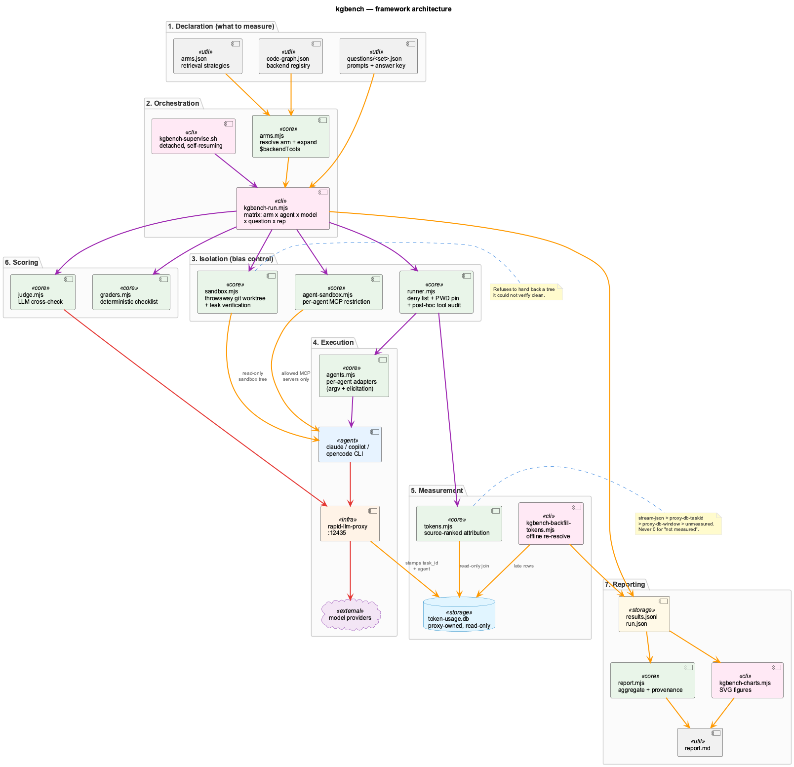
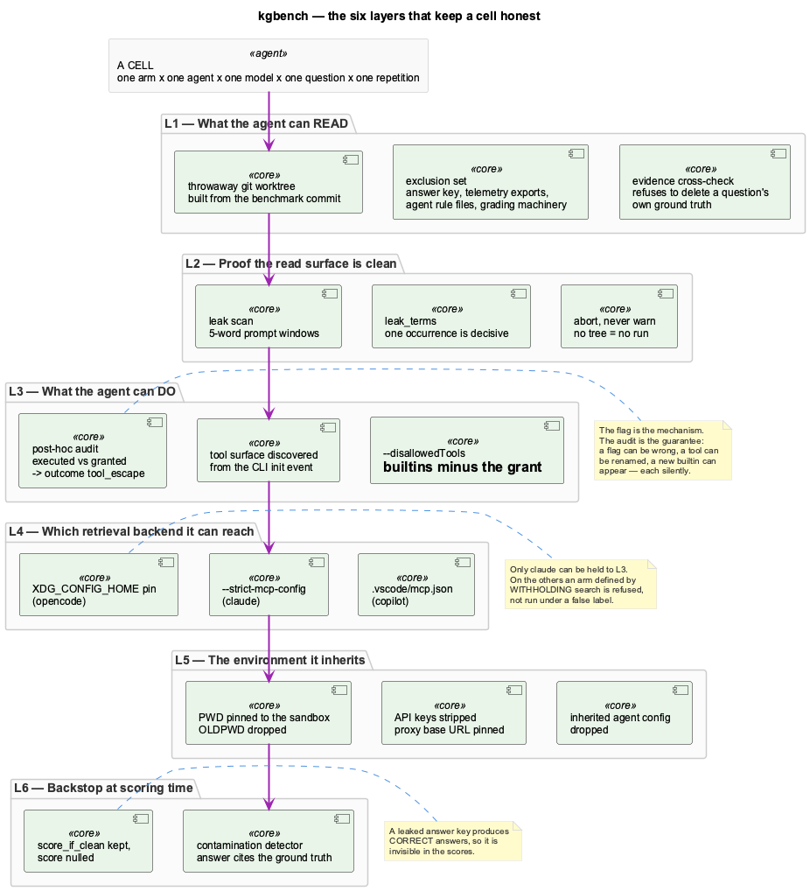
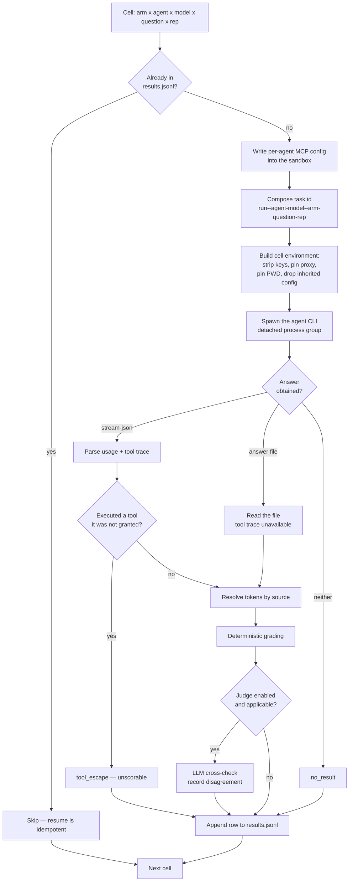
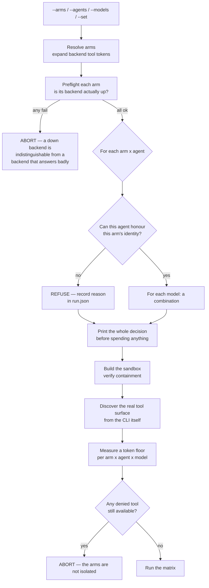
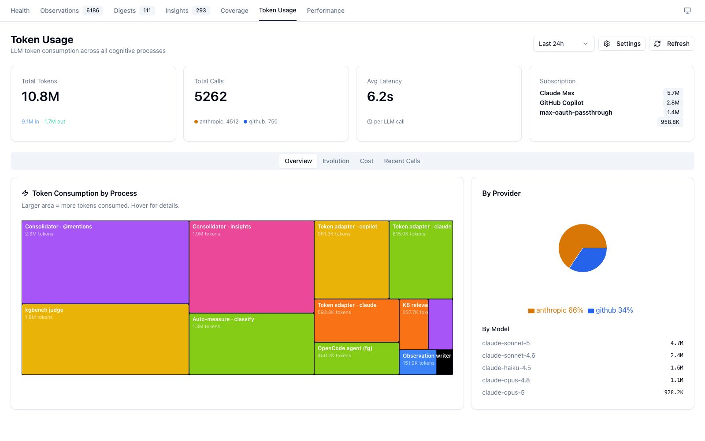
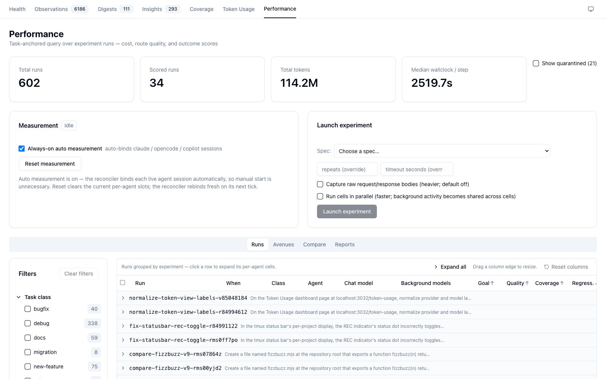

# Benchmarking Agent Systems — the kgbench Framework

This is a guide to measuring systems that do **cognitive work with LLMs** — coding agents,
retrieval layers, knowledge graphs, RAG pipelines — in a way whose numbers survive scrutiny.

It documents `kgbench`, the benchmark harness in this repository. But the harness is the
example, not the point. Nearly everything here was learned by getting it wrong first: five
separate leaks of the answer key, a comparison that turned out to be one configuration
measured against itself, a token column that silently double-counted, and a report that
published a grading model which had never graded anything. Each of those produced a
plausible-looking table. That is the hazard this guide is about.

> **New to this?** Start with the [Glossary](#glossary). Every term used here — *arm*, *cell*,
> *axis*, *ungated*, *leak*, *containment* — is defined there in plain language before it is
> used anywhere else.

**Companion documents**

| Document | What it covers |
|---|---|
| [Experimental Design](kgbench-experimental-design.md) | The deep treatment: how bias is excluded and how token counts are made comparable |
| [Tutorial](kgbench-tutorial.md) | Hands-on: run an experiment, write a question, add a retrieval backend, add an agent |
| [Operator Reference](kgbench.md) | Flags, prerequisites, reading a report |
| [Measurement & Judging Lessons](../benchmarks/measurement-lessons.md) | Case notes on grading failures and what each one taught |

---

## Why this is harder than it looks

The obvious way to compare two retrieval strategies is: ask both the same questions, score the
answers, compare. Every part of that sentence hides a trap.

**A leaked answer produces a correct answer.** If the thing being measured can read the
questions — or a previous run's published report, or a session log in which the questions were
written — it will score well, and the score will look exactly like retrieval working. Leaks are
invisible in the scores. They are only visible if you go looking for them *before* you believe
the numbers.

**A configuration flag may not configure anything.** The first full run of this benchmark
compared a "grep" strategy against a "code graph" strategy. The flag intended to restrict each
one to its own tools did nothing under the mode the harness was using. Both strategies ran with
the full tool surface. The comparison was one configuration measured against itself, and the
tell — both scoring identically on every question class — had already been read as *"the
questions are too easy."*

**A missing number and a zero are not the same thing.** Two of the three agents here cannot
report their own token usage. Recording `0` for them would have made the least measurable agent
look the cheapest. Recording `null` is correct but useless. Neither is a measurement.

**Averages hide the fact that you measured two different things.** Once cells can be run by
different agents, the same arm label covers a cell that was strictly confined to three tools and
a cell that kept every tool it shipped with. Their median is arithmetic, not meaningful.

The framework's design is a direct response to each of these.

---

## Glossary

Read this first. These terms are used precisely throughout, and several of them mean something
narrower than their everyday sense.

### The units of measurement

**Question** — one task put to the system, with a machine-checkable definition of a right
answer. Not just a prompt: a question also carries its *answer key* (what must appear in a
correct answer), its *class*, and its *provenance* (which files in the repository actually
contain the answer, verified by a human).

**Question class** — the kind of reasoning a question demands. This benchmark's set uses five:

| Class | What it asks for | Why it is separate |
|---|---|---|
| `lookup` | Find one specific fact — a file, a variable, a value | The easiest case; any strategy should manage it |
| `structural` | How pieces relate — what calls what, what is defined where | Where an index should start to pay off |
| `blast` | Blast radius — what breaks if this changes | Needs the graph of relationships, not just text |
| `arch` | Architecture and intent — why a thing is built this way | Needs synthesis across many files |
| `abstain` | A thing that **does not exist** in the repository | Tests whether the system says "not here" or invents an answer |

The `abstain` class matters more than its share of the question count suggests. A system that
scores well everywhere else and fabricates confidently on absence is not usable, and nothing but
an explicit absence question will reveal it.

**Arm** — one *way of answering*. An arm is defined by the tool surface it is allowed to use,
and nothing else. Same model, same prompt, same repository; only the tools differ. That is what
makes the comparison about retrieval strategy rather than about model quality.

This benchmark's arms:

| Arm | Tools it may use | What it represents |
|---|---|---|
| `grep` | Text search + file read | The baseline any retrieval layer has to beat — what shipping agents already do |
| `graphify` | File read + the graphify code-graph tools, **no text search** | A graph-based index |
| `codegraph` | File read + the CodeGraph tools, **no text search** | A different graph-based index |
| `hybrid` | Everything | The only production-shaped arm — an agent that chooses |

Note what makes `graphify` and `codegraph` what they are: they *withhold* text search. An arm
whose identity is a restriction can only exist where that restriction is enforceable. This has
consequences — see [ungated](#ungated) below.

**Axis** — a dimension the matrix varies. There are five:

```
arm  ×  agent  ×  model  ×  question  ×  repetition
```

An axis exists so that one factor can be varied while everything else is held still. Adding an
axis multiplies the run: 4 arms × 3 agents × 1 model × 16 questions × 3 repetitions is 192 cells
before refusals.

**Cell** — one point in that matrix: one arm, on one agent, with one model, answering one
question, once. A cell is the atomic unit of execution and the atomic unit of a result row. Each
cell gets its own isolated environment and its own result record.

**Repetition (rep)** — the same cell run again, unchanged. LLMs are non-deterministic, so a
single observation is an anecdote. Repetitions turn it into a distribution you can put a median
and a spread on. Three is the working minimum here; it is enough to notice variance, not enough
to characterise it.

**Agent** — which coding CLI actually drives the cell (`claude`, `copilot`, `opencode`). This is
an axis in its own right because agents differ in far more than the model they call: their
system prompts, their tool implementations, how they decide a task is finished.

**Model** — which LLM answers. Named in the benchmark's own canonical spelling; each agent's
dialect is derived, because the same model is called `claude-sonnet-4-6` by one CLI and
`rapid-proxy/claude-sonnet-4.6` by another.

### Control and enforcement

<a id="ungated"></a>
**Gated / ungated** — a *gated* agent can be held to an arm's tool surface: you can tell it
"you may use these tools and no others", and it obeys. An *ungated* agent cannot; you can
configure which retrieval backends it reaches, but its built-in file and search tools are always
present and cannot be withheld.

This asymmetry is the single most consequential fact about cross-agent measurement here. Of the
three agents, only one is gated. On the others, an arm defined by *withholding* text search
cannot be honoured — the cell would search anyway, while wearing a label that says it did not.
Those combinations are **refused** rather than run.

**Control surface** — the set of things the harness can actually hold constant. Naming it
explicitly matters, because the boundary between "held constant" and "hoped constant" is where
invalid comparisons come from. Here the control surface is: the repository contents, the tool
grant, the retrieval backends reachable, the model, the prompt, the working directory, the
credentials, and the inherited configuration.

**Enforcement** — the mechanism that makes a restriction real (a CLI flag, a config file). Every
cell records which mechanism applied to it, in two parts, because the honest answer differs
between them:

- `mcp_servers` — which retrieval backends were reachable. Enforceable on every agent.
- `builtins` — which built-in tools were available. Enforceable on one agent only.

A single boolean "was this enforced?" would have to lie about one of them.

**Audit** — the check performed *after* the fact: compare the tools the agent actually executed
against the tools it was granted. Enforcement is the mechanism; the audit is the guarantee. A
flag can be wrong, a tool can be renamed, a new built-in can appear upstream — each of those
fails silently, and each produces a run that looks fine and compares nothing. A cell that used a
tool it was not granted becomes `tool_escape` and cannot be scored.

Where no tool trace exists (agents that do not emit one), the cell records
`tool_audit: "unavailable"` — deliberately distinct from an empty violation list, which would
read as "audited, clean".

### Isolation

**Sandbox** — a throwaway copy of the repository, created per run as a git worktree of the exact
commit under test, with sensitive paths removed. The agents search this, never the live
repository. It is discarded afterwards.

**Containment** — the property that the sandbox does not contain the answers to the questions
being asked. Not assumed: *verified*, by scanning the tree for each question's own prompt before
any cell runs. The harness refuses to hand back a tree it could not verify.

**Leak** — any path by which the answer reaches the system other than by retrieval. The obvious
one is the answer key. The non-obvious ones found here, all real:

- telemetry exports that echo the prompts, because this project records its own sessions
- a previously published report of an earlier run
- session logs from the sessions in which the questions were written
- source-code comments *explaining a previous leak*, which quoted the thing they were explaining
- the project's own agent instructions, which told agents to prefer one arm's tool over another

**Leak term** — a string a question declares must appear nowhere in the tree. One occurrence
aborts the run. This exists because the general leak scan matches five-word windows from the
prompt, and a *paraphrase* of a question shares four words but never five in a row. The scan was
built to catch a copy of a question; it has no way to catch a description of one.

**Sandbox escape** — the agent operating outside the sandbox despite being placed inside it.
Observed here twice: once by using a shell to fetch content the containment scan never saw, and
once by reading an environment variable that still pointed at the live repository, and writing
its answer there.

### Scoring

**Checklist** — the deterministic answer key: a list of facts a correct answer must contain,
each with a matcher. Produces a score between 0 and 1 with no LLM involved, which means it is
reproducible and can be re-applied offline to stored answers.

**Matcher** — how one checklist fact is recognised in an answer. Types include exact path
matching, any-of alternatives, and proximity matching that binds a claim to a subject.

**Forbidden fact** — something a correct answer must *not* assert. Used mostly for absence
questions, where the failure mode is confidently naming a file that does not do what is claimed.
Matched only in assertive segments, so that an answer explaining what a path is *not* does not
trip it.

**Judge** — a second, LLM-based scorer that reads the answer and rates it. It never overrides
the deterministic score. Its purpose is to *disagree*: a gap between the two is an alarm that
something needs looking at.

**Disagreement** — a cell where checklist and judge differ materially. Worth stating plainly
what this is and is not: it names a symptom and never a cause. Across every investigation on
this question set, the cause was a rubric, a false answer key, a regex, a shared match token, or
a matcher that was simultaneously too loose and too narrow — and *never* a badly written
question. Twice the arms were right and the key was wrong.

**Hallucination flag** — the answer asserted something the question declared forbidden, or
fabricated where it should have abstained.

**Contamination flag** — the answer cited the benchmark's own ground truth. Scored `null`, with
the raw score kept as `score_if_clean`, so a leak can never rank as a win.

### Outcomes and reliability

Every cell ends in exactly one outcome. The set is closed, which is what stops failures from
quietly vanishing from the averages:

| Outcome | Meaning |
|---|---|
| `ok` | Ran and produced an answer |
| `timeout` | Exceeded its wall-clock budget — a fact about the arm |
| `host_stalled` | The timer fired far past its deadline: the *machine* was starved, not the arm slow. Void, not scored, not counted against anything |
| `no_result` | Ran and produced no answer |
| `api_error` | The model was unreachable — credit, auth, availability |
| `spawn_error` | The CLI could not be launched |
| `tool_escape` | Used a tool it was not granted; unscorable |

Distinguishing `timeout` from `host_stalled` matters: the first belongs in the arm's failure
rate, the second is a fact about your laptop and belongs nowhere near the results.

**Hard fail** — a cell that ended in any non-`ok` outcome. Counted, never dropped. An arm that
stalls is not cheap; it is *unavailable*, and averaging only its successes reports the opposite.

### Token accounting

**Token source** — where a cell's token count came from. Recorded per cell, because the sources
differ in kind and not merely in precision:

| Source | Meaning |
|---|---|
| `stream-json` | The agent reported its own usage — first-party and exact |
| `proxy-db-taskid` | The request carried the cell's identifier — exact, reconstructed from proxy telemetry |
| `proxy-db-window` | Proxy rows recorded while the cell was running — a *time join*, weaker than a tag |
| `unmeasured` | No rows found. The field stays null, never 0 |

**Baseline (token floor)** — what a session costs before any retrieval happens: system prompt,
tool schemas, boilerplate. Measured by asking a trivial question that needs no tools.

**Content tokens** — total minus the baseline. This is the number that actually distinguishes
retrieval strategies. Whole-session totals are dominated by a fixed floor that compresses every
ratio toward 1.0 and makes different strategies look identical.

---

## The mental model

Everything the framework does follows from one sentence:

> **A cell is one measurement, and the only difference between two cells should be the axis you
> are varying.**

Read backwards, that sentence generates the entire design. If the only difference should be the
axis, then everything else must be held still — the repository contents (so: a sandbox), the
tool grant (so: enforcement and an audit), the retrieval backends (so: per-agent MCP
restriction), the working directory and credentials (so: environment pinning), and the way the
answer is scored (so: a deterministic grader that can be re-run offline).

And where something *cannot* be held still — the elicitation difference between agents, the
token accounting difference between sources — the framework's obligation is to **record the
difference next to the number**, not to average over it.

---

## Architecture



Seven layers, each with one job:

**1. Declaration.** What to measure, as data rather than code. `arms.json` declares retrieval
strategies, `questions/<set>.json` the questions and their answer keys, `code-graph.json` which
retrieval backends exist. Adding an arm or a question is a config edit, not a code change.

**2. Orchestration.** `kgbench-run.mjs` walks the matrix. `kgbench-supervise.sh` runs it
detached and resumes it after a signal death — a full matrix runs for hours, and it must not be
a child of anything that might tidy it up.

**3. Isolation.** The bias-control layer, covered in depth in
[Experimental Design](kgbench-experimental-design.md).

**4. Execution.** Per-agent adapters translate a cell into that CLI's command line and know how
to get an answer back out of it. All model traffic goes through one local proxy.

**5. Measurement.** Token attribution, ranked by source, with an offline backfill for numbers
that arrive after the cell has ended.

**6. Scoring.** Deterministic first, LLM judge second, disagreements surfaced.

**7. Reporting.** Aggregation with provenance attached to every figure.

### The isolation layers



Six layers stand between a cell and a meaningless number. They are ordered by when they act:
L1–L2 before the cell runs, L3–L5 as it runs, L6 after. Each is explained in
[Experimental Design](kgbench-experimental-design.md).

---

## How a cell runs



Two properties of this flow are worth calling out.

**Failure is a row, not an exception.** Every path ends in a result record. A cell that timed
out, escaped its tool surface, or never answered still produces a row with an outcome. Nothing
is dropped, because a dropped failure is an arm that looks better than it is.

**Cleanup is unconditional.** The per-agent MCP config is removed after every cell, whatever
happened. One of those files is written *inside* the measured tree, so leaving it behind would
make the next cell's containment check see a file the run itself created.

## How the matrix is built



The shape of this is deliberate: **everything that can invalidate a run is checked before the
run spends anything.** A down backend, an unenforceable arm, a leaked tree, a tool that should
have been denied and is not — each aborts or refuses up front. The alternative is discovering it
after four hours and 200 cells.

---

## What comes out

### The results file

One JSON object per cell, appended as it completes, so a run can be inspected mid-flight and
resumed. Full answers are stored untruncated — which is what makes it possible to fix a grader
and re-score offline instead of re-running the matrix.

Each row carries not only the numbers but their provenance: which agent, which model, which
enforcement applied, how the answer was elicited, where the token count came from, and whether
the tool audit was even possible.

### The report

Aggregated per arm, and — when the run used more than one agent — per (arm, agent), because
pooling those is averaging two different experiments. Every figure carries the provenance of the
rows behind it, and arms whose cells were not all enforced are marked wherever their numbers
appear rather than in a footnote at the bottom.

The report also declines to declare a winner unless the effect is real: a median gap of at least
1.25× *and* non-overlapping spread. Anything weaker prints "tie". At these sample sizes a 1.3×
gap is not a result.

### Where the dashboard fits

**kgbench has no dashboard view of its own.** Its outputs are a markdown report and SVG figures.
What the dashboard does show is the shared telemetry the benchmark's token attribution is built
on — and that view is directly useful when diagnosing a measurement.



Every LLM call in this environment routes through one local proxy, which records it. The
treemap above is that record, broken down by process. Visible in it: `kgbench judge` (the
benchmark's own second scorer, 1.9M tokens), and the per-agent token adapters —
`Token adapter · copilot`, `Token adapter · claude`, `OpenCode agent (fg)`. Those adapters are
exactly the mechanism that makes cross-agent token accounting possible at all, because two of
the three agents cannot report their own usage. When a cell's tokens come back `unmeasured`,
this is where you look to find out whether the rows exist at all.

The sibling `/experiment` harness — a different system, for comparing agents on *authoring*
tasks rather than retrieval — does have a dashboard view:



It is shown here for contrast. It shares the proxy, the token database and the sandbox
discipline with kgbench, but answers a different question: not "which retrieval strategy finds
the answer" but "which agent does the work better".

---

## Applying this beyond kgbench

If you are measuring some other system that does cognitive work with an LLM, the transferable
parts are these, in rough order of how much grief they save:

1. **Verify containment, do not assume it.** Whatever your system reads, check that it does not
   contain your answers — programmatically, every run, and fail the run rather than warn. Assume
   you will leak; the question is only whether you find out.

2. **Audit what actually happened, do not trust the configuration.** Record what your system
   actually did and compare it to what it was allowed to do. Every silent-configuration failure
   in this project was caught by that check and by nothing else.

3. **Make "not measured" distinguishable from "zero".** In the data, in the aggregation, and in
   the rendered output. A zero that means "unknown" will find its way into a median.

4. **Record the provenance of every number next to the number.** Not in a methodology section.
   A reader forms a conclusion at the moment they see the figure.

5. **Close the outcome set.** Every execution ends in exactly one recorded state, including the
   failures, including the ones that are your machine's fault rather than the system's.

6. **Store enough to re-derive offline.** Full outputs, timestamps, identifiers. Re-running a
   trial to fix a scoring bug changes what you are measuring; re-scoring stored outputs does not.

7. **Refuse rather than approximate.** When a combination cannot be measured honestly, decline
   it loudly and record the refusal. A matrix that quietly shrinks is worse than one that says
   what it will not do.

---

## Reading on

- [Experimental Design](kgbench-experimental-design.md) — the deep treatment of bias exclusion
  and token comparability, with the specific failures that motivated each control
- [Tutorial](kgbench-tutorial.md) — run your first experiment, then extend the framework
- [Operator Reference](kgbench.md) — flags, prerequisites, reading a report
- [Measurement & Judging Lessons](../benchmarks/measurement-lessons.md) — grading case notes
