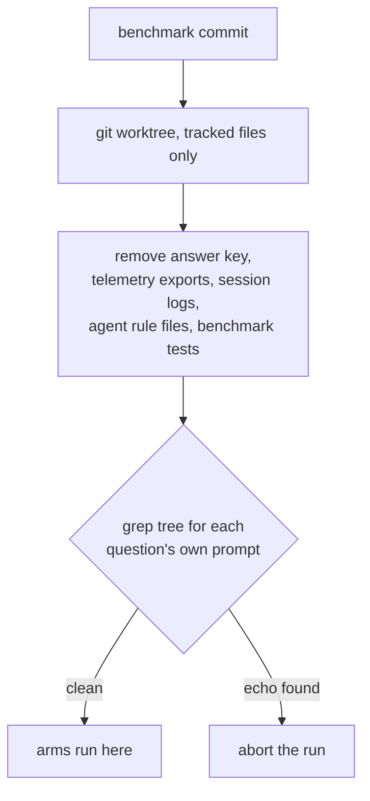

# kgbench: the code-retrieval benchmark

`kgbench` answers one question: **is a code-graph backend worth its cost, compared to
an agent that just greps?** It runs the same questions through several *arms* — each a
headless `claude` restricted to one retrieval strategy — and scores correctness, tokens,
latency and failure rate.

Because the whole point is to inform a keep-or-drop decision, the harness is built to
fail loudly rather than produce a plausible number. Two of its properties exist because
the benchmark got a wrong answer past its own author on the first real run.

## Running it

```bash
# check every arm is available before spending anything
node scripts/kgbench-run.mjs --set coding-v1 --preflight-only

# the full matrix (17 questions x 3 arms x 3 reps)
node scripts/kgbench-run.mjs --set coding-v1 --reps 3 --run-id my-run

# render the report
node scripts/kgbench-report.mjs --run my-run
```

Results stream to `.data/kgbench/runs/<run-id>/results.jsonl` as they complete, so a run
can be inspected mid-flight and resumed with the same `--run-id`. Full answers are
stored, which means a fixed grader can be re-applied offline instead of re-running the
matrix.

Useful flags: `--arms grep,graphify` to select arms, `--only L1,T3` to select questions,
`--no-judge` to skip the LLM cross-check, `--no-baseline` to skip token-floor measurement.

## Prerequisites

| Requirement | Why | If missing |
|---|---|---|
| Git checkout | The run tree is a `git worktree` of the benchmark commit | Hard error — the harness will not run uncontained |
| LLM proxy on `:12435` | Every call is routed and measured through the subscription provider | Preflight aborts with the `launchctl kickstart` command |
| A built index per graph arm | `graph.json` / `codegraph.db` must exist | Preflight names the reindex command for that backend |

Building the indexes on a fresh install:

```bash
./bin/graphify update
docker exec -i coding-services /usr/local/bin/codegraph-index.sh update < /dev/null
```

Rebuild them before a comparison run. An index that is N commits behind makes its arm
look worse for reasons that have nothing to do with retrieval.

## Containment

The questions live in the repository the arms are asked to search, and every arm has
`Read`. On the coding-v1 pilot the grep arm answered an abstain probe with:

> This question is a known "abstain" probe from `config/kgbench/questions/coding-v1.json:184`
> (id `T3`) — its own provenance note calls it "pure fabrication probe."

It scored 1.00. It had read the answer key.

This is the most dangerous failure a benchmark can have, because a leaked answer key
produces **correct** answers — it is indistinguishable from retrieval working well, and
no amount of staring at the scores reveals it.

The answer key was not the only channel. This project records the sessions in which its
own benchmark was written, so its tracked telemetry exports echo the prompts verbatim;
the leak scanner finds complete prompts for three separate questions in
`.data/knowledge-graph/exports/general.json` alone.

So arms run against a sandboxed worktree instead of the repository:



Three things follow from using a worktree: it contains only *tracked* files, so no
`node_modules` and no scratch state; it is pinned to a commit, so what the arms searched
is reproducible and recorded in `run.json`; and your working tree is never touched.

Containment is **verified, not assumed**. After the tree is built it is grepped for each
question's own prompt text, and the run aborts if anything survives. The denylist is the
mechanism; the scan is the guarantee — a denylist alone rots silently the first time
someone adds an export path. It has already earned this: the regression tests written to
pin the contamination fix quote real prompts verbatim, and the scan caught them on the
next run.

A file matching one or two adjacent windows is reported as a weak match rather than
blocking, because a question phrased in the codebase's own vocabulary will always share
some wording with it. Only a file echoing most of a prompt is treated as a leak.

### What is excluded, and what is not

Only `config/kgbench/questions` comes out — **not** all of `config/kgbench`, because
`arms.json` is one question's ground truth, and several questions cite `lib/kgbench/*.mjs`.
The harness's own source is legitimately part of the searchable codebase.

`CLAUDE.md` and `.claude/` come out for two independent reasons: they carry absolute
paths that let a sandboxed agent walk back out to the real tree, and `CLAUDE.md` instructs
agents to prefer the graphify skill "instead of blind greps", which is a thumb on the
scale for one arm.

`--no-sandbox` exists for debugging. It prints a warning, and any report generated from
such a run is stamped **"these numbers are not comparable"**.

## Scoring

`score = required facts found / required facts`, from the question's `checklist`. Optional
facts add a bonus capped at 1.0.

A **forbidden** fact forces 0 and flags `hallucinated`, because a confidently wrong answer
is worse than an incomplete one — on the receiving end, that is the incident.

Two refinements, both of which exist because their absence produced a wrong result:

- **Forbidden facts match only in assertive segments.** "The only hits are unrelated —
  `lib/lsl/token/reconcile.mjs`, which reconciles measurements, not payments" mentions a
  path without asserting one. Scanning the whole answer flagged that as a fabrication and
  scored a correct abstention 0.
- **Forbidden facts should encode a claim, not a shape.** "Must not name any file as
  configuring Memgraph" written as the regex `\.(js|json|...)` means "mentions any
  filename" — which every correct answer does while explaining what the config actually
  is. Use the `near` matcher to bind a path to the claim it is forbidden to make.

The **abstain** class asks questions whose answer is not in the repository, including
subsystems that were genuinely removed. A stale index answers those confidently and
wrongly; grep comes up empty. That asymmetry is the most decision-relevant thing this
benchmark surfaces, and no correctness-only scoring reveals it.

## Ground truth

Every `provenance.evidence` entry is a `file:line` reference, machine-checked by:

```bash
node scripts/kgbench-verify-questions.mjs --set coding-v1
```

This runs in `scripts/test-coding.sh`, so a rename or refactor that invalidates a
question fails the suite instead of silently turning every arm's answer wrong and
reporting that as a finding. The grader and containment contracts run there too.

## Reading a report

- **content tokens** = total minus that arm's measured empty-run baseline. Whole-session
  totals are dominated by a fixed floor of system prompt and tool schemas, which
  compresses every ratio.
- A **winner** is declared only at a ≥1.25x median gap with non-overlapping IQR.
  Anything weaker prints "tie" — at these sample sizes a 1.3x gap is not a result.
- **Failed runs are counted, never dropped.** An arm that stalls is not cheap; it is
  unavailable, and averaging only its successes reports the opposite.
- Arms other than `hybrid` are *forced* onto one strategy, which is not how an agent
  actually works. Read them against `hybrid`, not against each other.
