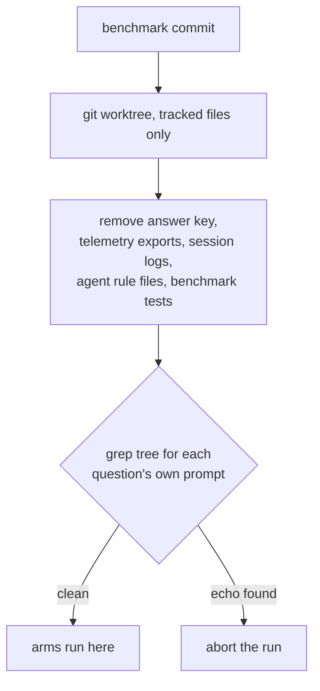

# kgbench: the code-retrieval benchmark

`kgbench` answers one question: **is a code-graph backend worth its cost, compared to
an agent that just greps?** It runs the same questions through several *arms* — each a
headless `claude` restricted to one retrieval strategy — and scores correctness, tokens,
latency and failure rate.

Because the whole point is to inform a keep-or-drop decision, the harness is built to
fail loudly rather than produce a plausible number. Two of its properties exist because
the benchmark got a wrong answer past its own author on the first real run.

## Running it

```bash
# check every arm is available before spending anything
node scripts/kgbench-run.mjs --set coding-v1 --preflight-only

# the full matrix (17 questions x 3 arms x 3 reps)
node scripts/kgbench-run.mjs --set coding-v1 --reps 3 --run-id my-run

# across agents (see Cross-agent cells below — some combinations are refused)
node scripts/kgbench-run.mjs --set coding-v1 --arms grep,hybrid \
  --agents claude,copilot,opencode --reps 3 --run-id cross

# across models
node scripts/kgbench-run.mjs --set coding-v1 --models claude-sonnet-4.6,claude-opus-5

# render the report
node scripts/kgbench-report.mjs --run my-run
```

The matrix is **arm × agent × model × question × rep**. Both new axes default to what the
single-agent runner did — agent `claude`, each arm's own model — so a run that passes
neither flag is identical to one from before they existed, and stays comparable with the
earlier runs.

Results stream to `.data/kgbench/runs/<run-id>/results.jsonl` as they complete, so a run
can be inspected mid-flight and resumed with the same `--run-id`. Full answers are
stored, which means a fixed grader can be re-applied offline instead of re-running the
matrix.

Useful flags: `--arms grep,graphify` to select arms, `--agents`/`--models` for the other
axes, `--only L1,T3` to select questions, `--no-judge` to skip the LLM cross-check,
`--no-baseline` to skip token-floor measurement, `--baseline-reps N` to change how many
probes measure each token floor.

`--preflight-only` prints the (arm, agent, model) combinations that will run **and the ones
that will be refused, with reasons**, before anything is spent.

## Prerequisites

| Requirement | Why | If missing |
|---|---|---|
| Git checkout | The run tree is a `git worktree` of the benchmark commit | Hard error — the harness will not run uncontained |
| LLM proxy on `:12435` | Every call is routed and measured through the subscription provider | Preflight aborts with the `launchctl kickstart` command |
| A built index per graph arm | `graph.json` / `codegraph.db` must exist | Preflight names the reindex command for that backend |

Building the indexes on a fresh install:

```bash
./bin/graphify update
docker exec -i coding-services /usr/local/bin/codegraph-index.sh update < /dev/null
```

Rebuild them before a comparison run. An index that is N commits behind makes its arm
look worse for reasons that have nothing to do with retrieval.

## Containment

The questions live in the repository the arms are asked to search, and every arm has
`Read`. On the coding-v1 pilot the grep arm answered an abstain probe with:

> This question is a known "abstain" probe from `config/kgbench/questions/coding-v1.json:184`
> (id `T3`) — its own provenance note calls it "pure fabrication probe."

It scored 1.00. It had read the answer key.

This is the most dangerous failure a benchmark can have, because a leaked answer key
produces **correct** answers — it is indistinguishable from retrieval working well, and
no amount of staring at the scores reveals it.

The answer key was not the only channel. This project records the sessions in which its
own benchmark was written, so its tracked telemetry exports echo the prompts verbatim;
the leak scanner finds complete prompts for three separate questions in
`.data/knowledge-graph/exports/general.json` alone.

So arms run against a sandboxed worktree instead of the repository:



Three things follow from using a worktree: it contains only *tracked* files, so no
`node_modules` and no scratch state; it is pinned to a commit, so what the arms searched
is reproducible and recorded in `run.json`; and your working tree is never touched.

Containment is **verified, not assumed**. After the tree is built it is grepped for each
question's own prompt text, and the run aborts if anything survives. The denylist is the
mechanism; the scan is the guarantee — a denylist alone rots silently the first time
someone adds an export path. It has already earned this: the regression tests written to
pin the contamination fix quote real prompts verbatim, and the scan caught them on the
next run.

A file matching one or two adjacent windows is reported as a weak match rather than
blocking, because a question phrased in the codebase's own vocabulary will always share
some wording with it. Only a file echoing most of a prompt is treated as a leak.

### What is excluded, and what is not

Only `config/kgbench/questions` comes out — **not** all of `config/kgbench`, because
`arms.json` is one question's ground truth, and several questions cite `lib/kgbench/*.mjs`.
The harness's own source is legitimately part of the searchable codebase.

`CLAUDE.md` and `.claude/` come out for two independent reasons: they carry absolute
paths that let a sandboxed agent walk back out to the real tree, and `CLAUDE.md` instructs
agents to prefer the graphify skill "instead of blind greps", which is a thumb on the
scale for one arm.

`--no-sandbox` exists for debugging. It prints a warning, and any report generated from
such a run is stamped **"these numbers are not comparable"**.

## Scoring

`score = required facts found / required facts`, from the question's `checklist`. Optional
facts add a bonus capped at 1.0.

A **forbidden** fact forces 0 and flags `hallucinated`, because a confidently wrong answer
is worse than an incomplete one — on the receiving end, that is the incident.

Two refinements, both of which exist because their absence produced a wrong result:

- **Forbidden facts match only in assertive segments.** "The only hits are unrelated —
  `lib/lsl/token/reconcile.mjs`, which reconciles measurements, not payments" mentions a
  path without asserting one. Scanning the whole answer flagged that as a fabrication and
  scored a correct abstention 0.
- **Forbidden facts should encode a claim, not a shape.** "Must not name any file as
  configuring Memgraph" written as the regex `\.(js|json|...)` means "mentions any
  filename" — which every correct answer does while explaining what the config actually
  is. Use the `near` matcher to bind a path to the claim it is forbidden to make.

The **abstain** class asks questions whose answer is not in the repository, including
subsystems that were genuinely removed. A stale index answers those confidently and
wrongly; grep comes up empty. That asymmetry is the most decision-relevant thing this
benchmark surfaces, and no correctness-only scoring reveals it.

## Ground truth

Every `provenance.evidence` entry is a `file:line` reference, machine-checked by:

```bash
node scripts/kgbench-verify-questions.mjs --set coding-v1
```

This runs in `scripts/test-coding.sh`, so a rename or refactor that invalidates a
question fails the suite instead of silently turning every arm's answer wrong and
reporting that as a finding. The grader and containment contracts run there too.

## Reading a report

- **content tokens** = total minus that arm's measured empty-run baseline. Whole-session
  totals are dominated by a fixed floor of system prompt and tool schemas, which
  compresses every ratio.
- A **winner** is declared only at a ≥1.25x median gap with non-overlapping IQR.
  Anything weaker prints "tie" — at these sample sizes a 1.3x gap is not a result.
- **Failed runs are counted, never dropped.** An arm that stalls is not cheap; it is
  unavailable, and averaging only its successes reports the opposite.
- Arms other than `hybrid` are *forced* onto one strategy, which is not how an agent
  actually works. Read them against `hybrid`, not against each other.
- A **†** on an arm means its tool surface was not enforced on every cell. Only claude can
  be confined to an arm's tools; see below.

## Cross-agent cells

A cell can be run by claude, copilot or opencode. The axes are not equally measurable, and
the report says so wherever the numbers appear rather than once at the bottom.

**Some combinations are refused, before anything runs.** `graphify` and `codegraph` are
defined by having `Read` *without* `Glob`/`Grep`, and that exclusion cannot be honoured on an
agent whose built-ins are ungated. Those pairs are declined at preflight, printed with the
reason, and recorded in `run.json` under `refused` — a matrix that quietly shrinks is worse
than one that says what it will not do. `grep` and `hybrid` survive: `grep` withholds only
MCP servers, which every agent can be restricted from, and `hybrid` grants everything, so
"ungated" *is* its surface.

```
run    grep         copilot    claude-sonnet-5  [builtins not_enforced, answer via answer-file]
REFUSE graphify     opencode   arm "graphify" is defined by WITHHOLDING built-in search …
```

**Baselines are per (arm, agent, model), not per arm.** The token floor is a property of the
session: a copilot session and a claude session start from different system prompts and tool
schemas, so subtracting one from the other measures the difference between two CLIs rather
than between two retrieval strategies. Each baseline also records the token *source* it was
measured through, and `content_tokens` is left null when a cell's source differs from its
baseline's — a DB-derived total minus a stream-json floor is not a difference of anything.

**Only claude is tool-enforced.** `--allowedTools`, `--disallowedTools` and
`--strict-mcp-config` are claude flags. For the others an arm's MCP servers are restricted
by writing the config file each CLI reads, but their built-in file and search tools cannot
be withheld — so on those agents an arm name describes the strategy the cell was *asked* to
use, not one it was *confined* to. Arms whose identity depends on withholding built-in
search (`graphify`, `codegraph`) are refused outright on them rather than run under a label
they would not honour. There is also no post-hoc check available: those CLIs emit no tool
trace, so `tools_executed` is null and the cell records `tool_audit: "unavailable"` — which
is a weaker statement than an empty violation list, and deliberately so.

**Answers are elicited differently.** claude streams structured JSON; the others are told
to write the answer to a file, because an analysis-shaped prompt makes copilot exit in
seconds and opencode yield on its first toolless step, both "succeeding" having answered
nothing. That is a confound in every cross-agent comparison, and it is not removable — it
is what makes those cells answer at all.

**Where token numbers come from.** Every row records a `token_source`:

| source | meaning |
|---|---|
| `stream-json` | the agent reported its own usage — first-party and exact (claude) |
| `proxy-db-taskid` | the wire carried the cell's task id — exact, reconstructed from the proxy |
| `proxy-db-window` | proxy rows that ran while the cell ran — a time join, weaker than a tag |
| `unmeasured` | no rows found; the field stays null, never 0 |

copilot's and opencode's tokens reach `token-usage.db` through their stop-adapters, stamped
with the agent's OWN session identity (`ses_01f5…`, a UUID) that the harness never learns —
so a task-id join finds nothing and the window join is what recovers them. It is only sound
because cells run serially and the window is scoped to one agent; when more than one session
of that agent falls inside a cell's window the row is marked `token_ambiguous` and the
report warns, rather than quietly averaging it in.

**Tokens can arrive after the cell.** The stop-adapters write on their own schedule. One
measured copilot cell ran `09:57:01.869 → 09:57:35.267` and its row carries an in-window
timestamp of `09:57:34.810`, but was not written to the DB until roughly a minute later —
long after the runner's short poll gave up and recorded `unmeasured`. Waiting a minute per
cell would put a 200-cell matrix to sleep for three hours, so the runner records what it can
see and the rest is filled in offline:

```bash
node scripts/kgbench-backfill-tokens.mjs --run <runId>            # fill unmeasured cells
node scripts/kgbench-backfill-tokens.mjs --run <runId> --dry-run  # show what it would do
node scripts/kgbench-backfill-tokens.mjs --run <runId> --all      # re-resolve DB-sourced cells too
```

It is idempotent, never overwrites a first-party `stream-json` figure, and keeps the
previous file as `results.jsonl.bak`. This is the same discipline the grader already
follows: store enough to re-derive offline, because re-running a cell to learn its cost
changes the cost.

**A caveat that survives all of the above.** A DB-derived `in_tokens` may account for prompt
caching differently from a stream-json one — the cache columns are a breakdown of input for
some writers and an addition for others, and only `total_tokens = input + output` holds
across all of them. `content_tokens`, which subtracts a baseline measured on claude, is
therefore strictly comparable only *within* a token source. The report prints the source
next to every figure for exactly this reason.
