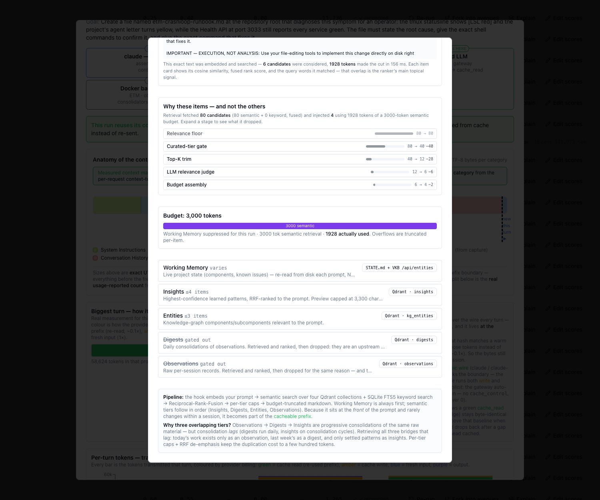
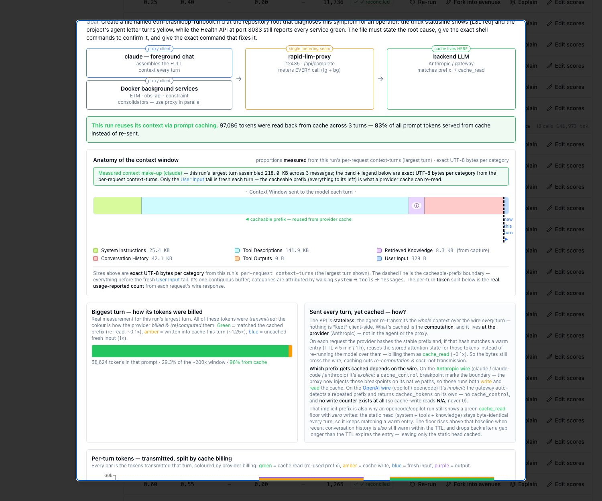
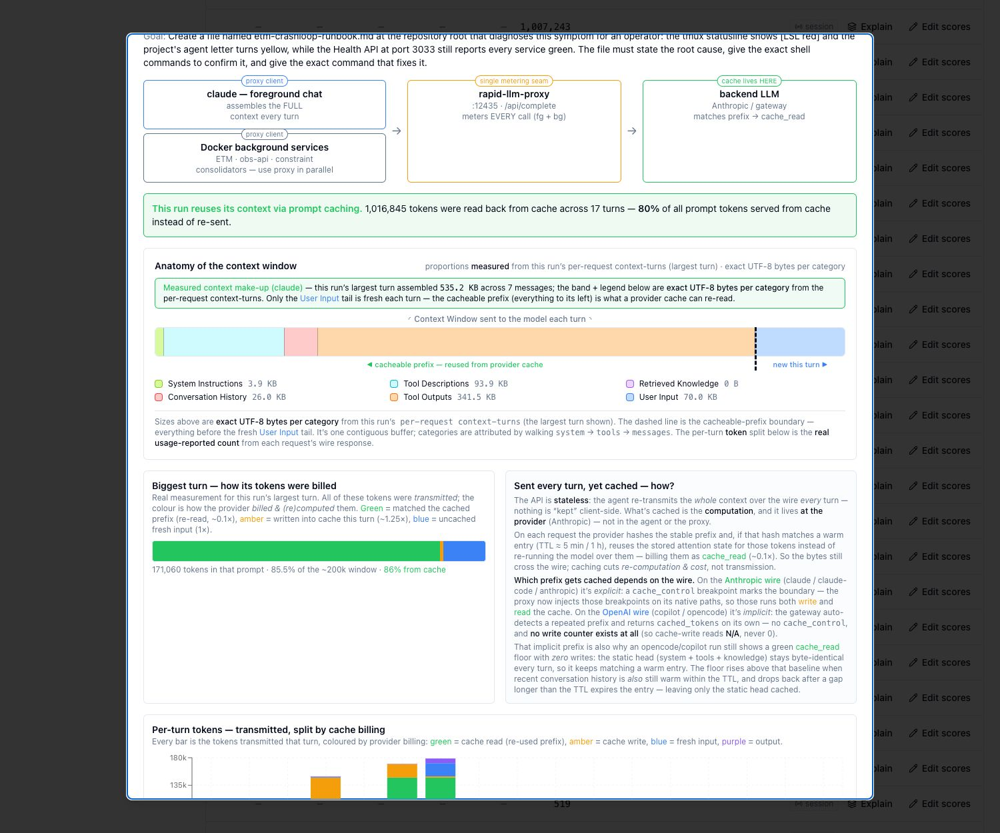

# Does Knowledge Injection Help? A Controlled A/B

This report documents a controlled experiment run on 2026-08-23 that measured whether
automatically injecting curated project knowledge into a coding agent's prompt makes it
better at its task.

It is written to be readable without prior exposure to this codebase, and in that order: what
the test actually is, what was asked, what came back, and what it does and does not support.

The numbers below come from that first round, which used **three hand-picked tasks**. A second
round is under way that chooses its tasks *mechanically* instead, in order to answer the question
the first round could not: how much of the knowledge base is genuinely non-redundant. Its first
attempt failed, for a reason worth reading — see [When we tried to sample](#when-we-tried-to-sample).

A long section on **pitfalls** follows the result rather than preceding it. That is deliberate.
The first two attempts at this experiment produced confident-looking numbers that were **wrong**,
and every measure described there exists to stop that recurring — but none of it is intelligible
before you know what was being measured. Read it as the audit trail behind the numbers, not as a
prerequisite for them.

---

## What the experiment set out to show

The project maintains a knowledge base built from its own history — insights distilled from
past sessions, a knowledge graph of components, daily digests, raw observations. A retrieval
service selects the most relevant pieces for whatever the agent is about to do and prepends
them to the prompt.

That machinery is expensive to build and run. The question it has to answer is simple:

> **Given a task whose answer is recorded in the knowledge base but not in the code, does an
> agent with injection do better than the same agent without it?**

"Better" is deliberately narrow here: does it produce a *correct* answer, and at what cost in
tokens, tool calls and wall-clock time.

---

## What kind of test this is

This is frequently mistaken for a needle-in-a-haystack test. It is the opposite, and the
difference decides how the results should be read.

A needle-in-a-haystack test plants a fact *inside* a long context and asks whether the model can
still find it. The needle is in the haystack; the question is attention over distance.

Here the fact is deliberately **absent** from the haystack. Both arms are dropped into the same
frozen copy of the repository, with the knowledge base stripped out of it. Only the treatment arm
additionally receives the fact — a few kilobytes of retrieved insights, prepended to its system
prompt. It is a **closed-book / open-book exam in which the textbook does not contain the
answer**: both students get the repository, one also gets the lecturer's private notes, and the
exam question is one the textbook never covers.

That framing splits the headline question into two independent ones, and a task is only
informative if both are live:

1. **Does the treatment arm use what it was handed?** Having a fact in the prompt does not put it
   in the answer. One task in this run received the correct knowledge and wrote a runbook
   contradicting it.
2. **Can the control arm reconstruct the fact from the repository?** If it can, the knowledge base
   is redundant *for that task* — the project is paying to store something the code already says.

Every combination of those two carries a different meaning, and all four occurred at some point
during the design:

| kb-on produces it | kb-off produces it | What it means |
|---|---|---|
| yes | no | Injection carried the answer. **The task discriminates** — this is the measurable case. |
| yes | yes | The repository already answers it. The task is uninformative and the KB adds nothing here. |
| no | no | Either the gate demands something the KB does not contain, or the task is beyond both arms. |
| no | yes | Injection actively **hurt**. Investigate — this happened, and the reason is the most transferable finding in this report. |

Getting a task into the first row is the hard part, and it is where three earlier attempts failed.
It requires a fact that is simultaneously carried by the knowledge base, absent from the
repository, and naturally demanded by a realistic goal — an intersection that is nearly empty,
because knowledge-base insights are prose *about* this repository and therefore tend to name
identifiers that also exist in it.

---

## The two tasks, verbatim

Each arm receives the goal sentence below and nothing else task-specific. Same model, same
snapshot, same tools; the injected block is the only difference.

### Task 1 — `kb-ab-etm-crashloop`

> Create a file named `etm-crashloop-runbook.md` at the repository root that diagnoses this
> symptom for an operator: the tmux statusline shows `[LSL red]` and the project's agent letter
> turns yellow, while the Health API at port 3033 still reports every service green. The file must
> state the root cause, give the exact shell commands to confirm it, and give the exact command
> that fixes it.

The real cause is a hand-made symlink — `node_modules/@fwornle/km-core`, which appears in no
`package.json`, so `npm install` neither creates nor restores it. When it disappears, every
telemetry-writer spawn dies instantly, yet the Health API stays green *because the writer is not a
service*. Nothing at the import site hints at any of this.

| Fact | Pattern | Why it is decisive |
|---|---|---|
| `symlink-path` | `node_modules/@fwornle/km-core` | The root cause. The import site gives no hint that the dependency is a hand-made link. |
| `fix-command` | `ln -s` | An agent that only diagnoses has not finished the task. |
| `launchctl-check` | `launchctl` | The crash-loop is visible as a non-zero exit in the launchd job, not in any service log. |
| `health-is-wrong-place` | *green **because** it is not a service* | The decisive insight — it explains why the obvious diagnostic tool lies. |

### Task 2 — `kb-ab-leveldb-amplification`

> Create a file named `leveldb-amplification-runbook.md` at the repository root that diagnoses
> this symptom for an operator: a dashboard HTTP route that only READS data is polled every 30
> seconds, and the container serving it is killed by the kernel out-of-memory killer on roughly
> every poll, even though its own startup logs are clean and fast. The file must state the root
> cause, name the option that fixes it, and give a cheap positive test that confirms the diagnosis
> before any fix is applied.

The cause is a chain no single file states: the graph store's `close()` persists by default, and
it writes the *whole* graph as one value under one key — so a store opened purely to read rewrites
everything on close. At one megabyte per poll against an eight-megabyte graph, `open()` alone
eventually exceeds the container's memory limit.

| Fact | Pattern | Why it is decisive |
|---|---|---|
| `persist-option` | `persistOnClose` | The option that fixes it. It landed *after* the snapshot, so it cannot be found in the sandbox at all. |
| `read-open-still-writes` | *close persists even on a read-only open* | The mechanism. Reaching it without the KB means inventing the close-path behaviour — measured 0/3 in the control and 0/3 with no knowledge at all. |
| `cgroup-not-docker-stats` | `memory.events` / `cgroup` | Pure experience: `docker stats` under-reports, because the spike outruns its one-second sampling. |
| `cheap-positive-test` | `du -sh` / `.ldb` | The goal demands confirmation before a fix — one GET adding a megabyte of SST files is it. |

### Task 3 — `kb-ab-llm-routing` *(retired)*

> Create a file named `llm-routing-runbook.md` at the repository root explaining to an operator how
> this project decides which provider and model serves a given background job. The file must say
> where the routing configuration lives, what each provider declares about the models it can serve,
> what happens at start-up when that configuration cannot be parsed, and how a change to it is
> picked up.

Retired after the run, for a reason that turned out to be worth more than the task. See
[Where injection fails](#where-injection-fails-it-fails-in-an-interesting-way).

### How a deliverable is graded

`node scripts/kb-ab-assert.mjs <topic>` reads the produced file and tests each pattern against it.
There is **no model in the loop** — grading is a conjunction of regular expressions, so it cannot
drift between runs. Two numbers are reported:

- **Facts** — the mean count of the four patterns present. Partial credit, showing *how far* an arm
  got.
- **Accepted** — the all-four conjunction. A cell passes only if it produced every required fact.

The obvious objection to regex grading is that it tests for a string, not for understanding: a cell
could in principle emit the right token inside a wrong sentence. Three things bound that risk. The
gate is a conjunction of four *independent* facts spanning cause, confirmation and fix, which is
hard to satisfy accidentally. The facts were selected empirically against deliverables already on
disk rather than chosen by intuition (see [pitfall 4](#4-a-gate-demanding-a-fact-the-knowledge-base-does-not-contain)).
And the judge separately scores the remaining rubric dimensions from the diff, so a cell that games
the strings does not thereby score well overall. Grading was previously a single `grep` for one
token; that gate could not tell diagnosing the cause apart from giving the fix, and every cell of an
earlier run passed it while differing sharply in what it actually explained.

---

## Terminology


Terms used throughout, defined once.

| Term | Meaning |
|---|---|
| **Arm** | One side of the comparison. `kb-on` receives injected knowledge; `kb-off` is identical in every other respect and receives none. |
| **Cell** | One execution: a single arm × a single repeat of a single task. This run had 18 cells. |
| **Spec** | A task definition — goal sentence, deliverable filename, grading rule, number of repeats. |
| **Snapshot** | A frozen copy of the repository at a known commit, plus its knowledge base and config, from which every cell starts. Guarantees all cells begin from identical state. |
| **Sandbox** | The throwaway working directory a cell runs in, materialised from the snapshot. Discarded afterwards. |
| **Fact** | One checkable claim the deliverable must contain, expressed as a regular expression. |
| **Conjunction gate** | A cell passes only if it produces **all** required facts. Replaces earlier single-token grading. |
| **Coinage** | Whether a model produces a fact unprompted, from its own prior knowledge, with no repository and no knowledge base. A fact the model coins cannot distinguish the arms. |
| **Recoverable** | Whether the control arm could find a fact by searching the sandbox. |
| **Leak** | Any path by which a cell reaches information outside its sandbox — the failure mode this experiment spent most of its effort eliminating. |

---

## How injection works


Every prompt the agent submits triggers a retrieval pass. The dashboard exposes exactly what
happened on each one, which is what makes the experiment auditable rather than a black box.

### What gets retrieved, and what gets rejected



The panel above is from a real `kb-on` cell in this run. Reading it top to bottom:

- **The prompt that drove retrieval** is shown verbatim. It is embedded and searched — nothing
  else is used as the query.
- **80 candidates** were fetched (80 by semantic similarity, 0 by keyword search) and fused.
- Five stages then reduce 80 to 4:

| Stage | In → Out | What it does |
|---|---|---|
| Relevance floor | 80 → 80 | Drops candidates below a similarity threshold. Nothing fell out here. |
| Curated-tier gate | 80 → 40 (−40) | Drops whole content tiers — see below. |
| Top-K trim | 40 → 12 (−28) | Keeps only the best-ranked candidates per tier. |
| LLM relevance judge | 12 → 6 (−6) | A model reads each survivor and rejects the ones that do not actually bear on the prompt. |
| Budget assembly | 6 → 4 (−2) | Fills the token budget in rank order; the rest do not fit. |

- **Budget: 3,000 tokens**, of which **1,928 were actually used**. The budget is the binding
  constraint on how much knowledge reaches the model.
- The tier table shows *why* whole categories were rejected. **Digests** and **Observations**
  are retrieved and ranked, then deliberately **gated out**: digests are an upstream precursor
  of insights rather than independent knowledge, and observations outnumber insights roughly
  11:1, so they crowd the budget without adding information. Only **Insights** (≤4 items) and
  **Entities** (≤3 items) survive into the prompt.

This is the sense in which "rejected" is meaningful here: rejection happens at five distinct
stages for five different reasons, and the panel attributes each drop to its stage.

### What actually gets injected



The same cell's context window, measured in exact bytes rather than estimated. **Retrieved
Knowledge: 8.3 KB** is the injected block. It sits near the front of the prompt, ahead of the
conversation, which is also why it is cheap: it becomes part of the cacheable prefix and is
re-read from the provider cache on later turns rather than re-sent.

### The control arm, for contrast



The same task, same model, `kb-off`. **Retrieved Knowledge: 0 B.** Note what replaces it: the
largest turn is **535.2 KB across 7 messages** versus the treatment cell's **218.0 KB across
3**, and **Tool Outputs alone are 341.5 KB** against the treatment's 0 B. The control arm is
not idle — it is searching the repository hard, and paying for it. Whether that search
succeeds is the experiment.

---

## Methodology


**Design.** Two arms, three tasks, three repeats per arm — 18 cells. The only difference
between arms is whether the injected block is present. Same model (`claude-sonnet-4-6`), same
snapshot, same goal text, same tooling.

**Task selection.** A task only carries information if the answer is in the knowledge base and
*not* reachable from the code. Each task grades a piece of operational know-how that was
learned after the snapshot was taken.

**Grading.** Each deliverable is checked against a conjunction of required facts. Partial
credit is reported (facts present) but a cell is only *accepted* if it produces all of them.
Grading is mechanical — regular expressions over the produced file — with no model in the loop,
so it cannot drift.

**Cost measurement.** Tokens, tool-call counts and wall-clock are recorded per cell from the
proxy that meters every LLM call.

---

## Results


18 cells, zero leaks, zero untraced cells, all treatment cells confirmed injected.

| Task | Arm | n | Facts | Accepted | Steps | Seconds | Tokens |
|---|---|---|---|---|---|---|---|
| etm-crashloop | **kb-on** | 3 | **4.00 / 4** | **3 / 3** | 1.7 | 35 | 3,955 |
| | kb-off | 3 | 1.33 / 4 | 0 / 3 | 41.0 | 429 | 31,905 |
| leveldb-amplification | **kb-on** | 3 | **4.00 / 4** | **3 / 3** | 1.3 | 38 | 3,788 |
| | kb-off | 3 | 1.00 / 4 | 0 / 3 | 12.0 | 179 | 9,665 |
| llm-routing *(retired)* | kb-on | 3 | 1.00 / 4 | 0 / 3 | 44.0 | 222 | 14,881 |
| | kb-off | 3 | 2.00 / 4 | 0 / 3 | 5.0 | 394 | 27,305 |

### Where injection works, it works decisively

On both surviving tasks the treatment arm produced **every** required fact in **every** repeat,
while the control produced roughly one in four and never passed the gate.

The per-fact breakdown shows the split is not uniform — it falls exactly where knowledge is
required rather than reasoning:

```
etm-crashloop  kb-on   symlink-path 3/3   fix-command 3/3   launchctl 3/3   health-insight 3/3
               kb-off  symlink-path 0/3   fix-command 0/3   launchctl 3/3   health-insight 1/3
```

The control reliably produces the fact that can be inferred (`launchctl`) and sometimes the
reasoning step, and **never** the two facts that must be known.

**Cost runs the same direction.** On `etm-crashloop` the control used **24× the steps, 12× the
wall-clock and 8× the tokens** — and still failed. Injection was not a trade of cost for
accuracy; it was cheaper *and* correct.

### Where injection fails, it fails in an interesting way

The third task was **retired**, and the reason is the most transferable finding here.

Its treatment arm scored **worse than its control** (1.00 vs 2.00 facts) while making 44 tool
calls to the control's 5. This was not a delivery failure: replaying the exact retrieval showed
the injected block **did** contain the two facts the arm scored 0/3 on, and the same injection
path fed the two successful tasks in the same run.

The cause is a **conflict between injected knowledge and the repository**. The graded facts
describe configuration living in a *separate* repository; meanwhile this repository ships its own
older, plausible, contradicting configuration file. The cells explored, found the local file, and
wrote about that.

> **When a repository contains a confident answer that contradicts injected knowledge, the model
> believes the repository — and searches harder to confirm it.**

Attempting to rescue the task by re-selecting its graded facts was tried and failed: mining every
candidate from the injected block returned **zero** usable facts, because every term the treatment
arm wrote was also grep-able from its own sandbox and also appeared in the control. There was
nothing left to grade.

---

## What this establishes — and what it does not

The effect above is large and perfectly consistent, which makes it easy to over-read. Three
constraints bound what it supports.

**The tasks were selected, not sampled.** They were written *because* their answers live in the
knowledge base and not in the code. That yields an existence result — when injection helps, it
helps decisively and costs less — and it says nothing about how often that case arises in real
work. A larger set of hand-picked knowledge-decisive tasks would tighten the confidence interval
around a number that is biased by construction.

**The denominator is three, not two.** The retired task is a result, not an administrative
nuisance. One of three hand-picked tasks — picked with a thumb on the scale for the treatment —
had its effect **reversed** by a stale file sitting in the repository. On a curated set biased
toward success, that adverse rate is arguably the more decision-relevant number of the two.

**The statistics are conditional on that selection.** Pooling the two surviving tasks gives 6/6
accepted against 0/6 (Fisher exact, one-sided *p* ≈ 0.001); a single task alone gives 3/3 vs 0/3,
*p* = 0.05. Those quantify how *consistent* the effect is within these tasks. They are not the
probability that injection helps on an arbitrary task, because the tasks were not drawn at random.

**And the deliverable is a document, not working code.** Nothing here shows that injection improves
software that has to compile and pass tests.

---

## Where this goes next

Two questions follow naturally from the limits above: would more tasks give statistically
meaningful evidence, and would programming tasks — rather than retrieval-shaped ones — work at all?

### More tasks, but sampled rather than curated

The binding constraint is task *provenance*, not cell count. Ten more hand-written
knowledge-decisive tasks would narrow the interval around a biased estimate without making it less
biased. The change that buys genuine evidence is to define a population and sample from it:

1. Take every knowledge-base insight above a confidence threshold and mechanically derive a runbook
   goal from the symptom it describes.
2. Apply the recoverability audit as a **blind inclusion filter**, before any cell runs — not as a
   post-hoc explanation for tasks that disappointed.
3. Run whatever survives, and report **two** numbers rather than one:
    - the **discrimination rate** — what fraction of knowledge-derived tasks the control arm cannot
      solve, which is a direct measure of how much of the knowledge base is *non-redundant*;
    - the **effect size on the tasks that do discriminate**, which is what this run already has.

The first number is the one that justifies the system's cost, and it is currently unknown. It is
also the number that would put the retired task's failure mode on a proper denominator.

Three cheaper power upgrades need no new tasks at all:

- **More models.** Everything here ran on a single pinned model. A result that holds only for one
  model is not a property of the knowledge base. The matrix already carries an agent/model axis.
- **Cost as a co-primary outcome.** Steps, tokens and wall-clock separated the arms by factors of
  8 to 24. They are continuous and low-variance, so they carry far more statistical power per cell
  than a binary gate — and they remain informative even when correctness ties.
- **More repeats, where they help.** Within-arm variance was effectively zero on the surviving
  tasks, so repeats buy little there. They become necessary as soon as the task type is noisier —
  which is exactly the programming case.

### When we tried to sample

That plan was executed on 2026-08-24, and the first full round — **eight tasks, 48 cells** — came
back with seven of the eight marked `neither-solves`, the label for *neither arm passed*.

That is not a finding about the knowledge base; it is the signature of a broken gate. The giveaway
was the treatment arm's own scores: 0/3, 1/3, 0/3, 2/3, 0/3, 0/3, 0/3, 1/3 — on conjunctions built
for it, with the answer sitting in its prompt. A gate the treatment arm cannot pass *with the answer
in hand* is measuring its own difficulty, not the agent's knowledge.

**The cause was a condition mismatch, not a lax filter.** A fact had been kept only if it appeared
in every *reference* runbook — an ideal answer written by a model handed the insight directly. But a
reference is written with no sandbox, no tools, no instruction to actually do the work, and no
pressure to be brief; a real cell writes under all four. Every fact in a conjunction can appear in
every reference and the conjunction can still be jointly unsatisfiable for an agent doing the job
for real.

**The fix was to stop predicting what a good answer looks like and read one.** Gates are now mined
from what the treatment arm *actually wrote*: the injected arm runs first, three times per task, and
a fact is eligible only if it appears in **every one** of those deliverables. A task that produced
fewer than two is dropped outright — one deliverable cannot show that a fact is stable rather than
incidental.
This is not a new idea. It is how the three curated tasks in this report were built, which is
precisely why they never had this problem.

**What that conditions, stated plainly.** Mining the gate from injected output means the treatment
arm passes its own gate close to by construction — so "the treatment arm scored well" stops being
evidence of anything, and must never be reported as if it were. The quantity that survives is the
other one: **what fraction of knowledge-derived tasks the control arm cannot reproduce.** That is
the discrimination rate this round exists to measure, and it stays a genuine measurement for one
reason — **the control arm is never consulted while the gate is being built.** Nothing the control
arm does can widen or narrow the set of facts it is later graded on.

The blind filters from the original design still apply, and are now shared as code rather than
restated: a fact must survive a shape check, must appear in the block the agent is actually handed,
must not be something the model already writes unprompted, and must not be given away by the goal
sentence itself.

The round is in flight at the time of writing, over roughly thirty sampled tasks. Its gates are
written alongside the originals rather than over them, so a partial pass cannot leave a half-stale
matrix behind.

### Programming tasks: possible, but grade a different thing

The concern that non-determinism will drown the signal is the right concern, in the wrong place.
The problem is not that programming outcomes are stochastic; it is that a programming cell can fail
for many reasons that have nothing to do with knowledge — a botched edit, a tool error, a timeout,
a flaky test. That variance is unrelated to the treatment and it lands directly on a binary
pass/fail outcome. Four measures keep the signal above it.

- **Grade the knowledge-dependent step, not the whole solution.** Not "does the feature work", but
  "does the diff touch the right file and encode the right mechanism", with the existing test suite
  as a guard against regression. This isolates the knowledge signal from general coding competence,
  which is not what the experiment is about.
- **Choose bugs where diagnosis is hard and the fix is small.** This project's own history is full
  of them — each recorded lesson is a symptom whose obvious cause is wrong. A recent example: a test
  that passed alone and failed in a batch, where the obvious explanation (cross-file interference)
  was wrong and the real cause was a wall-clock race against synchronous filesystem work. An agent
  without that lesson chases the obvious explanation; the fix itself is a few lines.
- **Measure the noise before designing around it.** Run one candidate programming task ten times on
  the *control arm only*. That gives the within-arm pass rate and its variance directly, and from it
  the number of repeats needed to detect a given effect. This is an afternoon's pilot, not a guess —
  and it is the step that answers the question rather than arguing about it.
- **Keep cost in the outcome set.** Correctness is more likely to tie on programming tasks, because
  a determined agent can often grind its way to a working answer. The cost difference is where the
  effect will show, and it is the cheaper measurement.

Three things genuinely get harder, and should be planned for rather than discovered:

- **The snapshot must build and test.** The documentation tasks needed only a filesystem. A
  programming task needs dependencies restored in the sandbox, which for this repository means
  submodules whose build output is not tracked in version control. That is real engineering work
  before the first cell runs.
- **The contradiction failure mode gets worse, not better.** The retired task failed because the
  repository held a confident, stale, wrong answer and the agent believed it over the injected
  knowledge. Code is far more likely than operational lore to have a competing implementation
  sitting in plain sight. Every programming spec needs the check that task lacked: does the sandbox
  contain a rival answer to this goal?
- **A diff is more forgiving to grade than a file.** A regex conjunction over a produced runbook is
  unambiguous. A diff can achieve the right outcome in a shape no pattern anticipates. Expect the
  test suite to become the primary gate with the pattern conjunction as corroboration, rather than
  the reverse.

**Suggested order.** Sample the documentation-task population first: it is cheap, it reuses
machinery that already works, and it produces the discrimination rate — the single number that
justifies or condemns the whole knowledge-injection system. Then pilot one programming task purely
to measure its noise. Then decide whether a full programming matrix is worth its cost, on evidence
rather than on intuition about how noisy such a matrix would be.

---

## Pitfalls, and the measures built to defeat them

Every item below is a real failure that produced plausible but invalid results, followed by the
measure now in place. Together they are the reason the table above can be believed: three of these
were found *after* a run had already produced a clean-looking set of numbers.

They are also the transferable part. The specific facts being graded are peculiar to this project;
the ways an isolated experiment turns out not to be isolated are not.

### 1. The sandbox leaked the answer

**Three independent leaks were found, each invalidating a run.**

The first was an allow-list file in the snapshot that named the host's agent-memory directory
by absolute path. Cells followed the pointer and read the answer directly. Stripping the file
closed it — and the next run still leaked.

The second was **project identity via git**. Sandboxes were created with `git worktree`, which
keeps pointing at the origin repository's `.git`. The agent runtime derives a session's project
— and therefore the memory index injected into its system prompt — from that. Cells were handed
the real project's memory index and read the graded fact out of it as their *first tool call*,
in **both arms**.

Two proposed fixes were tested and **both failed**: scrubbing every repository-naming
environment variable changed nothing, and moving the sandbox outside the repository tree
changed nothing. The channel is the git linkage itself. The measure that works is to give the
sandbox **its own `.git`** — an independent local clone at the same commit, with the origin's
module store copied in so submodules resolve without network access.

The third was the **parent-directory rules walk**. Agent instruction files are discovered by
walking *up* from the working directory. A file at the user's home directory therefore reaches
any sandbox beneath it, and this project's own instruction file contains **all nine graded
facts verbatim**. No in-sandbox strip can remove a file that lives in an ancestor directory.
The measure is to place sandboxes outside that ancestry entirely.

> **Generalisable lesson.** Isolation is not one thing. A sandbox can be isolated by filesystem
> location and still leak through version-control identity, ambient configuration discovery, or
> inherited environment. Each channel has to be closed and *verified* separately.

**Verification measure.** Every cell's transcript is now audited for paths outside its sandbox,
and the audit is reported *beside* the results rather than after them. This run: **0 leaks
across 18 cells**.

### 2. "Grep-able" is not "recoverable"

One task was designated a null control on the reasoning that all its facts are findable by
searching the sandbox. They are. Under clean isolation the control arm searched **123 times
across three cells and still never found two of the four facts**.

The measure is to stop treating static searchability as decisive. A static audit still runs and
reports whether a fact is reachable, but its verdict is advisory; the empirical arm difference
is the evidence. The audit's own documentation notes it over-reports by design.

### 3. Testing coinage on the wrong model

A fact was retired as "the model just invents this" on the strength of a probe that had
silently run on a cheaper model than the one answering the cells. Re-run on the correct model,
the fact was coined **0 times out of 3** — the original retirement was wrong, and the fact was
in reality being supplied by a leak.

**Measure:** the coinage probe runs on the cell's actual model, in a bare directory with no
repository and no knowledge base, and every graded fact is checked against it.

### 4. A gate demanding a fact the knowledge base does not contain

One fact scored **0 out of 6 across both arms**. That reads like a hard task; it was a broken
gate. The phrasing existed in the project's instruction file but not in the knowledge base, so
retrieval could never inject it and the treatment arm could not possibly supply what the gate
demanded.

**Measure:** candidate facts are now selected **by measurement** against deliverables already on
disk, and must satisfy four conditions — present in the injected block, absent from the sandbox,
produced by the treatment arm, and absent from both the control arm and bare-model coinage. When
this was applied, one plausible-looking candidate turned out to appear in **3/3 control cells and
2/3 coinage runs** while the treatment arm never wrote it. It would have graded backwards.

### 5. Silent mis-measurement from a path-encoding mismatch

Moving sandboxes to the system temp directory broke transcript location in two ways at once, on
macOS: `/var` is a symlink to `/private/var`, so the recorded path and the resolved path
disagreed; and the temp path contains an underscore, which the agent runtime rewrites when
naming its per-project transcript directory while the harness's locator does not.

The result was not an error. Cells closed as **`complete` with a null step count** — scored as
trivial runs, with a plausible score attached. Caught on the *first* cell because step counts
were checked before trusting anything.

**Measure:** two assertions now fail the restore loudly — the sandbox path must be its own
canonical path, and it must contain only characters both encoders agree on. Both are enforced on
the production path only, since injected test stubs legitimately use paths of the rejected shape.

### 6. An audit that over-reported leaks

The leak audit initially scanned the entire tool-call input, which counted paths appearing in
text the agent *wrote* — a runbook mentioning a log file path — as if the agent had accessed it.
Two cells were wrongly flagged.

**Measure:** the audit scans only fields denoting access (`file_path`, `command`, `path`, …) and
explicitly excludes authored content. Absolute paths legitimately exist inside the restored tree,
so quoting one is not an escape.

### 7. A dependency that fails open

The retrieval service was found **wedged** mid-run — process alive, port unresponsive. Injection
is deliberately fail-open, so a treatment cell retrieving against a dead service gets **zero
knowledge and still completes normally**. The arm would have been silently untreated.

**Measure:** injected byte counts are logged per cell and checked for consistency, and service
health is monitored for the duration of a run. In this run all nine treatment cells logged
identical injection sizes within their task (5,395 / 5,519 / ~9,000 chars), confirming none was
degraded.

---

## Recommendations


**For this knowledge-injection system**

1. **Keep it, for knowledge that is not in the code.** Two tasks showed a large, cheap, repeatable
   win precisely where the answer is operational know-how rather than something derivable from
   source.
2. **Treat contradiction as a first-class failure mode.** Injection does not override what the
   agent can read. Where injected knowledge supersedes something still present in the repository,
   expect the repository to win. The practical mitigation is to fix or remove the stale artefact,
   not to inject harder.
3. **Do not let the dependency fail silently.** A fail-open retrieval path plus a wedged service
   produces an untreated arm that looks normal. Injected byte counts should be asserted, not
   merely logged.

**For anyone running a similar experiment**

4. **Verify isolation empirically, per cell, and report it beside the results.** Not as a
   precondition assumed once. Three separate leaks survived at least one round of "we fixed that".
5. **Prefer a direct probe to an inference about the mechanism.** The decisive test throughout was
   a no-tools question — *"name your memory directory from your system prompt alone"* — which
   settled in seconds what two rounds of reasoning had got wrong.
6. **Select graded facts by measurement.** Require: present in the treatment input, absent from
   the control's reach, produced by the treatment, absent from the control and from bare-model
   coinage. Facts chosen by intuition graded backwards in this experiment more than once.
7. **Check the cheap invariants before trusting a batch.** A null step count on cell one saved a
   50-minute run that would have produced a full, plausible, meaningless table.

**Limits** are stated in full under [What this establishes — and what it does
not](#what-this-establishes-and-what-it-does-not), and the concrete next steps — sampling a task
population rather than curating one, and whether programming tasks can carry the same measurement —
under [Where this goes next](#where-this-goes-next).

---

## Reproducing


```bash
# Run a spec (both arms, three repeats)
node scripts/experiment-run.mjs --spec config/experiments/kb-ab-etm-crashloop.yaml

# Grade a produced deliverable against its conjunction gate
node scripts/kb-ab-assert.mjs kb-ab-etm-crashloop

# Check that the control arm cannot reach the graded facts by searching
node scripts/experiment-audit-recoverability.mjs --spec config/experiments/kb-ab-etm-crashloop.yaml
```

Fact definitions, and the retirement note explaining why the third task could not be rescued,
are in `lib/experiments/kb-ab-facts.mjs`.

The sampled round adds two steps in front of that, because its gates are derived rather than
written by hand:

```bash
# Build the injected-arm-only specs whose deliverables the gates are mined from
node scripts/kb-ab-make-mine-specs.mjs

# Mine each task's gate from those deliverables
# --dry-run reports what would be kept without calling a model or writing anything
node scripts/kb-ab-mine-facts.mjs --dry-run
```

## See also


- [The /experiment Skill](experiment-skill.md) — running experiment matrices
- [Experimental Design](kgbench-experimental-design.md) — design principles for the retrieval benchmark
- [Measurement & Judging Lessons](../benchmarks/measurement-lessons.md)
