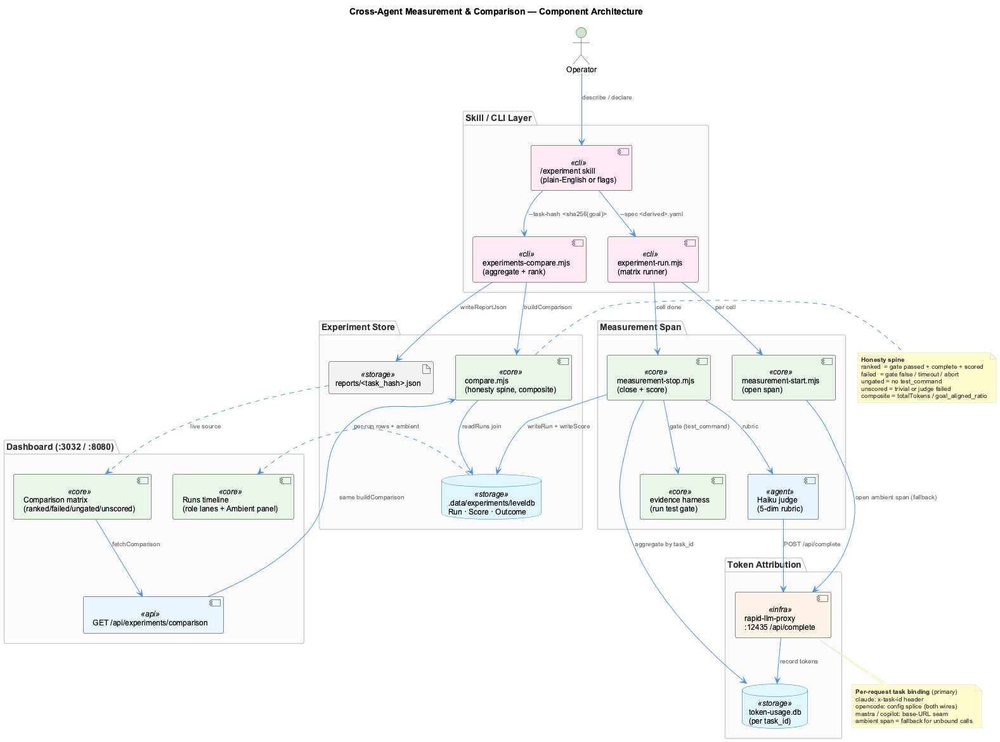

# Measurement & Cost Optimization

## Overview

This project can run the **same coding task across multiple agents, models, and methodologies**, measure what each one actually costs, and rank them by **cost-per-unit-quality** — so you can choose the cheapest option that still does the job. It turns "which model should I use?" from a guess into a measured decision.

Every run is measured on three axes:

- **Tokens** — the direct cost proxy (input + output + reasoning).
- **Wall-clock** — user-perceived latency.
- **Quality** — a `goal_aligned_ratio` (0–1) from a rubric judge, gated by an objective pass/fail test.

The headline number is the **composite**:

```
composite = totalTokens / goal_aligned_ratio      (lower = cheaper per unit quality)
```

A variant that is 3× cheaper but only 10% lower quality usually wins on composite — and this tooling makes that trade-off visible instead of hypothetical.



---

## The mental model: Run → Score → Comparison

1. **Run** — one execution of the goal by one variant `(agent × model × framework × env)`, repeated *N* times. Each run records its tokens, wall-clock, and route heuristics.
2. **Score** — after the run, an objective **test gate** decides pass/fail, and a 5-dimension rubric judge (Haiku) produces the quality signal.
3. **Comparison** — runs sharing a `task_hash` (the sha256 of the goal sentence) are aggregated per variant (`mean ± stddev`, median, min/max, *n*) and ranked.

### The honesty spine

A comparison never fakes a winner. Every variant lands in exactly one group:

| Group | Meaning | Ranked on cost? |
|-------|---------|-----------------|
| **ranked** | Test gate passed, run completed, rubric scored | ✅ yes |
| **failed** | Test gate failed, or the run timed out / aborted | ❌ shown, never cost-averaged |
| **ungated** | No objective test was supplied | ❌ compared on tokens/wall-clock only |
| **unscored** | Trivial run, or the judge could not score it | ❌ shown separately |

If nothing passed the gate, the **ranked** section is empty — and the dashboard shows "— none —" rather than crowning a failed variant. This is why supplying a **test gate** matters: it's what makes variants *rankable*.

---

## Ambient, measurement, experiment — three layers

Measurement happens at three levels, and only the top two ask anything of you:

- **Ambient (always-on).** Every LLM call that routes through the `rapid-llm-proxy` is recorded passively, and the `auto-measure-foreground` daemon (`com.coding.auto-measure-foreground`, every 120s) writes one dashboard **Run per OpenCode session** — including bypass-provider sessions (e.g. copilot-BYOK) that never hit the proxy. You get a token/route timeline for *all* work without asking. It attributes cost but does **not** run the judge, so ambient Runs carry no quality **Score**.
- **Measurement** — the Performance tab's **Start measurement** button. Opens a **named span** with a `task_id` + one-sentence goal you choose, so a specific task's tokens attribute to a stable `task_hash` (`sha256(goal)`); **Stop** then triggers the heavy close (token-aggregate + judge + score) that ambient skips. Reach for it when you want *one* hand-run task to be a scored, re-runnable, comparable unit — it is effectively a single manual experiment cell.
- **Experiment** — the **Launch experiment** button, or the [`/experiment` skill](experiment-skill.md). Runs a whole matrix (`variants × repeats` cells, each measured, gated, judged), ranks them, and writes the report the **Comparison** tab reads.

The **Performance** tab surfaces all three: the **Runs** table (every measured/ambient Run), each run's role-lane **timeline** with its **Ambient activity panel**, and the **Comparison** tab.

## When to reach for it

- **Choosing a model** — is Haiku good enough for this class of task, or do you need Sonnet/Opus?
- **Choosing an agent** — Claude vs OpenCode vs Copilot on the same goal.
- **Choosing a methodology** — straight prompting vs TDD framework, KB-injection on vs off.
- **Justifying a switch** — turning "Haiku feels fine" into "Haiku is 0.85 quality at ⅓ the tokens on `new-feature` tasks, n=5."

## Where to look

- **Run it:** the [`/experiment` skill](experiment-skill.md) — describe an experiment in plain English (or with flags) and it drives the whole pipeline.
- **How it works:** [Architecture](architecture.md) — the end-to-end measurement sequence and data model.
- **Do it now:** the [Tutorial](tutorial.md) — a 5-minute walkthrough from a plain-English description to a cost decision.

**Dashboard:** [http://localhost:3032](http://localhost:3032) → **Performance** tab.
