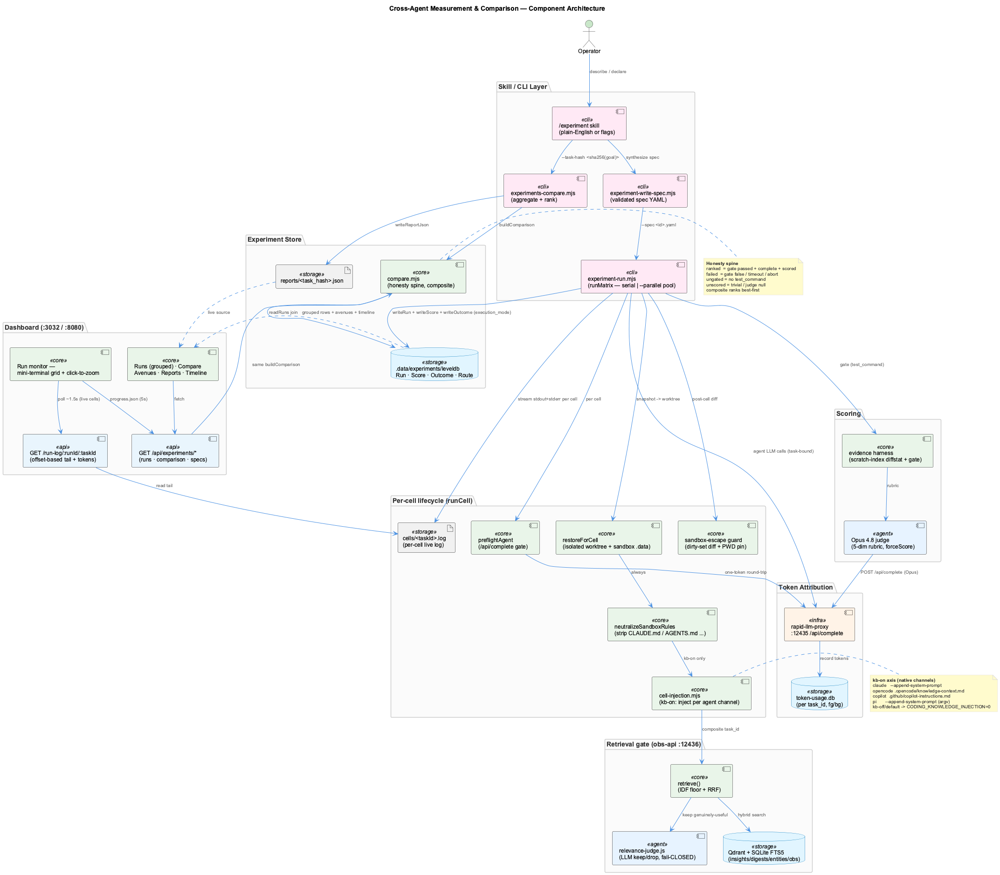

# Measurement & Cost Optimization

Run the same task across agents, models and methodologies; measure what each costs; rank
them by cost per unit of quality.

=== "⚡ Quick (~3 min)"

    ## What this answers

    "Which model should I use?" — as a measured decision rather than a feeling. The same coding
    goal is run across variants, each run is measured on three axes, and the variants are ranked.

    - **Tokens** — the cost proxy (input + output + reasoning)
    - **Wall-clock** — how long you waited
    - **Quality** — a 0–1 rubric score, gated by an objective pass/fail test

    The headline number combines them:

    ```
    composite = totalTokens / goal_aligned_ratio     (lower is better)
    ```

    A variant that is 3× cheaper at 10% lower quality usually wins — which is exactly the
    trade-off this makes visible.

    ## The one thing to remember

    **A comparison never fakes a winner.** A variant is only cost-ranked if it passed an
    objective test gate. Anything that failed, was never gated, or could not be scored is shown
    separately and never averaged into the ranking. If nothing passed, the ranked list is empty.

    ## Start here

    The [Tutorial](tutorial.md) goes from a plain-English description to a cost decision in about
    five minutes. Or open the dashboard at [localhost:3032](http://localhost:3032) → **Performance**.

=== "📖 Standard (~15 min)"

    ## Run, score, comparison

    Three nouns carry the whole model:

    1. **Run** — one execution of the goal by one variant (`agent × model × framework × env`),
       repeated *N* times, recording tokens, wall-clock and routing.
    2. **Score** — after the run, an objective **test gate** decides pass/fail and a five-dimension
       rubric judge produces the quality signal. The evidence is a diffstat over a post-restore
       baseline commit, so only the agent's own edits count, and untracked new files count too.
    3. **Comparison** — runs sharing a `task_hash` (the sha256 of the goal sentence) are
       aggregated per variant and ranked.

    

    ## Why the results can be trusted

    Every variant lands in exactly one group, and only the first is ranked on cost:

    | Group | Meaning | Cost-ranked? |
    |-------|---------|--------------|
    | **ranked** | Gate passed, run completed, rubric scored | yes |
    | **failed** | Gate failed, or the run timed out or aborted | no — shown, never averaged |
    | **ungated** | No objective test was supplied | no — tokens and wall-clock only |
    | **unscored** | Trivial run, or the judge could not score it | no — shown separately |

    This is why supplying a test gate matters: it is what makes a variant rankable at all.

    ## Three layers of measurement

    Only the top two ask anything of you.

    **Ambient** is always on. Every call routed through the proxy is recorded passively, and a
    daemon writes one Run per session — including sessions on bypass providers that never touch
    the proxy. You get a token and route timeline for free, but no quality score, because the
    judge is not run.

    **Measurement** is a named span with a `task_id` and a one-sentence goal, so a task's tokens
    attribute to a stable `task_hash` and closing the span triggers the heavy work ambient skips:
    token aggregation, the judge, the score. It can be bound automatically to each live
    foreground session, or opened by hand for a single task you want scored and re-runnable.

    **Experiment** runs a whole matrix — variants × repeats, each measured, gated and judged —
    then ranks them and writes the report the Compare tab reads. Drive it from the dashboard or
    the [`/experiment` skill](experiment-skill.md).

    ## Choosing the right layer

    - Just want to see what a session cost? Ambient already recorded it.
    - Want *this* task scored and comparable later? Open a measurement span.
    - Want to decide between options? Run an experiment — one variant measured once is an
      anecdote.

    Typical questions it settles: is Haiku good enough for this class of task; Claude or OpenCode
    on the same goal; straight prompting versus a TDD framework; knowledge injection on or off.

    ## Where to look next

    - **Do it now** — the [Tutorial](tutorial.md), five minutes end to end.
    - **How it works** — [Architecture](architecture.md), the measurement sequence and data model.
    - **Every knob** — the [Dashboard Reference](dashboard-reference.md).

=== "📚 Deep Dive (full)"

    --8<-- "_tiers/measurement/overview.deep.md"
