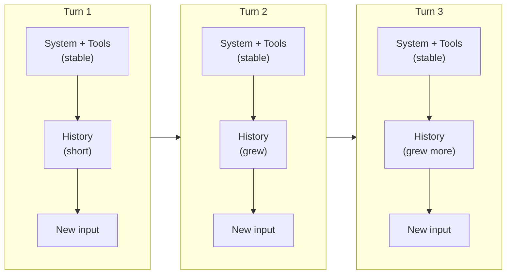
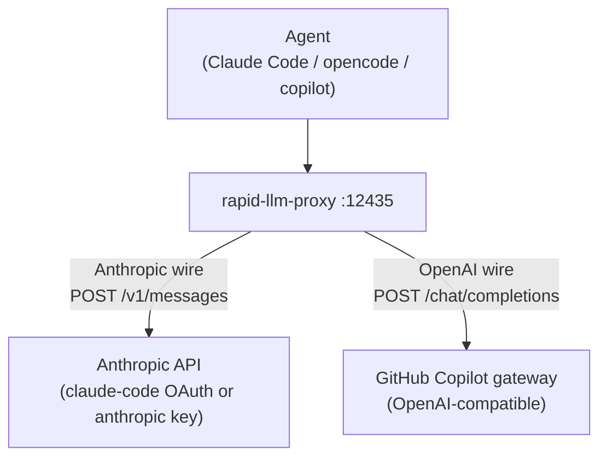
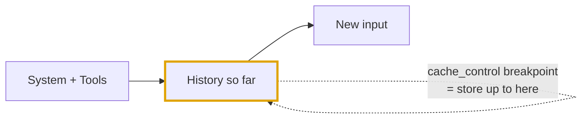
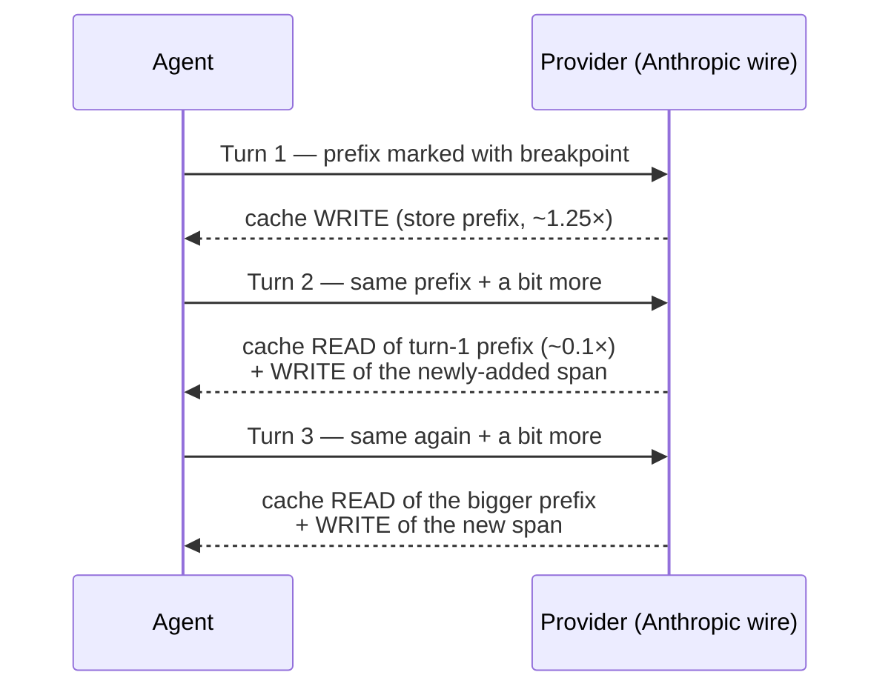
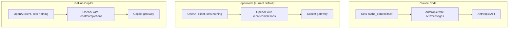
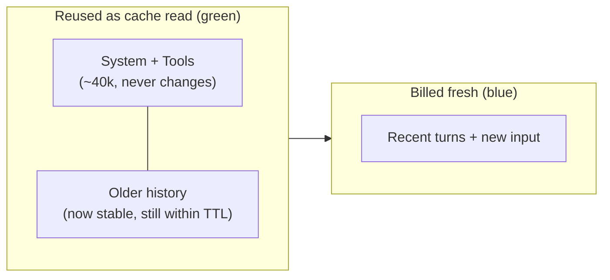
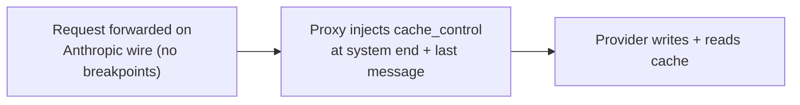

# Prompt Caching, End to End

## Why this page exists

Open the dashboard's **Performance → context** modal and two things look odd:

- **Cache write is 0** (or `N/A`) for some agents but not others.
- The **green "cache read" band** mostly sits on a flat floor, then sometimes jumps higher — *without any write ever happening*.

Neither is a bug. Both fall out of **where each agent's prompt travels** and **which caching rules apply on that path**. This page explains the whole chain — for **Claude Code**, **opencode**, and **GitHub Copilot** — so that after reading it there are no questions left.

!!! tip "The one-sentence model"
    Caching never stores your *text* — it stores the **provider's computation over a stable prefix** of the prompt, so the next request that begins with the same prefix skips re-computing it. Everything below is a consequence of that single idea.

---

## 1. The prompt is rebuilt and re-sent *every* turn

An LLM API is **stateless**. The provider keeps nothing between requests. So on every single turn, the agent re-sends the **entire conversation so far** — system instructions, tool definitions, all prior messages, and the new user input — as one big prompt.



The **front of the prompt barely changes** turn to turn (same system, same tools, and history that only ever *grows* at the end). That unchanging front is the **stable prefix** — the only thing that can be cached. The new bit at the end is fresh every time.

!!! note "Definition: prefix"
    A **prefix** is a run of tokens from the very start of the prompt. Caching only works on prefixes because the provider hashes *from the beginning*: the first token that differs from a cached entry ends the reusable span. Change something in the middle and everything after it is "fresh" again.

---

## 2. The "wire": which API language the provider is spoken to in

Your prompt does not go straight to a model. It goes through the **rapid-llm-proxy** (`localhost:12435`), which forwards it to a provider. The provider is spoken to in one of **two API formats** — we call the chosen format the **wire**, because it's what actually goes over the network.



The wire matters because **the two formats have different caching capabilities**:

| | **Anthropic wire** (`/v1/messages`) | **OpenAI wire** (`/chat/completions`) |
|---|---|---|
| Who serves it here | Anthropic API (Claude direct / Max OAuth) | GitHub Copilot gateway |
| How caching is triggered | **Explicit** — you place `cache_control` markers in the request | **Implicit** — the gateway auto-detects a repeated prefix; nothing to set |
| Cache **read** reported? | ✅ `cache_read_input_tokens` | ✅ `cached_tokens` |
| Cache **write** reported? | ✅ `cache_creation_input_tokens` | ❌ **no such field exists in the schema** |
| Pricing signal | read ≈ 0.1×, write ≈ 1.25× of input | read is cheaper; write is invisible |

The single most important row is the last-but-one: **the OpenAI wire has no field for "cache write."** So on that wire, cache-write can only ever be reported as `0` / `N/A` — not because nothing was cached, but because the protocol has no way to *say* it wrote a cache. This is the whole reason the number differs between agents.

---

## 3. `cache_control` breakpoints, explained plainly

On the **Anthropic wire**, caching is opt-in: you must **mark where the stable prefix ends**. That marker is a small tag attached to a piece of the prompt:

```json
{ "type": "text", "text": "...the system prompt...",
  "cache_control": { "type": "ephemeral" } }
```

Think of it as a **bookmark that says "store everything up to here."** We call each bookmark a **breakpoint**. The rules are simple:

- **Read** happens automatically when a new request's prefix matches a stored one (within the TTL — ~5 min, up to 1 h).
- **Write** happens when you place a breakpoint at a *new* boundary that wasn't stored yet — the provider computes that span once and stores it, billing it at ~1.25×.
- Up to **4** breakpoints; a span below the minimum size (~1024 tokens) is silently ignored.



**Turn over turn**, this produces the write-then-read rhythm that makes long sessions cheap:



Each turn **reads** the prefix it already stored and **writes** only the small new slice — so a long conversation is dominated by cheap reads.

---

## 4. The three agents, side by side

Same idea, three different paths. This is where the dashboard differences come from.



| | **Claude Code** | **opencode** *(default routing)* | **GitHub Copilot** |
|---|---|---|---|
| Wire | Anthropic `/v1/messages` | OpenAI `/chat/completions` | OpenAI `/chat/completions` |
| Provider | Anthropic (Max OAuth / key) | Copilot gateway | Copilot gateway |
| Caching kind | **Explicit** `cache_control` | **Implicit** (gateway) | **Implicit** (gateway) |
| Who sets breakpoints | Claude Code sets its own | nobody — not supported on this wire | nobody — not supported on this wire |
| Cache **read** shown | ✅ real `cache_read` | ✅ `cached_tokens` (green) | ✅ `cached_tokens` (green) |
| Cache **write** shown | ✅ real `cache_write` (amber) | ❌ `N/A` (schema has no field) | ❌ `N/A` (schema has no field) |

!!! info "So the write column is honest, not broken"
    - **Claude Code** writes to cache and the Anthropic wire *reports* it → you see amber.
    - **opencode / Copilot** *do* benefit from caching (the Copilot gateway caches prefixes implicitly, which is the green you see) — but the OpenAI wire has **no field to report a write**, so the dashboard correctly shows `N/A`, never a misleading `0`.

---

## 5. Reading the "Per-turn tokens" chart

Every bar is the tokens transmitted that turn, coloured by how the provider billed them:

| Colour | Meaning | Appears on |
|---|---|---|
| 🟢 **green** | cache **read** — prefix reused (~0.1×) | both wires |
| 🟠 **amber** | cache **write** — prefix stored this turn (~1.25×) | Anthropic wire **only** |
| 🔵 **blue** | fresh **input** — never cached, full price | both wires |
| 🟣 **purple** | **output** — the model's generated tokens | both wires |

### Why the green floor sits at ~40k, then sometimes jumps

The green floor is the part of the prefix that stayed **byte-identical long enough to still be warm** in the cache:



- **The ~40k floor** = system instructions + tool definitions. These are identical every turn, so they're always a cache hit.
- **Green jumps above the floor** when conversation history that was fresh a few turns ago has now *stopped changing* and is replayed **within the TTL** — so it, too, matches the warm entry and the green boundary creeps up.
- **Green drops back to ~40k** after a pause longer than the TTL (the cache expired) or after something invalidated the middle of the prefix — only the static head survives; everything after it is re-billed as blue.

That is the complete answer to *"why is there green (reuse) even though write is 0?"* — on the OpenAI wire the reuse is the **gateway's implicit caching**, reported as read; the write simply has no field to appear in.

---

## 6. What the proxy now does (and doesn't)

The `rapid-llm-proxy` was updated so that **any traffic it forwards on the Anthropic wire gets `cache_control` breakpoints injected automatically** — even when the agent didn't set them.

- It injects **two** breakpoints: at the end of the **system** prompt and on the **last message block** (the stable-prefix boundary that grows each turn).
- It's pure and safe: below-minimum spans are ignored by the API; disable with `LLM_PROXY_DISABLE_PROMPT_CACHE=1`.
- Both native completion paths then read `cache_read_input_tokens` / `cache_creation_input_tokens` back into the token record.



!!! warning "What this does NOT change"
    This only affects traffic on the **Anthropic wire**. **opencode and Copilot route on the OpenAI wire to the Copilot gateway**, which the proxy cannot add `cache_control` to (the field doesn't exist there). Their `N/A` write stays `N/A`. To make an opencode session show real cache-write, route it to an Anthropic-wire provider (a `rapid-proxy/<claude-model>` model instead of `github-copilot/<model>`) — a configuration choice with its own cost/latency/rate-limit trade-offs.

---

## 7. Quick answers

**Q: Why is cache write 0 for opencode but not Claude Code?**
opencode rides the OpenAI wire (Copilot gateway), whose usage schema has no cache-creation field. Claude Code rides the Anthropic wire, which reports writes. Different wire → different reportable numbers.

**Q: If nothing was written, why is there green (cache read)?**
The Copilot gateway caches repeated prefixes **implicitly** and reports them as `cached_tokens`. Reuse still happens; only the *write* side is unreportable on that wire.

**Q: Why does the green sometimes exceed the ~40k floor with no writes?**
Recent history became stable and is still within the cache TTL, so a longer prefix matches the warm entry. TTL expiry drops it back to the static head.

**Q: Is `N/A` the same as `0`?**
No. `0` would mean "measured, and it was zero." `N/A` means "this wire cannot report it." The dashboard shows `N/A` on the OpenAI wire deliberately.

**Q: How do I get real cache economics for opencode?**
Point it at a `rapid-proxy/<claude-model>` model so it uses the Anthropic wire; the proxy then injects breakpoints and the provider reports both read and write.

---

## See also

- [Measurement Architecture](architecture.md) — how a run's tokens are captured and split
- [Token Usage](../architecture/token-usage.md) — the token accounting model
- [LLM CLI Proxy](../integrations/llm-cli-proxy.md) — the proxy that forwards every request
