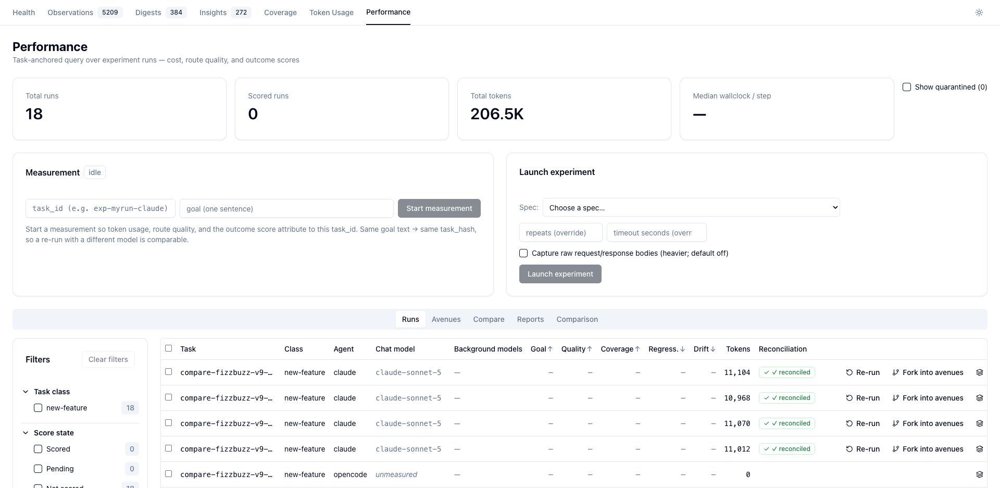
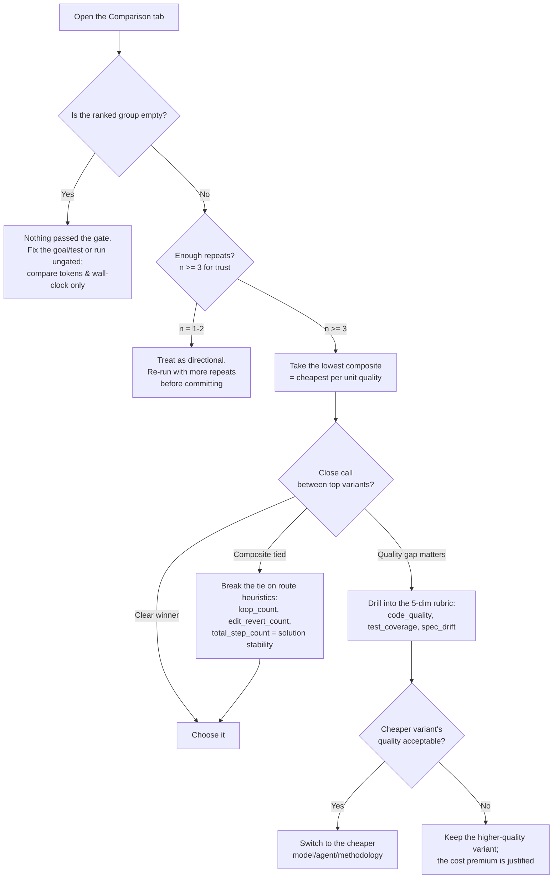

# Tutorial: Optimize Cost in 5 Minutes

## Overview

This walkthrough takes you from *"I wonder which model is cheapest for this"* to a **measured, defensible decision** — using one command and the dashboard. No flag syntax to memorize.

**The loop:** describe → confirm → run → read the ranked table → decide.

---

## Step 1 — Describe the experiment

In any coding agent, type `/experiment` and describe what you want to compare in plain English:

```
/experiment compare Claude Sonnet against OpenCode Haiku on writing a fizzbuzz
function, run each twice
```

## Step 2 — Confirm the synthesized plan

The skill turns your prose into a concrete experiment and shows you a preview — including a **drafted objective test** (the gate that makes the results rankable):

```
Experiment (from your description)
  goal:      Create fizzbuzz.mjs exporting fizzbuzz(n)…
  variants:  claude / sonnet
             opencode / rapid-proxy/claude-haiku-4-5
  repeats:   2     task_class: new-feature     test gate: node --test fizzbuzz.test.mjs
  rank by:   composite
```

Choose **Run it**. (Pick **Run ungated** to skip the test — you'll still get token/latency numbers, just no quality ranking. Pick **Edit** to fix any field.) The matrix now runs unattended.

## Step 3 — Watch the runs land

Open the dashboard at [http://localhost:3032](http://localhost:3032) → **Performance** → **Runs**. Each variant × repeat appears as a row with its tokens, wall-clock, model, and score as it completes.



## Step 4 — Read the ranked comparison

Switch to the **Comparison** tab. Variants are columns; metrics are rows. The **ranked** group is ordered cheapest-per-quality first, with `mean ± stddev` (hover for median/min/max/n). Failed, ungated, and unscored variants are shown separately — never crowned as winners.


---

## Step 5 — Make the cost decision

Use this decision flow to turn the table into a choice:



### What the numbers mean

| Metric | Prefer | Reads as |
|--------|--------|----------|
| `composite` | lower | cost per unit quality — **the headline** |
| `totalTokens` | lower | raw cost |
| `goal_aligned_ratio` | higher | quality (0–1) |
| `wallclock` | lower | latency |
| `loop_count`, `edit_revert_count`, `total_step_count` | lower | solution efficiency / stability |
| `n` | higher | how much to trust the result |

**A worked read:** if `claude/sonnet` scores 15k tokens @ 0.92 quality (composite ≈ 16.3) and `opencode/haiku` scores 8k @ 0.78 (composite ≈ 10.3), Haiku wins on cost-per-quality — switch to it *unless* the 0.14 quality gap lands somewhere you can't afford (e.g. `test_coverage` on a critical path).

---

## Optimizing across the three levers

- **Models** — sweep `opus`/`sonnet`/`haiku` for one agent to find the cheapest tier that clears your quality bar for a given `task_class`.
- **Agents** — same goal across `claude` / `opencode` / `copilot`; the composite normalizes their different token economics.
- **Methodologies** — vary `framework` (straight vs TDD) or `env` (KB-injection on/off) to measure whether a heavier method actually pays for itself.

Re-run whenever your goals or model options change — the comparison is only as current as its last run, and every decision is backed by numbers you can point to.

See the [`/experiment` skill reference](experiment-skill.md) for all options, or the [Architecture](architecture.md) for how the measurement works.
