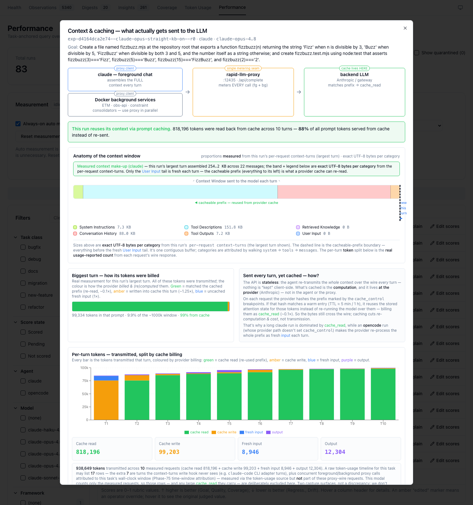
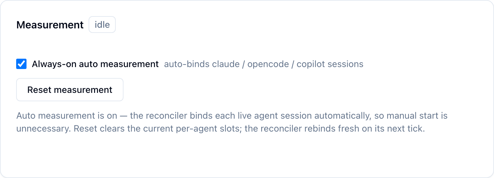
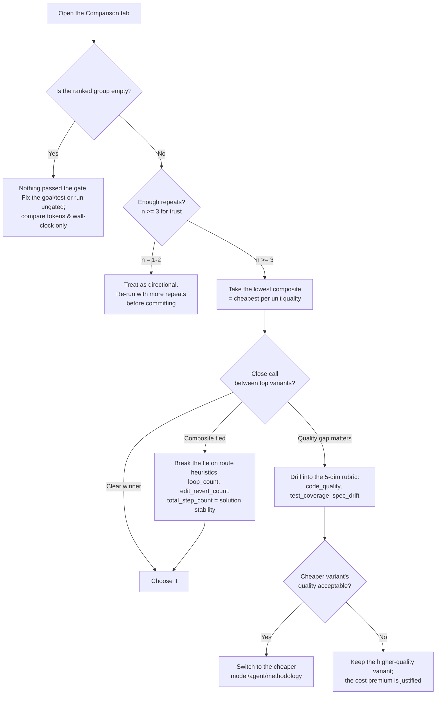

# Tutorial: Measure & Optimize Your Coding Agents

## What this suite gives you

Every time you use a coding agent (claude, opencode, copilot), the measurement suite can tell you **what it cost, what it sent to the model, and whether a cheaper setup would do the same job.** There are two ways to use it:

| Mode | Effort | You get | Use it when |
|------|--------|---------|-------------|
| **Always-on measurement** | Zero — it just runs | Per-session tokens, cost, timeline, and the exact **context-window breakdown** of every turn | You want to understand *where your tokens go* in normal work |
| **Experiments** (`/experiment`) | One command | A **ranked A/B table** across models / agents / methods, gated by an objective test | You want a *defensible decision*: "which is cheapest for this job?" |

You don't choose one — always-on is passive and always there; you reach for experiments when you need a comparison. Everything shows up in the same place: the dashboard at **[http://localhost:3032](http://localhost:3032) → Performance**.

---

## One-time setup — route through the proxy

!!! warning "Do this first, or you'll only see illustrative bands"
    Per-category capture (the real context-window breakdown) happens **only** for traffic that flows through the rapid-llm-proxy at `localhost:12435`. Agents using a **direct** provider (e.g. opencode's built-in `github-copilot/*`) bypass the proxy — you'll still get token totals, but the context-window band falls back to an *illustrative* placeholder.

In `~/.config/opencode/opencode.json`, point your model at the **`rapid-proxy`** provider instead of a direct one:

```jsonc
{
  "model": "rapid-proxy/claude-opus-4.6",        // ✅ captured   (not github-copilot/…)
  "provider": {
    "rapid-proxy": {
      "options": { "baseURL": "http://localhost:12435/v1" },
      "models": {
        "claude-opus-4.6": {}, "claude-sonnet-4.6": {}, "claude-haiku-4.5": {},
        "gpt-4o": {}, "gpt-4o-mini": {}
      }
    }
  }
}
```

Config is read **at launch**, so start a fresh agent session after editing. Claude Code (via `/v1/messages`) is captured automatically — no change needed.

**How to tell it's working:** open a run in the dashboard (below). A *measured* run shows exact KB per category; an *illustrative* one says "this run has no per-category wire capture" — that means the traffic bypassed the proxy.

---

## Path A — Just look at your work (zero effort)

Do your normal coding. Then open **[http://localhost:3032](http://localhost:3032) → Performance → Runs**. Every session is a row with its tokens, wall-clock, model, and (if it ran through an experiment) score.


Click a run to expand its **timeline** — every turn is a row, coloured by role (foreground development · knowledge capture · infrastructure) and **interleaved chronologically**, so you see foreground turns, background knowledge-capture calls, and infrastructure probes in the exact order they happened. Three **role-filter checkboxes** above the list toggle each lane — un-check *Foreground development* to isolate just the background timeline. A collapsible **Concurrent background activity** panel above the rows gives the same knowledge/infra spend as a per-process rollup.


### The payoff: what actually got sent to the model

Click **Explain** on any run to open **"Context & caching — what actually gets sent to the LLM."** This is the centrepiece — the exact anatomy of your context window, measured from the real wire bytes:



Read it like this:

- **The band** is one turn's full context window, scaled to real UTF-8 bytes. The legend gives exact sizes per category — **System Instructions**, **Tool Descriptions**, **Retrieved Knowledge**, **Conversation History**, **Tool Outputs**, **User Input**.
- **The dashed line** is the cacheable-prefix boundary: everything to its left can be re-read from the provider cache; only the **User Input** tail is fresh each turn.
- **"X% served from cache"** tells you how much of the prompt was re-used (cheap `cache_read`) vs re-sent. A long claude run is dominated by cache reads; an opencode run whose provider doesn't set `cache_control` re-processes the whole prefix as fresh input each turn.
- **Per-turn tokens** (bottom chart) splits every turn's billing: green = cache read, amber = cache write, blue = fresh input, purple = output.

This is where "why is this session so expensive?" gets a concrete answer — usually a fat **Tool Descriptions** or **Conversation History** block, or a run that isn't hitting cache.

### Always-on controls

The **Always-on auto measurement** checkbox (top of the Performance panel) is on by default — a background reconciler binds each live claude / opencode / copilot session so its traffic is captured with zero setup. **Reset** clears the current binding and re-detects on the next tick (useful if a session id goes stale).



Leave it on. Turn it off only if you want purely manual measurement spans.

---

## Path B — Run an experiment (5 minutes)

When you need a *decision* instead of an observation, compare setups head-to-head.

### Step 1 — Describe it in plain English

In any coding agent, type `/experiment`:

```
/experiment compare Claude Sonnet against OpenCode Haiku on writing a fizzbuzz
function, run each twice
```

### Step 2 — Confirm the synthesized plan

The skill turns your prose into a concrete matrix and drafts an **objective test** — the gate that makes results rankable:

```
Experiment (from your description)
  goal:      Create fizzbuzz.mjs exporting fizzbuzz(n)…
  variants:  claude / sonnet
             opencode / rapid-proxy/claude-haiku-4.5
  repeats:   2     task_class: new-feature     test gate: node --test fizzbuzz.test.mjs
  rank by:   composite
```

Choose **Run it**. (**Run ungated** skips the test — you still get token/latency numbers, just no quality ranking. **Edit** fixes any field.) The matrix runs unattended.

### Step 3 — Read the ranked comparison

Dashboard → **Performance → Comparison**. Variants are columns; metrics are rows. The **ranked** group is ordered cheapest-per-quality first, with `mean ± stddev` (hover for median/min/max/n). Failed, ungated, and unscored variants are shown separately — never crowned as winners.


### Step 4 — Make the call



**A worked read:** if `claude/sonnet` scores 15k tokens @ 0.92 quality (composite ≈ 16.3) and `opencode/haiku` scores 8k @ 0.78 (composite ≈ 10.3), Haiku wins on cost-per-quality — switch to it *unless* the 0.14 quality gap lands somewhere you can't afford (e.g. `test_coverage` on a critical path).

---

## Where to look for what

| I want to… | Go to |
|------------|-------|
| See what a session cost / its timeline | Performance → **Runs** → click a row |
| See the real context-window breakdown & cache reuse | Runs → **Explain** on a row |
| Confirm capture is working (measured vs illustrative) | The banner at the top of the Explain view |
| Compare models / agents / methods | Performance → **Comparison** (after `/experiment`) |
| Turn always-on capture on/off, or reset a binding | Performance panel → **Always-on** checkbox / **Reset** |
| Understand the token totals | Dashboard → **Token Usage** tab |

## What the numbers mean

| Metric | Prefer | Reads as |
|--------|--------|----------|
| `composite` | lower | cost per unit quality — **the headline** |
| `totalTokens` | lower | raw cost |
| `goal_aligned_ratio` | higher | quality (0–1) |
| `wallclock` | lower | latency |
| `loop_count`, `edit_revert_count`, `total_step_count` | lower | solution efficiency / stability |
| `n` | higher | how much to trust the result |

## Optimizing across the three levers

- **Models** — sweep `opus`/`sonnet`/`haiku` for one agent to find the cheapest tier that clears your quality bar for a given `task_class`.
- **Agents** — same goal across `claude` / `opencode` / `copilot`; the composite normalizes their different token economics.
- **Methodologies** — vary `framework` (straight vs TDD) or `env` (KB-injection on/off) to measure whether a heavier method actually pays for itself.

Re-run whenever your goals or model options change — the comparison is only as current as its last run.

---

See the [`/experiment` skill reference](experiment-skill.md) for all options, the [Overview](overview.md) for the three-layer model, or the [Architecture](architecture.md) for how capture works under the hood.
</content>
</invoke>
