# Tutorial: Measure & Optimize Your Coding Agents

## What this suite gives you

Every time you use a coding agent (claude, opencode, copilot), the measurement suite can tell you **what it cost, what it sent to the model, and whether a cheaper setup would do the same job.** There are two ways to use it:

| Mode | Effort | You get | Use it when |
|------|--------|---------|-------------|
| **Always-on measurement** | Zero — it just runs | Per-session tokens, cost, timeline, and the exact **context-window breakdown** of every turn | You want to understand *where your tokens go* in normal work |
| **Experiments** (`/experiment`) | One command | A **ranked A/B table** across models / agents / methods, gated by an objective test | You want a *defensible decision*: "which is cheapest for this job?" |

You don't choose one — always-on is passive and always there; you reach for experiments when you need a comparison. Everything shows up in the same place: **[http://localhost:3032](http://localhost:3032) → Performance**.

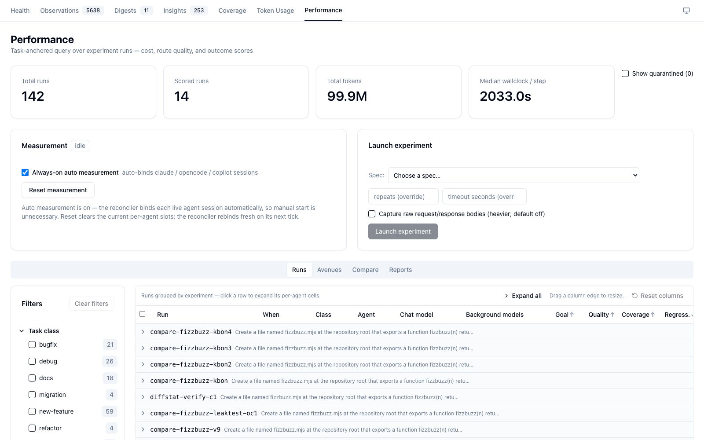

The four stat tiles (Total runs, Scored runs, Total tokens, Median wallclock/step) headline the page; the **Show quarantined (N)** toggle reveals runs hidden for an invalid `task_class`.

---

## One-time setup — route through the proxy

!!! warning "Do this first, or you'll only see illustrative bands"
    Per-category capture (the real context-window breakdown) happens **only** for traffic that flows through the rapid-llm-proxy at `localhost:12435`. Agents using a **direct** provider (e.g. opencode's built-in `github-copilot/*`) bypass the proxy — you'll still get token totals, but the context-window band falls back to an *illustrative* placeholder.

In `~/.config/opencode/opencode.json`, point your model at the **`rapid-proxy`** provider instead of a direct one:

```jsonc
{
  "model": "rapid-proxy/claude-sonnet-4.6",       // ✅ captured   (not github-copilot/…)
  "provider": {
    "rapid-proxy": {
      "options": { "baseURL": "http://localhost:12435/v1" },
      "models": {
        "claude-opus-4.8": {}, "claude-sonnet-4.6": {}, "claude-haiku-4.5": {},
        "gpt-4o": {}, "gpt-4o-mini": {}
      }
    }
  }
}
```

Config is read **at launch**, so start a fresh agent session after editing. Claude Code (via `/v1/messages`) is captured automatically — no change needed.

---

## Path A — Just look at your work (zero effort)

Do your normal coding. Then open **Performance → Runs**. Runs are **grouped by experiment** — one collapsible parent per experiment-run, plus a pinned **"Other activity — ambient (auto-measured) sessions"** bucket for your normal interactive work.

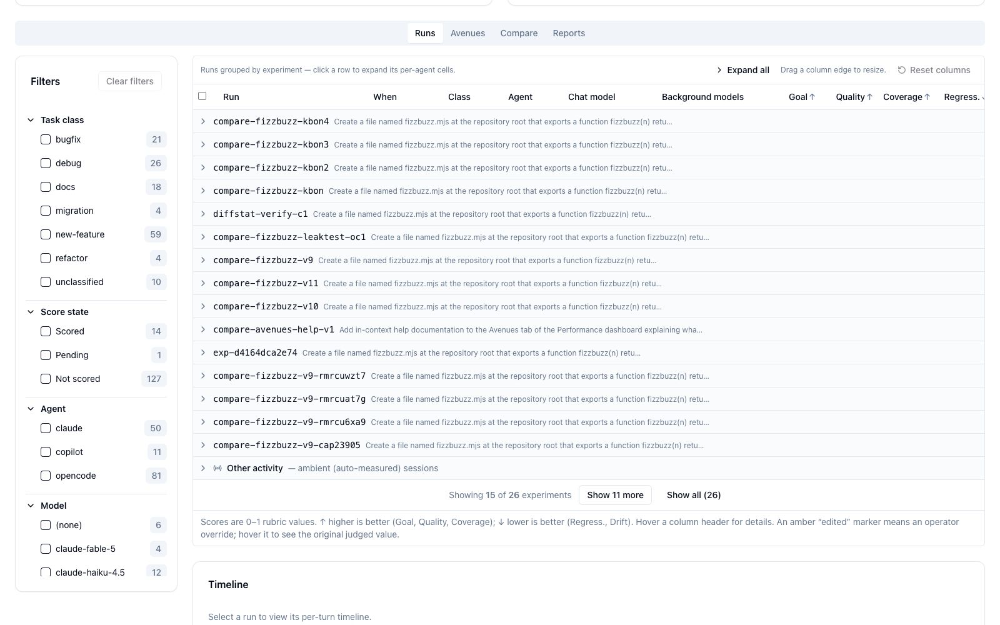

**Expand all** opens each parent into its per-agent cells, with the 5-dim rubric scores side by side — this is where a cross-agent spread jumps out (here claude scores 1.00 on Goal where opencode lands 0.00 on the same task):

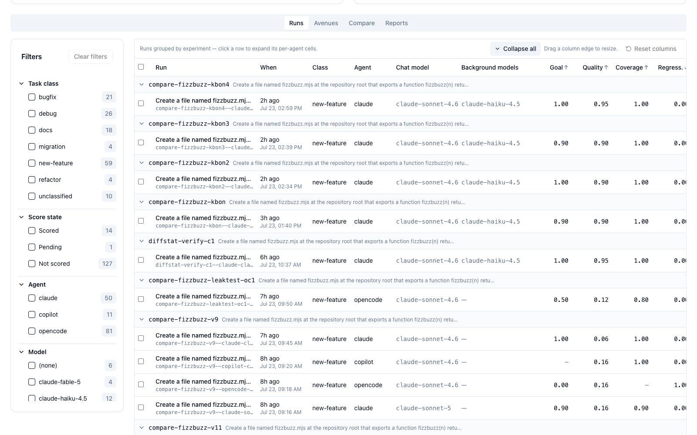

!!! tip "Hover the score columns — the definitions are hidden there"
    Every score header carries its full definition on hover. **Goal**: *"did the run accomplish its stated goal? LLM-judged (Opus) from the VERIFICATION verdict + test summary + goal-vs-diff… '—' = no evidence to judge (never treated as 0)."* Hover a **value** and you also get **"Why this run scored this: &lt;rationale&gt;."** The full set is in the [Dashboard Reference](dashboard-reference.md#score-dimension-glossary).

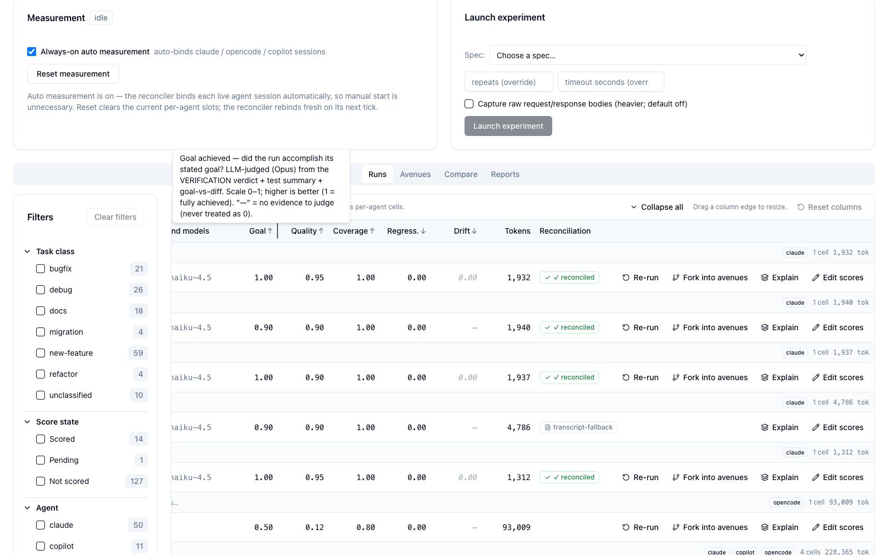

### The payoff: what actually got sent to the model

Click **Explain** on any run to open **"Context & caching — what actually gets sent to the LLM."** This is the centrepiece — the exact anatomy of your context window, measured from the real wire bytes:

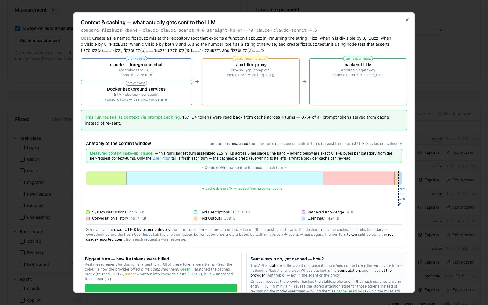

Read it like this:

- **The topology strip** shows the path: your agent → the `rapid-llm-proxy` (the single metering seam at :12435) → the backend LLM (where the cache lives).
- **The band** is one turn's full context window, scaled to real UTF-8 bytes: **System Instructions**, **Tool Descriptions**, **Retrieved Knowledge**, **Conversation History**, **Tool Outputs**, **User Input**. The dashed line is the **cacheable-prefix** boundary — everything to its left is re-read from cache; only the User Input tail is fresh each turn.
- **"X% served from cache"** tells you how much of the prompt was re-used (cheap `cache_read`) vs re-sent.

Scroll down in the same modal for the **caching detail** — how the biggest turn was billed, the explicit-vs-implicit wire explanation, and the per-turn stacked bar chart (green = cache read, amber = cache write, blue = fresh input, purple = output):

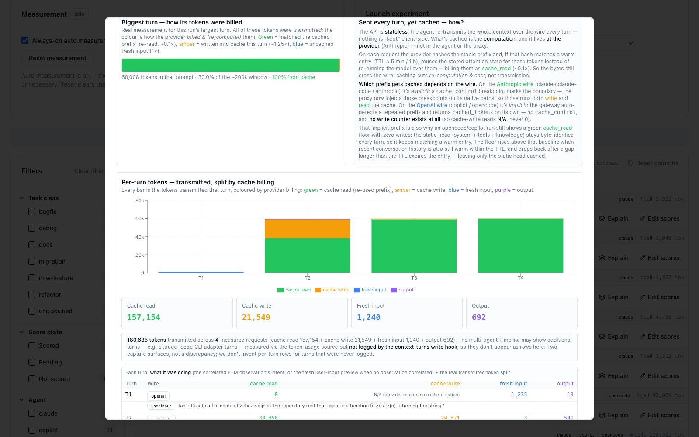

!!! tip "A 0-byte Retrieved-Knowledge block is the quality gate working"
    Click the **Retrieved Knowledge** segment for the injected-context breakdown — the ~1,000-token block (300 Working Memory + 700 semantic via Qdrant RRF). For a *trivial* task on a `kb-on` cell it shows **0 B**: the relevance judge rejected the topical-but-useless matches. That empty block is the gate, not a bug.

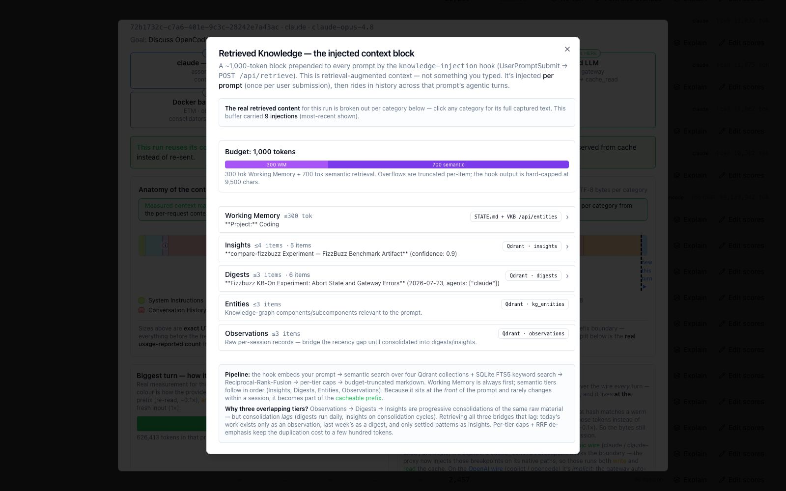

### The timeline

Click a run to load its **per-turn timeline** below the table — turns are chronological, coloured by **role** (foreground development · knowledge capture · infrastructure), with role-filter chips to isolate a lane and cache-read hatching per turn:

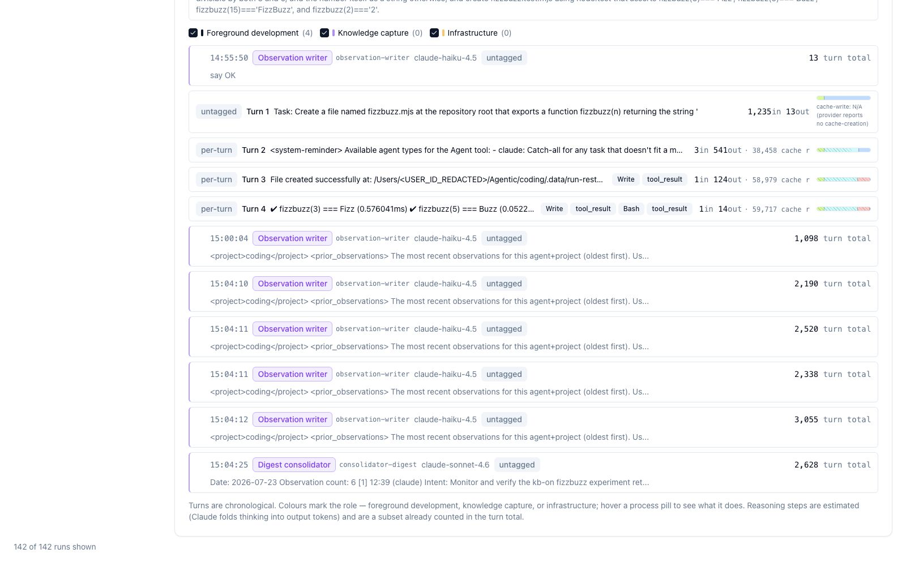

The **fullscreen** timeline adds the token-reconciliation summary and a cumulative context-growth band:

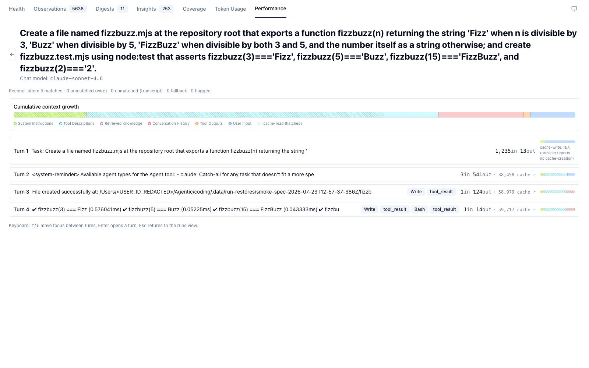

### Always-on controls

The **Always-on auto measurement** checkbox is on by default — a reconciler binds each live claude / opencode / copilot session so its traffic is captured with zero setup. **Reset** clears the current per-agent slots and rebinds on the next tick. Leave it on.

---

## Path B — Run an experiment (5 minutes)

When you need a *decision* instead of an observation, compare setups head-to-head.

### Step 1 — Describe it in plain English

In any coding agent, type `/experiment`:

```
/experiment compare Claude Sonnet against OpenCode on writing a fizzbuzz
function, run each twice
```

The skill turns your prose into a concrete matrix and drafts an **objective test** — the gate that makes results rankable — then writes `config/experiments/<id>.yaml`. Choose **Run it** (or **Run ungated** to skip the test, or **Edit** a field). The matrix runs **unattended**.

!!! warning "Run experiments unattended"
    There is a single measurement span slot. A concurrent in-repo agent call gets mis-stamped with the open cell's `task_id`. Don't drive a matrix from an interactive agent working the same repo.

You can also launch from the dashboard: pick a spec in **Launch experiment**, then watch the **Run monitor** cell grid move through `restoring → running → scoring`:

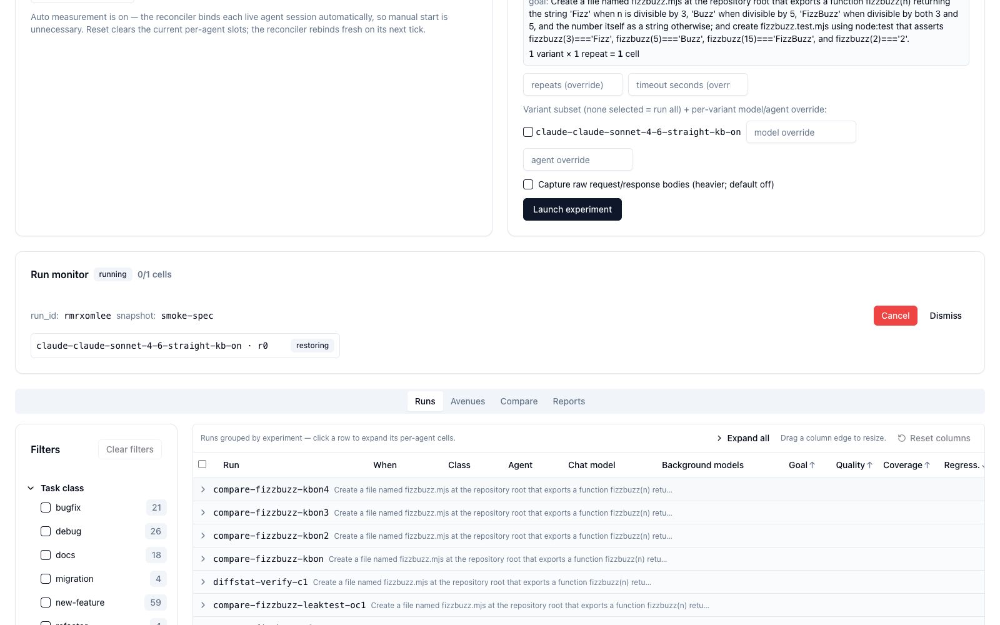

### Step 2 — Read the ranked comparison

Dashboard → **Performance → Compare**. Two sections. **Two-run comparison** contrasts any two runs by role — tick two rows on Runs, hit **Compare selected (2)**, and read the Δ(B−A) column. This is the clearest way to *see* the harness-overhead story (here claude sends 644 tokens where opencode sends 106,694 for the same fizzbuzz):

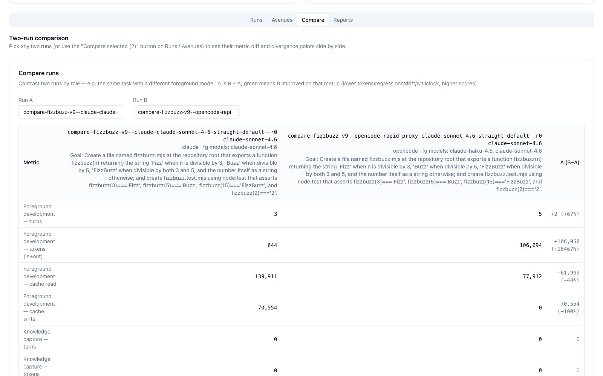

**Experiment variant comparison** is the ranked matrix — variants as columns, metrics ± variance as rows, grouped into the **honesty spine**: RANKED (best composite first), FAILED, UNGATED, UNSCORED — so a variant that never passed the gate is never crowned a winner:

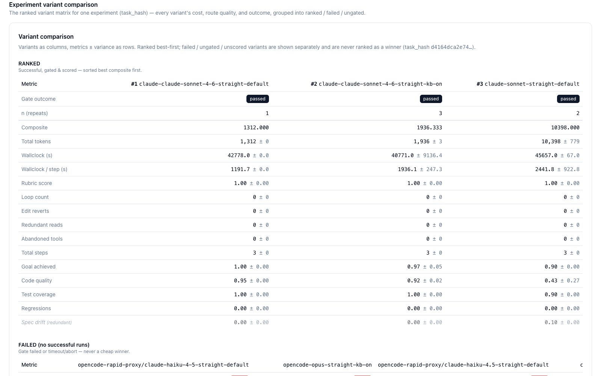

### Step 3 — Make the call

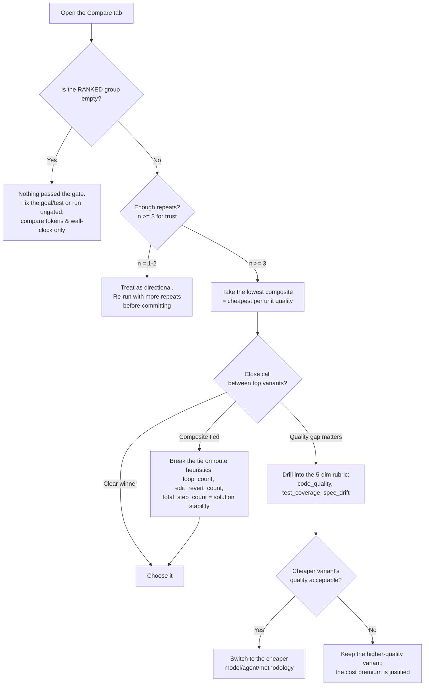

---

## Path C — Fork the same span into avenues

When you've got a run you like and want to try the *same prompt* several ways at once, **Fork into avenues** seeds a sweep across the agent / model / framework / knowledge-injection axes — each avenue on its own isolated git branch and worktree. The **Avenues** tab groups every sibling of one origin span into a single ranked table with a built-in help card:

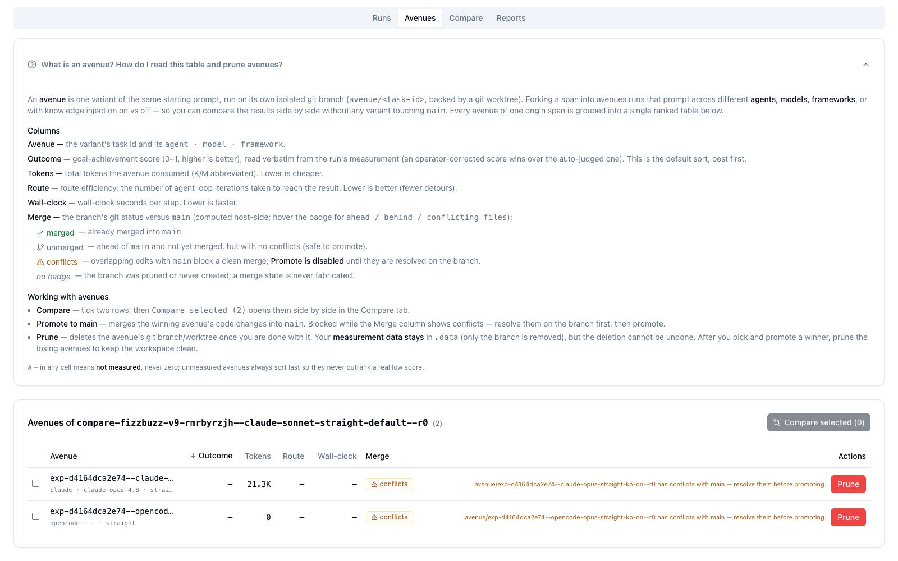

Rank by **Outcome**, then **Promote to main** the winner (blocked while its Merge badge shows conflicts) and **Prune** the losers — the branch goes, but the measurement data stays in `.data`.

---

## Where to look for what

| I want to… | Go to |
|------------|-------|
| See what a session cost / its timeline | Performance → **Runs** → click a row |
| See the real context-window breakdown & cache reuse | Runs → **Explain** on a row |
| Compare two runs or a variant matrix | Performance → **Compare** |
| Sweep the same prompt many ways | Runs → **Fork into avenues** → **Avenues** tab |
| Override a wrong auto-score | Runs → **Edit scores** |
| Every column / badge / tooltip defined | The [Dashboard Reference](dashboard-reference.md) |

## What the numbers mean

| Metric | Prefer | Reads as |
|--------|--------|----------|
| `composite` | lower | cost per unit quality — **the headline** |
| `totalTokens` | lower | raw cost (compare **within** an agent, not across) |
| `goal_achieved` | higher | quality (0–1) |
| `wallclock` | lower | latency |
| `loop_count`, `edit_revert_count`, `total_step_count` | lower | solution efficiency / stability |
| `n` | higher | how much to trust the result |

## Optimizing across the levers

- **Models** — sweep `opus`/`sonnet`/`haiku` for one agent to find the cheapest tier that clears your quality bar.
- **Agents** — same goal across `claude` / `opencode` / `copilot`; the composite normalizes their different token economics.
- **Methods** — vary `framework` (straight vs TDD) or the `env` **kb-on / kb-off** axis to measure whether a heavier method actually pays for itself.

!!! note "Execution-style goals score better for opencode/copilot"
    opencode's headless `run` ends its loop on the first assistant message with no tool call, so an *analysis-shaped* goal ("explain how…") gets narrated instead of executed. Phrase deliverables as **execution** ("create file X, write it, done only once it exists") to get a real artifact. See [Operational notes](experiment-skill.md#operational-notes).

---

See the [Dashboard Reference](dashboard-reference.md) for every facet, the [`/experiment` skill reference](experiment-skill.md) for all options, the [Overview](overview.md) for the three-layer model, or the [Architecture](architecture.md) for how capture works under the hood.
